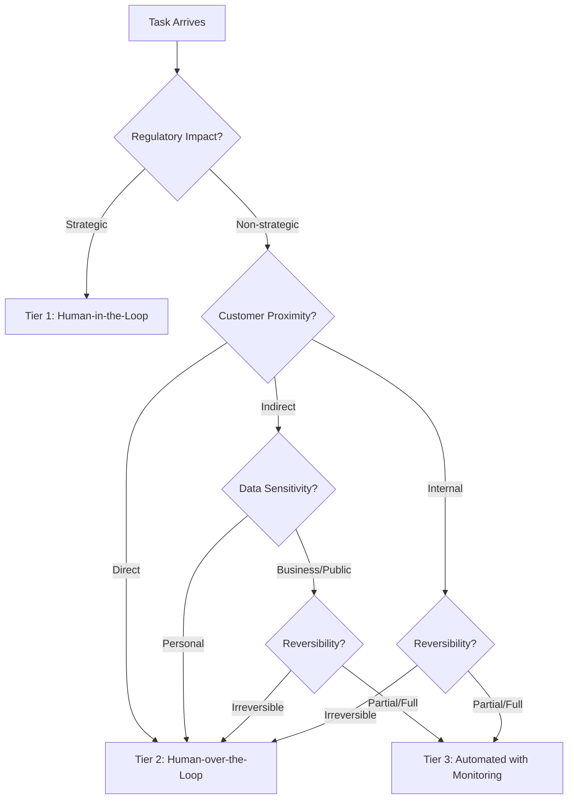
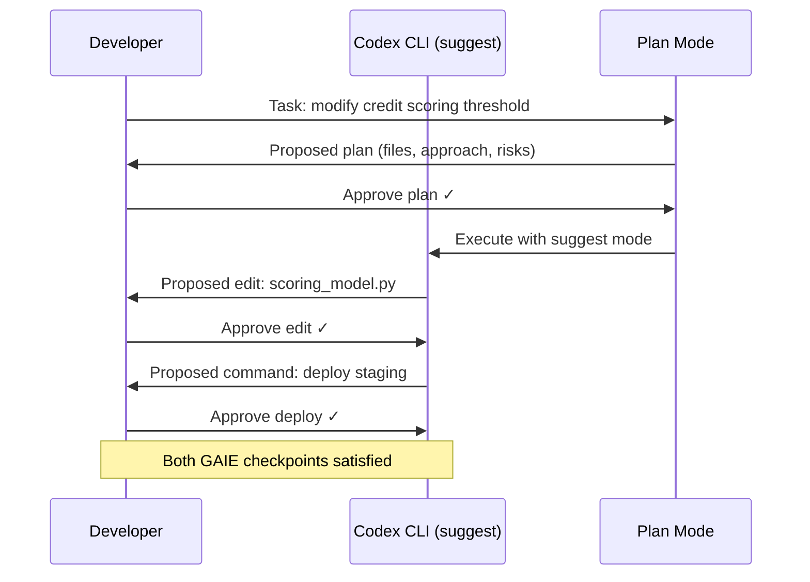

# Governed AI-Assisted Engineering: Mapping GAIE's Graduated Oversight Model to Codex CLI Permission Profiles for Regulated Codebases


---

Your compliance officer does not care that your coding agent resolves tickets 40% faster. They care whether the audit trail proves a human reviewed the credit-scoring threshold change before it reached production. The Governed AI-Assisted Engineering (GAIE) framework, published by Richard Kang on 21 June 2026 [^1], offers the first formal model for calibrating human oversight intensity to regulatory impact — and it maps remarkably well onto Codex CLI's existing governance primitives.

## The Problem GAIE Solves

Existing maturity models for AI-assisted development — from GitHub's Copilot adoption playbooks to Anthropic's responsible scaling policy — treat oversight as a binary: either the human approves everything or the agent runs free [^1]. Neither works in regulated industries. Full human-in-the-loop review collapses velocity. Full autonomy collapses compliance.

GAIE introduces the **Oversight Classification Model (OCM)**, a deterministic decision function that classifies every code-generation task across four dimensions and routes it through one of three oversight tiers [^1]:



## The Four OCM Dimensions

The OCM is not a weighted score. It is a priority-ordered decision tree [^1]:

| Dimension | Values | Question It Answers |
|-----------|--------|-------------------|
| **Regulatory Impact (RI)** | strategic, non-strategic | Does this task touch a function subject to regulatory examination? |
| **Customer Proximity (CP)** | direct, indirect, internal | How close is the output to end-customer experience? |
| **Reversibility (RV)** | irreversible, partial, full | Can the change be rolled back without data loss or customer impact? |
| **Data Sensitivity (DS)** | personal, business, public | What classification of data does the code handle? |

Strategic regulatory impact always escalates to Tier 1. Everything else cascades through proximity, sensitivity, and reversibility before settling into Tier 2 or Tier 3 [^1].

## The Three Tiers in Practice

GAIE illustrates its tiers through a banking scenario [^1]:

| Task | RI | CP | RV | DS | Tier |
|------|----|----|----|----|------|
| Modify credit approval threshold | strategic | direct | irreversible | personal | **1 — HITL** |
| Update mobile banking transfer UI | non-strategic | direct | full | business | **2 — HOTL** |
| Add field to internal logging | non-strategic | internal | full | public | **3 — AWM** |
| Refactor AML screening rule | strategic | indirect | partial | personal | **1 — HITL** |

The velocity impact is modest. Across three scenarios (conservative to optimistic), GAIE estimates 84–97% velocity retention with a central estimate of approximately 91% [^1]. The weighted formula is straightforward:

```
Velocity = (Tier3_volume × Tier3_velocity) + (Tier2_volume × Tier2_velocity) + (Tier1_volume × Tier1_velocity)
```

Under the moderate scenario: `(0.70 × 0.98) + (0.20 × 0.85) + (0.10 × 0.55) = 0.911` [^1].

## Mapping GAIE Tiers to Codex CLI

GAIE describes a generic multi-agent supervisor pattern without binding to specific tools [^1]. Codex CLI already ships every primitive needed to implement it.

### Tier 3 → `full-auto` with PostToolUse Monitoring

Internal, reversible, non-sensitive tasks — the 60–80% that constitute most engineering work — run in Codex CLI's `full-auto` approval policy (or its successor permission profiles [^2]) with monitoring hooks providing the evidence trail:

```toml
# config.toml — Tier 3 profile
[profile.tier3]
model = "o4-mini"
approval_policy = "full-auto"
sandbox = "container"

[profile.tier3.hooks.post_tool_use]
command = "scripts/tier3-audit-log.sh"
```

The PostToolUse hook writes an append-only audit record — the file changed, the diff, the timestamp, and the model used — satisfying GAIE's monitoring evidence requirement without interrupting the agent [^3].

### Tier 2 → `auto-edit` with PreToolUse Deploy Gate

Customer-facing or partially irreversible tasks run with `auto-edit`, where file modifications proceed but shell commands (including deployment) require human approval [^2]:

```toml
# config.toml — Tier 2 profile
[profile.tier2]
model = "o3"
approval_policy = "auto-edit"
sandbox = "container"

[profile.tier2.hooks.pre_tool_use]
command = "scripts/tier2-deploy-gate.sh"
```

The PreToolUse hook intercepts deployment commands and logs the human reviewer's identity — matching GAIE's requirement for cryptographically signed deploy authorisation at Tier 2 [^1].

### Tier 1 → `suggest` with Plan Mode

Strategic regulatory functions demand human approval before generation begins and again before deployment. Codex CLI's `suggest` mode combined with Plan Mode achieves this [^2][^4]:

```toml
# config.toml — Tier 1 profile
[profile.tier1]
model = "o3"
approval_policy = "suggest"
sandbox = "container"
```

In `suggest` mode, every file edit and command requires explicit approval. Plan Mode adds the first GAIE checkpoint: the human reviews and approves the approach before the agent writes a single line [^4]. This maps directly to GAIE's RETURN_CONTROL event pattern [^1].



## Per-Directory OCM Classification with AGENTS.md

The OCM classification need not live in a separate system. Codex CLI's `AGENTS.md` files, placed at directory level, can encode the tier assignment directly [^5]:

```markdown
<!-- services/credit-scoring/AGENTS.md -->
# Agent Guidelines — Credit Scoring Service

## GAIE Classification
- **Regulatory Impact:** Strategic (Basel III capital adequacy)
- **Customer Proximity:** Direct
- **Reversibility:** Irreversible (affects live credit decisions)
- **Data Sensitivity:** Personal (PII, credit history)
- **OCM Tier:** 1 — Human-in-the-Loop

## Constraints
- ALWAYS use `suggest` approval mode
- NEVER modify threshold constants without explicit human review
- ALL changes require Plan Mode review before execution
- Deployment requires sign-off from compliance team lead
```

```markdown
<!-- services/internal-logging/AGENTS.md -->
# Agent Guidelines — Internal Logging Service

## GAIE Classification
- **Regulatory Impact:** Non-strategic
- **Customer Proximity:** Internal
- **Reversibility:** Full
- **Data Sensitivity:** Public (operational metrics only)
- **OCM Tier:** 3 — Automated with Monitoring

## Constraints
- May use `full-auto` approval mode
- PostToolUse audit logging required
- No PII may be added to log schemas
```

Named profiles then bind the tier to a Codex CLI configuration. Switching between regulated and internal code becomes a profile switch [^2]:

```bash
# Working on credit scoring — Tier 1
codex --profile tier1 "Adjust the risk weighting for unsecured consumer loans"

# Working on internal tooling — Tier 3
codex --profile tier3 "Add request duration histogram to the metrics endpoint"
```

## The Evidence Chain

GAIE requires cryptographically chained evidence artifacts at every tier [^1]. Codex CLI's rollout files — the JSONL session recordings introduced in earlier versions — provide the generation trace [^6]. Combined with hooks, they satisfy the full evidence matrix:

| GAIE Requirement | Codex CLI Implementation |
|-----------------|-------------------------|
| OCM classification log | AGENTS.md tier annotation + profile selection log |
| Generation trace | Rollout file (JSONL session recording) |
| Security scan results | PostToolUse hook running `semgrep` or `bandit` |
| Test execution results | PostToolUse hook running `pytest` / `npm test` |
| Human reviewer identity | `suggest` mode approval event in rollout file |
| Signed deploy authorisation | PreToolUse hook with GPG-signed approval token |
| RETURN_CONTROL event | Plan Mode approval timestamp |
| Modification diff | Git diff captured by PostToolUse hook |

## Tier Reclassification

GAIE includes a reclassification lifecycle: a Tier 1 task can be downgraded to Tier 2 after N ≥ 20 clean deployments with no compliance incidents [^1]. In Codex CLI terms, this means a team starts a new service directory with a conservative AGENTS.md and `suggest` profile, then relaxes to `auto-edit` once the deployment history justifies it.

The inverse also applies. A compliance incident triggers immediate re-escalation — update the AGENTS.md, switch the profile, and the next `codex` invocation in that directory inherits the stricter controls.

## Limitations Worth Noting

GAIE is analytically modelled, not empirically validated. The 91% velocity estimate comes from scenario analysis, not production measurement [^1]. The paper acknowledges that confident but incorrect OCM metadata is a failure mode — if a task is misclassified as Tier 3 when it should be Tier 1, the framework provides no runtime safety net beyond the fail-safe confidence threshold θ [^1].

For Codex CLI practitioners, this means the AGENTS.md classification is only as good as the engineer who wrote it. Peer review of AGENTS.md files — treating them as compliance-critical configuration — is essential. ⚠️ The mapping between GAIE's generic architecture and Codex CLI's specific primitives presented here is the author's interpretation; GAIE does not reference Codex CLI directly.

## Practical Takeaway

GAIE's contribution is not the insight that different code needs different oversight — most teams already know that. Its contribution is a **formal, auditable classification model** that compliance officers and regulators can reason about. Codex CLI's named profiles, per-directory AGENTS.md, hook pipeline, and rollout files provide the implementation substrate.

For teams in banking, healthcare, insurance, or any domain where "the agent did it" is not an acceptable audit response, the combination offers a path to agentic velocity without regulatory exposure.

---

## Citations

[^1]: Kang, R. (2026). "Governed AI-Assisted Engineering: Graduated Human Oversight for Agentic Code Generation in Regulated Domains." arXiv:2606.22484. [https://arxiv.org/abs/2606.22484](https://arxiv.org/abs/2606.22484)

[^2]: OpenAI. (2026). "Configuration Reference — Codex CLI." OpenAI Developers. [https://developers.openai.com/codex/config-reference](https://developers.openai.com/codex/config-reference)

[^3]: OpenAI. (2026). "Hooks — Codex CLI." OpenAI Developers. [https://developers.openai.com/codex/cli/hooks](https://developers.openai.com/codex/cli/hooks)

[^4]: OpenAI. (2026). "Features — Codex CLI." OpenAI Developers. [https://developers.openai.com/codex/cli/features](https://developers.openai.com/codex/cli/features)

[^5]: OpenAI. (2026). "AGENTS.md — Codex CLI." OpenAI Developers. [https://developers.openai.com/codex/cli/agents-md](https://developers.openai.com/codex/cli/agents-md)

[^6]: Vaughan, D. (2026). "Codex CLI Rollout Files: Session Recording, Replay, and Building Audit Trails." Codex Knowledge Base. [https://codex.danielvaughan.com/2026/04/29/codex-cli-rollout-files-session-recording-replay-audit-trails/](https://codex.danielvaughan.com/2026/04/29/codex-cli-rollout-files-session-recording-replay-audit-trails/)
