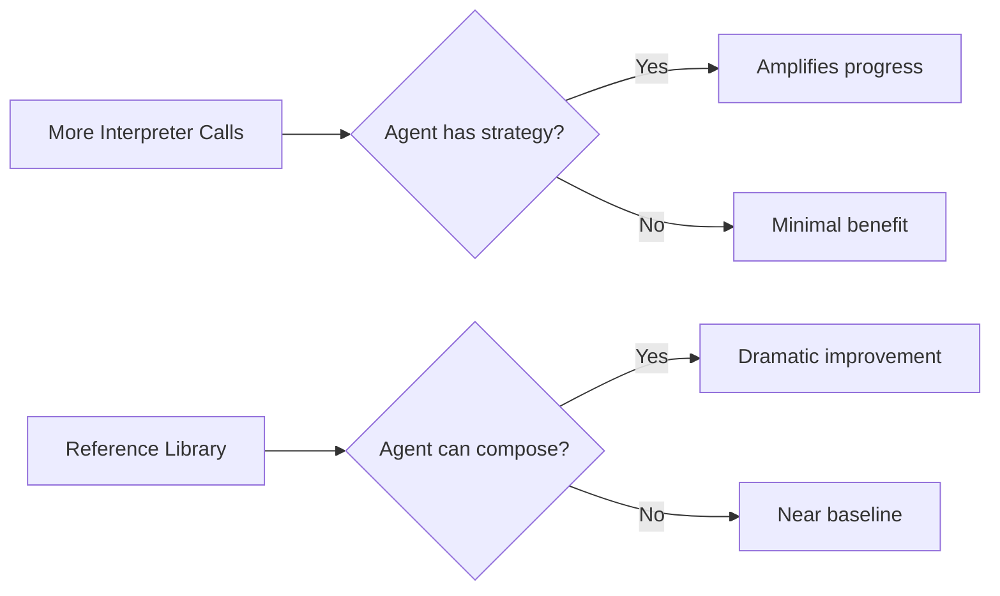
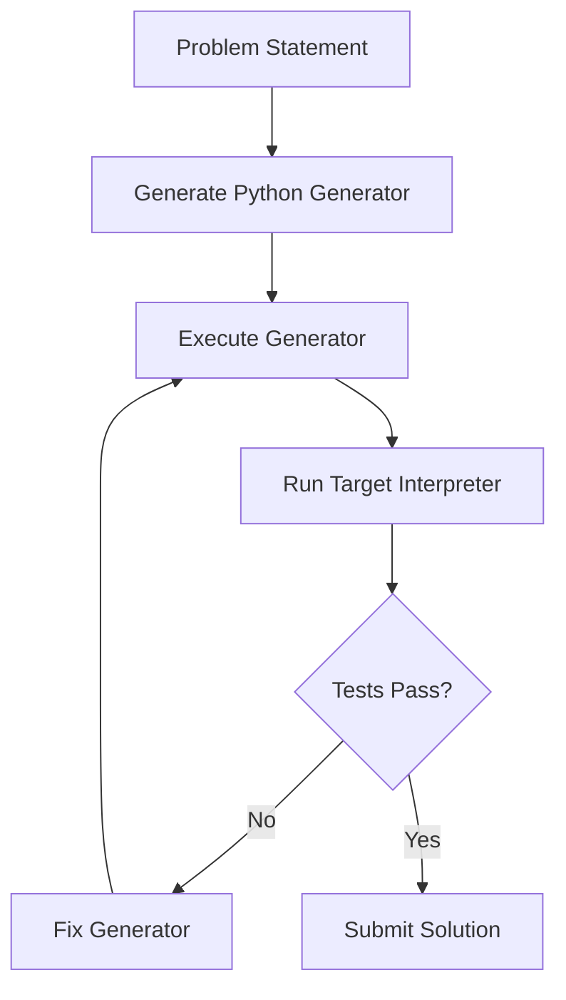

# The Metaprogramming Reflex: How Frontier Coding Agents Survive Languages They Have Never Seen — and What It Means for Codex CLI


---

When a senior developer faces a language they have never used — a proprietary DSL, a vendor-specific configuration grammar, an internal templating engine — they do not attempt to write it fluently on day one. They reach for a familiar language to generate the unfamiliar one. A Python script that emits Terraform. A Ruby program that produces XSLT. A shell pipeline that assembles COBOL copybooks.

New research demonstrates that frontier coding agents do precisely the same thing, and the gap between agents that discover this strategy and those that do not is enormous. The implications for how you configure Codex CLI — particularly AGENTS.md, sandbox permissions, and tool availability — are immediate and practical.

## The Paper: Frontier Coding Agents Use Metaprogramming

Sharma, Thorat, and Chopra at Lossfunk published *Frontier Coding Agents Use Metaprogramming to Adapt to Unfamiliar Programming Languages* (arXiv:2606.10933) on 9 June 2026 [^1]. The study evaluates six coding agents across four esoteric programming languages drawn from the EsoLang-Bench benchmark [^2]:

- **Brainfuck** — a minimal pointer-machine language with eight single-character instructions
- **Befunge-98** — two-dimensional control flow on a stack-based grid
- **Whitespace** — programs composed entirely of spaces, tabs, and linefeeds
- **Shakespeare** — programs disguised as Shakespearean plays

These languages were chosen because their training data is 5,000–100,000× scarcer than Python [^2], making them genuine tests of adaptation rather than memorisation. The experimental protocol gives each agent a problem statement, an isolated workspace with file editing, unlimited local interpreter calls, and up to three hidden-test submissions per problem — 80 problems per language, 320 total.

## The Results: A Staggering Spread

The headline finding is that unfamiliar-language evaluation exposes capability differences that mainstream benchmarks compress into narrow bands [^1]:

| Agent | Whitespace | Shakespeare | Befunge-98 | Brainfuck | Mean |
|-------|-----------|-------------|------------|-----------|------|
| GPT-5.4 xhigh | 100.0% | 100.0% | 100.0% | 98.8% | **99.7%** |
| Claude Opus 4.6 | 100.0% | 87.5% | 80.0% | 80.0% | **86.9%** |
| Claude Sonnet 4.6 | 100.0% | 70.0% | 80.0% | 15.0% | **66.3%** |
| GPT-5.4 mini | 88.8% | 21.3% | 13.8% | 6.3% | **32.5%** |
| Claude Haiku 4.5 | 81.3% | 7.5% | 5.0% | 5.0% | **24.7%** |
| Kimi K2.5 | 31.3% | 2.5% | 6.3% | 5.0% | **11.3%** |

The spread across all six agents is **88.4 percentage points** (SD 36.0). Compare that to SWE-Bench Verified at 6.6 pp (SD 2.9) or Terminal-Bench 2.0 at 33.3 pp (SD 11.5) [^1]. Mainstream benchmarks tell you which agent is marginally better; EsoLang-Bench tells you which agent can *think*.

## What the Best Agents Actually Do

The paper's central finding is that the strongest agents **stopped writing the target language by hand**. Instead, they wrote Python programs whose output was the target-language solution [^1] [^3]:

1. Write a Python generator that emits Brainfuck
2. Run the generator locally
3. Feed the output to the Brainfuck interpreter
4. Observe failures, fix the Python, regenerate
5. Submit only when hidden tests pass

This metaprogramming strategy lets agents name and manage details — cell allocation, pointer positioning, numeric encoding — that become cognitively fragile when hand-authored in a minimal language.

### The Evidence Is Decisive

When the researchers **banned metaprogramming** (forcing agents to author target code directly), the results collapsed [^1]:

- **Claude Opus 4.6 on Brainfuck:** 64/80 → 27/80 (−58%)
- **GPT-5.4 xhigh on Brainfuck:** 79/80 → 29/80 (−63%)
- **Claude Opus 4.6 on Befunge-98:** 80/80 → 64/80 (−20%)

Whitespace and Shakespeare showed minimal decline — their shorter, more structured solutions do not require scaffolding [^1].

### Host Language Flexibility

The generators do not need to be Python. On Brainfuck, GPT-5.4 xhigh achieved 79/80 with Python, 77/80 with JavaScript, and 79/80 with Rust [^1]. The metaprogramming reflex is language-agnostic — it is the *strategy* that matters, not the *tool*.

## Strategy Transfer: Knowledge vs. Capability

The most practically significant experiment tested whether the metaprogramming strategy could be *transferred* to weaker agents [^1]:

| Agent | Brainfuck Base | +Text Guidance | +Library |
|-------|---------------|---------------|----------|
| Claude Haiku 4.5 | 4/80 | 3/80 | 7/80 |
| Claude Sonnet 4.6 | 12/80 | 12/80 | **64/80** |
| GPT-5.4 mini | 5/80 | 8/80 | **53/80** |

Written advice about the strategy — distilled from Opus 4.6's successful trajectories — produced almost no improvement. But providing a **working reference library** of generic Python building blocks (cell allocators, pointer managers, numeric encoders) transformed mid-tier agents. Sonnet jumped from 12 to 64 solved problems; GPT-5.4 mini from 5 to 53 [^1].

Haiku 4.5 remained near baseline even with the library, exposing genuine composition limitations rather than knowledge gaps [^1].

The lesson: **you cannot teach strategy with documentation alone, but you can scaffold it with reusable code**.

## Token Efficiency: Strategy Beats Budget

Opus 4.6 solved all 20 initial Brainfuck and Befunge-98 problems using fewer cumulative output tokens than Sonnet 4.6 [^1]. The paper observes that "Opus finds a reusable strategy earlier, after which additional problems become cheaper to solve" [^1].

Similarly, increasing interpreter call budgets helped agents that already had useful strategies but left weaker agents near their floor [^1]:



This is the core insight: **resources amplify existing strategies; they do not create them**.

## What This Means for Codex CLI

The metaprogramming reflex has direct implications for how you configure and deploy Codex CLI, particularly when working with unfamiliar targets — DSLs, infrastructure-as-code languages, legacy formats, or domain-specific grammars.

### 1. Seed AGENTS.md with Generator Patterns, Not Just Syntax

The paper shows that written guidance about metaprogramming strategy barely moves the needle, but working code does [^1]. Your `AGENTS.md` should include **executable generator templates** for domain-specific targets:

```markdown
## Terraform Generation

When generating Terraform HCL, prefer writing a Python generator
that emits the HCL rather than authoring HCL directly. Use the
generator at `scripts/tf_gen.py` as a reference. Run
`python scripts/tf_gen.py | terraform fmt -` to validate output.
```

This maps directly to the paper's finding that reference libraries produced 5× improvement in mid-tier agents while text guidance produced none [^1].

### 2. Ensure Local Interpreter Access in the Sandbox

The metaprogramming loop depends on rapid local execution: generate, run, observe, fix. If your Codex CLI sandbox cannot execute the target language's interpreter, the agent loses its feedback loop [^1].

For `codex.toml` or your environment configuration:

```toml
[sandbox]
# Ensure interpreters for target languages are available
allow_commands = [
    "python3",
    "node",
    "terraform",
    "your-dsl-interpreter"
]
```

The paper demonstrates that increasing interpreter call budgets amplifies stronger agents substantially [^1]. Restricting sandbox access is the fastest way to kill the metaprogramming reflex.

### 3. Use Codex CLI Skills for Reusable Generators

Codex CLI's skills system [^4] maps directly to the reference library concept from the paper. Package your domain-specific generators as skills that Codex can discover and invoke:

```markdown
<!-- .codex/skills/generate-protobuf.md -->
## Generate Protobuf Definitions

When creating .proto files, use the Python generator at
`tools/proto_gen.py`. This generator handles:
- Field numbering and reserved ranges
- Import resolution from the registry
- Style compliance with our proto lint rules

Run: `python tools/proto_gen.py <spec.yaml> | protoc --lint_out=.`
```

This provides the "working reference library" the paper identifies as the critical enabler for mid-tier agents [^1].

### 4. Choose Models Strategically for Unfamiliar Domains

The paper's results suggest a clear model-selection heuristic for Codex CLI's `--model` flag:

- **Unfamiliar or complex targets** (DSLs, legacy formats, multi-step generation): use the strongest available model. The capability gap is enormous — 99.7% vs 11.3% at the extremes [^1]
- **Familiar, well-documented languages**: mid-tier models may suffice, especially when supported by reference libraries
- **Simple templated output**: even smaller models perform well (81%+ on Whitespace, the most structured language tested) [^1]

```bash
# Complex DSL generation — use the strongest model
codex --model o4-high "Generate the Kubernetes operator CRD from spec.yaml"

# Well-supported language with reference code available
codex --model o4-mini "Add pagination to the REST endpoint"
```

### 5. Structure Multi-Step Workflows with Explicit Generation Phases

The metaprogramming loop is inherently multi-step: generate, execute, validate, iterate. Codex CLI's hook system [^5] can enforce this structure:



A `PreToolUse` hook can verify that the agent has created a generator script before attempting to write the target language directly, nudging it toward the more effective metaprogramming path.

## Beyond Esoteric Languages

The paper uses esoteric languages as controlled proxies, but the practical applications are far broader [^3]:

- **Infrastructure-as-code**: generating CloudFormation, Terraform, Pulumi from higher-level specifications
- **Legacy migration**: producing COBOL, RPG, or mainframe JCL from modern language generators
- **Configuration grammars**: emitting Nginx configs, HAProxy rules, or iptables chains programmatically
- **Domain-specific languages**: generating GraphQL schemas, OpenAPI specs, or protocol buffer definitions

In each case, the pattern is identical: the agent works in a language it knows well to produce output in a language it does not. The sandbox provides the feedback loop. The reference library provides the scaffolding.

## The Deeper Lesson

The metaprogramming reflex reveals something fundamental about agent capability: **the best agents do not succeed by knowing more — they succeed by adapting their approach**. Opus 4.6 uses fewer tokens than Sonnet 4.6 while solving more problems [^1]. It finds the right strategy faster, then amortises that discovery across subsequent tasks.

For Codex CLI developers, this means that your agent configuration is not just about what the model *knows* — it is about whether your environment enables the model to *discover and apply effective strategies*. Interpreter access, reference libraries, and structured workflows are not optional conveniences. They are the difference between an agent that writes Brainfuck by hand at 27/80 and one that generates it at 79/80.

---

## Citations

[^1]: Sharma, A., Thorat, S., & Chopra, P. (2026). *Frontier Coding Agents Use Metaprogramming to Adapt to Unfamiliar Programming Languages*. arXiv:2606.10933. [https://arxiv.org/abs/2606.10933](https://arxiv.org/abs/2606.10933)

[^2]: Sharma, A. et al. (2026). *EsoLang-Bench: Evaluating Genuine Reasoning in Large Language Models via Esoteric Programming Languages*. arXiv:2603.09678. [https://arxiv.org/abs/2603.09678](https://arxiv.org/abs/2603.09678)

[^3]: Lossfunk. (2026). *The Metaprogramming Reflex: How the Best Coding Agents Survive Languages They've Never Seen*. Lossfunk Letters. [https://letters.lossfunk.com/p/the-metaprogramming-reflex-how-the](https://letters.lossfunk.com/p/the-metaprogramming-reflex-how-the)

[^4]: OpenAI. (2026). *Custom instructions with AGENTS.md — Codex CLI*. OpenAI Developers. [https://developers.openai.com/codex/guides/agents-md](https://developers.openai.com/codex/guides/agents-md)

[^5]: OpenAI. (2026). *Advanced Configuration — Codex CLI*. OpenAI Developers. [https://developers.openai.com/codex/config-advanced](https://developers.openai.com/codex/config-advanced)
