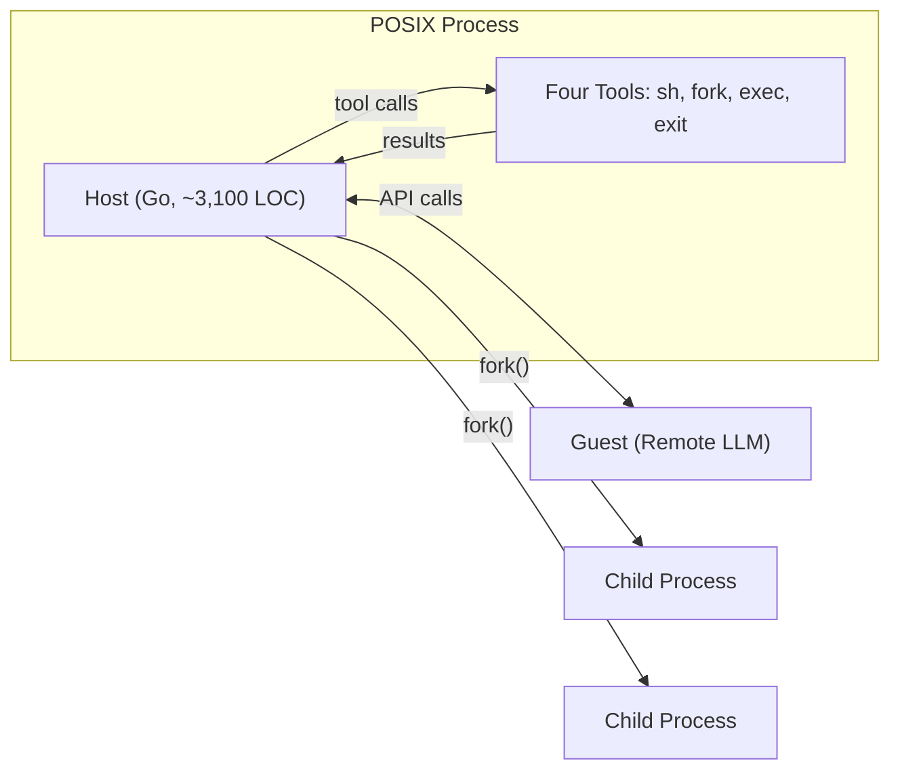
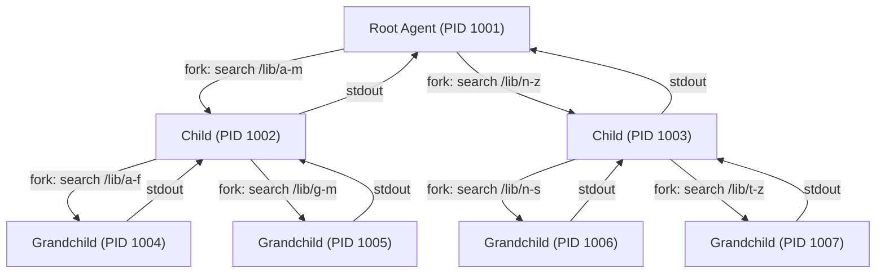

# Quine and the POSIX Agent: What Mapping LLM Agents to Unix Processes Means for Codex CLI Developers


---

## The Argument: Agents Are Processes, Not Objects

Most coding agent frameworks model agents as objects or threads within a single host process. Identity is a framework concept; isolation is simulated through software boundaries; composition requires bespoke orchestration code. Hao Ke's *Quine* paper (arXiv:2603.18030, March 2026) challenges this entire approach with a deceptively simple thesis: an LLM agent *already is* a POSIX process — we have simply been ignoring the mapping [^1].

The paper presents a reference implementation — a single ~9.8 MB Go binary compiled from approximately 5,700 lines — that treats the Unix process model as the agent's native runtime [^1]. The result is a system where isolation comes from the MMU, scheduling from the kernel, and composition from the shell. No framework required.

For Codex CLI developers, this matters because Codex CLI's own architecture already embeds significant POSIX semantics — Landlock, seccomp-bpf, Bubblewrap, `setsid()`, `openpty()` — yet does so within a monolithic Rust binary rather than across a process tree [^2]. Understanding the Quine mapping clarifies both what Codex CLI does well and where alternative architectural choices might lead.

## The Four POSIX Mappings

Quine establishes four explicit correspondences between agent concepts and OS primitives [^1]:

| Agent Concept | POSIX Primitive | Quine Implementation |
|---|---|---|
| **Identity** | PID | Hardware-enforced address space boundaries; kernel-assigned globally unique identifiers |
| **Interface** | stdin/stdout/stderr + exit status | Five-channel I/O contract: `argv` (mission), `stdin` (material), `stdout` (results), `stderr` (diagnostics), exit code (0–255) |
| **State** | Memory, env vars, filesystem | Three tiers: ephemeral (process memory), scoped (environment variables inherited by children), global (filesystem) |
| **Lifecycle** | fork/exec/exit | `fork` creates children with distinct missions; `exec` replaces process image preserving PID; `exit` signals completion |

The I/O contract is particularly elegant. The agent's mission (its system prompt) enters through `argv`, whilst input data arrives on `stdin`. This structural separation between instructions and data maps directly to the system-prompt / user-message boundary that every LLM API enforces [^1].

## The Host-Guest Architecture

Quine splits each agent into two halves [^1]:



The **Host** is a compiled Go programme handling OS-level operations: parsing `argv`, maintaining conversation history, managing child processes, and marshalling I/O. The **Guest** is the remote LLM, providing stateless cognitive decisions through structured tool calls. Four tools mediate interaction [^1]:

- **`sh`** — execute shell commands, capture output and exit status
- **`fork`** — spawn a child process with a new mission
- **`exec`** — replace the current process image (default: re-entry into the same binary)
- **`exit`** — terminate with a status code

This is a radically smaller tool surface than Codex CLI's built-in set (which includes `shell`, `apply_patch`, `create_file`, `read_file`, `list_directory`, `search_files`, `search_text`, `image`, and subagent tools) [^3]. The minimalism is deliberate: Quine delegates everything beyond cognition to the shell.

## Self-Renewal Through exec

Perhaps the most striking mechanism is context renewal through the `exec` syscall. When an agent approaches context exhaustion, it can `exec` into a fresh instance of itself. The syscall replaces the process image — clearing memory and conversational context — whilst preserving the PID, parent relationship, environment variables, and open file descriptors [^1].

This maps to a problem every Codex CLI developer encounters: long-running sessions that degrade as the context window fills. Codex CLI addresses this through context compaction — intelligent summarisation of earlier turns [^4]. Quine's approach is more radical: throw away the context entirely and rely on filesystem state (the scoped and global tiers) to carry continuity forward.

On MRCR needle-retrieval tasks spanning 4K to 279K tokens, Quine achieved ≥99.6% success where single-context baselines failed on five of eight samples. The 279K-token case required approximately 12 `exec` cycles with roughly 80 read operations [^1].

## Shell-Native Composition

Because a Quine agent is a standard Unix filter, it composes natively with shell pipelines:

```bash
cat server.log | ./quine "Extract auth failures" | sort | uniq -c
```

This is qualitatively different from Codex CLI's subagent model, where child agents are spawned through the `codex_agent` tool within the same orchestration framework [^5]. Both approaches have merits:

| Dimension | Quine (Process Pipes) | Codex CLI (Subagents) |
|---|---|---|
| Isolation | Hardware-enforced (MMU) | Software-enforced (Landlock + seccomp-bpf) |
| Composition | Shell pipelines, any Unix tool | Framework-managed delegation |
| State sharing | Filesystem + env vars | Shared working directory |
| Observability | Standard process monitoring (`ps`, `htop`, `strace`) | Codex-specific tracing and rollout budgets |
| Max concurrency | OS process limits | Six subagents (current Codex CLI limit) |

## How Codex CLI Already Uses POSIX Semantics

Codex CLI is not a Quine-style process tree, but it already leans heavily on POSIX primitives for its sandbox architecture [^2]:

- **`setsid()` and `setpgid()`** for signal management of child processes
- **`prctl(PR_SET_PDEATHSIG)`** on Linux to ensure children die when the parent exits
- **`openpty()`** via `portable-pty` for terminal emulation during process execution
- **Landlock LSM** for filesystem access control
- **seccomp-bpf** via `seccompiler` for syscall filtering
- **Bubblewrap** (vendored) for namespace isolation on Linux
- **Seatbelt** with deny-by-default policy on macOS

The key architectural difference: Codex CLI sandboxes its *tool calls*, not itself. The main Codex process runs unsandboxed; only the shell commands it executes on behalf of the AI are sandboxed [^2]. In Quine's model, the agent *is* the sandboxed process.

## Recursive Delegation: Quine's Fractal Search

Quine's evaluation includes a fractal library search where the agent delegated work to 36 processes across three hierarchy levels to search 1,000 files within an eight-turn budget [^1]. The recursive decomposition emerges naturally from `fork`: each child is structurally isomorphic to its parent — same interface, independent context window.



Codex CLI's subagent model achieves similar parallelism but with more structure: three roles (explorer, worker, default) and configurable token budgets per subagent [^5]. The trade-off is flexibility versus governance — Quine's agents can spawn indefinitely, whilst Codex CLI's six-subagent limit provides cost control.

## Two Gaps Quine Identifies Beyond POSIX

The paper is refreshingly honest about where the POSIX model breaks down [^1]:

1. **World Constitution** — traditional sandboxing restricts access, but cognitive runtimes must scope reality itself. Agents need "a world organised by task relevance — a situated perspective in which some entities are present, others absent." This maps to Codex CLI's `AGENTS.md` and per-directory configuration, which tell the agent what matters in each part of the codebase [^6].

2. **Revisable Time** — POSIX manages forward-moving execution. Agents need "the ability to undo effects whilst preserving experience" — rollback without amnesia. Codex CLI's session archiving and conversation forking (`/fork`, `/side`) provide partial solutions, but true speculative branching with rollback remains an open problem [^7].

## Practical Implications for Codex CLI Workflows

Even without adopting Quine directly, Codex CLI developers can apply the POSIX process model thinking:

### Use git worktrees as process-like isolation

```bash
# Each worktree gives a subagent its own filesystem "world"
git worktree add ../feature-auth -b feature/auth
codex --cwd ../feature-auth "Implement OAuth flow"
```

This approximates Quine's fork semantics — isolated filesystem state with a shared repository history [^8].

### Treat environment variables as scoped agent configuration

```toml
# ~/.codex/config.toml — environment as state tier
[env]
CODEX_MODEL = "gpt-5-codex"
CODEX_TOKEN_BUDGET = "50000"
```

Quine's three-tier state model (ephemeral memory, scoped env vars, global filesystem) maps well to Codex CLI's configuration hierarchy: session state → environment variables → `config.toml` → `AGENTS.md` [^6].

### Compose Codex CLI in shell pipelines

```bash
# Codex CLI as a Unix filter via --exec
codex --exec "Summarise the failing tests" < test-output.log > summary.md
```

Codex CLI's `--exec` and structured output modes already support pipeline composition, bringing it closer to Quine's shell-native philosophy [^9].

## Where This Leads

The Quine paper is not a competitor to Codex CLI — it is a lens. By formalising what it means for an agent to be a process, Ke exposes the design space that all coding agent architectures navigate: how much structure to impose, how much to inherit from the OS, and where the boundaries of POSIX semantics genuinely fall short.

For Codex CLI developers, the actionable insight is this: the Unix process model is not just an implementation detail of the sandbox. It is a design vocabulary for agent composition, isolation, and lifecycle management. The more fluently you speak it, the more effectively you can orchestrate agents — whether those agents are Quine binaries, Codex CLI subagents, or shell scripts that happen to call an LLM.

---

## Citations

[^1]: Ke, H. (2026). "Quine: Realizing LLM Agents as Native POSIX Processes." arXiv:2603.18030. [https://arxiv.org/abs/2603.18030](https://arxiv.org/abs/2603.18030)

[^2]: Agent Safehouse. (2026). "OpenAI Codex CLI — Sandbox Analysis Report." [https://agent-safehouse.dev/docs/agent-investigations/codex](https://agent-safehouse.dev/docs/agent-investigations/codex)

[^3]: OpenAI. (2026). "Features — Codex CLI." OpenAI Developers. [https://developers.openai.com/codex/cli/features](https://developers.openai.com/codex/cli/features)

[^4]: OpenAI. (2026). "CLI — Codex." OpenAI Developers. [https://developers.openai.com/codex/cli](https://developers.openai.com/codex/cli)

[^5]: OpenAI. (2026). "Subagents — Codex." OpenAI Developers. [https://developers.openai.com/codex/subagents](https://developers.openai.com/codex/subagents)

[^6]: OpenAI. (2026). "Configuration Reference — Codex." OpenAI Developers. [https://developers.openai.com/codex/config-reference](https://developers.openai.com/codex/config-reference)

[^7]: OpenAI. (2026). "Changelog — Codex." OpenAI Developers. [https://developers.openai.com/codex/changelog](https://developers.openai.com/codex/changelog)

[^8]: Vaughan, D. (2026). "Codex CLI Worktree Parallel Development." Codex Knowledge Base. [https://codex.danielvaughan.com/2026/03/26/codex-cli-worktree-parallel-development/](https://codex.danielvaughan.com/2026/03/26/codex-cli-worktree-parallel-development/)

[^9]: OpenAI. (2026). "Command Line Options — Codex CLI." OpenAI Developers. [https://developers.openai.com/codex/cli/reference](https://developers.openai.com/codex/cli/reference)
