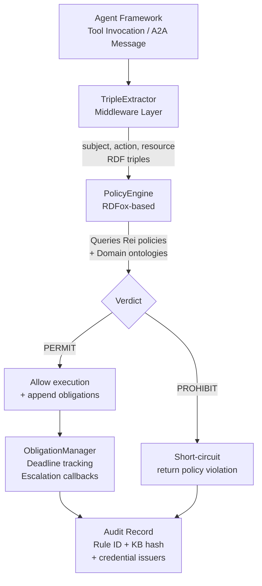
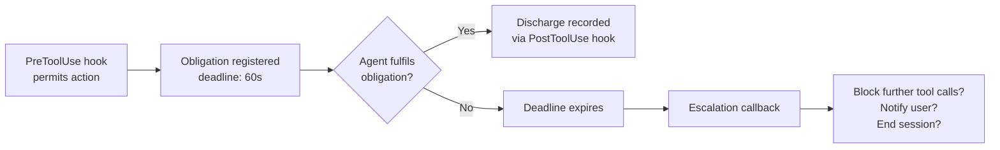

# Deontic Policies and Runtime Governance: What AgenticRei Means for Codex CLI's Permission Model


---

Codex CLI's permission model — sandbox modes, approval policies, `PreToolUse` hooks — handles the question *"is this action allowed?"* tolerably well. What it cannot express is the question that follows: *"what must happen because it was allowed?"* A paper published on 17 June 2026 argues that this gap is not a missing feature but a category error in how the entire industry builds policy engines for agentic AI.

## The Governance Gap

Joshi, Finin, Joshi and Kagal's "Deontic Policies for Runtime Governance of Agentic AI Systems" (arXiv:2606.19464) [^1] identifies three structural problems with current agent governance:

1. **Scaling oversight with autonomy.** Regulators expect oversight proportional to granted autonomy, but regulatory guidance (including the EU AI Act high-risk obligations taking effect August 2026) explicitly excludes agentic AI from scope [^1], leaving organisations to build frameworks that do not yet exist.
2. **Authority creep.** Confirmation requirements gradually relax and autonomy thresholds silently increase without explicit re-authorisation. The paper calls this *"diffuse accountability"* — when decisions are later challenged, no audit trail records who authorised the relaxation [^1].
3. **Standards-enforcement gap.** Control frameworks like NIST AI RMF and AIUC-1 specify objectives but remain silent on runtime enforcement mechanisms [^1].

The central claim is that flat permit/deny policy engines — including OPA/Rego, Cedar, and XACML 3.0 — structurally cannot address these problems because they lack first-class support for **obligations**, **dispensations**, and **meta-policy conflict resolution** [^1].

## AgenticRei: Deontic Logic Outside the LLM

AgenticRei extends the Rei policy framework, originally developed at UMBC for Semantic Web trust management [^2], with four deontic modalities expressed in OWL:

| Modality | Purpose | Example |
|---|---|---|
| `deontic:Permission` | Allows an action | Agent may install packages |
| `deontic:Prohibition` | Forbids an action | Agent must not delete user records |
| `deontic:Obligation` | Duty arising *because* a permitted action occurred | Agent must notify CISO after installing software |
| `deontic:Dispensation` | Waives an obligation under specific conditions | Exempt counterparty waives filing requirement |

The critical insight is the separation of *permission* from *consequence*. An obligation fires only because the parent action was permitted, attached via `deontic:provision`. This is structurally inexpressible in attribute-based access control (ABAC) systems where duties are separate rules that must be manually chained [^1].

### Architecture: Extract–Evaluate–Apply



The `TripleExtractor` intercepts outbound actions at the framework middleware boundary, converting tool invocations and agent-to-agent messages to `⟨subject, action, resource⟩` RDF triples. The RDFox-based policy engine evaluates these against loaded Rei policies and domain ontologies, returning a verdict plus any triggered obligations [^1].

Performance is sub-millisecond for policy queries, with end-to-end latency under 10ms dominated by HTTP overhead [^1]. Every decision generates a structured audit record capturing the matched rule, credential issuers, and a hash of the loaded policy knowledge base — enabling forensic queries like *"which policy version was in effect when this decision was made?"* [^1].

### What Competing Engines Cannot Express

The paper demonstrates five policy scenarios of increasing complexity [^1]:

| Capability | AgenticRei | Rego (OPA) | Cedar | XACML 3.0 |
|---|:---:|:---:|:---:|:---:|
| Permit/Prohibit | ✓ | ✓ | ✓ | ✓ |
| Obligations (native) | ✓ | ✗ | ✗ | ✗ |
| Dispensations | ✓ | ✗ | ✗ | ✗ |
| Meta-policy conflict resolution | ✓ | ✗ | ✗ | ✗ |
| OWL class hierarchy reasoning | ✓ | ✗ | ✗ | ✗ |
| Obligation lifecycle management | ✓ | ✗ | ✗ | Partial |

The OWL reasoning capability is particularly relevant: a prohibition on reading Protected Health Information (PHI) automatically covers any future subclass — `PatientTreatmentPlan`, `GeneticTestResult` — through RDFox's materialisation of the OWL subclass closure at load time [^1]. No policy modification is required when the data taxonomy expands.

## Mapping to Codex CLI's Current Model

Codex CLI's governance stack operates at three layers [^3] [^4]:

1. **Sandbox modes** (`read-only`, `workspace-write`, `danger-full-access`) — kernel-level filesystem and network isolation.
2. **Approval policies** (`on-request`, `untrusted`, `never`, granular categories) — controlling when the agent must request user consent.
3. **Hooks** (`PreToolUse`, `PostToolUse`, `UserPromptSubmit`) — programmatic policy gates where exit code 0 permits and exit code 1 blocks.

Additionally, `requirements.toml` enforces administrator-level restrictions that users cannot override, following precedence: cloud-managed → MDM → system → project → user [^3].

### Where Codex CLI Aligns

Codex CLI's `PreToolUse` hook already functions as a synchronous policy interceptor — conceptually equivalent to AgenticRei's `TripleExtractor` + `PolicyEngine` pipeline. The hook receives the tool name and arguments on stdin, evaluates local policy, and returns a permit/deny verdict [^4]. Protected paths (`.git`, `.agents`, `.codex`) remain read-only regardless of sandbox setting [^3], implementing a form of default-deny posture.

The `requirements.toml` hierarchy maps loosely to AgenticRei's meta-policy conflict resolution: administrator rules override project rules override user rules [^3]. Both systems recognise that policy authority must be layered and non-overridable from below.

### Where the Gap Shows

Codex CLI has no mechanism to express: *"if you permitted this tool call, you are now obligated to do X within Y seconds."* Hooks fire before or after individual actions but cannot attach **conditional duties** to permitted actions. Consider these practical scenarios:

- **Obligation:** *"If the agent writes to production configuration files, it must open a pull request for review within the same session."* Currently, this must be embedded in the AGENTS.md prompt — where it is interpreted probabilistically by the LLM, not enforced deterministically [^1].
- **Dispensation:** *"The CTR filing obligation is waived for exempt counterparties."* Codex CLI's binary hook model (exit 0 / exit 1) cannot express conditional obligation waivers.
- **Authority creep:** *"Who authorised the change from `workspace-write` to `danger-full-access`?"* Codex CLI tracks the active sandbox mode but does not audit-log the authorisation chain for mode changes [^1].

### Connecting the Layers

Microsoft's Agent Governance Toolkit, released April 2026 [^5], addresses a similar problem space with a seven-package system across Python, TypeScript, Rust, Go and .NET. Its Agent OS component intercepts every agent action with sub-0.1ms p99 latency and claims coverage of all 10 OWASP agentic AI risks [^5]. However, like Codex CLI's hooks, it operates on a flat permit/deny model without native obligation lifecycle management.

AgenticRei's contribution is orthogonal: it does not replace Codex CLI's sandbox or Microsoft's Agent OS but adds the deontic layer that both lack.

## A Practical Codex CLI Integration Pattern

While AgenticRei is not integrated with Codex CLI today, the hook system provides a viable attachment point. Here is a pattern using `PreToolUse` to delegate policy evaluation to an external deontic engine:

```toml
# .codex/config.toml
[hooks.pre_tool_use]
command = "python3 .codex/hooks/deontic_gate.py"
timeout_ms = 50
```

```python
#!/usr/bin/env python3
"""deontic_gate.py — PreToolUse hook delegating to AgenticRei."""
import json, sys, urllib.request

def main():
    tool_call = json.load(sys.stdin)
    triple = {
        "subject": tool_call.get("agent_id", "codex-cli"),
        "action": tool_call["tool_name"],
        "resource": tool_call.get("arguments", {}).get("path", "*"),
    }
    req = urllib.request.Request(
        "http://localhost:8090/evaluate",
        data=json.dumps(triple).encode(),
        headers={"Content-Type": "application/json"},
    )
    try:
        resp = urllib.request.urlopen(req, timeout=0.04)
        verdict = json.loads(resp.read())
        if verdict["decision"] == "PROHIBIT":
            print(verdict.get("reason", "Policy violation"), file=sys.stderr)
            sys.exit(1)
        # Log obligations for post-session audit
        for ob in verdict.get("obligations", []):
            print(f"OBLIGATION: {ob['action']} -> {ob['target']} "
                  f"within {ob.get('deadline', 'session end')}", file=sys.stderr)
    except Exception:
        # Fail-open or fail-closed per organisational policy
        sys.exit(1)  # fail-closed
    sys.exit(0)

if __name__ == "__main__":
    main()
```

This pattern delegates the policy decision to an external engine while keeping Codex CLI's hook contract intact. Obligations are logged to stderr (visible in the Codex CLI session trace) but enforcement of obligation *discharge* remains a gap — the hook can record the duty but cannot force the agent to fulfil it within the session.

## The Obligation Lifecycle Problem

AgenticRei's `ObligationManager` tracks deadlines and triggers escalation callbacks [^1], but integrating this with Codex CLI's session model raises unsolved questions:



⚠️ Codex CLI hooks are stateless — each invocation receives only the current tool call, with no mechanism to query outstanding obligations from prior calls within the same session. Implementing obligation lifecycle tracking would require either:

- A **sidecar process** maintaining obligation state across hook invocations, queried by each `PreToolUse` call.
- An **extension to the hook protocol** adding a session-scoped obligation registry that hooks can read and write.
- Integration with Codex CLI's **extension events** (introduced in v0.133) to emit obligation-related lifecycle events [^6].

## Ontological Reasoning: The Underappreciated Advantage

AgenticRei's use of OWL class hierarchies offers a governance capability that no current coding agent implements. Consider a Codex CLI policy that prohibits reading files tagged as containing personally identifiable information (PII). In today's hook model, you must enumerate every file path or pattern. With ontological reasoning:

```turtle
pii:PII a rdfs:Class .
pii:EmailAddress rdfs:subClassOf pii:PII .
pii:NationalID rdfs:subClassOf pii:PII .
pii:BiometricData rdfs:subClassOf pii:PII .
```

A single prohibition on `pii:PII` automatically covers all subclasses — including future additions to the ontology [^1]. When the data team adds `pii:VoicePrint` next quarter, no policy file needs updating.

This maps to a real enterprise concern: Codex CLI agents operating across repositories with different data classification schemes. A shared OWL ontology could unify governance policies across teams without requiring each repository's AGENTS.md to enumerate its own data categories.

## What This Means for Codex CLI Developers

Three takeaways from the AgenticRei paper:

1. **Your hooks are necessary but insufficient.** `PreToolUse` handles binary permit/deny well. It cannot express *"yes, but you must also do X."* If your organisation's compliance posture requires conditional duties — audit logging, notification, compensating actions — you need an external obligation tracker, and you need it before the EU AI Act high-risk provisions bite in August 2026.

2. **Authority creep is a configuration governance problem.** Every Codex CLI sandbox mode change should be audit-logged with the authorisation chain. AgenticRei's KB hash approach — recording which policy version was in effect for each decision — is a pattern worth adopting even without the full deontic stack. Codex CLI's `requirements.toml` hierarchy provides the enforcement mechanism; what is missing is the audit trail.

3. **Ontological reasoning reduces policy maintenance cost.** If your data classification taxonomy changes frequently, encoding it in OWL and evaluating policies via ontological reasoning eliminates the chore of updating hook scripts every time a new data category appears.

## Citations

[^1]: Joshi, A., Finin, T., Joshi, K. P. & Kagal, L. (2026). "Deontic Policies for Runtime Governance of Agentic AI Systems." arXiv:2606.19464. [https://arxiv.org/abs/2606.19464](https://arxiv.org/abs/2606.19464)

[^2]: Kagal, L., Finin, T. & Joshi, A. "Rei: A Policy Language for the Me-Centric Project." UMBC eBiquity. [https://ebiquity.umbc.edu/_file_directory_/papers/57.pdf](https://ebiquity.umbc.edu/_file_directory_/papers/57.pdf)

[^3]: OpenAI. "Agent approvals & security — Codex." OpenAI Developers. [https://developers.openai.com/codex/agent-approvals-security](https://developers.openai.com/codex/agent-approvals-security)

[^4]: OpenAI. "Configuration Reference — Codex." OpenAI Developers. [https://developers.openai.com/codex/config-reference](https://developers.openai.com/codex/config-reference)

[^5]: Microsoft. "Introducing the Agent Governance Toolkit: Open-source runtime security for AI agents." Microsoft Open Source Blog, 2 April 2026. [https://opensource.microsoft.com/blog/2026/04/02/introducing-the-agent-governance-toolkit-open-source-runtime-security-for-ai-agents/](https://opensource.microsoft.com/blog/2026/04/02/introducing-the-agent-governance-toolkit-open-source-runtime-security-for-ai-agents/)

[^6]: OpenAI. "Changelog — Codex." OpenAI Developers. [https://developers.openai.com/codex/changelog](https://developers.openai.com/codex/changelog)
