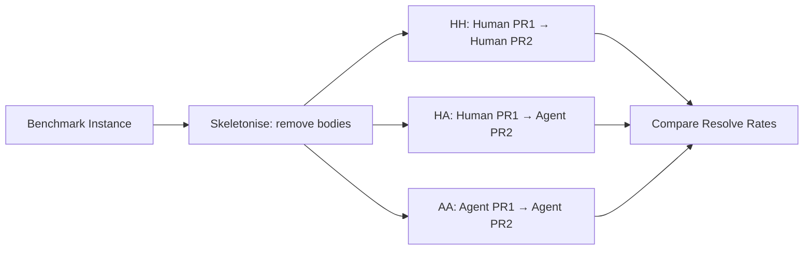
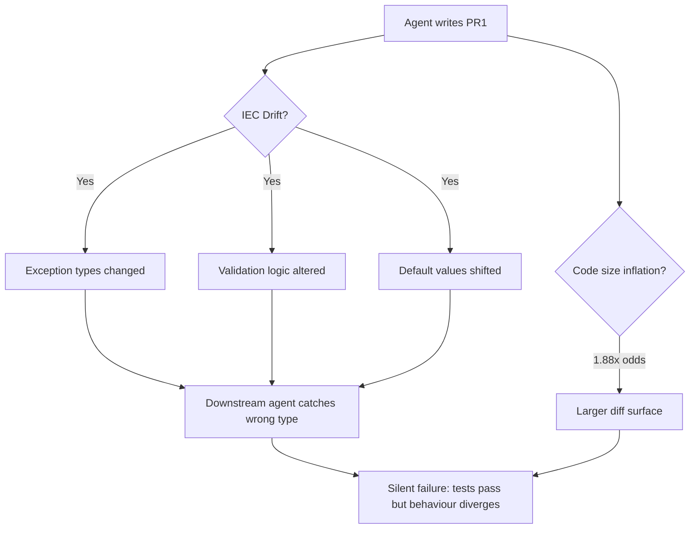

# Is Agent Code Less Maintainable? What CodeThread Reveals About Codex CLI Output and How to Defend Against Drift


---

Your coding agent resolved the ticket. The tests pass. The diff looks clean. Six weeks later, a second agent — or a colleague — tries to extend that code and silently fails. The problem is not logic errors or missing tests. It is something subtler: the agent changed how the function validates its inputs, swapped exception types, or introduced a default-value path that no test exercises. Welcome to **Input/Error Contract (IEC) drift**, the maintainability tax that SWE-Bench scores do not measure and traditional complexity metrics cannot detect.

A paper published on 19 June 2026 — *"Is Agent Code Less Maintainable Than Human Code?"* by Patel, Hou, Purohit, Xu, Pan, He and Chen [^1] — puts hard numbers on this problem for the first time. This article unpacks the findings and maps every practical implication to Codex CLI configuration, hooks and workflow patterns.

## The CodeThread Framework

The researchers needed a way to isolate authorship as a variable. Raw SWE-Bench scores conflate the model, the harness and the environment into a single pass/fail verdict [^2]. CodeThread removes that noise with a three-stage experimental design:

1. **Skeletonise** — strip function bodies from the codebase while preserving signatures, creating an Implementation Task (PR₁).
2. **Author under controlled conditions** — generate PR₁ code via three scenarios: Human→Human (HH), Human→Agent (HA), and Agent→Agent (AA).
3. **Evaluate downstream** — measure whether a second agent can resolve a dependent follow-on task (PR₂) using each PR₁ variant as its starting point.

The framework filters instances to ensure a PR₁ solution cannot accidentally resolve PR₂, preserving task independence [^1].



## What the Numbers Say

Four frontier agents — Claude 4.5 Sonnet, GPT-5, GLM 4.7 and MiniMax M2.5 — were evaluated across four benchmarks: SWE-Bench Verified (500 instances), SWE-Bench Multilingual (300), SWE-Bench Pro (731) and FeatBench (156) [^1].

The headline finding: **agents building on agent code resolve fewer tasks than agents building on human code**, with drops of up to 13.1%.

| Agent | Benchmark | Resolve Rate Drop |
|-------|-----------|-------------------|
| GLM 4.7 | SWE-Bench Pro | −13.1% |
| GPT-5 | FeatBench | −12.5% |
| All agents (mean) | Feature implementation | −6.25% |
| All agents (mean) | Refactoring tasks | −8.21% |

Refactoring and multi-file tasks proved most vulnerable — precisely the kinds of tasks you delegate to Codex CLI in `full-auto` mode [^1].

## Why Traditional Metrics Miss It

The researchers tested four standard maintainability proxies [^1]:

- **Cyclomatic Complexity** — no significant predictive value
- **Cognitive Complexity** — insufficient to explain the differences
- **Halstead Volume** — failed to differentiate outcomes
- **Logical Lines of Code (LLOC)** — only final-stage LLOC changes showed marginal significance

Static analysis tools that rely on these metrics — the kind you might run in a PostToolUse hook today — will not catch IEC drift. The problem is *behavioural*, not *structural*.

## The Three Drift Mechanisms

CodeThread identified three factors that actually predict downstream failure [^1]:

### 1. Input/Error Contract (IEC) Drift

Agents alter exception types or validation logic in ways that are functionally correct for the immediate task but create silent incompatibilities downstream. A function that raised `TypeError` under human authorship might raise `ValueError` under agent authorship. Both pass the current test suite; neither will behave identically when a future caller catches a specific exception type.

### 2. Downstream Code Size Inflation

Agent-authored code tends to add more lines when modifying existing functions. Each additional line of diff correlates with a 1.88× odds increase in downstream failure [^1]. The agent is not writing *wrong* code — it is writing *more* code, which increases the surface area for future misunderstandings.

### 3. Task Difficulty Inversion

Paradoxically, *easier* tasks showed larger performance gaps between human-authored and agent-authored starting points. On harder tasks, both human and agent code were equally difficult to extend. The implication: agents introduce unnecessary complexity into straightforward code paths.



## Mapping to Codex CLI: Five Defence Patterns

### 1. PostToolUse Contract Assertions

Standard linting hooks catch style violations but miss IEC drift. Instead, write a PostToolUse hook that compares the *exception signature* and *parameter validation pattern* of modified functions against a baseline snapshot.

```toml
# codex.toml — PostToolUse hook for IEC drift detection
[[hooks]]
event = "PostToolUse"
tool = "write_file"
command = "python3 scripts/check_iec_drift.py --baseline .iec-baseline.json --changed $CODEX_FILE_PATH"
on_fail = "inject_feedback"
```

When exit code 2 is returned, Codex CLI replaces the tool result with the hook's stderr output, steering the agent to correct the contract violation before continuing [^3].

### 2. AGENTS.md Contract Constraints

Pin the contracts that matter most in your project's `AGENTS.md` or per-directory instruction files:

```markdown
## Error Handling Contracts

- All public API functions MUST raise `ValueError` for invalid input, never `TypeError`
- Functions accepting optional parameters MUST use `None` as the default, not `getattr` fallbacks
- Exception messages MUST include the parameter name and received value
- Do NOT add input validation to internal helper functions unless explicitly requested
```

These instructions survive across sessions and constrain every agent — human-supervised or autonomous — that touches the directory [^4].

### 3. Diff Size Budgets via Rollout Token Controls

CodeThread's finding that larger diffs correlate with 1.88× failure odds justifies constraining agent output volume. Codex CLI v0.142's configurable rollout token budgets [^5] offer one mechanism, but for finer control, a PreToolUse hook can reject file writes that exceed a diff-line threshold:

```bash
#!/usr/bin/env bash
# hooks/check-diff-size.sh — reject oversized diffs
CHANGED_LINES=$(git diff --numstat -- "$CODEX_FILE_PATH" | awk '{print $1 + $2}')
MAX_LINES=150
if [ "$CHANGED_LINES" -gt "$MAX_LINES" ]; then
  echo "Diff exceeds ${MAX_LINES} lines (${CHANGED_LINES}). Split into smaller changes." >&2
  exit 2
fi
```

### 4. Two-Pass Refactoring with Contract Lock

For refactoring tasks — the category most vulnerable to IEC drift at −8.21% — adopt a two-pass workflow:

1. **Pass 1 (contract lock):** instruct the agent to extract and freeze the current input/output contracts as snapshot tests, without changing implementation.
2. **Pass 2 (refactor):** proceed with the refactoring, with the snapshot tests acting as regression gates.

This mirrors the CodeThread methodology itself: separate the contract from the implementation so that drift becomes a test failure rather than a silent regression.

### 5. Permission Profile Stratification

Use Codex CLI's permission profiles to match task risk to oversight level [^6]:

```toml
# Low-risk: new feature in isolated module — full-auto is acceptable
[profiles.feature-isolated]
auto_edit = true
auto_run = true

# High-risk: refactoring shared utilities — suggest mode forces review
[profiles.refactor-shared]
auto_edit = false
auto_run = false
```

CodeThread's data shows that refactoring tasks and multi-file edits are disproportionately affected by IEC drift. Routing those tasks through `suggest` mode ensures a human reviews the contract-sensitive changes before they become the foundation for future agent work.

## The Compounding Problem

The paper's most sobering observation: the maintainability costs measured in CodeThread appear "even on two-step chains and likely to compound over many edits" [^1]. In a codebase where agents routinely build on agent-authored code — the AA scenario — each layer of IEC drift makes the next layer harder to detect and correct.

This has direct implications for teams running Codex CLI in long-running Goal Mode sessions or multi-agent delegation workflows. Every autonomous edit that subtly alters an error contract becomes the starting point for the next agent's reasoning. Without explicit contract preservation, the codebase drifts toward a state where tests pass but behaviour diverges from design intent.

## Practical Checklist

- [ ] Generate IEC baseline snapshots for critical modules (`scripts/snapshot_iec.py`)
- [ ] Add PostToolUse hook checking exception types and validation patterns against baseline
- [ ] Pin error-handling conventions in `AGENTS.md` at the repository root
- [ ] Set diff-line thresholds via PreToolUse hooks for refactoring tasks
- [ ] Route refactoring and multi-file tasks through `suggest` permission profile
- [ ] Adopt two-pass refactoring: freeze contracts first, then modify implementation
- [ ] Review CodeThread's findings quarterly as new agent models may shift the baseline

## Conclusion

CodeThread demonstrates that the question is no longer *whether* agents can write correct code — they demonstrably can — but whether the code they write remains a viable foundation for future work. The 13.1% resolve-rate drop is not a bug in any single model; it is a systemic property of how current agents handle input validation, error contracts and code volume. Codex CLI's hook pipeline, AGENTS.md constraints and permission profiles provide the mechanisms to detect and contain this drift, but only if you configure them for *behavioural* invariants rather than *structural* metrics.

The linter will not save you. The contract snapshot will.

## Citations

[^1]: Patel, S., Hou, B.L., Purohit, A., Xu, K., Pan, J., He, H. & Chen, V. (2026). "Is Agent Code Less Maintainable Than Human Code?" arXiv:2606.21804. [https://arxiv.org/abs/2606.21804](https://arxiv.org/abs/2606.21804)

[^2]: Position paper on benchmark misalignment: "Coding Benchmarks Are Misaligned with Agentic Software Engineering." arXiv:2606.17799. [https://arxiv.org/abs/2606.17799](https://arxiv.org/abs/2606.17799)

[^3]: OpenAI. "Hooks — Codex CLI." OpenAI Developers Documentation. [https://developers.openai.com/codex/hooks](https://developers.openai.com/codex/hooks)

[^4]: OpenAI. "AGENTS.md — Codex CLI." OpenAI Developers Documentation. [https://developers.openai.com/codex/agents-md](https://developers.openai.com/codex/agents-md)

[^5]: OpenAI. "Codex CLI v0.142.0 Release Notes." GitHub. [https://github.com/openai/codex/releases/tag/rust-v0.142.0](https://github.com/openai/codex/releases/tag/rust-v0.142.0)

[^6]: OpenAI. "Configuration Reference — Codex CLI." OpenAI Developers Documentation. [https://developers.openai.com/codex/config-reference](https://developers.openai.com/codex/config-reference)
