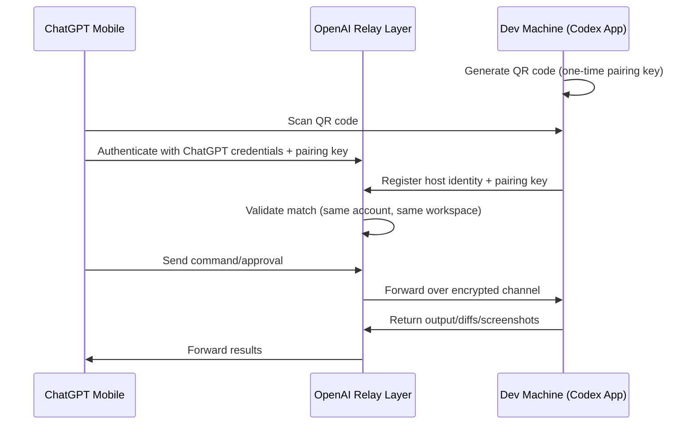
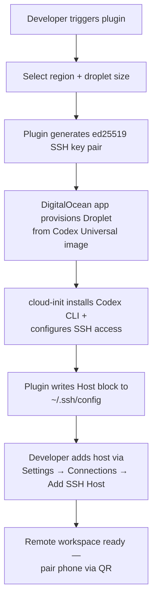
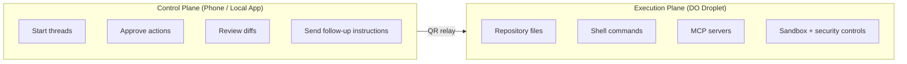
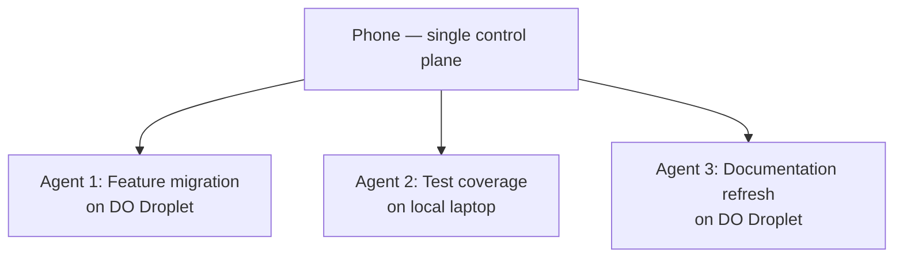

# Codex Remote GA: QR Relay, DigitalOcean Plugin, and the Phone as Your Agent's Control Plane


---

On 25 June 2026 OpenAI promoted Codex Remote from preview to general availability, opening phone-based control of long-running AI coding sessions to every paid ChatGPT subscriber — Plus, Pro, Business, Enterprise, and Education.[^1] Alongside it shipped authenticated QR pairing between mobile devices and hosts, and a first-party DigitalOcean plugin that provisions cloud workspaces without leaving the Codex app.[^2]

For the more than 5 million developers who now use Codex each week — up from 600,000 at the start of the year — the practical effect is that approving an agent action, steering a long-running goal, or reviewing a set of diffs no longer requires sitting at the machine where the code runs.[^3] This article covers the GA architecture, the security model change, the DigitalOcean plugin, and the practical patterns that make mobile approval genuinely useful rather than a novelty.

---

## From Preview to GA: What Changed

Codex Remote has evolved rapidly through 2026:

| Date | Milestone | Key Change |
|------|-----------|------------|
| March 2026 | App-server v1 | WebSocket-based remote TUI with bearer tokens [^4] |
| May 2026 | v0.130 Remote Control | First ChatGPT mobile pairing, experimental [^5] |
| June 2026 | v0.137 App-server v2 RPCs | Device enumeration, grant revocation, Remodex bridge [^6] |
| 18 June 2026 | v0.141 Noise Protocol | End-to-end encrypted relay channels [^7] |
| 25 June 2026 | **Remote GA** | QR relay pairing, DigitalOcean plugin, all paid plans [^1] |

The GA release replaces the previous remote-shell connection approach with a purpose-built relay architecture designed to keep development machines inaccessible to the public internet while remaining reachable from anywhere a developer happens to be.[^1]

---

## QR Relay: The Security Model Shift

The most significant architectural change is the move to authenticated one-to-one QR pairing between each iOS or Android device and each host.[^2] This is not a minor UX polish — it changes the trust model fundamentally.

### How it works



Three properties distinguish this from the earlier bearer-token approach:

1. **One-to-one binding** — each phone must be paired with each host it controls. A compromised token on one device cannot pivot to an unpaired host.[^1]
2. **Relay isolation** — the host never exposes a port to the public internet. OpenAI's relay layer brokers connections without seeing plaintext session content, building on the Noise Protocol channels introduced in v0.141.[^7]
3. **Account-scoped validation** — both endpoints must share the same ChatGPT account and workspace. Multi-factor authentication, SSO, and passkey requirements carry through.[^8]

### Migration path

Existing connections used since 8 June 2026 carry over automatically after updating both the Codex desktop app and the ChatGPT mobile app. Connections unused since that date require a fresh QR pairing.[^1]

---

## The DigitalOcean Plugin: Cloud Workspaces on Demand

Shipping alongside Remote GA, the DigitalOcean plugin addresses a specific friction point: developers who want to hand off heavy or long-duration tasks to a cloud machine without maintaining separate infrastructure.[^9]

### Provisioning flow



The plugin uses the installed Codex DigitalOcean app for provisioning — no `doctl` or API tokens required.[^10] Droplet naming follows an adjective-noun-hex4 scheme, and key management uses Python 3 standard library with no external dependencies.[^10]

### What runs where

Once provisioned, the Droplet becomes the execution plane. Tasks running on it are unaffected by host sleep, network interruptions, or laptop lid closures on the developer's local machine.[^9] The developer's phone (or local Codex app) remains the control plane:



The Droplet inherits the host's environment: installed plugins, MCP servers, browser access, Computer Use features, and sandboxing settings.[^8]

---

## Thread Handoff: Moving Work Between Machines

Remote GA also brings thread handoff to production. A running thread can be moved between hosts — say, from a local laptop to a DigitalOcean Droplet for overnight execution — provided both destinations have matching Git repositories.[^8] The handoff mechanism creates or reuses worktrees on the target, preserving conversation state and goal progress.

This is particularly powerful when combined with `/goal` mode, which was promoted from experimental to first-class in May 2026.[^11] A developer can:

1. Start a goal on their laptop: `/goal Migrate the payment module from Stripe v3 to v4, validate each step`
2. Hand the thread off to a DigitalOcean Droplet before leaving the office
3. Approve actions from their phone over dinner
4. Hand back to the laptop the next morning to review the final state

---

## Practical Patterns for Mobile Approval

The mobile surface is a control interface, not a code editor. Understanding what it does well — and what it does not — determines whether it accelerates or undermines your workflow.

### What works from a phone

| Action | Mobile suitability |
|--------|--------------------|
| Approve/reject shell commands | High — binary decision, context visible |
| Review file-level diff shapes | Medium — scan which files changed, how many lines |
| Send follow-up steering instructions | High — natural language, no precision needed |
| Triage test failures | Medium — read output, decide retry vs investigate |
| Approve large multi-file refactors | Low — diff detail insufficient on mobile |
| Review security-sensitive operations | Low — requires desktop scrutiny |

### Defence-in-depth configuration

Mobile approval works best as a triage layer, not a final production sign-off. Configure your host to enforce guardrails regardless of where approvals originate:

```toml
# config.toml — host-side safety net
[permissions]
# Restrict to suggest mode for mobile-approved sessions
default_mode = "suggest"

[sandbox]
# Full sandbox remains active on the execution plane
enabled = true
writable_paths = ["./src", "./tests"]
```

Pair this with AGENTS.md constraints that prevent the agent from taking destructive actions without explicit confirmation:

```markdown
# AGENTS.md
## Safety constraints
- Never run `rm -rf`, `git push --force`, or `DROP TABLE` without explicit user confirmation
- Always run tests before committing
- Present a summary of changes before applying any migration
```

### Recommended adoption path

1. **Start with low-risk repositories** — documentation fixes, isolated bug investigations, test additions
2. **Use suggest mode** — the agent proposes changes but cannot apply them without approval
3. **Define mobile-agent policies before usage spreads** — which repositories allow mobile approval, which require desktop review [^12]
4. **Treat mobile approvals as triage** — if a diff is too complex to review on a phone screen, reject and flag for desktop review

---

## Enterprise Considerations

For Business and Enterprise subscribers, Remote GA introduces several governance questions:

### Network architecture

The relay model means no inbound ports on development machines. This aligns well with zero-trust network architectures but introduces a dependency on OpenAI's relay infrastructure. Teams should:

- Map the relay dependency in their business continuity plans
- Test failover behaviour when relay connectivity drops mid-session
- Evaluate whether Noise Protocol relay channels meet their compliance requirements for data-in-transit [^7]

### Audit trail

Every action approved via mobile flows through the same audit pipeline as desktop approvals. The execution plane logs remain on the host, not on the phone. For SOC 2 and ISO 27001 environments, this separation works in your favour — the approval record and the execution record are co-located on the governed machine.

### Device management

QR pairing is per-device, per-host. Enterprise MDM policies should account for:

- Revoking pairings when devices are lost or decommissioned (use app-server v2 RPCs from v0.137) [^6]
- Requiring MFA/SSO on the ChatGPT account [^8]
- Restricting which hosts can be paired with mobile devices in sensitive environments

---

## The Bigger Picture: 5 Million Users and the Approval Bottleneck

OpenAI confirmed on 2 June 2026 that Codex had crossed 5 million weekly active users, with roughly 20% being knowledge workers rather than developers.[^3] As agent sessions grow longer — especially with `/goal` mode enabling multi-hour autonomous runs — the approval bottleneck becomes the primary constraint on throughput.

Remote GA directly addresses this. A developer running three parallel Codex agents on different tasks can now approve actions for all three from a single phone, without switching between terminal windows or SSH sessions. Combined with the DigitalOcean plugin providing disposable cloud execution planes, the pattern that emerges is:



This is a meaningful architectural shift. The developer's role moves from "person who types code" to "person who steers agents and approves actions" — and that role can be performed from anywhere with a phone signal.

---

## Quick-Start Checklist

For developers wanting to try Remote GA today:

1. **Update both apps** — Codex desktop to latest, ChatGPT mobile to latest
2. **Enable remote access** — Codex App → Settings → Remote Access → Enable
3. **Scan the QR code** from your phone's ChatGPT app
4. **Test with a simple task** — `codex "list the top 5 TODO comments in this repo"`
5. **Try thread handoff** — start on laptop, hand off to a remote host
6. **Install the DigitalOcean plugin** (optional) — for cloud-hosted execution planes

---

## Citations

[^1]: OpenAI, "Codex Remote Goes Live for All Plans: Phone Control Now Secured by QR Relay", Codex Changelog, 25 June 2026. [https://developers.openai.com/codex/changelog](https://developers.openai.com/codex/changelog)

[^2]: OpenAI, "Codex Updates — June 2026", Releasebot, accessed 29 June 2026. [https://releasebot.io/updates/openai/codex](https://releasebot.io/updates/openai/codex)

[^3]: OpenAI, "Codex Passes 5 Million Weekly Active Users", 2 June 2026, reported by TechJack Solutions. [https://techjacksolutions.com/ai-brief/openai-codex-passes-5-million-weekly-users-and-1-in-5-arent/](https://techjacksolutions.com/ai-brief/openai-codex-passes-5-million-weekly-users-and-1-in-5-arent/)

[^4]: OpenAI, "Building Effective AI Coding Agents for the Terminal", arXiv:2603.05344, March 2026. [https://arxiv.org/abs/2603.05344](https://arxiv.org/abs/2603.05344)

[^5]: D. Vaughan, "Codex CLI v0.130 Remote Control", Codex Knowledge Base, May 2026. [https://codex.danielvaughan.com/2026/05/09/codex-cli-v0130-remote-control/](https://codex.danielvaughan.com/2026/05/09/codex-cli-v0130-remote-control/)

[^6]: D. Vaughan, "Codex CLI Remote Control and Mobile Pairing: App-Server v2 RPCs", Codex Knowledge Base, 6 June 2026. [https://codex.danielvaughan.com/2026/06/06/codex-cli-remote-control-mobile-pairing/](https://codex.danielvaughan.com/2026/06/06/codex-cli-remote-control-mobile-pairing/)

[^7]: D. Vaughan, "Noise Protocol Relay Channels in Codex CLI v0.141", Codex Knowledge Base, 20 June 2026. [https://codex.danielvaughan.com/2026/06/20/codex-cli-v0141-noise-protocol-relay-channels/](https://codex.danielvaughan.com/2026/06/20/codex-cli-v0141-noise-protocol-relay-channels/)

[^8]: OpenAI, "Remote Connections — Codex", OpenAI Developers documentation, accessed 29 June 2026. [https://developers.openai.com/codex/remote-connections](https://developers.openai.com/codex/remote-connections)

[^9]: DigitalOcean, "Run Codex in the Cloud — DigitalOcean for Codex Is Now Available", DigitalOcean Blog, June 2026. [https://www.digitalocean.com/blog/run-codex-in-the-cloud](https://www.digitalocean.com/blog/run-codex-in-the-cloud)

[^10]: DigitalOcean, "CodexPlugin", GitHub repository, accessed 29 June 2026. [https://github.com/digitalocean/CodexPlugin](https://github.com/digitalocean/CodexPlugin)

[^11]: OpenAI, "Run Long Horizon Tasks with Codex", OpenAI Developers Blog, May 2026. [https://developers.openai.com/blog/run-long-horizon-tasks-with-codex](https://developers.openai.com/blog/run-long-horizon-tasks-with-codex)

[^12]: SyntaxDispatch, "Codex Mobile Remote Access: What It Changes for AI Coding Workflows", June 2026. [https://www.syntaxdispatch.com/blog/codex-mobile-remote-access](https://www.syntaxdispatch.com/blog/codex-mobile-remote-access)
