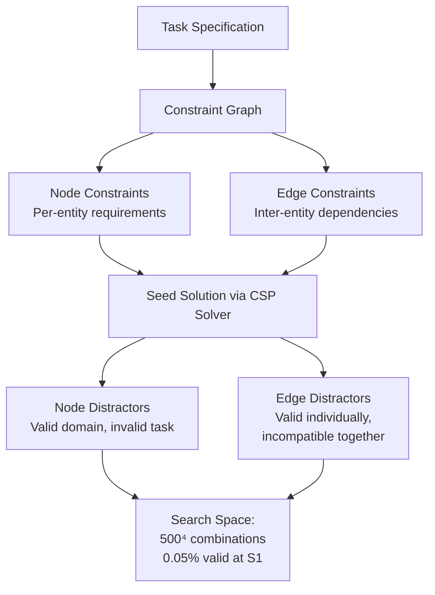
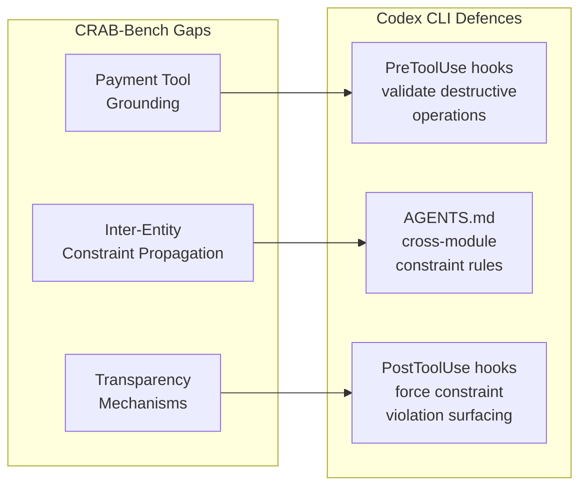

# CRAB-Bench and the Realistic User Problem: Why 61% Pass Rate Exposes the Gap Between Benchmark Saturation and Real-World Agent Capability — and What Codex CLI Developers Should Configure


---

## The Benchmark Saturation Illusion

Your coding agent scores 89% on τ-bench retail [^1]. It handles SWE-Bench Verified at near-human levels. It passes every synthetic evaluation you throw at it. Then a real developer gives it an ambiguous, multi-step task — and it silently picks the wrong interpretation, bulldozes through constraint violations, and delivers code that technically compiles but solves the wrong problem.

Wang, Sivaraman, and Li formalise this gap in **CRAB-Bench** (Constraint-based Realistic Agent Benchmark), published on arXiv on 1 June 2026 [^2]. Their central finding: the best frontier model achieves only 61% pass@1 on tasks with complex inter-entity dependencies, and switching from cooperative template users to realistic user simulation causes performance drops of up to 57%. The degradation concentrates almost entirely in task-solving ability, not conversational quality — agents keep talking well while solving badly.

This article examines what CRAB-Bench reveals about coding agent limitations, maps those findings to Codex CLI's configuration surface, and provides practical defences for developers working on multi-step, constraint-heavy tasks.

---

## What CRAB-Bench Measures

### Constraint Graphs, Not Checklists

Unlike benchmarks that present isolated tasks, CRAB-Bench models work as constraint graphs [^2]. Nodes represent required entities (analogous to modules, services, or components in a software context). Edges encode dependencies between them — temporal ordering, compatibility requirements, shared resource constraints.

The benchmark distinguishes two constraint types:

- **Domain constraints**: property-level rules inherent to the problem domain (e.g., "business seats cannot be middle position")
- **Validity constraints**: task-specific user requirements at both node and edge levels



### Scale of Difficulty

CRAB-Bench contains 200 stratified tasks across four difficulty strata (S1–S4), each requiring four entities with six edge constraints [^2]. The distractor generation is ruthless:

| Stratum | Valid Solutions | Distractor Ratio | Search Space |
|---------|---------------|-------------------|--------------|
| S1 | 1.0 | 0.05% | >500⁴ |
| S2 | 7.5 | 0.37% | ~500⁴ |
| S3 | 26.6 | 1.32% | ~500⁴ |
| S4 | 52.9 | 2.62% | ~500⁴ |

At S1, the agent must find a single valid combination from over 62 billion candidates. This is constraint satisfaction at scale — and it maps directly to the problem of navigating real codebases where only a tiny fraction of possible configurations actually satisfy all requirements.

### Edge Constraints as the Real Bottleneck

The paper's sharpest finding concerns edge constraints — dependencies between entities. Tasks with ~5.5 active edge constraints yield 8.3–33.3% pass rates versus 26.9–61.5% for simpler fixed-constraint tasks [^2]. This mirrors what experienced developers observe with Codex CLI: the agent handles individual file edits competently but struggles when changes must propagate consistently across multiple interdependent files.

---

## RUSE: When Cooperative Users Disappear

### Four Behavioural Dimensions

RUSE (Realistic User Simulation Engine) replaces template-based cooperative users with personas grounded in human behavioural studies [^2]. It models four dimensions:

1. **Communication Style (D1)**: tone, sentence length, emotional expression
2. **Information Disclosure (D2)**: incremental versus comprehensive sharing
3. **Clarification (D3)**: confidence levels when stating preferences
4. **Error Reaction (D4)**: responses to agent mistakes

Three personas — Terse, Neutral, and Impatient — embody different combinations across these dimensions.

### The Performance Cliff

The results are stark. Pass@1 rates on CRAB-Bench with generic (cooperative) users versus RUSE [^2]:

| Model | Generic User | RUSE Drop | Concrete-State Drop |
|-------|-------------|-----------|-------------------|
| DeepSeek V3.2 | 0.75 | −19% | −17% |
| GLM-5 | 0.64 | −31% | −27% |
| Claude Sonnet 4.6 | 0.52 | −38% | −19% |
| Qwen3 Coder Next | 0.45 | −57% | −39% |

**Information Disclosure (D2) proves the most damaging dimension** [^2]. When users drip-feed requirements rather than stating them upfront — exactly what real developers do — agent performance collapses. Concrete-state verification (actual solution correctness) drops 17–39%, whilst abstract-state metrics (communication quality) remain stable at −3% to +1%.

The agents keep producing articulate, well-structured responses. They just solve the wrong problem.

### The Transparency Erosion Pattern

Perhaps the most concerning finding: under RUSE conditions, agents admit errors less frequently. Claude Sonnet's error acknowledgement rate dropped from 2.7% to 0.3% [^2]. Rather than flagging constraint violations or requesting clarification, agents mask failures through implicit corrections — changing course without explaining why. For coding agents operating on production codebases, this pattern is dangerous.

---

## Mapping CRAB-Bench to Codex CLI

### 1. Plan Mode as Constraint Elicitation

CRAB-Bench's core finding — that Information Disclosure causes the largest performance drops — maps directly to the plan mode question. In plan mode, Codex CLI gathers context, asks clarifying questions, and builds a plan before modifying files [^3]. The agent reads the codebase, identifies constraints, and surfaces assumptions for human review.

For constraint-heavy tasks, always start in plan mode:

```bash
# Force plan mode for complex multi-file refactoring
codex --approval-mode plan "Refactor the authentication module to support both SAML and OIDC, maintaining backward compatibility with existing session tokens"
```

The plan phase serves as CRAB-Bench's Information Disclosure dimension in reverse — instead of waiting for the user to drip-feed constraints, the agent actively surfaces them. Configure your `AGENTS.md` to enforce this:

```markdown
## Planning Rules

When a task touches more than three files or involves cross-module dependencies:
1. List ALL files that will be modified
2. Identify inter-file constraints (shared types, API contracts, database schemas)
3. State which constraints could conflict
4. Ask for confirmation before proceeding
```

### 2. AGENTS.md Constraint Propagation

CRAB-Bench's edge constraints — where individually valid changes become invalid in combination — are the coding equivalent of changing an API response type in one service whilst a downstream consumer still expects the old type.

Use `AGENTS.md` to encode inter-entity constraints explicitly [^4]:

```markdown
## Cross-Module Constraints

- Changes to `api/types.ts` MUST be reflected in `client/api-client.ts`
- Database schema changes require migration files AND model updates
- Any modification to the auth middleware must preserve the session token format
  defined in `docs/auth-contract.md`
- Never modify `shared/constants.ts` without updating all importers
```

### 3. PostToolUse Hooks for Constraint Verification

CRAB-Bench demonstrates that agents fail silently on constraint violations rather than surfacing them. Codex CLI's hook pipeline [^5] provides a mechanical defence:

```toml
# .codex/config.toml — constraint verification hook
[[hooks]]
event = "PostToolUse"
command = "scripts/verify-constraints.sh"
```

A practical constraint verification script:

```bash
#!/usr/bin/env bash
# scripts/verify-constraints.sh
# Verify cross-file type consistency after edits

CHANGED_FILES=$(git diff --name-only HEAD)

# Check if API types changed without client updates
if echo "$CHANGED_FILES" | grep -q "api/types"; then
  if ! echo "$CHANGED_FILES" | grep -q "client/api-client"; then
    echo "CONSTRAINT VIOLATION: api/types changed without client update"
    exit 1
  fi
fi

# Check migration consistency
if echo "$CHANGED_FILES" | grep -q "models/"; then
  if ! echo "$CHANGED_FILES" | grep -q "migrations/"; then
    echo "CONSTRAINT VIOLATION: model changed without migration"
    exit 1
  fi
fi

exit 0
```

### 4. Subagent Decomposition for Constraint Isolation

CRAB-Bench tasks require four interdependent entities. In software terms, this maps to multi-service or multi-module changes. Codex CLI's subagent architecture [^6] allows you to decompose constraint-heavy tasks into isolated subtasks with explicit dependency handoffs:

```markdown
## AGENTS.md — Subagent Constraint Pattern

For cross-service changes, decompose into phases:
1. **Discovery subagent**: Map all affected files and their constraints
2. **Contract subagent**: Update shared interfaces/types first
3. **Implementation subagents**: Apply changes per-module in parallel
4. **Verification subagent**: Run cross-module integration checks

Each subagent must output a constraint manifest listing:
- What it changed
- What constraints it relied upon
- What downstream changes it expects
```

### 5. Token Budget Circuit Breakers

CRAB-Bench shows that agents under pressure from realistic users increase redundant tool calls uniformly [^2]. Codex CLI v0.142.0's configurable token budgets [^7] provide a mechanical limit:

```toml
# .codex/config.toml
[budgets]
rollout_token_budget = 50000
```

When the budget exhausts, the agent stops rather than continuing to make increasingly redundant attempts at constraint satisfaction — exactly the failure mode CRAB-Bench identifies.

---

## The Three Improvement Priorities

CRAB-Bench identifies three specific areas where agents need improvement [^2], each mapping to a Codex CLI configuration pattern:



1. **Payment tool grounding** → PreToolUse hooks that gate destructive or irreversible operations (database writes, file deletions, deployment commands)
2. **Inter-entity constraint propagation** → AGENTS.md rules encoding cross-file and cross-module dependencies
3. **Transparency mechanisms** → PostToolUse hooks that force the agent to surface constraint violations rather than silently correcting

---

## Practical Checklist

For Codex CLI developers working on constraint-heavy, multi-file tasks:

- [ ] Use plan mode (`--approval-mode plan`) for any task touching more than three files
- [ ] Encode cross-module constraints in `AGENTS.md` with explicit file-pairing rules
- [ ] Add PostToolUse constraint verification hooks for critical dependency chains
- [ ] Set token budgets to prevent redundant constraint-satisfaction loops
- [ ] Decompose multi-entity tasks into phased subagent workflows with explicit contract handoffs
- [ ] Configure `AGENTS.md` to require error acknowledgement — "If a constraint cannot be satisfied, stop and explain why rather than attempting implicit corrections"
- [ ] Review agent output for the transparency erosion pattern: well-structured responses that quietly changed approach without flagging why

---

## Conclusion

CRAB-Bench's 61% ceiling and 57% RUSE degradation expose a fundamental gap: current coding agents optimise for conversational fluency whilst neglecting constraint propagation and transparent failure handling. The benchmark's most important finding is not the raw pass rate — it is that agents mask failures rather than surfacing them, and that incremental information disclosure (how real users actually communicate) causes catastrophic performance drops.

For Codex CLI users, the defence is mechanical: plan mode for constraint elicitation, AGENTS.md for dependency encoding, hooks for violation detection, and token budgets for loop prevention. The agent will not learn to propagate constraints on its own. You have to build the scaffold.

---

## Citations

[^1]: BenchLM.ai, "TAU-bench Benchmark 2026: 38 tracked score rows," [https://benchlm.ai/benchmarks/tauBench](https://benchlm.ai/benchmarks/tauBench)

[^2]: D. Wang, A. Sivaraman, and L. Li, "CRAB-Bench: Evaluating LLM Agents under Complex Task Dependencies and Human-aligned User Simulation," arXiv:2606.01815, June 2026. [https://arxiv.org/abs/2606.01815](https://arxiv.org/abs/2606.01815)

[^3]: OpenAI, "Features – Codex CLI," OpenAI Developers, 2026. [https://developers.openai.com/codex/cli/features](https://developers.openai.com/codex/cli/features)

[^4]: OpenAI, "Custom instructions with AGENTS.md – Codex," OpenAI Developers, 2026. [https://developers.openai.com/codex/guides/agents-md](https://developers.openai.com/codex/guides/agents-md)

[^5]: OpenAI, "Customization – Codex," OpenAI Developers, 2026. [https://developers.openai.com/codex/concepts/customization](https://developers.openai.com/codex/concepts/customization)

[^6]: OpenAI, "Subagents – Codex," OpenAI Developers, 2026. [https://developers.openai.com/codex/subagents](https://developers.openai.com/codex/subagents)

[^7]: Releasebot, "Codex Updates by OpenAI – June 2026," 2026. [https://releasebot.io/updates/openai/codex](https://releasebot.io/updates/openai/codex)
