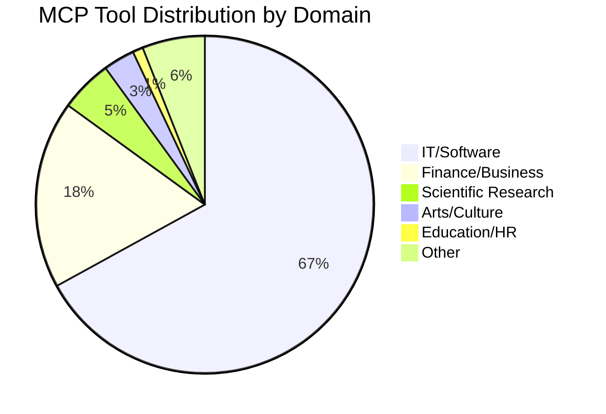
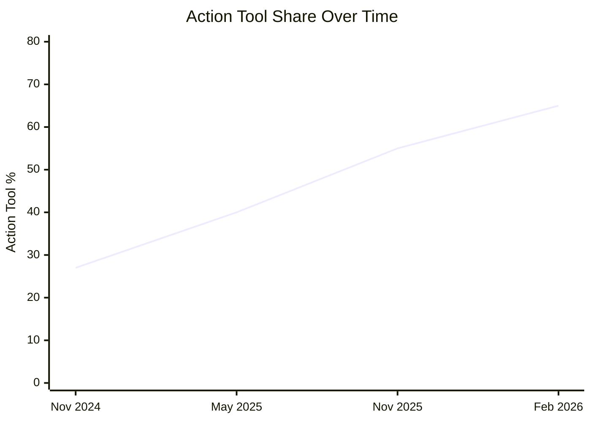

# 177,000 MCP Tools and the Action-Tool Explosion: What the First Large-Scale Agent Census Means for Codex CLI Governance


---

## The Headline Numbers

In March 2026, Merlin Stein published the first large-scale empirical census of the MCP tool ecosystem, analysing 177,436 tools across 19,388 verified servers collected between November 2024 and February 2026 [^1]. The headline finding is stark: action tools — those that directly modify external environments — grew from 27% to 65% of total MCP tool usage in sixteen months [^1]. For commercial entities the shift is even more pronounced, rising from 21% to 71% over the same period [^1].

This matters for every Codex CLI developer because Codex's MCP integration is the primary mechanism through which agents interact with external systems. Every one of those action tools is a potential write operation — a file edit, a deployment trigger, a financial transaction — and the approval configuration you set in `config.toml` is the only gate between your agent and those operations.

## Software Development Dominates

The census confirms what Codex users already suspect: software development is the overwhelming use case for MCP tools. It accounts for 67% of all tools and a remarkable 90% of server downloads [^1]. The remaining distribution fragments across finance and business (18% of tools, 5% of downloads), scientific research (5% of tools), and arts, education, and other domains collectively below 10% [^1].



This concentration has a practical consequence: the tools your Codex CLI connects to are overwhelmingly developer tools — Git operations, CI/CD triggers, package managers, cloud provisioning — and these are precisely the tools where the perception-to-action shift creates the most risk.

## The Perception-to-Action Shift

The paper categorises tools into three direct-impact classes: **perception** (read data), **reasoning** (analyse data), and **action** (modify environments) [^1]. The sixteen-month trajectory shows a clear convergence toward action-heavy tooling:



A critical finding compounds this: 94% of general-purpose server downloads involved action capabilities (browser automation, code execution), whilst 95% of downloaded perception tools operated in constrained, API-bound environments [^1]. The implication is that unconstrained tools are almost always action tools, and constrained tools are almost always read-only — there is very little middle ground.

## AI Tools Building AI Tools

The census detected AI assistance in 28.3% of all MCP servers (36.3% of tools) [^1]. The growth rate is exponential: AI-coauthored servers rose from 6% in January 2025 to 62% in February 2026 [^1]. The dominant authoring tool is Claude Code at 68.6% of AI-coauthored servers, followed by Cursor (9.2%), Copilot (9.1%), and Codex (6.0%) [^1].

This creates a recursive trust problem. When your Codex CLI connects to an MCP server, there is now a better-than-even chance that server was itself written by an AI agent. The paper's detection methodology used four evidence categories: `Co-Authored-By` commit trailers, AI tool configuration files (`.cursorrules`, `CLAUDE.md`), known AI bot account commits, and AI tool mentions in commit messages [^1]. The authors acknowledge these are conservative lower bounds — actual AI assistance rates are likely higher.

## The Financial Transaction Case Study

The paper's most alarming finding concerns payment-capable MCP servers: these grew from 47 servers in January 2025 to 1,578 in February 2026, a 33× increase [^1]. The paper specifically flags cryptocurrency transaction tools as operating with "less regulatory oversight" [^1]. Whilst most Codex CLI users are not executing financial transactions, the principle applies universally: the tool ecosystem is expanding into high-consequence domains faster than governance frameworks can keep pace.

## Mapping to Codex CLI's Approval Architecture

Codex CLI's MCP integration provides three layers of defence against ungoverned action tools. Understanding all three is essential given the census findings.

### Layer 1: Per-Server Default Approval Mode

Every MCP server in your `config.toml` accepts a `default_tools_approval_mode` setting [^2]:

```toml
[mcp_servers.github]
command = "npx"
args = ["-y", "@modelcontextprotocol/server-github"]
default_tools_approval_mode = "prompt"
```

The three modes are `auto` (execute without confirmation), `prompt` (require user confirmation), and `approve` (always execute) [^2]. Given that 65% of MCP tools are now action tools, setting `auto` on any server with write capabilities is a decision that should be made deliberately, not by default.

### Layer 2: Per-Tool Approval Overrides

For servers where you need a mix of autonomous reads and gated writes, per-tool overrides provide granular control [^2]:

```toml
[mcp_servers.github]
command = "npx"
args = ["-y", "@modelcontextprotocol/server-github"]
default_tools_approval_mode = "auto"

[mcp_servers.github.tools.search_repositories]
approval_mode = "auto"

[mcp_servers.github.tools.create_pull_request]
approval_mode = "prompt"

[mcp_servers.github.tools.delete_branch]
approval_mode = "prompt"
```

This pattern directly addresses the census finding that perception and action tools coexist on the same servers. You can let your agent read freely whilst gating every write operation.

### Layer 3: Tool Allow and Deny Lists

The `enabled_tools` and `disabled_tools` settings provide a hard boundary [^2]:

```toml
[mcp_servers.cloud-provider]
command = "npx"
args = ["-y", "@example/cloud-mcp"]
enabled_tools = ["list_instances", "describe_instance", "get_logs"]
```

Any tool not in `enabled_tools` is invisible to the agent. The `disabled_tools` list applies after `enabled_tools`, providing a secondary exclusion mechanism [^2]. For high-consequence servers — cloud provisioning, payment processing, CI/CD — this is the strongest control available.

## The Granular Approval Policy

Beyond per-server settings, Codex CLI's granular approval policy object provides category-level control across all tool types [^3]:

```toml
[approval_policy.granular]
sandbox = "auto-approve"
mcp = "always-prompt"
execpolicy_rule = "auto-approve"
request_permissions = "always-prompt"
skill_script = "auto-approve"
```

This separates MCP tool calls from sandbox operations and permission escalations, letting you maintain tight control over external tool invocations whilst keeping local sandbox operations fluid [^3].

## A Governance Checklist for Codex CLI MCP Servers

The census data, combined with the paper's governance recommendations, suggests a practical audit framework for Codex CLI configurations:

**1. Classify every connected server by action share.** List your MCP servers and categorise each tool as perception, reasoning, or action. Any server where action tools exceed 50% warrants `prompt` as the default approval mode.

**2. Apply the principle of least privilege via `enabled_tools`.** For every MCP server, ask: which tools does this workflow actually need? Enable only those. The census shows 45.4% of downloads go to general-purpose, unconstrained tools [^1] — these are precisely the servers where `enabled_tools` provides the most value.

**3. Audit AI-authored servers.** If you are connecting to community MCP servers, check for AI authorship signals (commit trailers, configuration files). AI-authored servers are not inherently less trustworthy, but the 62% AI-coauthored rate [^1] means you should not assume human review occurred.

**4. Set timeouts aggressively.** The `tool_timeout_sec` setting (default 60 seconds) should be reduced for tools where long execution times signal unexpected behaviour [^2]:

```toml
[mcp_servers.github]
tool_timeout_sec = 15
startup_timeout_sec = 5
```

**5. Use `required = true` for critical servers.** If your workflow depends on a specific MCP server being available, mark it as required so Codex fails fast rather than proceeding without expected governance controls [^2]:

```toml
[mcp_servers.security-scanner]
required = true
```

## The Regulatory Horizon

The paper frames MCP tool monitoring as a governance primitive — regulators can monitor the tool layer to understand what agents actually do, rather than relying solely on model-level controls [^1]. This connects directly to the EU AI Act's August 2026 high-risk provisions [^4], which will require demonstrable oversight mechanisms for AI systems operating in regulated domains.

For Codex CLI developers working in financial services, healthcare, or other regulated sectors, this means your `config.toml` is not just a convenience — it is an auditable governance artefact. The combination of per-tool approval modes, enabled/disabled tool lists, and granular approval policies provides the kind of documented, enforceable control that regulators will increasingly expect.

## Conclusion

The 177,000-tool census delivers one clear message: the MCP ecosystem has crossed from observation into action. Two-thirds of tools now modify external environments, most of them in software development, and most of them on servers with a better-than-even chance of AI authorship. Codex CLI's three-layer approval architecture — server defaults, per-tool overrides, and allow/deny lists — provides the governance primitives to manage this shift. The question is whether you have configured them deliberately, or whether you are running on defaults whilst 65% of the tools your agent can reach are action tools.

---

## Citations

[^1]: Stein, M. (2026). "How are AI agents used? Evidence from 177,000 MCP tools." *arXiv:2603.23802*. [https://arxiv.org/abs/2603.23802](https://arxiv.org/abs/2603.23802)

[^2]: OpenAI. (2026). "Model Context Protocol – Codex." *OpenAI Developers*. [https://developers.openai.com/codex/mcp](https://developers.openai.com/codex/mcp)

[^3]: OpenAI. (2026). "Agent approvals & security – Codex." *OpenAI Developers*. [https://developers.openai.com/codex/agent-approvals-security](https://developers.openai.com/codex/agent-approvals-security)

[^4]: European Commission. (2024). "Regulation (EU) 2024/1689 — Artificial Intelligence Act." *Official Journal of the European Union*. [https://eur-lex.europa.eu/eli/reg/2024/1689/oj](https://eur-lex.europa.eu/eli/reg/2024/1689/oj)
