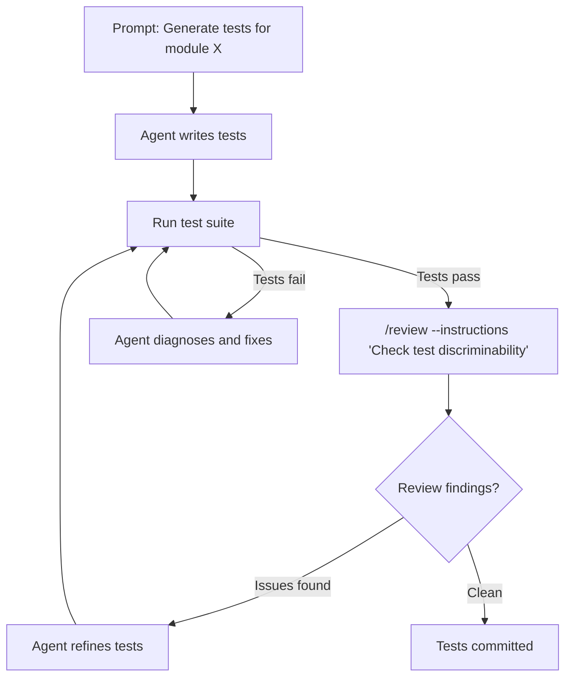

# OmniCode and the Beyond-Bug-Fixing Problem: Configuring Codex CLI for Test Generation, Code Review, and Multilingual Workflows


---

## The Comfortable Illusion of Bug-Fixing Benchmarks

Most coding agent benchmarks measure one thing: can the agent fix a bug in a Python repository? SWE-Bench, the benchmark that launched a thousand agent startups, tests precisely this — and agents have become rather good at it. Claude 4.6 Sonnet scores 68.9% on Python bug-fixing tasks via SWE-Agent [^1]. Codex CLI achieves similar figures on SWE-Bench Verified [^2]. The numbers are impressive and, unfortunately, misleading.

OmniCode, published by Sonwane et al. in February 2026 and accepted to ACL 2026[^1], dismantles this illusion. With 1,794 tasks spanning three programming languages (Python, Java, C++) and four task categories (bug fixing, test generation, code review response, and style fixing), OmniCode reveals that the moment you step outside Python bug-fixing, agent performance collapses — and collapses unevenly.

This article examines what OmniCode's findings mean for Codex CLI users and provides concrete configuration patterns for the task categories where agents struggle most.

---

## What OmniCode Measures

Unlike SWE-Bench, OmniCode deliberately tests the breadth of real software engineering work [^1]:

| Category | Python | C++ | Java | Total |
|----------|--------|-----|------|-------|
| Bug Fixing | 273 | 112 | 109 | 494 |
| Test Generation | 273 | 112 | 109 | 494 |
| Code Review Response | 273 | 112 | 109 | 494 |
| Style Fixing | 144 | 147 | 124 | 415 |
| **Total** | **963** | **413** | **418** | **1,794** |

Each category is constructed differently. Bug-fixing tasks draw from SWE-Bench Verified and Multi-SWE-Bench. Test generation tasks require the agent to produce tests that pass the gold patch *and* fail against a set of bad patches — a much harder criterion than simple pass/fail. Code review tasks pair synthetically generated LLM reviews with corrective patches. Style-fixing tasks use language-specific linters: pylint for Python, clang-tidy for C++, and PMD for Java [^1].

Crucially, all tasks are manually validated to eliminate ill-defined problems, and synthetically constructed or recently curated to avoid data leakage [^1].

---

## The Results: A Capability Map with Canyons

Here are the SWE-Agent results across five models, adapted from the OmniCode evaluation tables [^1]:

### Python (resolve rate, %)

| Model | Bug Fix | Test Gen | Review | Style |
|-------|---------|----------|--------|-------|
| Claude 4.6 Sonnet | 68.9 | 14.6 | 67.9 | 61.2 |
| DeepSeek-V3.1 | 56.4 | 18.7 | 52.2 | 54.0 |
| GPT-5-mini | 47.3 | 6.2 | 30.5 | 45.9 |
| Gemini 2.5 Flash | 38.1 | 14.0 | 29.9 | 57.0 |
| Qwen3-32B | 24.5 | 4.0 | 17.7 | 19.5 |

### C++ (resolve rate, %)

| Model | Bug Fix | Test Gen | Review | Style |
|-------|---------|----------|--------|-------|
| DeepSeek-V3.1 | 19.6 | 25.0 | 22.7 | 18.8 |
| GPT-5-mini | 15.2 | 6.8 | 20.5 | 19.5 |
| Claude 4.6 Sonnet | 8.0 | 13.6 | 9.1 | 35.6 |
| Gemini 2.5 Flash | 8.0 | 12.2 | 13.6 | 30.5 |
| Qwen3-32B | 3.8 | 4.5 | 4.5 | 6.7 |

### Java (resolve rate, %)

| Model | Bug Fix | Test Gen | Review | Style |
|-------|---------|----------|--------|-------|
| DeepSeek-V3.1 | 31.2 | 20.9 | 44.3 | 23.1 |
| GPT-5-mini | 22.0 | 2.7 | 26.6 | 22.1 |
| Claude 4.6 Sonnet | 15.6 | 8.9 | 20.3 | 27.3 |
| Gemini 2.5 Flash | 14.7 | 4.9 | 31.6 | 22.0 |
| Qwen3-32B | 10.1 | 1.3 | 15.2 | 18.5 |

Three patterns leap out:

1. **Test generation is catastrophically weak.** The *best* score across all models and languages is 25.0% (DeepSeek on C++). Most models score below 15%. No model reaches 20% on Python test generation [^1].
2. **Python proficiency does not transfer.** Claude 4.6 Sonnet scores 68.9% on Python bug-fixing but 8.0% on C++ bug-fixing — an 88% relative drop [^1].
3. **Style fixing introduces new violations.** In Java and C++, agents produce error ratios exceeding 2.0, meaning they introduce more new style violations than they fix [^1].

The correlation analysis is equally telling: bug-fixing and code review performance correlate strongly (Pearson r = 0.921), but test generation correlates weakly with both (r = 0.764), confirming it demands a fundamentally different skill set [^1].

---

## Why This Matters for Codex CLI

If you are using Codex CLI exclusively for Python bug-fixing, carry on — the agent is well-suited to the task. But the moment your workflow includes test generation, multilingual codebases, or style enforcement, you need deliberate configuration to compensate for the capability gaps OmniCode exposes.

The following sections translate OmniCode's findings into actionable Codex CLI patterns.

---

## Pattern 1: Task-Specific AGENTS.md Files

OmniCode demonstrates that different task categories require different agent behaviours. Use the AGENTS.md directory hierarchy to scope instructions per task type [^3][^4]:

```
repo-root/
├── AGENTS.md                    # Global: architecture, build, test commands
├── src/
│   └── AGENTS.md                # Implementation: coding conventions
├── tests/
│   └── AGENTS.md                # Test generation: framework, coverage rules
└── .codex/
    └── agents/
        ├── test-writer.toml     # Custom subagent for test tasks
        └── style-fixer.toml     # Custom subagent for linting
```

The `tests/AGENTS.md` file should encode the specific constraints that OmniCode's test generation task demands — tests that are genuinely discriminative:

```markdown
# Test Generation Rules

- Every new test MUST fail against at least one plausible bad implementation
- Run the full test suite after generating tests: `pytest tests/ -x --tb=short`
- Never write tests that merely call a function and assert it returns without error
- Use parameterised tests for boundary conditions
- For C++: run `ctest --test-dir build --output-on-failure` after generation
- For Java: run `mvn test -pl <module> -Dtest=<TestClass>` for targeted execution
```

This directly addresses OmniCode's finding that weak test generation stems from agents producing superficial tests that pass both correct and incorrect implementations [^1].

---

## Pattern 2: Model Routing by Task and Language

OmniCode reveals that no single model dominates all task-language combinations. DeepSeek-V3.1 leads on C++ and Java tasks but Claude 4.6 Sonnet leads on Python bug-fixing and review [^1]. In Codex CLI, you can route different tasks to different models using subagent definitions [^5][^6]:

```toml
# ~/.codex/agents/test-writer.toml
name = "test-writer"
description = "Generates discriminative tests for the target module"
model = "gpt-5.5"
model_reasoning_effort = "high"

developer_instructions = """
You write tests that distinguish correct implementations from plausible bugs.
Every test must include at least one assertion that would fail against a
common incorrect implementation. Run the project test suite after writing.
"""
```

```toml
# ~/.codex/agents/cpp-worker.toml
name = "cpp-worker"
description = "C++ implementation and review tasks"
model = "gpt-5.5"
model_reasoning_effort = "high"

developer_instructions = """
You work on C++ code. Always run clang-tidy before committing.
Prefer modern C++20/23 idioms. Check compilation with both GCC and Clang.
"""
```

For ad-hoc model switching during a session, use the `/model` command [^7]:

```
/model gpt-5.5
```

The key insight from OmniCode: use your most capable model for test generation and non-Python tasks, where the ceiling is lowest and every percentage point matters.

---

## Pattern 3: PostToolUse Hooks for Style Gate Enforcement

OmniCode's style-fixing data is alarming: agents routinely introduce *more* violations than they resolve, particularly in Java and C++[^1]. Codex CLI's hook pipeline provides a defence [^8]:

```toml
# In config.toml
[hooks]

[[hooks.PostToolUse]]
event = "PostToolUse"
hooks = [
  { command = "python .codex/hooks/lint-gate.py", timeout_ms = 30000 }
]
```

The lint gate script compares violation counts before and after the tool invocation:

```python
#!/usr/bin/env python3
"""PostToolUse hook: reject changes that increase linter violations."""
import json, subprocess, sys

def count_violations(cmd: list[str]) -> int:
    result = subprocess.run(cmd, capture_output=True, text=True)
    return len(result.stdout.strip().splitlines())

LINTERS = {
    ".py": ["ruff", "check", "--quiet", "."],
    ".cpp": ["clang-tidy", "--quiet", "src/**/*.cpp", "--"],
    ".java": ["pmd", "check", "-d", "src", "-R", "rulesets/java/quickstart.xml",
              "-f", "text", "--no-progress"],
}

# Read the hook context from stdin
context = json.load(sys.stdin)
changed = context.get("changed_files", [])

for ext, cmd in LINTERS.items():
    if any(f.endswith(ext) for f in changed):
        violations = count_violations(cmd)
        baseline = int(open(f".codex/baselines/lint-count{ext}.txt").read().strip())
        if violations > baseline:
            print(f"REJECT: {ext} violations increased from {baseline} to {violations}")
            sys.exit(1)

sys.exit(0)
```

This pattern directly counters the error-ratio problem OmniCode identified: the hook prevents any tool invocation that worsens the linting baseline from being accepted into the working tree.

---

## Pattern 4: Two-Pass Test Generation with /review

OmniCode's test generation weakness suggests that a single-pass "write tests" prompt is insufficient. Codex CLI's `/review` command enables a two-pass workflow [^7]:



The review model can be configured separately for higher-quality test assessment [^8]:

```toml
# config.toml
review_model = "gpt-5.5"
```

The review instructions should specifically target the discriminability problem:

```
/review --instructions "For each test: (1) identify what incorrect behaviour it would
catch, (2) flag any test that would pass regardless of implementation correctness,
(3) check boundary conditions are covered"
```

---

## Pattern 5: Multilingual Subagent Decomposition

OmniCode's starkest finding is the Python-to-C++/Java performance cliff. For polyglot repositories, decompose work across language-specialised subagents [^5][^6]:

```toml
# config.toml
[agents]
max_threads = 4

[agents.python-worker]
description = "Python implementation and testing"
config_file = ".codex/agents/python-worker.toml"

[agents.cpp-worker]
description = "C++ implementation and testing"
config_file = ".codex/agents/cpp-worker.toml"

[agents.java-worker]
description = "Java implementation and testing"
config_file = ".codex/agents/java-worker.toml"
```

Each worker's TOML file specifies the language-appropriate build commands, linters, and test runners. The orchestrating session routes tasks to the correct subagent rather than attempting cross-language work in a single context window.

This directly mitigates the transfer failure OmniCode documents: Python proficiency in the agent's context does not help with C++ tasks, so isolating them prevents cross-language context pollution [^1].

---

## What OmniCode Does Not Tell You

Several caveats bear mentioning:

- **SWE-Agent ≠ Codex CLI.** OmniCode evaluates SWE-Agent and Aider, not Codex CLI directly. Codex CLI's sandbox, hook pipeline, and subagent architecture may produce different absolute scores, though the relative capability gaps across task categories are likely to persist. ⚠️
- **The bad-patch validation criterion matters enormously.** Without it, test generation scores inflate dramatically — Qwen on C++ jumps from 4.5% to 22.7% [^1]. Any internal test quality assessment must include mutation-style validation.
- **Style-fixing complexity varies by linter configuration.** OmniCode uses default rulesets; stricter or more lenient configurations will shift results.
- **OmniCode's February 2026 model snapshot predates GPT-5.5.** Current Codex CLI defaults (gpt-5.5, gpt-5-codex) may perform differently on these tasks. ⚠️

---

## Practical Takeaways

1. **Do not assume bug-fixing proficiency generalises.** If your workflow includes test generation, code review, or style enforcement, benchmark those tasks independently.
2. **Use the highest-capability model for test generation.** This is where agents are weakest and where model quality matters most.
3. **Gate style-fixing with linter baselines.** Never allow an agent to commit style changes without verifying the violation count did not increase.
4. **Isolate multilingual work into language-specific subagents.** Cross-language context degrades performance.
5. **Adopt two-pass workflows for test generation.** Generate, then review for discriminability before committing.

OmniCode makes the implicit explicit: today's coding agents are bug-fixing specialists operating in a profession that demands generalists. Codex CLI's configuration surface — AGENTS.md hierarchies, subagent definitions, hook pipelines, model routing — provides the scaffolding to compensate, but only if you configure it deliberately for the tasks where agents are weakest.

---

## Citations

[^1]: Sonwane, A., Tu, E-S., Lu, W-C., Beger, C., Larsen, C., Dhar, D., Alford, S., Chen, R., Pattanayak, R., Dang, T.A., Chen, G., Geng, G., Ellis, K. & Dutta, S. (2026). "OmniCode: A Benchmark for Evaluating Software Engineering Agents." *arXiv:2602.02262v3*. Accepted to ACL 2026. [https://arxiv.org/abs/2602.02262](https://arxiv.org/abs/2602.02262)

[^2]: OpenAI. (2026). "Codex CLI Features." *OpenAI Developers*. [https://developers.openai.com/codex/cli/features](https://developers.openai.com/codex/cli/features)

[^3]: OpenAI. (2026). "Custom instructions with AGENTS.md." *OpenAI Developers*. [https://developers.openai.com/codex/guides/agents-md](https://developers.openai.com/codex/guides/agents-md)

[^4]: Augment Code. (2026). "How to Build Your AGENTS.md." [https://www.augmentcode.com/guides/how-to-build-agents-md](https://www.augmentcode.com/guides/how-to-build-agents-md)

[^5]: OpenAI. (2026). "Subagents." *OpenAI Developers*. [https://developers.openai.com/codex/subagents](https://developers.openai.com/codex/subagents)

[^6]: OpenAI. (2026). "Configuration Reference." *OpenAI Developers*. [https://developers.openai.com/codex/config-reference](https://developers.openai.com/codex/config-reference)

[^7]: OpenAI. (2026). "Codex CLI Features — /review and /model commands." *OpenAI Developers*. [https://developers.openai.com/codex/cli/features](https://developers.openai.com/codex/cli/features)

[^8]: OpenAI. (2026). "Sample Configuration — hooks and review_model." *OpenAI Developers*. [https://developers.openai.com/codex/config-sample](https://developers.openai.com/codex/config-sample)
