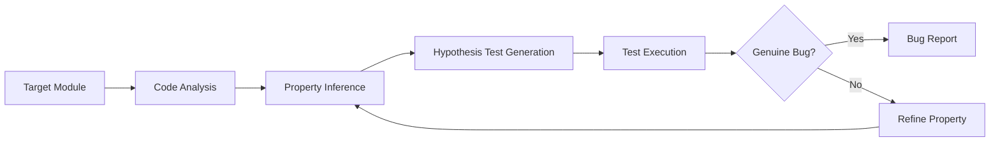
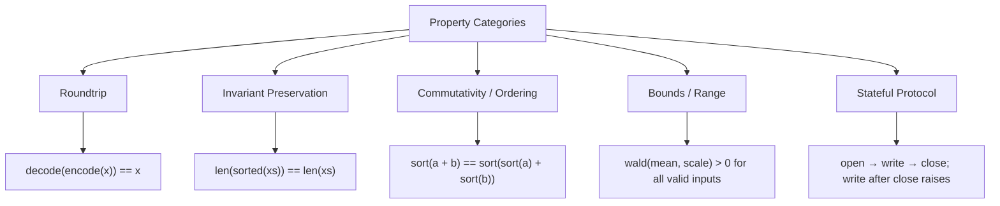

# Property-Based Testing with Codex CLI: Agentic Invariant Discovery, Hypothesis Workflows, and What PBT-Bench Reveals About Agent Testing Capabilities


---

Most agent-generated tests are example-based: a fixed input, an expected output, an assertion. They catch the bug the developer already imagined. Property-based testing (PBT) inverts the approach — you declare an invariant that must hold for *all* valid inputs, and a framework like Hypothesis generates hundreds of random cases to find counterexamples [^1]. The question in 2026 is no longer whether PBT works, but whether coding agents can *derive the invariants themselves*.

Two recent research efforts answer that question with data. PBT-Bench (Jing et al., May 2026) benchmarks eight frontier LLMs on their ability to infer invariants from documentation, construct Hypothesis strategies, and detect injected bugs across 40 Python libraries [^2]. Separately, Anthropic's agentic PBT project deployed a Claude-based agent across 100+ PyPI packages, generating 984 bug reports with a 56% validity rate and patches merged into NumPy, AWS Lambda Powertools, and Hugging Face Tokenizers [^3]. This article maps both findings onto Codex CLI workflows and provides a practical configuration for running property-based testing as an agent-driven development pattern.

## Why Property-Based Testing Matters for Agent Workflows

Example-based tests verify *known* behaviour. Property-based tests verify *invariants* — statements that must hold universally. The distinction matters for agentic workflows because:

1. **Coverage amplification.** A single `@given` decorator can exercise thousands of input combinations per test function, catching edge cases no developer would enumerate manually [^1].
2. **Specification as documentation.** Properties encode semantic contracts — "a sorted list has each element less than or equal to the next" — that serve as machine-readable specifications for the agent [^2].
3. **Shrinking.** When Hypothesis finds a failing input, it automatically reduces it to the minimal reproducing case, giving the agent a precise signal for repair [^1].

The PBT-Bench results show that frontier models already possess this capability at meaningful levels, but the gap between scaffolded and unscaffolded performance reveals where agent configuration makes the difference.

## PBT-Bench: What the Numbers Say

PBT-Bench isolates a specific agent capability: reading library documentation, identifying a semantic invariant, and constructing a Hypothesis `@given` strategy precise enough to trigger a planted bug [^2].

### The benchmark

- **100 problems** across **40 Python libraries** spanning seven domains: serialisation, data structures, date-time handling, type systems, numerics, state machines, and parsing [^2]
- **365 injected bugs** (3.65 per problem on average), representing eleven real-world bug patterns including off-by-one errors, logic inversions, and argument-order swaps [^2]
- Three difficulty levels based on required Hypothesis strategy sophistication [^2]

### Difficulty stratification

| Level | Share of Bugs | Description | Mean Recall |
|-------|--------------|-------------|-------------|
| L1 | 24% | Single-constraint boundary conditions | 66% |
| L2 | 50% | Multi-constraint triggers requiring simultaneous documentation-derived conditions | 60% |
| L3 | 26% | Cross-function protocol violations and stateful invariant checks | 51% |

### Model performance

Eight models were evaluated under two prompting regimes — open-ended baseline and explicit Hypothesis scaffolding — with three independent runs per configuration [^2]:

| Model | Baseline Recall | PBT-Scaffolded Recall | Delta |
|-------|----------------|----------------------|-------|
| Claude Sonnet 4.6 | 76.7% | 83.4% | +6.7pp |
| DeepSeek V3.2 | 68.3% | 65.1% | -3.2pp |
| Gemini 3 Flash | 61.2% | 72.8% | +11.6pp |
| Qwen 3.6 Plus | 42.1% | 66.6% | +24.5pp |
| Qwen 3.5-30B-A3B | 31.4% | 54.3% | +22.9pp |

The critical finding: **scaffolding impact varies inversely with model capability** [^2]. Mid-tier models gained 20+ percentage points from explicit Hypothesis scaffolding, whilst frontier models showed minimal or negative gains. The implication for Codex CLI users is clear — if you are running GPT-5.4 or GPT-5.5, the model already knows how to write Hypothesis tests. Your job is to give it the right *context*, not the right *instructions*.

The ensemble union across all sixteen model-mode combinations detected 99.5% of bugs, with only two remaining consistently undiscovered [^2]. This suggests that multi-model routing — running PBT with different models and merging results — approaches near-complete coverage.

## Anthropic's Agentic PBT: Production-Scale Bug Hunting

Where PBT-Bench measures capability in a controlled setting, Anthropic's agentic PBT project tests the full pipeline against real, unmodified Python packages [^3]:



Key results from the Anthropic deployment [^3]:

- **984 bug reports** across 100+ PyPI packages
- **56% validity rate** on manual review of 50 sampled reports
- **86% validity** among top-ranked reports after filtering
- Patches merged into **NumPy** (negative values from `numpy.random.wald` due to catastrophic cancellation), **AWS Lambda Powertools** (`slice_dictionary()` repeating first chunk), and **Hugging Face Tokenizers** (malformed HSL colour codes) [^3]

The agent used a five-step workflow: code analysis, property inference, Hypothesis test generation, execution with reflection, and structured bug reporting [^3]. Each step maps directly onto a Codex CLI agent loop iteration.

## Configuring Codex CLI for Property-Based Testing

### AGENTS.md configuration

Add a PBT section to your project's `AGENTS.md` to prime the model for invariant discovery:

```markdown
## Testing Strategy

### Property-Based Testing
- Use Hypothesis for all property-based tests
- Place property tests in `tests/property/` alongside unit tests
- Every public function with documented contracts MUST have at least one property test
- Properties should test invariants, not examples:
  - Roundtrip: `decode(encode(x)) == x`
  - Idempotence: `f(f(x)) == f(x)`
  - Ordering: `sorted(xs) preserves elements and enforces ordering`
  - Type preservation: output type matches documented return type
- Use `@given(st.from_type(T))` for typed inputs where possible
- Use `@settings(max_examples=500)` for thorough coverage
- Always include `@example` decorators for known edge cases
```

### Codex CLI skill for PBT

Create a reusable skill that encodes the PBT workflow:

```toml
# ~/.codex/skills/property-testing.toml
[skill]
name = "property-testing"
description = "Generate property-based tests using Hypothesis"

[skill.prompt]
text = """
You are a property-based testing specialist. For each target function:

1. Read the function signature, docstring, and type annotations
2. Identify semantic invariants (roundtrip, idempotence, ordering, bounds)
3. Write a Hypothesis test with @given and appropriate strategies
4. Use st.from_type() for dataclass/typed inputs
5. Add @settings(max_examples=500, deadline=None) for thorough runs
6. Run the test and analyse any failures
7. Distinguish genuine bugs from overly strict properties

Output: test file in tests/property/ and a brief report of findings.
"""
```

### Hook-based PBT gate

Use a `PostToolUse` hook to enforce PBT coverage on new functions:

```json
{
  "hooks": {
    "PostToolUse": [
      {
        "command": "bash -c 'python -m pytest tests/property/ --hypothesis-seed=0 -x --tb=short 2>&1 | tail -20'",
        "description": "Run property-based tests after code changes",
        "on_tool": ["write_file", "apply_diff"]
      }
    ]
  }
}
```

## The Five-Property Checklist

PBT-Bench's difficulty taxonomy and the Anthropic findings converge on five property categories that agents discover most reliably [^2] [^3]:



| Category | PBT-Bench Level | Agent Success Rate | Codex CLI Prompt Pattern |
|----------|-----------------|-------------------|------------------------|
| Roundtrip | L1 | ~66% | "Write a property test verifying serialisation roundtrip" |
| Invariant preservation | L1-L2 | ~63% | "Verify the output preserves all input elements" |
| Commutativity / ordering | L2 | ~60% | "Test that operation order does not affect the result" |
| Bounds / range | L1-L2 | ~63% | "Verify output values stay within documented bounds" |
| Stateful protocol | L3 | ~51% | "Test the state machine: valid transitions succeed, invalid ones raise" |

## Practical Workflow: Codex CLI PBT Loop

The most effective pattern combines Codex CLI's agent loop with Hypothesis's shrinking:

```mermaid
sequenceDiagram
    participant Dev as Developer
    participant CLI as Codex CLI
    participant Hyp as Hypothesis
    participant Code as Codebase

    Dev->>CLI: "Write property tests for src/parser.py"
    CLI->>Code: Read parser.py, docstrings, type hints
    CLI->>CLI: Infer invariants from contracts
    CLI->>Code: Write tests/property/test_parser.py
    CLI->>Hyp: pytest tests/property/
    Hyp-->>CLI: FAIL: counterexample found (shrunk)
    CLI->>Code: Fix parser.py based on minimal counterexample
    CLI->>Hyp: pytest tests/property/ (re-run)
    Hyp-->>CLI: PASS (500 examples)
    CLI-->>Dev: "Fixed off-by-one in parse_header; property test passes"
```

A typical session:

```bash
# Generate property tests for a module
codex "Write Hypothesis property tests for src/billing/calculator.py. \
  Focus on roundtrip, bounds, and invariant properties. \
  Run them and fix any genuine bugs you find."

# Run PBT across the whole test suite
codex "Run all property tests in tests/property/ with --hypothesis-seed=0. \
  For any failures, determine if the bug is in the code or the test. \
  Fix code bugs; refine test properties if the test is overly strict."
```

## Multi-Model PBT: The Ensemble Advantage

PBT-Bench's most striking result is the ensemble: combining all eight models' outputs detected 99.5% of injected bugs [^2]. Different models fail on different problems — Claude Sonnet 4.6 excels at stateful protocol properties but misses some numerical edge cases that Gemini 3 Flash catches [^2].

For Codex CLI users, this suggests a practical pattern:

```bash
# Run PBT with the primary model
codex --model gpt-5.4-xhigh "Write property tests for src/crypto/signing.py"

# Run the same task with a different model for coverage
codex --model o3 "Review and extend property tests in tests/property/test_signing.py. \
  Add any invariants the existing tests miss."
```

This two-pass approach mirrors the ensemble finding without requiring a custom orchestrator.

## PGS: Property-Oriented Feedback for Code Refinement

A related line of research — the Property-Generated Solver (PGS) framework by He et al. — demonstrates that property-based feedback improves code refinement by 13.4% over TDD-based methods [^4]. PGS validates high-level programme properties and delivers the simplest counterexample when properties fail, achieving a 64% fix rate on initially-failed problems and a 1.4-1.6x higher bug fix rate compared to strongest debugging approaches [^4].

The practical takeaway: when Codex CLI finds a failing property test, the *minimal counterexample* from Hypothesis provides better repair signal than a full stack trace. Configure your `AGENTS.md` to instruct the agent to prioritise the shrunk counterexample over verbose error output.

## Limitations and Caveats

- **L3 recall remains at 51%.** Cross-function stateful properties — state machines, protocol violations — are the hardest for agents to discover [^2]. For safety-critical code, human-authored stateful properties remain essential.
- **False positive rate.** The Anthropic project reports 44% of bug reports are invalid [^3]. A human review step before filing issues remains necessary.
- **Hypothesis overhead.** Running 500 examples per property adds seconds per test. For CI pipelines, consider `@settings(max_examples=100)` for fast feedback and `max_examples=1000` for nightly runs.
- **Model-specific scaffolding.** Explicit Hypothesis scaffolding *degrades* performance for some frontier models [^2]. Test whether your model benefits before adding scaffolding to `AGENTS.md`. With GPT-5.4 or GPT-5.5, less scaffolding is likely better.

## Key Takeaways

1. **PBT is an agent-native testing pattern.** The invariant-discovery-then-generation workflow maps naturally onto the Codex CLI agent loop.
2. **Scaffolding helps mid-tier models, not frontier ones.** If running GPT-5.4+, focus on providing project context (via `AGENTS.md`) rather than Hypothesis instruction.
3. **Ensemble multi-model runs approach complete coverage.** PBT-Bench shows 99.5% bug detection when combining eight models [^2].
4. **The minimal counterexample is the repair signal.** Hypothesis shrinking gives agents precisely the information they need to fix bugs.
5. **Stateful properties remain hard.** L3 recall at 51% means human oversight for protocol-level invariants is still required [^2].

---

## Citations

[^1]: Hypothesis documentation, "What is Hypothesis?", [https://hypothesis.readthedocs.io/](https://hypothesis.readthedocs.io/), accessed June 2026.

[^2]: Jing, L., Wang, X., Zhang, L. & Du, S. S. (2026). "PBT-Bench: Benchmarking AI Agents on Property-Based Testing." arXiv:2605.15229. [https://arxiv.org/abs/2605.15229](https://arxiv.org/abs/2605.15229)

[^3]: Anthropic (2026). "Finding bugs with Claude and property-based testing." Anthropic Research. [https://www.anthropic.com/research/property-based-testing](https://www.anthropic.com/research/property-based-testing)

[^4]: He, L., Chen, Z., Zhang, Z., Gao, X. & Sheng, L. (2025, revised 2026). "Effective LLM Code Refinement via Property-Oriented and Structurally Minimal Feedback." arXiv:2506.18315. [https://arxiv.org/abs/2506.18315](https://arxiv.org/abs/2506.18315)

[^5]: Jha, S. et al. (2025). "Agentic Property-Based Testing: Finding Bugs Across the Python Ecosystem." arXiv:2510.09907. [https://arxiv.org/abs/2510.09907](https://arxiv.org/abs/2510.09907)
