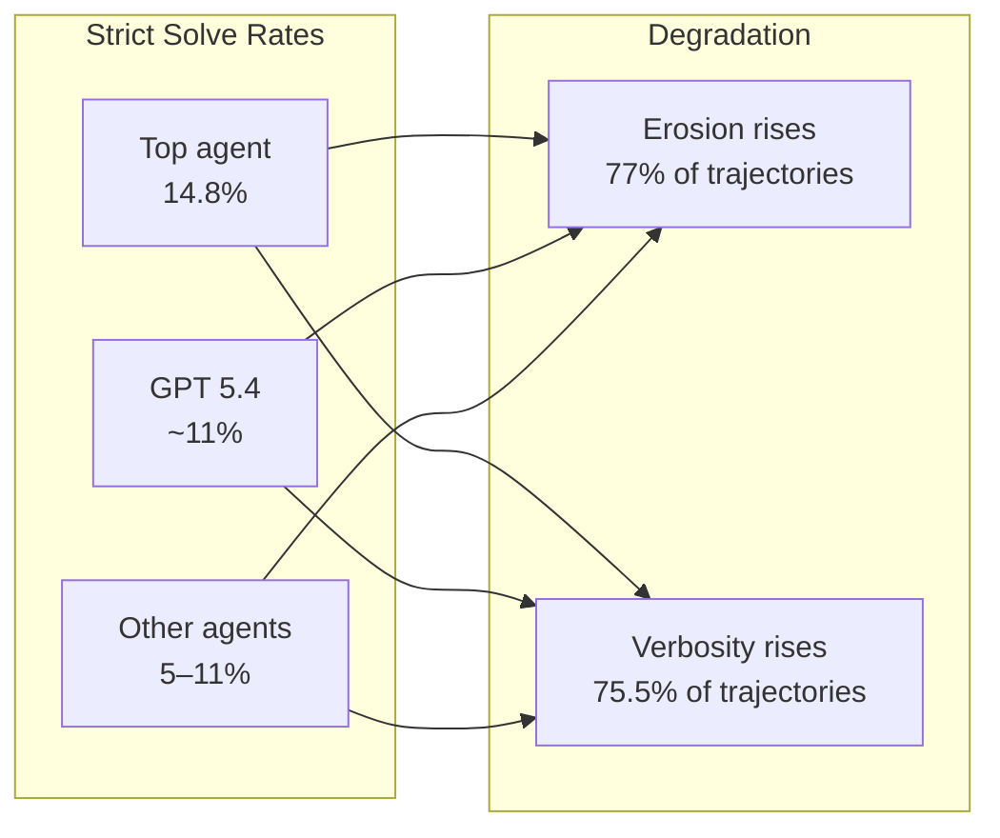
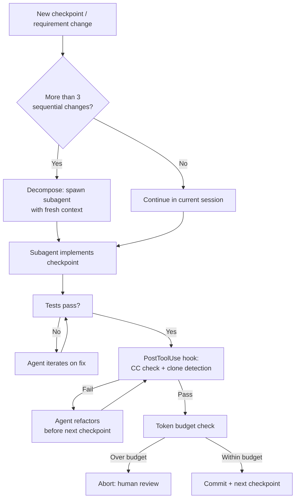

# SlopCodeBench and the Iterative Degradation Problem: Why Your Coding Agent's Code Rots Faster Than Yours — and How Codex CLI's Architecture Fights Back


---

Every coding agent benchmark you have seen is lying to you — not through malice, but through methodology. SWE-Bench, HumanEval, and their descendants evaluate agents on single-shot tasks: here is a bug, fix it; here is a spec, implement it. Real software development is iterative. You ship a feature, then extend it, then extend the extension, and somewhere around the fourth iteration you discover that the original architecture cannot bear the weight. Orlanski et al.'s SlopCodeBench [^1] is the first benchmark to measure what happens when coding agents must do the same — and the results should concern anyone relying on agentic workflows for production code.

## What SlopCodeBench Measures

SlopCodeBench comprises 36 problems spanning 196 checkpoints [^1]. Each problem begins with a base specification and evolves through a sequence of requirement changes that force architectural decisions. Agents must extend their own prior solutions without prescribed internal interfaces or visible test suites — exactly the conditions under which real codebases grow.

The benchmark tracks two trajectory-level quality signals:

- **Structural erosion**: the share of complexity mass concentrated in high-complexity functions (cyclomatic complexity > 10), calculated as `mass(CC>10) / total_mass` where `mass(f) = CC(f) × √SLOC(f)`[^1]
- **Verbosity**: the fraction of redundant or duplicated code, combining AST-Grep pattern detection (137 rules) with clone detection [^1]

These are not aesthetic preferences. Erosion predicts maintainability failures; verbosity predicts merge conflicts and review burden.

## The Numbers

Fifteen agents were evaluated. No agent solved any problem end-to-end across all checkpoints [^1]. The highest strict checkpoint solve rate was 14.8% [^2].



The degradation metrics tell the real story:

| Metric | Agent code | Human code (48 repos) | Ratio |
|--------|-----------|----------------------|-------|
| Verbosity | 0.33 | 0.15 | 2.2× |
| Erosion | 0.68 | 0.31 | 2.2× |
| Trajectories with rising erosion | 77% | Flat/modest | — |
| Trajectories with rising verbosity | 75.5% | Flat/modest | — |

Cyclomatic complexity in main functions grew from 27.1 to 68.2 across checkpoints [^2]. In the worst case, a `circuit_eval` main function expanded to 1,099 lines with a cyclomatic complexity of 285[^2]. Per-checkpoint cost grew 2.9× across problem progress [^2].

## Why Agents Degrade

Three mechanisms drive the rot:

### 1. Hardcoding Over Abstraction

When agents encounter a new requirement, they tend to handle it with conditional branches rather than refactoring towards abstractions. Each checkpoint adds another `if` block to an already complex function. Human developers, facing the same pressure, eventually extract helpers, introduce dispatch tables, or restructure entirely — the "third time, refactor" heuristic. Agents lack this instinct because each turn sees only the current specification, not the trajectory of specifications [^1].

### 2. Context Window Decay

As sessions grow longer, earlier architectural decisions fade from the context window. After compaction in Codex CLI — which fires when accumulated messages exceed roughly 80–90% of the model's context budget [^3] — the agent loses fidelity on earlier turns. It may forget that a function was originally designed as a dispatch point and instead treat it as a monolith to be extended.

### 3. Clone-and-Modify as Default Strategy

When uncertain about how existing code works, agents duplicate rather than understand. SlopCodeBench found that structural duplication drove 66% of verbosity growth [^2]. This is rational under token constraints — reading and comprehending a 200-line function costs more tokens than copying it and tweaking the copy — but it compounds across checkpoints.

## The Prompt Intervention Failure

Orlanski et al. tested two prompt interventions: "anti-slop" instructions (explicitly requesting clean code) and "plan-first" prompts (requiring architectural planning before implementation) [^1].

The results are instructive:

- Anti-slop prompts reduced initial verbosity by 34.5% on GPT 5.4[^2]
- **Degradation slopes remained unchanged** — prompts shifted the intercept, not the trajectory [^2]
- Zero improvement in pass rates (p > 0.05 via Wilcoxon tests) [^2]
- 47.9% cost increase for the improved initial quality with no correctness gains [^2]

This is a critical finding: you cannot prompt your way out of iterative degradation. The problem is structural, not instructional.

## Codex CLI's Architectural Defences

SlopCodeBench did not evaluate Codex CLI's defensive features specifically, but its findings map directly to four mechanisms available in the Codex CLI toolchain.

### Defence 1: Subagent Decomposition

The single most effective counter to iterative degradation is to avoid iterating within a single context. Codex CLI's subagent architecture [^4] spawns isolated task instances, each with a fresh context window and its own git worktree. Rather than extending a monolithic solution across ten checkpoints in one session, a parent agent can decompose the work:

```toml
# AGENTS.md excerpt — decomposition directive
When a task involves more than three sequential requirement changes,
decompose into subtasks. Each subtask gets a fresh subagent with:
- A focused specification covering only its checkpoint range
- Read access to the current codebase state
- Its own test harness

Merge subtask outputs through the parent agent's review pass.
```

Each subagent inherits the test harness but starts with an uncompacted context window [^4]. The Superpowers community framework formalises this pattern, spawning fresh subagents per task to prevent context drift during multi-hour sessions [^5].

### Defence 2: PostToolUse Refactoring Gates

Codex CLI's hook pipeline supports `PostToolUse` hooks that fire after every shell command [^6]. A refactoring gate can enforce quality thresholds between checkpoints:

```bash
#!/usr/bin/env bash
# .codex/hooks/post-tool-use-quality-gate.sh

# Run only after test passes
if [[ "$CODEX_TOOL" == "shell" && "$CODEX_EXIT_CODE" == "0" ]]; then
  # Check cyclomatic complexity of changed files
  CHANGED=$(git diff --name-only HEAD~1 -- '*.py')
  for f in $CHANGED; do
    MAX_CC=$(radon cc "$f" -n C -s | grep -oP 'CC=\K\d+' | sort -rn | head -1)
    if [[ "${MAX_CC:-0}" -gt 15 ]]; then
      echo "REJECT: $f has function with CC=$MAX_CC (threshold: 15)"
      echo "Refactor before proceeding to next checkpoint."
      exit 1
    fi
  done
fi
```

This forces the agent to refactor high-complexity functions before moving on — exactly the "third time, refactor" heuristic that SlopCodeBench found agents lack naturally.

### Defence 3: Context-Aware Compaction Strategy

Codex CLI's compaction fires when token usage hits the configured threshold [^3]. The default behaviour summarises older turns, but for iterative tasks the architectural decisions from early turns are precisely what must survive compaction. Two configuration approaches help:

1. **Lower the threshold** to trigger compaction earlier, keeping more headroom for detailed recent context
2. **Use structured AGENTS.md notes** that persist across compactions — architectural decisions documented in the project's AGENTS.md file are re-read at the start of every session and after every compaction, providing a stable reference that does not degrade [^7]

```toml
# AGENTS.md — architectural invariants for iterative work
## Architecture Decisions (DO NOT VIOLATE)
- Event dispatch uses the Registry pattern in src/dispatch.py
- All new event types MUST register via @registry.handler decorator
- Maximum function CC: 15. If exceeded, extract helper before proceeding.
- No clone-and-modify. If duplicating >10 lines, extract shared function.
```

### Defence 4: Token Budget Abort

Codex CLI v0.142.0 introduced configurable rollout token budgets [^8] that track usage across agent threads and abort turns when exhausted. SlopCodeBench found that per-checkpoint costs grew 2.9× across problem progress [^2] — a runaway cost signal that correlates with degradation. Setting a per-checkpoint token budget creates a natural circuit breaker: if the agent cannot solve a checkpoint within budget, it is likely producing bloated code and should be stopped for human review.

## A Practical Anti-Degradation Workflow

Combining these defences into a cohesive workflow for iterative feature development:



## What This Means for Your Workflow

SlopCodeBench's core insight is that **pass rates lie about sustainability**. An agent can pass every checkpoint while producing code that is 2.2× more verbose and 2.2× more structurally eroded than human-written equivalents [^1]. The traditional benchmark tells you the agent succeeded; the erosion metric tells you the codebase is approaching unmaintainability.

For Codex CLI users, the practical takeaways are:

1. **Do not run marathon sessions** for iterative feature work. Decompose into subagent-per-checkpoint or subagent-per-feature-slice.
2. **Instrument quality gates** via PostToolUse hooks. Cyclomatic complexity and clone detection are cheap to run and directly measure the degradation signals SlopCodeBench identified.
3. **Document architectural decisions in AGENTS.md**, not in conversation history. Conversation history gets compacted; AGENTS.md persists.
4. **Set token budgets per checkpoint**. Cost growth is a leading indicator of quality degradation.
5. **Do not rely on quality prompts alone**. SlopCodeBench proved they shift the starting point but not the degradation rate [^2].

The agents are getting better at passing tests. They are not getting better at writing code that survives iteration. Until they do, the defence is architectural — and Codex CLI's toolchain provides the mechanisms to build it.

---

## Citations

[^1]: Orlanski, G., Roy, D., Yun, A., Shin, C., Gu, A., Ge, A., Adila, D., Roberts, N., Sala, F. & Albarghouthi, A. (2026). "SlopCodeBench: Benchmarking How Coding Agents Degrade Over Long-Horizon Iterative Tasks." arXiv:2603.24755. [https://arxiv.org/abs/2603.24755](https://arxiv.org/abs/2603.24755)

[^2]: SlopCodeBench detailed results and leaderboard. [https://www.scbench.ai](https://www.scbench.ai)

[^3]: "Codex CLI Context Compaction: Architecture, Configuration, and Managing Long Sessions." Codex Knowledge Base, March 2026. [https://codex.danielvaughan.com/2026/03/31/codex-cli-context-compaction-architecture/](https://codex.danielvaughan.com/2026/03/31/codex-cli-context-compaction-architecture/)

[^4]: "Agentmaxxing: Parallel Multi-CLI Orchestration with Codex CLI, Claude Code and Gemini CLI." Codex Knowledge Base, April 2026. [https://codex.danielvaughan.com/2026/04/11/agentmaxxing-parallel-multi-cli-orchestration/](https://codex.danielvaughan.com/2026/04/11/agentmaxxing-parallel-multi-cli-orchestration/)

[^5]: "Community Workflow Frameworks for Codex CLI: Superpowers, GSD, gstack, Spec Kit, OMX, and Compound Engineering Compared." Codex Knowledge Base, April 2026. [https://codex.danielvaughan.com/2026/04/24/community-workflow-frameworks-codex-cli-superpowers-gsd-gstack-comparison/](https://codex.danielvaughan.com/2026/04/24/community-workflow-frameworks-codex-cli-superpowers-gsd-gstack-comparison/)

[^6]: "Test-Driven Development with Codex CLI: The Red-Green-Refactor Loop, AGENTS.md Test Gates, and Hook-Based Verification." Codex Knowledge Base, April 2026. [https://codex.danielvaughan.com/2026/04/10/codex-cli-test-driven-development-workflow/](https://codex.danielvaughan.com/2026/04/10/codex-cli-test-driven-development-workflow/)

[^7]: OpenAI. "CLI — Codex." OpenAI Developers Documentation. [https://developers.openai.com/codex/cli](https://developers.openai.com/codex/cli)

[^8]: OpenAI. "Changelog — Codex." OpenAI Developers, June 2026. [https://developers.openai.com/codex/changelog](https://developers.openai.com/codex/changelog)
