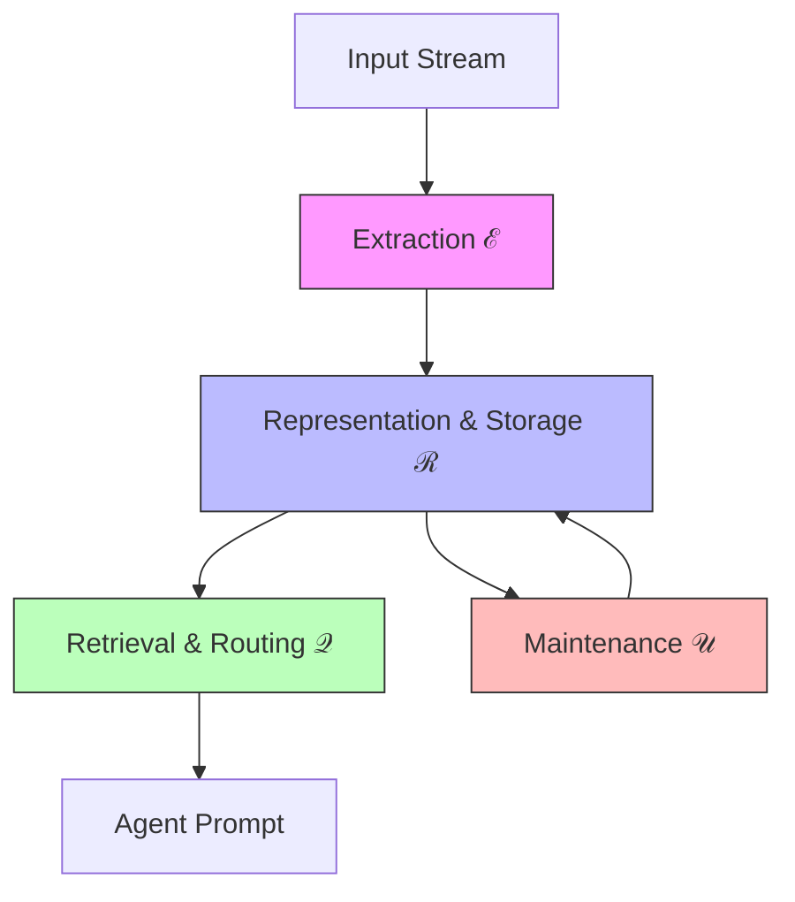
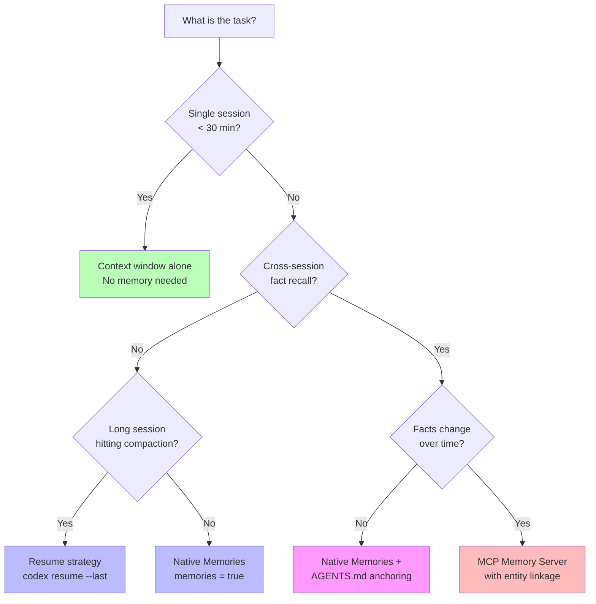

# Agent-Native Memory Systems: What a 12-System Benchmark Reveals About Memory Architecture — and How to Configure Codex CLI's Memory Stack


---

## The Memory Problem No One Benchmarked Properly

Every coding agent session longer than thirty minutes runs into the same wall: the model forgets what it decided, re-reads files it already analysed, and loses track of constraints established three tool calls ago. The industry response has been a proliferation of memory systems — Mem0, Zep, Letta, Cognee, and a dozen others — each claiming to solve cross-session persistence. But until now, nobody had benchmarked them against each other using the same datasets under realistic cost constraints.

Zhou et al.'s "Are We Ready For An Agent-Native Memory System?" (arXiv:2606.24775, 23 June 2026) changes that [^1]. The paper evaluates 12 representative memory systems plus 2 baselines across 5 benchmark workloads spanning 11 datasets, decomposing agent memory into four core modules and producing the first systematic cost-performance comparison. The findings have direct implications for how you configure Codex CLI's own three-layer memory stack: native Memories, context compaction, and MCP memory servers.

---

## The Four-Module Decomposition

The paper's analytical framework breaks every agent memory system into four modules [^1]:



| Module | What it does | Codex CLI equivalent |
|--------|-------------|---------------------|
| **Extraction (ℰ)** | Transforms input streams into memory primitives — raw concatenation, schema-free, or schema-constrained | Native Memories extraction after thread idle [^2] |
| **Representation & Storage (ℛ)** | Defines logical structure (tokens, graphs, trees) and physical persistence | `~/.codex/memories/` files + `~/.codex/sessions/` JSONL rollouts [^2][^3] |
| **Retrieval & Routing (𝒬)** | Identifies relevant subsets via semantic search, topological traversal, or hybrid execution | Memory injection at session start + `codex resume` transcript loading [^3] |
| **Maintenance (𝒰)** | Governs lifecycle through eviction, consolidation, or versioning | Compaction, memory consolidation model, rate-limit-gated generation [^2] |

This decomposition matters because the paper's central finding is that **no single architecture dominates across all scenarios** — effectiveness depends on alignment between memory structure and workload bottlenecks [^1].

---

## Key Findings: The Numbers That Matter

### Cost-Performance Tiers

The paper clusters systems into three efficiency tiers [^1]:

| Tier | Representative Systems | Normalised Utility | Latency |
|------|----------------------|-------------------|---------|
| Efficient | LightMem, MemTree | 48–63 | 3.6–15.9s |
| Moderate | MemOS, MemoryOS | ~82 | ~28.6s |
| Expensive | Cognee, Zep | 84+ | 116–155s |

Higher structure yields diminishing returns beyond the moderate tier. For coding agents operating under token budgets (as Codex CLI does since v0.142.0[^4]), this means that pouring tokens into elaborate memory graphs produces marginal accuracy gains at catastrophic latency costs.

### Raw Text Beats Abstraction

Finding 6 from the paper is counterintuitive: "Retaining the original conversational content is more important than increasing abstraction"[^1]. Raw text preserves exact detail recovery; aggressive summarisation reduces queryable evidence. This has direct implications for compaction strategy — Codex CLI's compaction summarises prior turns into compressed representations [^5], which is precisely the trade-off the paper warns about.

### Graph-Based Updates Handle Knowledge Revisions Best

Systems with entity linkage (Zep: 44.4 Substring EM on knowledge updates) handle fact overwrites most reliably [^1]. Systems lacking explicit entity linkage return stale facts — what the authors call "hallucinations of the past." For coding agents, this means a memory system that cannot track which facts have been superseded will confidently apply deprecated API patterns.

### Localized Maintenance Wins on Cost

Localized maintenance — updates to bounded memory subsets — keeps costs proportional to changed data [^1]. Global reorganisation (whole-memory rewriting, multi-store synchronisation) becomes the dominant cost driver as memory grows, yielding orders-of-magnitude latency increases without proportional accuracy gains.

---

## Mapping the Taxonomy to Codex CLI's Memory Stack

Codex CLI implements a three-layer memory architecture that, viewed through the paper's framework, covers all four modules — but with trade-offs at each layer.

### Layer 1: Native Memories (Cross-Session Persistence)

Codex CLI's native Memories system (v0.128+) extracts durable insights from completed sessions and injects them into future ones automatically [^2]. Configuration in `~/.codex/config.toml`:

```toml
[features]
memories = true

[memories]
generate_memories = true
use_memories = true
disable_on_external_context = false
min_rate_limit_remaining_percent = 20
extract_model = "gpt-5.4-mini"
consolidation_model = "gpt-5.4-mini"
```

In the paper's taxonomy, this is **schema-free extraction** with **timestamp-based versioning** and **semantic retrieval**. The paper finds this combination lands in the "efficient" tier — low latency, reasonable accuracy, but vulnerable to stale fact retention because there is no entity linkage for knowledge updates [^1].

**Recommendation:** Treat memories as a recall layer, not a source of truth. Keep mandatory guidance in `AGENTS.md`[^2].

### Layer 2: Context Compaction (In-Session Persistence)

When a session's context approaches the model's window limit, Codex CLI compacts prior turns into a compressed summary [^5]. This is the paper's **LLM-driven consolidation** maintenance strategy.

The paper's findings suggest this is a trade-off: compaction preserves session continuity but destroys retrievable evidence. The Efficient tier systems (LightMem, MemTree) use **segmented or hierarchical structures with localized updates** instead of whole-context summarisation [^1].

For Codex CLI, the practical mitigation is to structure long sessions as multiple shorter sessions connected via `codex resume`:

```bash
# End session naturally when approaching compaction threshold
# Resume with full transcript rather than compacted summary
codex resume --last
```

This preserves the raw transcript (Finding 6) rather than relying on compacted summaries.

### Layer 3: MCP Memory Servers (Structured Persistence)

For workloads requiring dispersed cross-session reasoning — the paper's most demanding category — Codex CLI can compose MCP memory servers that implement graph-based or relational representations [^6]. The paper finds that relation-aware systems (Cognee, Zep tier) achieve the highest accuracy on these workloads despite higher costs [^1].

```toml
# ~/.codex/config.toml — MCP memory server configuration
[[mcp]]
name = "memory"
command = "npx"
args = ["-y", "@mem0/mcp-server"]
env = { MEM0_TOKEN = "env:MEM0_TOKEN" }
enabled_tools = ["add_memory", "search_memory", "get_all_memories"]

[[mcp]]
name = "knowledge-graph"
command = "npx"
args = ["-y", "@cognee/mcp-server"]
enabled_tools = ["cognee_add", "cognee_search", "cognee_codify"]
```

---

## Workload-Driven Architecture Selection

The paper's most actionable conclusion is that memory architecture should be selected by workload type, not by abstract capability [^1]. Here is how that maps to common Codex CLI usage patterns:



### Pattern 1: Short Deterministic Tasks

For `codex exec` batch operations and single-session bug fixes, the context window alone is sufficient. No memory overhead needed.

### Pattern 2: Multi-Session Feature Development

Enable native Memories and anchor critical constraints in `AGENTS.md`:

```markdown
<!-- AGENTS.md -->
## Memory Anchors

- API version: v3.2 (do NOT use v2.x patterns even if memories suggest them)
- Test framework: Vitest, not Jest
- Authentication: OAuth2 PKCE flow only
```

This mitigates the stale-fact problem the paper identifies — `AGENTS.md` always overrides remembered patterns [^2].

### Pattern 3: Long-Running Refactoring

For sessions that regularly hit compaction thresholds, use the resume-over-compact strategy:

```bash
# Structure work as checkpoint-and-resume
codex --model gpt-5.5 "Refactor auth module phase 1: extract interfaces"
# Session ends naturally
codex resume --last "Phase 2: implement new interfaces"
```

### Pattern 4: Evolving Codebase Knowledge

For teams where APIs, dependencies, and patterns change frequently, add an MCP memory server with entity linkage to handle knowledge updates correctly:

```toml
[memories]
disable_on_external_context = true  # Avoid polluting native memories with MCP-sourced facts

[[mcp]]
name = "project-memory"
command = "npx"
args = ["-y", "@mem0/mcp-server"]
env = { MEM0_TOKEN = "env:MEM0_TOKEN" }
```

---

## The Compaction Dilemma

The paper's most uncomfortable finding for Codex CLI users is about compaction. The benchmark shows that systems preserving raw content outperform those that summarise aggressively [^1]. Yet compaction is Codex CLI's primary mechanism for handling sessions that exceed the context window [^5].

The practical resolution is a tiered approach:

1. **Prevent compaction where possible** — use subagent delegation to keep individual sessions short [^7]
2. **When compaction is unavoidable**, resume from the compacted session rather than continuing within it — this gives the model a fresh context window with the compacted summary as preamble
3. **For mission-critical context**, write it to `AGENTS.md` or a project README rather than relying on compacted memory — static files survive any memory strategy

```toml
# Subagent definitions to prevent compaction via task decomposition
[[agents]]
name = "test-writer"
model = "gpt-5.4-mini"
prompt = "Write tests for the specified module. Do not modify production code."

[[agents]]
name = "implementer"
model = "gpt-5.5"
prompt = "Implement the specified feature. Run existing tests after changes."
```

---

## Cost Governance

The paper's cost-performance data reinforces Codex CLI's v0.142.0 token budget governance [^4]. Memory operations consume tokens — extraction, consolidation, and retrieval all add to the bill. Configure memory generation to respect rate limits:

```toml
[memories]
min_rate_limit_remaining_percent = 25   # Conservative: skip memory generation when budget is tight
extract_model = "gpt-5.4-mini"          # Use cheaper model for extraction
consolidation_model = "gpt-5.4-mini"    # Use cheaper model for consolidation
```

The paper shows that the Efficient tier (LightMem, MemTree) achieves 48–63 normalised utility at 3.6–15.9s latency, while the Expensive tier (Cognee, Zep) achieves 84+ at 116–155s [^1]. For most coding workflows, the efficient tier is the right trade-off — which aligns with Codex CLI's lightweight native Memories design.

---

## What the Paper Gets Wrong About Coding Agents

The benchmark workloads — LoCoMo, LongMemEval, DB-Bench — are conversational and procedural [^1]. None of them test the specific memory pattern that coding agents use most: **remembering structural decisions across a codebase**. A coding agent needs to recall that the project uses repository pattern for data access, that error handling follows a Result type convention, and that the team rejected Redux in favour of Zustand — none of which map cleanly to episodic QA or temporal reasoning benchmarks.

This gap means the paper's architectural recommendations should be applied with caution. For coding agents specifically, `AGENTS.md` remains the most reliable memory mechanism because it is explicit, versioned, and deterministic [^2] — precisely the properties that no evaluated memory system fully achieves.

---

## Conclusion

The agent-native memory benchmark confirms what experienced Codex CLI users already intuit: there is no universal memory architecture. The right configuration depends on session length, fact volatility, and cost tolerance. Codex CLI's three-layer stack — native Memories for lightweight cross-session recall, compaction for in-session continuity, and MCP servers for structured persistence — covers the taxonomy well, but each layer requires deliberate configuration to avoid the pitfalls the paper identifies.

The single most important takeaway: **raw content preservation beats abstraction** for detail recovery. Structure your Codex CLI workflows to minimise compaction, anchor critical facts in `AGENTS.md`, and reserve expensive graph-based memory for workloads where facts genuinely change over time.

---

## Citations

[^1]: Zhou, W., Zhou, X., Han, S., Xu, H., Li, G., Li, Z., Xiong, F. & Wu, F. (2026). "Are We Ready For An Agent-Native Memory System?" arXiv:2606.24775. [https://arxiv.org/abs/2606.24775](https://arxiv.org/abs/2606.24775)

[^2]: OpenAI. (2026). "Memories — Codex." OpenAI Developers. [https://developers.openai.com/codex/memories](https://developers.openai.com/codex/memories)

[^3]: OpenAI. (2026). "Features — Codex CLI." OpenAI Developers. [https://developers.openai.com/codex/cli/features](https://developers.openai.com/codex/cli/features)

[^4]: OpenAI. (2026). "Changelog — Codex." OpenAI Developers. [https://developers.openai.com/codex/changelog](https://developers.openai.com/codex/changelog)

[^5]: Vaughan, D. (2026). "Context Compaction Deep Dive: How Codex CLI, Claude Code, and OpenCode Manage Long Sessions." Codex Knowledge Base. [https://codex.danielvaughan.com/2026/04/14/context-compaction-deep-dive-codex-cli-claude-code-opencode/](https://codex.danielvaughan.com/2026/04/14/context-compaction-deep-dive-codex-cli-claude-code-opencode/)

[^6]: Mem0. (2026). "How Memory Works in Codex CLI." Mem0 Blog. [https://mem0.ai/blog/how-memory-works-in-codex-cli](https://mem0.ai/blog/how-memory-works-in-codex-cli)

[^7]: OpenAI. (2026). "Subagents — Codex CLI." OpenAI Developers. [https://developers.openai.com/codex/cli/features](https://developers.openai.com/codex/cli/features)
