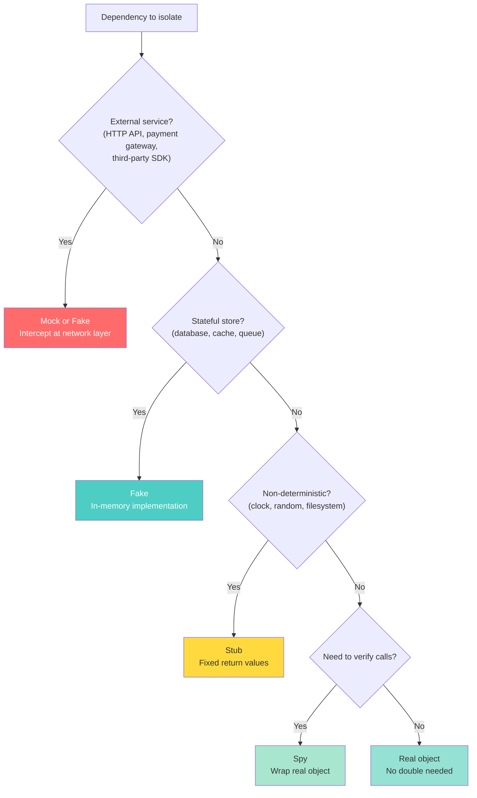
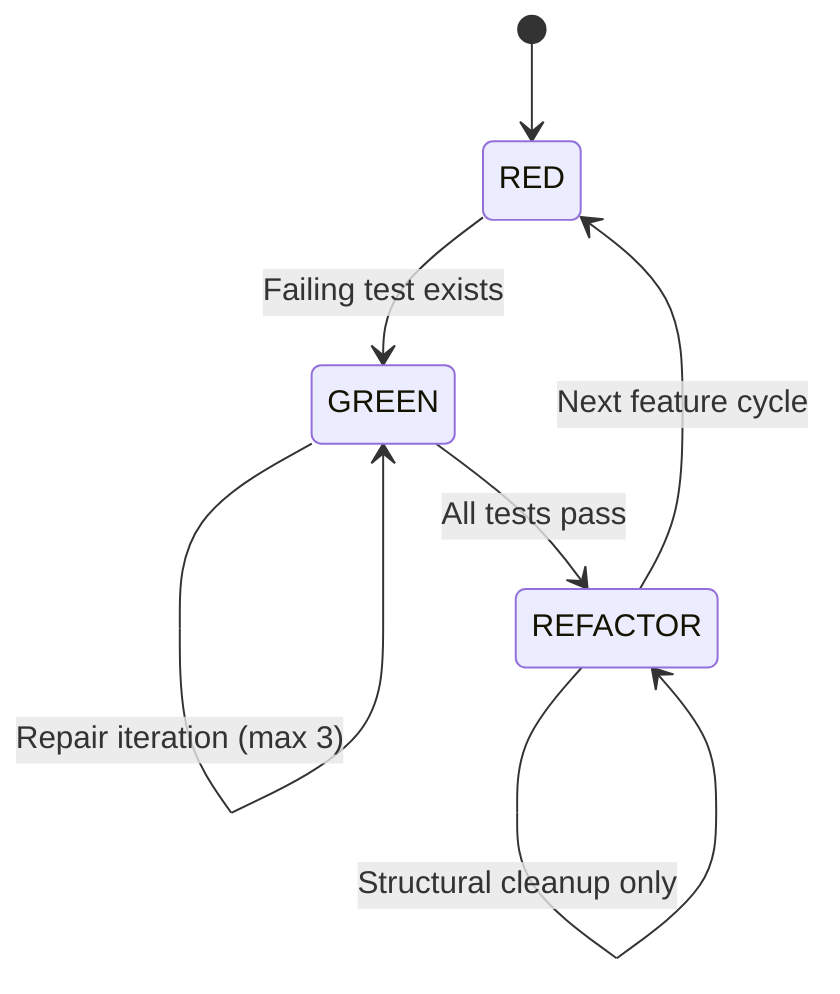
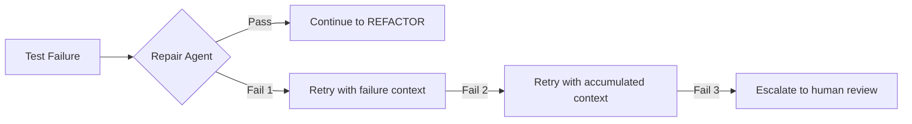
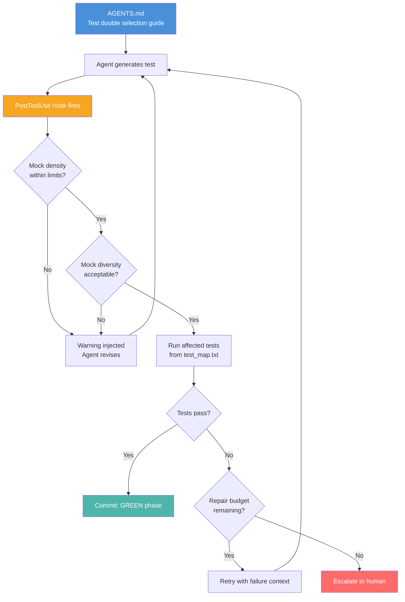

# The Agent Testing Quality Playbook: Mock Diversity, Integration Balance, and AGENTS.md Templates for Codex CLI


---

Coding agents are prolific test writers — and reliably poor test designers. Two independent research threads published in 2026 converge on the same conclusion: agents over-mock, under-diversify their test doubles, and lack the architectural awareness to test effectively without explicit guidance. Hora and Robbes found that agent-generated test commits include mocks at 36% versus 26% for humans [^1]. Separately, TDAD demonstrated that procedural TDD instructions without dependency context *increase* regressions by 63% [^2]. Neither finding alone tells the full story. Together, they define a unified test quality framework that Codex CLI teams can encode directly into their `AGENTS.md` hierarchy and enforce through `PostToolUse` hooks.

This playbook consolidates those findings into a single actionable guide: a test double selection model, a three-layer testing architecture, concrete AGENTS.md templates, and hook-based enforcement patterns.

## The Over-Mocking Problem: Evidence at Scale

The Hora and Robbes study analysed 1.2 million commits across 2,168 TypeScript, JavaScript, and Python repositories, isolating 48,563 agent commits for comparison [^1]. The headline numbers matter, but the structural findings matter more.

### Mock Monoculture

Human developers distribute their test double usage across multiple types: mocks (91%), fakes (57%), and spies (51%) [^1]. Agents concentrate overwhelmingly on mocks — 95% of agent test double usage is the `mock` type, with fakes at 32% and spies at 33% [^1]. This monoculture reflects a generation strategy that treats isolation as a binary choice (mock everything or mock nothing) rather than selecting the appropriate double for the dependency type.

The practical consequence is threefold:

1. **False coverage.** Mocked tests verify wiring, not behaviour. A test that mocks every collaborator confirms the unit calls the right methods with the right arguments — and nothing else. When interfaces change, mocked tests continue passing while real integration breaks [^1].

2. **Maintenance drag.** Every mock carries an implicit contract. Rename a method, change a return type, or add a parameter, and every mock referencing it must be updated. In agent-heavy repositories, this maintenance surface grows disproportionately [^1].

3. **Specification drift.** Agents mock based on current implementation rather than intended interfaces. The mock becomes a snapshot of today's code shape, not a specification of the contract [^1].

### The Configuration Gap

A GitHub code search found that only 12% of `CLAUDE.md` files, 16% of `copilot-instructions.md` files, and 4% of `CURSOR.md` files mention mocking practices at all [^1]. Most projects that use coding agents provide no explicit guidance on test double selection. The `browser-use/browser-use` repository stands as a positive example: its instructions state "Never mock anything in tests, always use real objects!!" — and agent mock commits in that repository dropped to just five [^1].

## The Test Double Selection Guide

Rather than blanket rules like "never mock" or "always mock external services," effective test quality requires a decision framework that matches double types to dependency characteristics.



| Dependency Type | Recommended Double | Rationale |
|----------------|-------------------|-----------|
| External HTTP APIs | Mock (network-layer intercept) | Avoid real network calls; use `responses` (Python), `msw` (TypeScript) [^1] |
| Databases, caches | Fake (in-memory implementation) | Preserves query semantics; avoids mock contract drift [^3] |
| Clocks, random generators | Stub (fixed values) | Determinism without behavioural coupling [^3] |
| Internal collaborators (need call verification) | Spy (wrapping real object) | Verifies interaction while preserving real behaviour [^3] |
| Internal collaborators (no verification needed) | Real object | Maximises integration coverage; zero maintenance cost [^1] |
| Standard library modules | Never mock | Mocking `os`, `sys`, or `pathlib` creates fragile, unreadable tests [^1] |

This guide should live in every project's `AGENTS.md` — not as prose, but as a decision table the agent can reference during test generation.

## Three Layers of Testing Architecture

TDAD and TDD Governance research independently converge on a three-layer architecture that addresses the *when*, *what*, and *how long* of agent testing [^2][^4].

### Layer 1: Dependency Graphs — Know What to Test

TDAD's central finding is that agents must know which tests are affected by a proposed change *before* touching code [^2]. Without dependency context, "run the tests" means either running the entire suite (slow, noisy) or guessing (fragile, incomplete).

TDAD builds a code-test dependency graph using AST analysis with four node types (File, Function, Class, Test) and five edge types (CONTAINS, CALLS, IMPORTS, TESTS, INHERITS) [^2]. The output is a `test_map.txt` file — a static text artefact that fits inside the agent's context window.

The critical finding: when TDAD simplified its skill definition from 107 lines to 20 lines of pure dependency context, resolution rates quadrupled from 12% to 50% on SWE-bench Verified [^2]. **Context outperforms procedure.**

### Layer 2: Phase Gates — Know When to Test

TDD Governance formalises phase transitions as a multi-agent architecture with strict separation between proposal and authority layers [^4]:



The proposal layer (planner, test generator, implementation agent) produces structured patches. The governance layer validates against schemas and policies, enforces phase consistency, and applies mutations atomically [^4]. Agents never write directly to the filesystem — the same principle behind Codex CLI's sandbox model [^5].

### Layer 3: Bounded Repair — Know When to Stop

Unbounded retry loops are the most expensive failure mode in agent testing. TDD Governance caps repair iterations at three attempts per GREEN step, with termination triggered by repeated failure signatures, semantic equivalence detection, or iteration cap [^4].



When the repair budget is exhausted, the correct action is escalation — not another attempt. Circuit breakers and explicit escalation paths are production necessities [^4].

## AGENTS.md Templates

Codex CLI's hierarchical instruction system resolves files root-first, leaf-last, with files closer to the current directory overriding earlier guidance [^6]. The following templates encode the full playbook.

### Global Baseline (~/.codex/AGENTS.md)

```markdown
## Test Double Selection

- Prefer real objects over test doubles. Only isolate:
  - External services → Mock at network layer
  - Stateful stores → Fake with in-memory implementation
  - Non-deterministic deps → Stub with fixed values
  - Call verification needed → Spy wrapping real object
- Never mock standard library modules (os, sys, pathlib).
- Never mock the class under test.
- Maximum mock depth: 1 level. Never mock a dependency of a dependency.
- Every test file must include at least one integration test exercising
  the real dependency chain.

## Test Governance

- Before modifying any file, consult `test_map.txt` to identify affected
  tests. Run ONLY those tests after your change.
- If `test_map.txt` does not exist, run the full suite once, then create it.
- For feature work: RED (failing test) → GREEN (minimal fix) → REFACTOR.
- Each phase is a separate commit.
- Maximum 3 repair attempts per failing test. After 3, escalate to human.
```

### Project Root (AGENTS.md)

```markdown
## Test Configuration

- Test framework: pytest (Python), vitest (TypeScript).
- Mock library: unittest.mock (Python), vi.mock (TypeScript).
- Run tests with `just test` before completing any task.
- For database tests, use fixtures in `tests/fixtures/` — do NOT mock ORM.
- For HTTP tests, use `responses` (Python) or `msw` (TypeScript) to
  intercept at network layer, not by mocking client classes.

## Forbidden Patterns

- `@patch` on more than 2 targets in a single test function.
- `MagicMock()` without a spec — always use `spec=ClassName`.
- Mocking standard library modules.
- Writing implementation and tests in the same commit.
```

### Per-Directory Override (services/payments/AGENTS.override.md)

```markdown
## Testing — Payments Service

- External payment gateway calls MUST use the fake in
  `tests/payments/gateway_fake.py`.
- Database, cache, and queue dependencies use real test instances
  via docker-compose.
- Never stub the payment state machine — test transitions with
  real objects.
```

## PostToolUse Hook Enforcement

AGENTS.md instructions are advisory — the agent may still over-mock when the path of least resistance leads there. Codex CLI's `PostToolUse` hooks provide harder enforcement by validating test files after they are written [^7].

### Mock Density Check

```bash
#!/usr/bin/env bash
# .codex/hooks/check-mock-density.sh
# Runs after every file write to enforce mock limits

set -euo pipefail

CHANGED_FILE="$1"

# Only check test files
[[ "$CHANGED_FILE" =~ test_ || "$CHANGED_FILE" =~ _test\. ]] || exit 0

# Count mock/patch occurrences
MOCK_COUNT=$(grep -cE '@patch|MagicMock|mock\.|vi\.mock|jest\.mock' \
  "$CHANGED_FILE" 2>/dev/null || echo 0)

# Count test functions
TEST_COUNT=$(grep -cE 'def test_|it\(|test\(' \
  "$CHANGED_FILE" 2>/dev/null || echo 1)

RATIO=$(echo "scale=2; $MOCK_COUNT / $TEST_COUNT" | bc)

if (( $(echo "$RATIO > 3.0" | bc -l) )); then
  echo "MOCK DENSITY WARNING: $CHANGED_FILE has $MOCK_COUNT mocks " \
       "across $TEST_COUNT tests (ratio: $RATIO). " \
       "Consider using fakes or spies instead." >&2
fi
```

### Mock Type Diversity Check

```bash
#!/usr/bin/env bash
# .codex/hooks/check-mock-diversity.sh
# Warns when test files use only mock type without fakes or spies

set -euo pipefail

CHANGED_FILE="$1"
[[ "$CHANGED_FILE" =~ test_ || "$CHANGED_FILE" =~ _test\. ]] || exit 0

HAS_MOCK=$(grep -cE 'Mock|mock\.|@patch|vi\.mock' "$CHANGED_FILE" || echo 0)
HAS_FAKE=$(grep -cE '[Ff]ake|InMemory|FakeClient' "$CHANGED_FILE" || echo 0)
HAS_SPY=$(grep -cE '[Ss]py|vi\.spyOn|wraps=' "$CHANGED_FILE" || echo 0)

if [[ "$HAS_MOCK" -gt 3 && "$HAS_FAKE" -eq 0 && "$HAS_SPY" -eq 0 ]]; then
  echo "MOCK DIVERSITY WARNING: $CHANGED_FILE uses $HAS_MOCK mocks " \
       "but no fakes or spies. Review test double selection." >&2
fi
```

Register both hooks in your Codex CLI configuration:

```toml
# ~/.codex/config.toml

[[hooks.post_tool_use]]
event = "post_tool_use"
script = ".codex/hooks/check-mock-density.sh"

[[hooks.post_tool_use]]
event = "post_tool_use"
script = ".codex/hooks/check-mock-diversity.sh"
```

The hooks inject their warnings into the agent's stderr feedback stream, steering subsequent tool calls without blocking execution [^7]. This creates a feedback loop: the agent sees mock density warnings and adjusts its approach on the next test generation pass.

## Putting It Together: The Quality Loop



The loop encodes all three layers: dependency-aware test selection (Layer 1) via `test_map.txt`, phase-gated commits (Layer 2) via AGENTS.md governance, and bounded repair (Layer 3) via explicit escalation after three failures. The PostToolUse hooks add a fourth dimension — continuous mock quality enforcement that operates orthogonally to the testing layers.

## Key Takeaways

1. **Mock diversity, not mock avoidance.** The problem is not that agents mock — it is that they mock *everything* using a single type. Encode the test double selection guide in AGENTS.md.

2. **Context over procedure.** Twenty lines of dependency context outperform 107 lines of TDD instructions. Invest in `test_map.txt` generation, not longer prompts [^2].

3. **Phase gates prevent simultaneous test-and-implementation commits.** Enforce RED → GREEN → REFACTOR in AGENTS.md task governance.

4. **Three repair attempts, then escalate.** Unbounded retry loops waste tokens and context. Cap repairs and escalate to humans [^4].

5. **Hooks enforce what instructions suggest.** PostToolUse mock density and diversity checks create feedback loops that measurably shift agent behaviour [^7].

## Citations

[^1]: A. Hora and R. Robbes, "Are Coding Agents Generating Over-Mocked Tests? An Empirical Study," *MSR 2026*, arXiv:2602.00409, January 2026. [https://arxiv.org/abs/2602.00409](https://arxiv.org/abs/2602.00409)

[^2]: TDAD (Test-Driven Agentic Development), arXiv, March 2026. Dependency graph-based test targeting achieving 50% resolution on SWE-bench Verified vs 12% with procedural TDD.

[^3]: G. Meszaros, *xUnit Test Patterns: Refactoring Test Code*, Addison-Wesley, 2007. Canonical test double taxonomy (dummy, stub, spy, mock, fake).

[^4]: TDD Governance for Multi-Agent Code Generation, 2026. Multi-agent architecture enforcing RED/GREEN/REFACTOR phase gates with bounded repair.

[^5]: OpenAI, "CLI – Codex," OpenAI Developers, 2026. [https://developers.openai.com/codex/cli](https://developers.openai.com/codex/cli)

[^6]: OpenAI, "Custom instructions with AGENTS.md," OpenAI Developers, 2026. [https://developers.openai.com/codex/guides/agents-md](https://developers.openai.com/codex/guides/agents-md)

[^7]: OpenAI, "Hooks – Codex," OpenAI Developers, 2026. [https://developers.openai.com/codex/hooks](https://developers.openai.com/codex/hooks)
