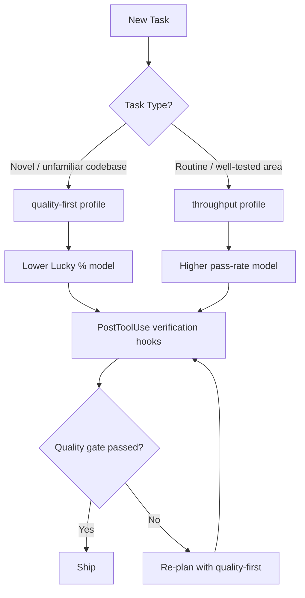

# AgentLens and the Lucky Pass Problem: Why 10.7% of Your Agent's Passing Tests Are Flukes — and How to Configure Codex CLI for Process Quality


---

Your coding agent passes the tests. Ship it? Not so fast. A study of 2,614 agent trajectories across eight model backends reveals that **10.7% of passing solutions are Lucky Passes** — tests that pass despite regression cycles, blind retries, missing verification, or temporally disordered reasoning[^1]. Worse, ranking models by pass rate alone produces a leaderboard that disagrees with process-quality rankings by up to five positions[^1]. For teams running Codex CLI in production, this has immediate implications for model selection, hook configuration, and AGENTS.md discipline.

## What AgentLens Measures

Sahoo et al. (arXiv:2605.12925, May 2026) introduce AgentLens, a framework that moves beyond binary pass/fail evaluation to assess the *process quality* of coding agent trajectories[^1]. The core insight: two trajectories that produce identical patches can differ radically in how they got there. One may follow a principled explore → implement → verify sequence; the other may thrash through blind retries until something sticks.

### The Four Intent Stages

AgentLens classifies every agent action into one of four cognitive phases[^1]:

- **Exploration (E)** — file reading, searching, listing directory contents
- **Implementation (I)** — source file editing and patch application
- **Verification (V)** — test execution, error checking, output validation
- **Orchestration (O)** — bookkeeping, reasoning, planning

Critically, the labelling is **context-sensitive**: a `read_file` call before any patches counts as Exploration, but the same call after Implementation counts as Verification[^1]. A seven-rule cascade achieves κ = 0.933 inter-annotator agreement across seven annotators[^1].

### The Prefix Tree Acceptor

For each task, AgentLens merges k ≥ 2 passing trajectories into a Prefix Tree Acceptor (PTA) — a directed acyclic graph representing known-good solution strategies[^1]. States are matched via a confidence-weighted cascade: exact content hash (1.0), file-scope AST matching (0.90), line-range overlap with ≥ 30% threshold (0.80–0.95), and semantic terminal grouping (0.70–0.85)[^1]. The study found k = 5 provides optimal AUROC (0.777) balancing precision and coverage[^1].

### The Quality Score

A composite 0–100 score combines four signals[^1]:

```
f(τc, G) = 0.20·Φstruct + 0.15·Φcov + 0.30·(100·Φcoh) + 0.35·(100·Φtemp)
```

| Signal | Weight | What it measures |
|--------|--------|-----------------|
| Structural alignment (Φstruct) | 20% | How closely the trajectory's action graph matches the PTA |
| Set coverage (Φcov) | 15% | Whether the trajectory touches the same files and edits as known-good solutions |
| Coherence (Φcoh) | 30% | Consistency of intent-stage transitions (E→I→V, not random jumps) |
| Temporal profile (Φtemp) | 35% | Whether exploration precedes implementation, which precedes verification |

Thresholds: **Ideal ≥ 70**, **Solid 47–69**, **Lucky < 47**[^1].

## The Numbers That Should Worry You

Across the 1,815-trajectory evaluation subset (47 PTA-eligible tasks from SWE-bench Verified), AgentLens classifies 229 trajectories as Ideal (20.2%), 785 as Solid (69.1%), and 122 as Lucky (10.7%)[^1].

### Model Rankings Diverge

The headline finding is that pass-rate rankings and quality-score rankings disagree significantly[^1]:

| Model | Pass % | Pass Rank | Quality Score | Quality Rank | Lucky % |
|-------|--------|-----------|--------------|--------------|---------|
| Claude Opus 4.5 | 87.9% | 1 | 66.2 | 2 | 0.5% |
| Claude Sonnet 4.5 | 86.8% | 2 | 67.4 | **1** | 1.0% |
| Claude Opus 4.6 | 77.3% | 3 | 56.7 | **6** | 18.7% |
| GPT-5.2-Codex | 64.6% | 4 | 56.1 | **7** | 19.4% |
| GPT-4.1 | 59.9% | 5 | 54.7 | **8** | 23.2% |
| GPT-5.3-Codex | 45.9% | 6 | 58.3 | 5 | 15.3% |
| Gemini 2.5 Pro | 42.9% | 7 | 59.2 | 4 | 7.6% |
| GPT-4o | 34.9% | 8 | 63.4 | **3** | 4.1% |

Claude Opus 4.6 drops from rank 3 to rank 6. GPT-4o climbs from rank 8 to rank 3[^1]. The chi-square association between model and Lucky category is χ²(28) = 102.47, p < 0.0001 — models have strongly characteristic failure modes[^1].

### The Five Lucky Pass Mechanisms

AgentLens decomposes Lucky Passes into five recurring categories[^1]:

1. **C1: Minimal & Unverified (15.6%)** — overconfident agent produces short trajectories with no verification stage
2. **C2: Brute-Force Convergence (34.4%)** — the agent lacks a plan and converges through repeated low-coherence attempts
3. **C3: Incomplete Implementation (33.6%)** — partial fixes that pass insufficient test suites
4. **C4: Excessive Exploration (4.1%)** — unfocused, extended search without termination discipline
5. **C5: Divergent-but-Valid (12.3%)** — alternative approaches that happen to work but follow no established strategy

The cost is real: Lucky trajectories waste **11.4 steps** on blind retries versus 2.7 in Ideal trajectories — a 4.2× increase[^1].

## Mapping AgentLens to Codex CLI Configuration

The Lucky Pass findings map directly to Codex CLI's configuration surface. Each mechanism has a defensive configuration pattern.

### Defence Against C1 (Minimal & Unverified): Mandatory Verification in AGENTS.md

The agent skips verification entirely. Force it:

```markdown
<!-- AGENTS.md -->
## Verification Rules

- After EVERY implementation change, run the relevant test suite before proceeding
- Never submit a patch without at least one successful test run
- If no tests exist for the changed code, write at least one before marking done
```

Combine with a PostToolUse hook that gates on test execution[^2]:

```bash
#!/bin/bash
# .codex/hooks/post-tool-use.sh
# Block if implementation detected but no test run followed

if [[ "$CODEX_TOOL_NAME" == "bash" ]]; then
  LAST_ACTIONS=$(cat "$CODEX_TRAJECTORY_LOG" | tail -5)
  if echo "$LAST_ACTIONS" | grep -q "apply_patch\|edit_file" && \
     ! echo "$LAST_ACTIONS" | grep -q "pytest\|npm test\|go test\|cargo test"; then
    echo "BLOCKED: Implementation detected without subsequent verification"
    exit 2  # Exit 2 blocks the action
  fi
fi
```

### Defence Against C2 (Brute-Force Convergence): Token Budgets and Retry Limits

Brute-force convergence burns tokens on repeated low-coherence attempts. Codex CLI v0.142's configurable rollout token budgets provide a hard stop[^3]:

```toml
# config.toml
[goal]
rollout_token_budget = 50000  # Hard ceiling per goal
tool_timeout_sec = 120        # Prevent individual tool calls from hanging
```

Complement with AGENTS.md retry discipline:

```markdown
## Retry Policy

- Maximum 3 attempts at the same approach before stopping to re-plan
- If tests fail twice with the same error, explain your diagnosis before the next attempt
- Never apply a patch that reverts a previous patch without explicit justification
```

### Defence Against C3 (Incomplete Implementation): Test Coverage Gates

Partial fixes pass weak test suites. Add coverage verification:

```bash
#!/bin/bash
# .codex/hooks/post-tool-use.sh (coverage section)
if [[ "$CODEX_TOOL_NAME" == "bash" ]] && echo "$CODEX_TOOL_INPUT" | grep -q "pytest"; then
  COVERAGE=$(python -m coverage report --format=total 2>/dev/null)
  if [[ -n "$COVERAGE" ]] && (( $(echo "$COVERAGE < 70" | bc -l) )); then
    echo "WARNING: Test coverage at ${COVERAGE}% — below 70% threshold"
    # Log but don't block; coverage thresholds are project-specific
  fi
fi
```

### Defence Against C4 (Excessive Exploration): Exploration Budgets

Unfocused search wastes context. AGENTS.md can enforce exploration discipline:

```markdown
## Exploration Budget

- Spend no more than 5 file reads understanding the problem before proposing a solution
- Use grep/ripgrep for targeted search — do not read entire files when a search suffices
- State your hypothesis BEFORE exploring; if exploration invalidates it, state a new one
```

### Model Routing: Quality Over Pass Rate

The AgentLens data suggests that model selection based on pass rate alone is misleading. For Codex CLI, this informs model routing via named profiles[^4]:

```toml
# config.toml — quality-optimised profiles
[profiles.quality-first]
model = "o4-mini"  # Lower pass rate but higher process coherence
approval_policy = "unless-allow-listed"

[profiles.throughput]
model = "gpt-5.5"  # Higher pass rate for well-understood tasks
approval_policy = "on-failure"
```

The principle: use higher-quality-process models for unfamiliar codebases and novel tasks; reserve high-pass-rate models for well-trodden paths where Lucky Passes are less likely to cause downstream problems.



### Trajectory Observability

AgentLens's four-phase intent labelling (E→I→V→O) provides a template for monitoring your own agent runs. Codex CLI's JSONL event stream can be piped to an analysis script that flags disordered sequences[^5]:

```bash
# Monitor trajectory phase ordering in real time
codex --event-stream json goal "Fix issue #123" 2>&1 | \
  python3 scripts/phase-monitor.py --warn-on "I→E" --block-on "I→I→I"
```

A trajectory that shows repeated Implementation without intervening Verification (I→I→I) is exhibiting C2 brute-force convergence in real time.

## What This Means for Teams

The Lucky Pass problem is not academic. A 10.7% Lucky rate means roughly one in ten of your agent's "successful" patches reached correctness through a process that would not survive the next refactor, the next edge case, or the next code review. The 4.2× retry waste translates directly to token spend.

Three actionable takeaways:

1. **Do not choose models by pass rate alone.** AgentLens shows GPT-4o at rank 3 for quality despite rank 8 for pass rate. Your model routing should factor in process coherence, not just outcome.

2. **Enforce the E→I→V temporal pattern.** AGENTS.md instructions and PostToolUse hooks can structurally prevent the two most common Lucky mechanisms (C2 brute-force and C1 missing verification), which together account for 50% of Lucky Passes.

3. **Budget against thrashing.** Rollout token budgets, retry limits, and exploration caps prevent the agent from stumbling into correctness through sheer volume of attempts.

The goal is not to prevent the agent from succeeding — it is to ensure that when it succeeds, the process is one you can trust.

## Citations

[^1]: Sahoo, P., Mittal, G., Li, X., Ma, S., Steenhoek, B., Lin, P. & Hu, Y. (2026). "AgentLens: Revealing The Lucky Pass Problem in SWE-Agent Evaluation." arXiv:2605.12925. [https://arxiv.org/abs/2605.12925](https://arxiv.org/abs/2605.12925)

[^2]: OpenAI. (2026). "Hooks – Codex." OpenAI Developers. [https://developers.openai.com/codex/hooks](https://developers.openai.com/codex/hooks)

[^3]: OpenAI. (2026). "Changelog – Codex." Codex CLI v0.142.0 release notes. [https://developers.openai.com/codex/changelog](https://developers.openai.com/codex/changelog)

[^4]: OpenAI. (2026). "Command line options – Codex CLI." OpenAI Developers. [https://developers.openai.com/codex/cli/reference](https://developers.openai.com/codex/cli/reference)

[^5]: OpenAI. (2026). "Custom instructions with AGENTS.md – Codex." OpenAI Developers. [https://developers.openai.com/codex/guides/agents-md](https://developers.openai.com/codex/guides/agents-md)
