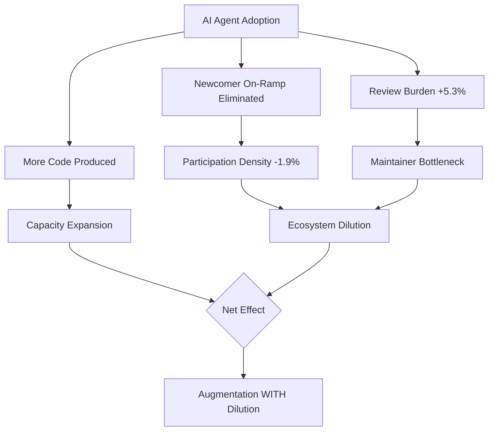
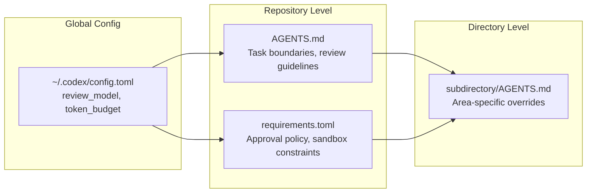

# Augmentation with Dilution: What the First Large-Scale Study of AI Coding Agent Impact on Contributor Ecosystems Means for Codex CLI Teams


---

The promise of AI coding agents has always been additive: more code, faster cycles, fewer bottlenecks. A new large-scale empirical study by Zhang, Jiang, and Koziolek challenges that narrative with uncomfortable precision. Their paper, *Augmentation with Dilution* (arXiv:2606.26289), analyses 11,097 GitHub repositories from January 2023 to May 2026 using causal inference methods, and finds that while AI agents expand project capacity, they simultaneously dilute human participation structures in ways that demand deliberate governance [^1].

For teams running Codex CLI — whether on open-source projects or enterprise codebases — the findings map directly onto configuration decisions you should be making today.

## The Core Finding: Capacity Up, Participation Down

The study's event-study design compares contributor behaviour before and after AI coding agent adoption across repositories. The headline numbers are stark [^1]:

| Metric | Effect | Statistical Significance |
|--------|--------|--------------------------|
| Total human contributors | No significant change | p = 0.224 |
| Human participation density (relative share) | −1.9% | p = 0.002 |
| Newcomer participation share | −3.7 percentage points | p < 0.001 |
| Review depth | +5.3% | — |

The pattern is clear: AI agents do not displace humans outright, but they reshape who participates and where the work concentrates. Newcomers are hit hardest — their relative participation drops immediately after adoption, suggesting that the "easy" contributions agents now handle were precisely the on-ramp that brought new developers into projects [^1].

Review burden increases by 5.3%, confirming what many maintainers already suspect: agents shift work from the code production stage to the review stage [^1]. Someone still has to verify what the agent wrote.

## The Integration Friction Multiplier

A companion paper by Russo, *Govern the Repository, Not the Agent* (arXiv:2606.28235), reinforces these findings from an integration perspective. Analysing over 930,000 agent-authored pull requests, Russo finds that approximately half of integration friction persists at the repository level, and agent-authored contributions concentrate that friction at roughly twice the rate of human contributions (intraclass correlation 0.30 vs 0.16) [^2].

The implication is that governing individual agents is insufficient — the risk is a property of the ecosystem, not the agent [^2].



## Mapping to Codex CLI: Five Configuration Responses

### 1. Preserve the Newcomer On-Ramp with AGENTS.md Task Boundaries

If agents consume all the "good first issue" work, newcomers lose their entry point. Use AGENTS.md to declare task boundaries that reserve certain categories for human contributors:

```markdown
# AGENTS.md

## Task Boundaries
- Do NOT auto-fix issues labelled `good-first-issue` or `newcomer`
- For issues labelled `mentored`, suggest an approach but do not implement
- Documentation typo fixes: suggest corrections inline but leave the commit to the contributor
```

This is not about limiting agent capability — it is about preserving the social infrastructure that sustains contributor pipelines [^1]. Codex CLI discovers AGENTS.md files hierarchically, so you can place these boundaries at the repository root while allowing subdirectory overrides for areas where full automation is appropriate [^3].

### 2. Shift Review Burden with review_model and Automated Review Pipelines

The +5.3% review depth increase is manageable if you automate the first pass. Configure `review_model` in `~/.codex/config.toml` to use a heavier reasoning model for review while keeping interactive sessions on a faster model:

```toml
# ~/.codex/config.toml
model = "gpt-5.4-mini"
review_model = "o3"
```

The `/review` command in Codex CLI offers four review modes and does not modify the working tree [^4]. For CI pipelines, pair this with `openai/codex-action` running in headless read-only mode to catch the obvious issues before a human reviewer sees the PR:

```yaml
# .github/workflows/agent-review.yml
name: Agent PR Review
on: pull_request
jobs:
  codex-review:
    runs-on: ubuntu-latest
    steps:
      - uses: actions/checkout@v4
      - uses: openai/codex-action@v2
        with:
          approval-mode: full-auto
          command: "/review security"
```

This absorbs the increased review burden computationally rather than dumping it on human maintainers [^4] [^5].

### 3. Configure Approval Policy to Match Contribution Source

The granular approval policy in Codex CLI v0.142+ lets you differentiate approval requirements based on context [^6]. For repositories with mixed human-agent contribution patterns, configure tighter approval for agent-authored changes in sensitive areas:

```toml
# ~/.codex/config.toml
[approval_policy]
granular.sandbox_approval = true
granular.rules = true
granular.request_permissions = true

# Use auto_review for routine approvals, human review for escalations
approvals_reviewer = "auto_review"
```

The `approvals_reviewer = "auto_review"` setting delegates routine approval prompts to the reviewer subagent, reserving human attention for genuinely ambiguous decisions [^6]. This directly addresses the review burden finding — you are not eliminating human review, but triaging it.

### 4. Token Budgets as Contribution Governance

Codex CLI v0.142.0 introduced configurable rollout token budgets that track usage across agent threads and abort turns when exhausted [^7]. Use these not just for cost control but as a governance mechanism:

```toml
# ~/.codex/config.toml
[token_budget]
daily_limit = 500000
warning_threshold = 0.8
```

By capping agent throughput, you create natural space for human contributions. This is particularly relevant for open-source projects where the "augmentation with dilution" effect is strongest — unlimited agent capacity can crowd out the pacing that allows human contributors to engage [^1].

### 5. Multi-Agent Delegation Modes for Team Structure

The v0.143 alpha introduces delegation modes configurable at the thread and turn level: `disabled`, `explicit-request-only`, and `proactive` [^7]. Map these to your team's contribution model:

```toml
# For repositories with active newcomer programmes
[delegation]
mode = "explicit-request-only"

# For mature, review-heavy codebases
# mode = "proactive"
```

`explicit-request-only` ensures agents only spawn subagents when a human explicitly asks, preventing the autonomous proliferation that drives participation dilution [^7].

## The Review Guidelines Pattern

Codex CLI automatically discovers `## Review guidelines` sections in AGENTS.md files closest to each changed file [^3]. Use this to encode review standards that account for agent-authored code:

```markdown
## Review guidelines

### Agent-authored changes
- P0: Verify no "good-first-issue" labelled work was consumed by agent
- P0: Check that documentation changes include human-readable commit messages
- P1: Confirm test coverage meets project minimum (80%)
- P1: Flag any new dependencies not in the approved list

### Human-authored changes
- P0: Standard code review criteria
- P1: Encourage and mentor newcomer contributions
```

On GitHub, Codex displays only P0 and P1 findings by default [^3], so this tiered approach keeps noise manageable while enforcing ecosystem-aware review.

## Measuring the Dilution Effect in Your Repository

Before configuring defences, measure your baseline. Use GitHub's contributor activity API to track:

```bash
# Monthly unique contributors (human vs bot)
gh api repos/{owner}/{repo}/stats/contributors \
  --jq '[.[] | select(.author.type == "User")] | length'

# Newcomer rate: contributors with first commit in last 90 days
gh api repos/{owner}/{repo}/stats/contributors \
  --jq '[.[] | select(.weeks[-13:] | map(.c) | add > 0) |
         select(.weeks[:-13] | map(.c) | add == 0)] | length'
```

Track these monthly. If newcomer rate drops after introducing Codex CLI, revisit your AGENTS.md task boundaries [^1].

## The Broader Governance Implication

Zhang et al.'s finding that effects vary by "project size, programming language, and maturity level" [^1] means there is no universal configuration. Small projects with fragile contributor pipelines need aggressive boundary-setting. Large, mature codebases with established review processes can lean harder into automation.

Russo's repository-level governance framing [^2] aligns with Codex CLI's hierarchical configuration model: global defaults in `~/.codex/config.toml`, project-level overrides in AGENTS.md, and directory-level specialisation through nested AGENTS.md files [^3]. The governance unit is the repository, not the agent.



## What This Means for Enterprise Teams

For enterprise Codex CLI deployments using `requirements.toml` to enforce organisation-wide policy [^6], the "augmentation with dilution" findings suggest adding explicit contribution governance to your managed requirements:

- **Token budget ceilings** per team, not just per user
- **Review model mandates** ensuring agent output always passes through a reasoning model
- **Delegation mode restrictions** preventing proactive agent spawning in repositories with onboarding programmes
- **Contribution attribution** tracking to distinguish agent-assisted from fully-agent-authored commits

The study's causal inference approach — event-study design comparing pre- and post-adoption periods [^1] — also provides a template for measuring the impact of your own Codex CLI rollout on team dynamics.

## Conclusion

"Augmentation with Dilution" is not an argument against AI coding agents. It is a rigorous demonstration that agent adoption reshapes participation structures in ways that require deliberate configuration. Codex CLI provides the governance primitives — AGENTS.md boundaries, review pipelines, token budgets, delegation modes, and hierarchical policy — but the defaults assume you want maximum throughput. If you also want a healthy contributor ecosystem, you need to configure for it.

---

## Citations

[^1]: Zhang, W., Jiang, B. & Koziolek, A. (2026). "Augmentation with Dilution: A Large-Scale Empirical Study of Human Contributor Ecosystems After AI Coding Agent Adoption." arXiv:2606.26289. [https://arxiv.org/abs/2606.26289](https://arxiv.org/abs/2606.26289)

[^2]: Russo, D. (2026). "Govern the Repository, Not the Agent: Measuring Ecosystem-Level Risk in AI-Native Software." arXiv:2606.28235. [https://arxiv.org/abs/2606.28235](https://arxiv.org/abs/2606.28235)

[^3]: OpenAI. (2026). "Custom instructions with AGENTS.md." OpenAI Developer Documentation. [https://developers.openai.com/codex/guides/agents-md](https://developers.openai.com/codex/guides/agents-md)

[^4]: OpenAI. (2026). "Slash commands in Codex CLI." OpenAI Developer Documentation. [https://developers.openai.com/codex/cli/slash-commands](https://developers.openai.com/codex/cli/slash-commands)

[^5]: OpenAI. (2026). "Codex CLI Automatic Code Review: PR Integration and Pre-Commit Workflows." Codex Knowledge Base. [https://codex.danielvaughan.com/2026/03/27/codex-cli-code-review-pr-integration/](https://codex.danielvaughan.com/2026/03/27/codex-cli-code-review-pr-integration/)

[^6]: OpenAI. (2026). "Configuration Reference." OpenAI Developer Documentation. [https://developers.openai.com/codex/config-reference](https://developers.openai.com/codex/config-reference)

[^7]: OpenAI. (2026). "Codex Changelog." OpenAI Developer Documentation. [https://developers.openai.com/codex/changelog](https://developers.openai.com/codex/changelog)
