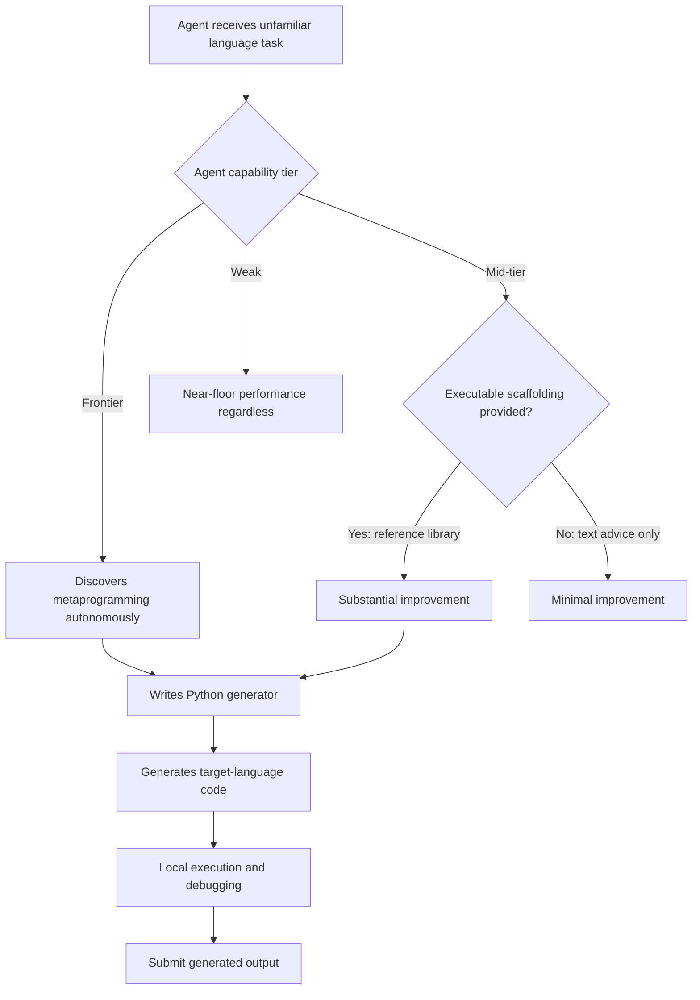
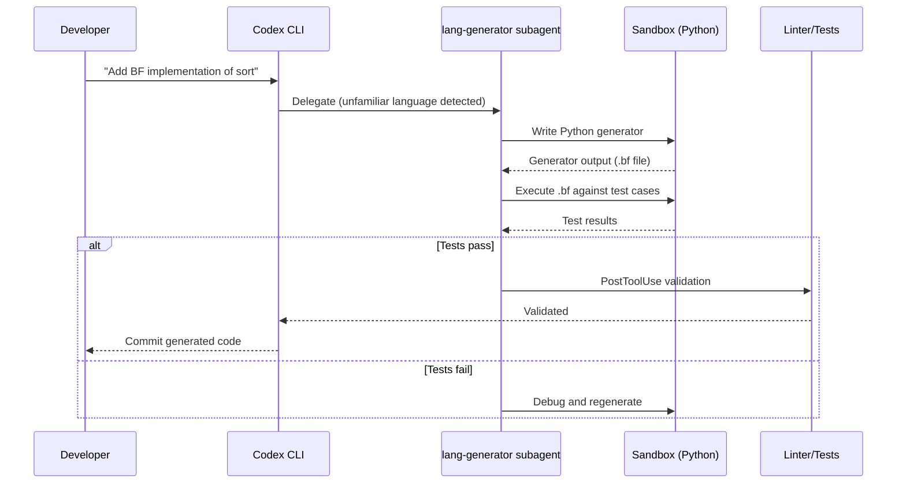

# Metaprogramming as Emergent Strategy: What EsoLang-Bench Reveals About Coding Agent Adaptation — and How to Configure Codex CLI Subagents for Language Scaffolding


---

## The Problem with Mainstream Benchmarks

SWE-Bench Verified, Terminal-Bench, LiveCodeBench — the industry's go-to coding agent benchmarks all share the same blind spot. They evaluate agents on familiar territory: mainstream languages, common libraries, public repositories saturated in training data. The performance spread across six frontier agents on SWE-Bench Verified is a mere 6.6 percentage points [^1]. That compressed band tells you very little about how an agent actually reasons when confronted with something genuinely novel.

Sharma, Thorat, and Chopra's EsoLang-Bench (arXiv:2606.10933, June 2026) blows that band wide open [^1]. By evaluating six contemporary coding agents on four esoteric programming languages — Brainfuck, Befunge-98, Whitespace, and Shakespeare — the benchmark produces a performance spread of 88.4 percentage points with a standard deviation of 36.0, roughly 12× that of SWE-Bench Verified [^1].

The finding that matters isn't the spread itself. It's _how_ the strongest agents achieve their scores.

## The Metaprogramming Discovery

When Claude Opus 4.6 and GPT-5.4 xhigh encounter an unfamiliar language, they don't try to master it. They route around it. Without any explicit prompting, both agents independently discover the same strategy: write a Python programme that generates the target-language source code, debug the generator locally, then submit the output [^1].

Consider the numbers on Brainfuck — the most hostile of the four languages, with its eight-character instruction set and raw memory tape semantics:

| Agent | Score (Brainfuck) | Score (Mean across 4 languages) |
|-------|------------------:|-------------------------------:|
| GPT-5.4 xhigh | 98.8% | 99.7% |
| Claude Opus 4.6 | 80.0% | 86.9% |
| Claude Sonnet 4.6 | 15.0% | 66.3% |
| GPT-5.4 mini | 6.3% | 32.5% |
| Claude Haiku 4.5 | 5.0% | 24.7% |
| Kimi K2.5 | 5.0% | 11.3% |

The performance cliff between the top two and the rest is striking. On problem E04, Opus 4.6 first attempted an 1,884-byte hand-written Brainfuck programme that failed all tests, then pivoted to a Python generator producing a 24,500-byte output that passed every test [^1]. The agent didn't learn Brainfuck — it learned to _avoid_ Brainfuck.

## Causality: Metaprogramming Is the Mechanism

The researchers confirmed this through an ablation study. When metaprogramming was blocked (forcing direct authoring), performance collapsed:

| Agent | Brainfuck (allowed) | Brainfuck (blocked) | Befunge-98 (allowed) | Befunge-98 (blocked) |
|-------|:------------------:|:------------------:|:-------------------:|:-------------------:|
| Opus 4.6 | 80/80 | 27/80 | 80/80 | 50/80 |
| GPT-5.4 xhigh | 79/80 | 29/80 | 80/80 | 63/80 |

Opus drops from 100% to 33.75% on Brainfuck when forced to write directly [^1]. The strategy isn't a nice-to-have; it's the primary capability mechanism on low-level targets.

Host language flexibility was also tested: Opus achieved 64/80 (Python), 63/80 (JavaScript), and 55/80 (Rust) as generator languages on Brainfuck [^1]. Python's marginal advantage confirms it's the familiarity of the host, not a language-specific trick, that drives the strategy.

## Strategy Transfer: Scaffolding Works, Advice Doesn't

Can weaker agents adopt the metaprogramming strategy? The researchers tested two approaches:

1. **Text-only guidance** — distilled instructions explaining the strategy. Result: minimal improvement across all agents [^1].
2. **Reference library** — working helper code (no solutions). Result: dramatic gains for mid-tier models [^1].

| Agent | Brainfuck (baseline) | Brainfuck (with library) | Befunge-98 (baseline) | Befunge-98 (with library) |
|-------|:-------------------:|:----------------------:|:--------------------:|:------------------------:|
| Claude Sonnet 4.6 | 12/80 | 64/80 | 64/80 | 78/80 |
| GPT-5.4 mini | 5/80 | 53/80 | 11/80 | 64/80 |
| Claude Haiku 4.5 | 4/80 | 7/80 | 4/80 | 4/80 |

The takeaway: executable scaffolds transfer capability; written advice does not. Haiku 4.5 lacked the base reasoning capacity to exploit even the library, remaining near floor [^1].



## Resource Amplification, Not Creation

The paper's interpreter-call budget experiment reveals another asymmetry. Increasing the number of local execution calls from 3 to unlimited improved Opus 4.6's scores substantially, while Haiku 4.5 remained near floor regardless of budget [^1]. Additional tool access amplifies useful strategies that already exist — it cannot create them in agents that lack the reasoning base.

This has direct implications for how you allocate compute. Giving more execution budget to a weak model is waste; giving it to a strong model with a viable strategy is multiplicative.

## Mapping to Codex CLI: Subagent Language Scaffolding

The EsoLang-Bench findings map cleanly onto Codex CLI's subagent architecture. When your codebase includes unfamiliar or domain-specific languages — whether that's COBOL migration, hardware description languages, or bespoke DSLs — you can configure Codex to exploit the same metaprogramming strategy the frontier agents discovered on their own.

### 1. Define a Generator Subagent

Create a TOML agent definition that routes unfamiliar-language tasks through a code generation strategy [^2][^3]:

```toml
# .codex/agents/lang-generator.toml
name = "lang-generator"
description = "Generates target-language code via Python metaprogramming for unfamiliar or low-level languages"

model = "o4-mini"
model_reasoning_effort = "high"
sandbox_mode = "workspace-write"

developer_instructions = """
When asked to write code in an unfamiliar, esoteric, or low-level language:
1. Write a Python generator programme that emits the target-language source
2. Execute the generator locally to produce the output
3. Test the generated output against any available test cases
4. Debug the generator (not the output) if tests fail
5. Never attempt to hand-write complex target-language code directly

Supported target languages: Brainfuck, COBOL, VHDL, Terraform HCL,
custom DSLs defined in the project AGENTS.md.
"""
```

### 2. AGENTS.md Language Routing Rules

In your project's `AGENTS.md`, declare which languages should trigger the generator strategy [^4]:

```markdown
## Language Scaffolding Policy

When modifying files with these extensions, delegate to `lang-generator`:
- `.bf`, `.b` — Brainfuck
- `.cob`, `.cbl` — COBOL
- `.vhd`, `.vhdl` — VHDL
- `.dsl` — Project-specific DSL (see /docs/dsl-spec.md)

For these languages, always use Python metaprogramming to generate code
rather than authoring directly. Test generated output before committing.
```

### 3. Executable Scaffolding via Skills

The strategy transfer data shows that reference libraries work where text instructions fail. Package your generator utilities as Codex CLI skills [^3]:

```toml
# .codex/agents/lang-generator.toml (extended)
[skills.config]
generator_templates = ".codex/skills/lang-generators/"
```

Place working generator templates — not documentation, not comments, but executable code — in the skills directory. The EsoLang-Bench data predicts this will lift mid-tier models from baseline to near-frontier on your target language.

### 4. Interpreter Budget Allocation

Control execution access through sandbox and approval configuration [^5]. For generator subagents, you want liberal interpreter access:

```toml
# config.toml
[agents]
max_threads = 6
max_depth = 1

[permissions]
# Generator agents need execution access to test their output
sandbox_mode = "workspace-write"
```

The research shows diminishing returns plateau around 15–30 interpreter calls for frontier models [^1]. For a generator workflow — write, execute, check, iterate — that budget is typically sufficient.

### 5. PostToolUse Validation

Add a hook that validates generated output before it enters the codebase [^6]:

```markdown
## PostToolUse Hooks (AGENTS.md)

After `lang-generator` produces output:
1. Run the project's language-specific linter/compiler on the generated file
2. Execute any associated test suite
3. Reject the output if either step fails — do not commit generated code
   that hasn't passed validation
```



## Implications for Model Selection

The EsoLang-Bench spread has a practical consequence for Codex CLI's `model` field in subagent definitions. If a task involves genuine novelty — a language or domain underrepresented in training data — routing it to a mid-tier model is not just suboptimal, it's near-zero. The 88.4pp spread means the difference between a frontier model and a budget model isn't incremental; it's categorical [^1].

Configure your agent definitions accordingly:

```toml
# High-reasoning model for novel language tasks
model = "o4-mini"
model_reasoning_effort = "high"

# Don't waste budget models on genuinely novel domains
# Reserve cost-efficient models for mainstream language tasks
```

## The Broader Pattern

EsoLang-Bench demonstrates something that mainstream benchmarks obscure: frontier coding agents don't solve novel problems by knowing more. They solve them by discovering higher-order strategies — in this case, metaprogramming — that let them route around their knowledge gaps. The strategy emerges without prompting in the strongest models, transfers via executable scaffolding to mid-tier models, and is amplified by tool access.

For Codex CLI teams, the practical lesson is architectural. Don't write better instructions for hard languages. Write better generators. Configure subagents that exploit the metaprogramming pattern. Provide executable scaffolding, not documentation. And allocate your interpreter budget where it multiplies a viable strategy rather than where it props up an absent one.

---

## Citations

[^1]: Sharma, A., Thorat, S., & Chopra, P. (2026). *Frontier Coding Agents Use Metaprogramming to Adapt to Unfamiliar Programming Languages*. arXiv:2606.10933. [https://arxiv.org/abs/2606.10933](https://arxiv.org/abs/2606.10933)

[^2]: OpenAI. (2026). *Subagents – Codex CLI Developer Documentation*. [https://developers.openai.com/codex/subagents](https://developers.openai.com/codex/subagents)

[^3]: OpenAI. (2026). *Custom instructions with AGENTS.md – Codex Developer Documentation*. [https://developers.openai.com/codex/guides/agents-md](https://developers.openai.com/codex/guides/agents-md)

[^4]: Vaughan, D. (2026). *Codex CLI Custom Agent Definitions: Building Specialised Subagents with TOML Configuration*. Codex Knowledge Base. [https://codex.danielvaughan.com/2026/04/27/codex-cli-custom-agent-definitions-toml-specialised-subagents/](https://codex.danielvaughan.com/2026/04/27/codex-cli-custom-agent-definitions-toml-specialised-subagents/)

[^5]: OpenAI. (2026). *Agent approvals & security – Codex Developer Documentation*. [https://developers.openai.com/codex/agent-approvals-security](https://developers.openai.com/codex/agent-approvals-security)

[^6]: OpenAI. (2026). *Config basics – Codex Developer Documentation*. [https://developers.openai.com/codex/config-basic](https://developers.openai.com/codex/config-basic)
