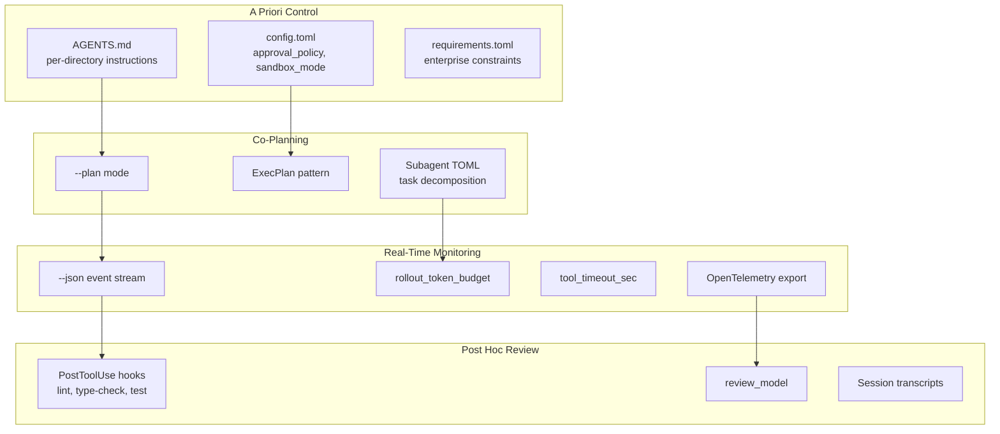

# Human Oversight of Coding Agents in Practice: What 17 Developers Reveal About Oversight Work — and How to Configure Codex CLI for Each Form


---

Most conversations about human oversight of coding agents stay conceptual: taxonomies of risk, normative frameworks, compliance checklists. What developers *actually do* when supervising an agent — the practical work, the shortcuts, the failure points — has received far less attention. A new qualitative study by Dhanorkar, Passi, and Vorvoreanu changes that, documenting four distinct forms of emergent oversight work drawn from interviews with 17 experienced developers who use coding agents daily [^1]. The findings map remarkably well to Codex CLI's configuration surface, and the gaps they expose point to concrete improvements every team can make today.

## The Study at a Glance

The researchers conducted semi-structured interviews (averaging 60 minutes each) with 17 professional developers between July and August 2025 [^1]. Thirteen had seven or more years of experience; twelve used coding agents daily for professional work [^1]. Analysis followed a three-round inductive coding process — open, axial, then selective — producing a taxonomy of oversight activities, challenges, and coping heuristics.

The central finding upends the assumption that oversight is primarily reactive. The study identifies four forms of oversight work, two of which occur *before* an agent writes a single line of code [^1]:


## Form 1: A Priori Control — Configuration as Governance

A priori control covers everything you set *before* the agent runs: autonomy levels, deny lists, custom instructions, and global context about the project [^1]. Participants described their instruction files as "the most important asset" requiring "constant maintaining, improving, and iterating" [^1].

The study surfaces a sharp tension. Developers want granular control but report that agents are often black-boxed — they "don't think [they] have" much actual control over agent operation [^1]. Many rely on ad hoc prompts rather than persistent configuration, reducing effectiveness.

### Codex CLI configuration for a priori control

Codex CLI's layered configuration system directly addresses this form. The hierarchy runs from managed enterprise requirements down to per-invocation overrides [^2] [^3]:

```toml
# ~/.codex/config.toml — persistent a priori control

# Approval policy: require human approval for state-mutating actions
approval_policy = "on-request"

# Sandbox mode: constrain filesystem and network access
sandbox_mode = "workspace-write"

# Granular approval settings
[approval_policy.granular]
sandbox_approval = true
mcp_elicitations = true
skill_approval = true

# Deny network access by default; allow specific domains
[sandbox_workspace_write]
network_access = true

[features.network_proxy]
enabled = true

[features.network_proxy.domains]
"api.github.com" = "allow"
"registry.npmjs.org" = "allow"
"*" = "deny"
```

Per-directory `AGENTS.md` files provide the persistent custom instructions the study's participants described as their most important asset. OpenAI reportedly uses 88 `AGENTS.md` files across their internal monorepo [^4], giving per-package instructions rather than relying on session prompts that evaporate between runs.

For enterprise teams, `requirements.toml` enforces constraints that individual developers cannot weaken — preventing anyone from setting `sandbox_mode = "danger-full-access"` or `approval_policy = "never"` [^5]:

```toml
# /etc/codex/requirements.toml — admin-enforced constraints
allowed_approval_policies = ["on-request", "untrusted"]
allowed_sandbox_modes = ["read-only", "workspace-write"]
```

## Form 2: Co-Planning — Shared Goal-Setting Before Execution

Co-planning involves iterative goal-setting between developer and agent before code generation begins [^1]. Developers invest upfront effort to "minimise review and repair downstream" [^1]. The key practice is task decomposition — breaking work into chunks with "minimal side effects and independent testability" [^1].

The study identifies a fundamental dilemma: under-specification causes agent misinterpretation, but over-specification negates the benefit of using an agent at all [^1]. Constructing prompts that read like a coherent "story" with logical flow is "not an easy task" [^1].

### Codex CLI configuration for co-planning

Codex CLI's plan mode (`codex --plan`) forces the agent to produce a structured plan before executing [^6]. The ExecPlan pattern extends this further — the agent writes a `plans/` markdown file, you review it, then a second invocation executes against the approved plan:

```bash
# Step 1: Generate the plan
codex exec "Analyse the authentication module and produce a refactoring \
  plan in plans/auth-refactor.md. Do not write any code."

# Step 2: Review the plan (human oversight checkpoint)
# Step 3: Execute against the approved plan
codex exec "Execute the plan in plans/auth-refactor.md"
```

Subagent decomposition via TOML definitions maps directly to the study's finding about task decomposition reducing review burden [^7]:

```toml
# .codex/subagents/auth-tests.toml
model = "o4-mini"
prompt = "Write unit tests for the authentication module. Do not modify source files."
sandbox_mode = "read-only"
```

Each subagent operates in a constrained scope — limited to specific directories, models, and sandbox permissions — making its output independently testable.

## Form 3: Real-Time Monitoring — The Oversight That Mostly Does Not Happen

The study's most sobering finding concerns real-time monitoring. Most participants "never proactively" examined agent reasoning, only "eyeballing" logs perfunctorily [^1]. They relied on ad hoc cues — long execution times, excessive turns — rather than vigilant monitoring [^1]. When agents exhibited poor confidence calibration (being "10% wrong but very confident" [^1]), developers had no reliable way to detect it.

Worse, redirecting agents mid-execution often failed. Participants reported that "you have to stop it and restart" rather than course-correct [^1]. Context drift was common — agents "start doing random things" during extended execution [^1].

### Codex CLI configuration for real-time monitoring

The JSONL event stream (`codex exec --json`) provides structured machine-readable monitoring that goes beyond eyeballing [^8]:

```bash
# Stream events and filter for tool calls exceeding timeout
codex exec --json "Refactor the payment module" 2>/dev/null | \
  jq -r 'select(.type == "turn.completed") |
    "Turn \(.turn_id): \(.duration_ms)ms, \(.tool_calls) tool calls"'
```

Token budget governance (v0.142.0) directly addresses context drift by capping how long an agent can run before requiring human re-engagement [^9]:

```toml
# Cap rollout token budgets to prevent unbounded execution
[features]
rollout_token_budget = 50000
```

The `tool_timeout_sec` setting prevents individual tool calls from hanging indefinitely — one of the ad hoc cues developers reported watching for [^3]:

```toml
# Timeout individual tool calls after 120 seconds
tool_timeout_sec = 120
```

OpenTelemetry integration exports traces and metrics to external dashboards, enabling team-level monitoring rather than individual screen-watching [^10]:

```toml
[otel]
exporter = "otlp-http"
environment = "production"
log_user_prompt = false
```

## Form 4: Post Hoc Review — Where the Real Work Lives

Post hoc review consumes the most oversight effort. The study documents substantial friction from what the authors call *cognitive distance* — reviewing code you did not write requires fundamentally different mental processing [^1]. It is "much faster to read your own handwriting" [^1]. Compounding the problem, each agent iteration necessitates full re-review because agents make changes across multiple locations [^1].

### Codex CLI configuration for post hoc review

PostToolUse hooks automate the mechanical portion of review — running linters, type-checkers, and test suites after every tool call [^11]:

```toml
# Automated quality gates after each tool call
[[hooks.PostToolUse]]
command = "npx eslint --max-warnings 0 ."
on_failure = "stop"

[[hooks.PostToolUse]]
command = "npx tsc --noEmit"
on_failure = "stop"

[[hooks.PostToolUse]]
command = "npm test -- --bail"
on_failure = "stop"
```

The `review_model` setting routes review to a separate model for independent verification, implementing the "LLM-as-judge" pattern several study participants described [^3]:

```toml
review_model = "o4-mini"
```

Session transcripts (`codex exec --json > transcript.jsonl`) create permanent audit trails, addressing the re-review burden by preserving the full reasoning chain for each iteration [^8].

## The Four Heuristics — and Where They Break

The study identifies four practical heuristics developers use as oversight shortcuts [^1]. Each trades thoroughness for cognitive feasibility:

| Heuristic | Assumption | Codex CLI Mitigation |
|-----------|-----------|---------------------|
| **Plans as proxies** | Plan quality equals output quality | ExecPlan pattern with PostToolUse hooks verifying implementation matches plan |
| **Test results guarantee correctness** | Passing tests confirm code is correct | PostToolUse test hooks plus `review_model` for coverage gap detection |
| **Eyeballing signals issues** | Spot-checking suffices | JSONL event stream with `jq` filtering replaces manual eyeballing |
| **Trust in unfamiliar contexts** | Reasonable to trust agents in domains you lack expertise | Named profiles with stricter `approval_policy` for unfamiliar codebases |

The "test results guarantee correctness" heuristic is the most widely adopted and the most dangerous. One developer proposed treating the source folder as "a complete black box" if tests pass [^1]. This works only when test suites are comprehensive — and the study itself notes participants acknowledged this condition is rarely met [^1].

The mitigation is defence-in-depth: test hooks *plus* linter hooks *plus* type-checker hooks *plus* human review of the diff. No single gate suffices.

## Mapping the Study to a Codex CLI Oversight Configuration

Combining all four forms into a single configuration yields a layered oversight posture:



## The Shift from Craftsman to Manager

The study's deepest implication extends beyond configuration. Software development is shifting from what the authors call the "craftsman model" — hands-on coding — toward a "developer-manager model" where oversight is the primary skill [^1]. This parallels the broader adoption data: OpenAI's own study reports that 99.8% of internal output tokens now come through Codex, with non-developer usage growing 137-fold since August 2025 [^12].

The practical consequence for teams: oversight skills are not innate. They must be developed deliberately, supported by tooling that makes each oversight form easier, and reinforced by configuration that makes the right thing the default. The four-form taxonomy gives teams a vocabulary for discussing where their oversight is strong, where it is weak, and where Codex CLI's configuration surface can close the gap.

## Citations

[^1]: Dhanorkar, S., Passi, S. & Vorvoreanu, M. (2026). "Human oversight of agentic systems in practice: Examining the oversight work, challenges, and heuristics of developers using software agents." arXiv:2606.05391. [https://arxiv.org/abs/2606.05391](https://arxiv.org/abs/2606.05391)

[^2]: OpenAI. (2026). "Configuration Reference – Codex CLI." OpenAI Developers. [https://developers.openai.com/codex/config-reference](https://developers.openai.com/codex/config-reference)

[^3]: OpenAI. (2026). "Advanced Configuration – Codex CLI." OpenAI Developers. [https://developers.openai.com/codex/config-advanced](https://developers.openai.com/codex/config-advanced)

[^4]: CodeGateway. (2026). "AGENTS.md for Codex CLI (2026): Lookup Order, Limits & Monorepo Templates." [https://www.codegateway.dev/en/blog/agents-md-playbook-2026](https://www.codegateway.dev/en/blog/agents-md-playbook-2026)

[^5]: OpenAI. (2026). "Managed configuration – Codex." OpenAI Developers. [https://developers.openai.com/codex/enterprise/managed-configuration](https://developers.openai.com/codex/enterprise/managed-configuration)

[^6]: OpenAI. (2026). "Features – Codex CLI." OpenAI Developers. [https://developers.openai.com/codex/cli/features](https://developers.openai.com/codex/cli/features)

[^7]: OpenAI. (2026). "Custom instructions with AGENTS.md – Codex." OpenAI Developers. [https://developers.openai.com/codex/guides/agents-md](https://developers.openai.com/codex/guides/agents-md)

[^8]: OpenAI. (2026). "Non-interactive mode – Codex CLI." OpenAI Developers. [https://developers.openai.com/codex/noninteractive](https://developers.openai.com/codex/noninteractive)

[^9]: OpenAI. (2026). "Changelog – Codex." OpenAI Developers. [https://developers.openai.com/codex/changelog](https://developers.openai.com/codex/changelog)

[^10]: OpenAI. (2026). "Agent approvals & security – Codex." OpenAI Developers. [https://developers.openai.com/codex/agent-approvals-security](https://developers.openai.com/codex/agent-approvals-security)

[^11]: OpenAI. (2026). "Config basics – Codex CLI." OpenAI Developers. [https://developers.openai.com/codex/config-basic](https://developers.openai.com/codex/config-basic)

[^12]: Johnston, D. & Holtz, D. (2026). "The Shift to Agentic AI: Evidence from Codex." arXiv:2606.26959. [https://arxiv.org/abs/2606.26959](https://arxiv.org/abs/2606.26959)
