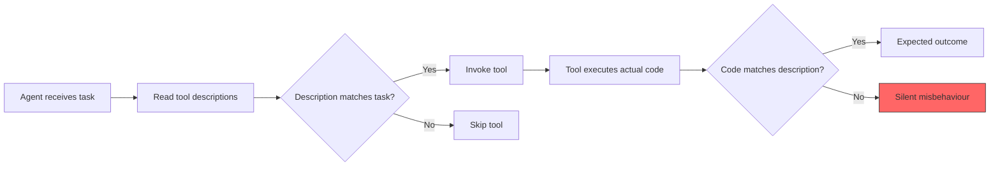
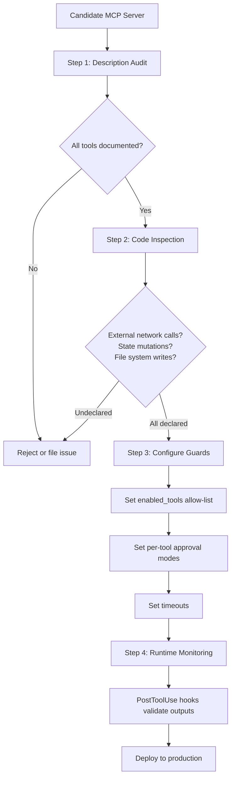

# MCP Description-Code Inconsistency and the Tool Trust Gap: What Two Studies of 12,000+ MCP Servers Reveal — and How to Defend Codex CLI Pipelines


---

When Codex CLI invokes an MCP tool, it reads the tool's natural-language description, decides whether that tool matches the current task, and calls it. The entire decision rests on one assumption: that the description accurately reflects what the code actually does. Two independent studies published in 2026 demonstrate that this assumption fails at scale — roughly one in ten MCP tools says one thing and does another.

## The Problem: Descriptions Lie

Shi et al. analysed 19,200 description-code pairs from 2,214 real-world MCP servers and found that **9.93% of tools exhibit description-code inconsistency (DCI)**[^1]. At the server level, **35% of servers contain at least one inconsistent tool**[^1]. The problem is concentrated: a mere 8.27% of servers contribute 60.30% of all problematic tools [^1].

Li et al. independently examined 10,240 MCP servers across 36 categories and found that **approximately 13% exhibit substantial mismatches** enabling undocumented privileged operations, hidden state mutations, or unauthorised financial actions [^2].

These are not theoretical concerns. Li et al. document specific cases: `longport-mcp`, a financial platform, omits `submit_order` and `cancel_order` from its tool descriptions, allowing real trading actions without explicit user awareness [^2]. `zerops-mcp` hides an `updateUser` function capable of modifying user information [^2]. `mcpx-py` contains an undocumented `killtree` function that can forcibly terminate process trees [^2].

## A Taxonomy of Inconsistency

Shi et al. classify DCI into two primary categories with seven subtypes [^1]:

### Type I: Mismatched Functionality (75.2% of cases)

| Subtype | Share | Description |
|---------|-------|-------------|
| **Func-Over** (Overclaimed) | 35.4% | Description promises capabilities the code does not deliver |
| **Func-Mis** (Misclaimed) | 14.64% | Described and implemented functions differ semantically |
| **Func-Un** (Undeclared) | 9.15% | Implementation provides hidden features beyond the description |
| **Func-Am** (Ambiguous) | 3.34% | Description too vague to define functional scope |

### Type II: Undeclared Side Effects (24.8% of cases)

| Subtype | Share | Description |
|---------|-------|-------------|
| **Eff-RO** (Resource Overconsumption) | 22.83% | Substantial resource usage not disclosed |
| **Eff-DL** (Data Leakage) | 13.6% | Sensitive data transmission to external sinks unmentioned |
| **Eff-SM** (State Mutation) | 1.03% | Persistent system-state changes omitted |

The most dangerous subtypes are **Func-Un** and **Eff-DL**. A tool described as performing "local PDF-to-Markdown conversion" that silently uploads files to an external service falls into both categories [^1].

## Why Agents Are Uniquely Vulnerable

Traditional software supply-chain attacks require developers to read code or audit dependencies. MCP description-code inconsistency exploits a different surface: the agent's tool-selection process itself. The agent never reads the implementation. It reads the description, matches it against the current task, and invokes the tool.



Li et al. find significant variation across MCP marketplaces [^2]:

- **Smithery**: 56.6% full match rate (highest reliability)
- **MCP World**: 48.8% full match, but lowest severe mismatch rate (3.0%)
- **MCPMarket**: 50.4% full match, highest inconsistency risk (4.3% rare match)

This means the marketplace you source MCP servers from materially affects your risk profile.

## Detection at Scale: DCIChecker

Shi et al. built DCIChecker, a two-stage detection pipeline [^1]:

**Stage 1 — Structure-Aware Extraction** parses tool descriptions and constructs "code bundles" containing the entry function, helper code within depth k=3 of the call graph, and sensitive API calls.

**Stage 2 — Direct-Reverse-Arbitration (DRA) Prompting** runs two complementary LLM judgements: one comparing description-to-code, one comparing code-to-description. Where the two disagree, a neutral arbitration prompt resolves the conflict.

DCIChecker achieves **96.00% precision**, **97.46% recall**, and a **96.73% F1 score** on validated real-world samples [^1]. Li et al.'s MCPDiff framework takes a complementary approach, using Tree-Sitter parsing to construct directed call graphs before running semantic analysis against tool descriptions [^2].

## Defending Codex CLI: A Practical Configuration Guide

Codex CLI's MCP configuration provides three layers of defence against description-code inconsistency. None is sufficient alone; the combination creates meaningful protection.

### Layer 1: Tool Allow-Lists and Deny-Lists

The bluntest but most effective control. If you have audited which tools a server actually needs to expose, lock the list down:

```toml
[mcp_servers.finance_tools]
command = "npx"
args = ["-y", "@longport/mcp-server"]
# Only expose tools you have personally verified
enabled_tools = ["get_quote", "get_portfolio", "list_positions"]
# Explicitly block undocumented dangerous tools
disabled_tools = ["submit_order", "cancel_order", "killtree"]
```

The `enabled_tools` allow-list runs first; `disabled_tools` is applied after it [^3]. For servers with Func-Un inconsistencies (hidden features), the allow-list is the primary defence — tools not on the list cannot be invoked regardless of what the implementation exposes.

### Layer 2: Per-Tool Approval Modes

For tools that must remain available but carry risk, escalate their approval mode:

```toml
[mcp_servers.code_tools]
command = "npx"
args = ["-y", "@example/code-mcp"]
default_tools_approval_mode = "auto"

# State-mutating tools require explicit approval
[mcp_servers.code_tools.tools.write_file]
approval_mode = "approve"

[mcp_servers.code_tools.tools.execute_command]
approval_mode = "approve"

# Read-only tools can run automatically
[mcp_servers.code_tools.tools.read_file]
approval_mode = "auto"
```

The three approval modes map directly to the DCI risk taxonomy [^3]:

| Approval Mode | When to Use | DCI Risk Addressed |
|---------------|------------|-------------------|
| `auto` | Verified read-only tools with no side effects | Low-risk, fully audited tools |
| `prompt` | Tools with potential Eff-RO (resource) or Eff-SM (state) side effects | Undeclared side effects |
| `approve` | State-mutating, financial, or network-accessing tools | Func-Un, Eff-DL, Eff-SM |

### Layer 3: Timeout and Startup Guards

Eff-RO (resource overconsumption) inconsistencies — where a tool consumes far more resources than its description implies — can be bounded with timeouts:

```toml
[mcp_servers.document_tools]
command = "npx"
args = ["-y", "@example/doc-converter"]
# A "local conversion" tool should complete in seconds
tool_timeout_sec = 15
startup_timeout_sec = 5
```

If the allegedly-local PDF converter is actually uploading to an external service, it will likely exceed a 15-second timeout on large files [^3].

### Combining All Three Layers

A defence-in-depth configuration for a production Codex CLI setup:

```toml
[mcp_servers.verified_tools]
command = "npx"
args = ["-y", "@trusted/mcp-server"]
enabled_tools = ["search", "read", "summarise"]
disabled_tools = []
default_tools_approval_mode = "prompt"
tool_timeout_sec = 30
startup_timeout_sec = 10

[mcp_servers.verified_tools.tools.search]
approval_mode = "auto"

[mcp_servers.verified_tools.tools.read]
approval_mode = "auto"

[mcp_servers.verified_tools.tools.summarise]
approval_mode = "prompt"
```

## Building a Pre-Deployment Audit Pipeline

The research suggests a four-step vetting process before adding any MCP server to your Codex CLI configuration:



**Step 1 — Description Audit**: Check whether every tool has a description. Shi et al. found 11.30% of tools lack descriptions entirely [^1]. A missing description is a disqualifying signal.

**Step 2 — Code Inspection**: For servers you control or can inspect, verify that no undeclared network calls, file-system writes, or state mutations exist. For closed-source servers, treat every tool as potentially inconsistent.

**Step 3 — Configure Guards**: Apply the three-layer configuration above. Start with `approve` for all tools and relax to `auto` only after verification.

**Step 4 — Runtime Monitoring**: Use Codex CLI's PostToolUse hooks to validate tool outputs against expected patterns. A tool claiming to perform local conversion should not return URLs from external domains.

## The Marketplace Governance Gap

Both studies identify a systemic governance problem. Li et al. demonstrate that marketplace choice materially affects risk, with Smithery showing 56.6% full match rates versus MCPMarket's weaker 50.4% [^2]. Shi et al. recommend that registries "require verification evidence for publication, display consistency labels, enforce review gates, [and] promote structured metadata standards"[^1].

Until marketplace governance catches up, the burden falls on individual teams. Codex CLI's configuration primitives — allow-lists, per-tool approval escalation, and timeouts — provide the mechanical controls. The judgement about which tools to trust remains yours.

## What This Means for Codex CLI Teams

The 177,000-tool MCP ecosystem is growing faster than anyone can audit [^4]. The research quantifies what practitioners have suspected: a meaningful fraction of the tools your agent might invoke do not behave as described. Shi et al.'s finding that 35% of servers contain at least one inconsistent tool [^1] means that if you connect Codex CLI to three MCP servers without vetting, you have a better-than-even chance of exposing your agent to description-code inconsistency.

The defence is not to avoid MCP — the productivity gains are real. The defence is to treat MCP tool descriptions with the same scepticism you apply to third-party library documentation: verify before you trust, constrain what you cannot verify, and monitor what you deploy.

## Citations

[^1]: Shi, Y., Zhang, X., Zhang, X., Shen, X., Ouyang, H., Qiu, H., Zhang, M. & Yang, M. (2026). "Description-Code Inconsistency in Real-world MCP Servers: Measurement, Detection, and Security Implications." arXiv:2606.04769. [https://arxiv.org/abs/2606.04769](https://arxiv.org/abs/2606.04769)

[^2]: Li, Z., Ma, B., Dai, X., Xu, M., Zhang, Y., Yan, B. & Li, K. (2026). "Don't believe everything you read: Understanding and Measuring MCP Behavior under Misleading Tool Descriptions." arXiv:2602.03580. [https://arxiv.org/abs/2602.03580](https://arxiv.org/abs/2602.03580)

[^3]: OpenAI. (2026). "Configuration Reference — Codex CLI." OpenAI Developers. [https://developers.openai.com/codex/config-reference](https://developers.openai.com/codex/config-reference)

[^4]: Stein, C. (2026). "MCP Tool Census: 177,436 Tools Across 19,388 Servers." arXiv:2603.23802. [https://arxiv.org/abs/2603.23802](https://arxiv.org/abs/2603.23802)
