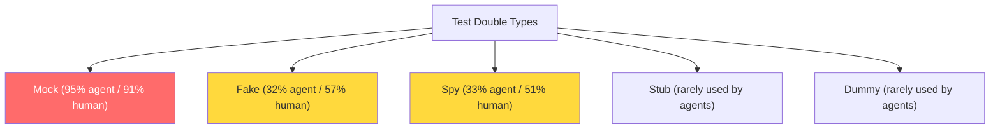
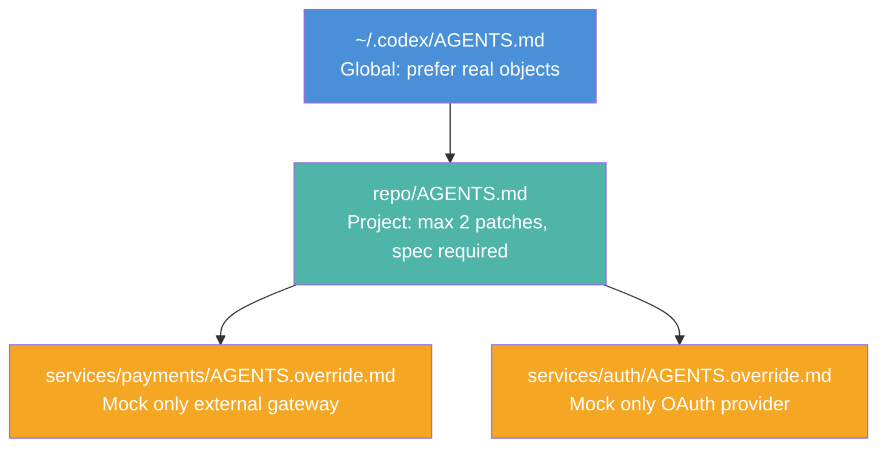

# Over-Mocked Tests and Coding Agents: What 1.2 Million Commits Reveal — and How to Configure Codex CLI's AGENTS.md for Test Quality


---

Coding agents write more tests than humans. They also mock more aggressively — and with far less variety. A February 2026 empirical study by Hora and Robbes analysed 1.2 million commits across 2,168 repositories and found that agent-generated test commits include mocks at a rate ten percentage points higher than human-written ones [^1]. The finding matters because excessive mocking produces tests that verify wiring rather than behaviour, creating a false sense of coverage that crumbles under refactoring.

This article examines the over-mocking problem, maps the empirical evidence to Codex CLI's configuration surface, and provides concrete `AGENTS.md` patterns that bring agent-generated tests back under control.

## The Scale of the Problem

Hora and Robbes examined 48,563 agent commits alongside over 1.15 million human commits across TypeScript, JavaScript, and Python repositories on GitHub [^1]. Three research questions drove the analysis: how often agents modify tests, how often those test commits introduce mocks, and what types of test doubles agents actually use.

### Agents Test More — and Mock More

| Metric | Agent commits | Human commits |
|--------|--------------|---------------|
| Test modification rate | 23% | 13% |
| Mock addition rate (of test commits) | 36% | 26% |
| Dominant mock type usage | 95% | 91% |

Agent commits are nearly twice as likely to touch test files [^1]. When they do, over a third introduce mocks — compared with roughly a quarter for human developers. The gap widens further in repositories with high agent activity: in repos with 50 or more agent commits, mock rates reach 36% for agents versus 28% for humans [^1].

### Language Breakdown

Python repositories show slightly higher mock rates (37%) than JavaScript and TypeScript (35%) [^1]. The per-agent breakdown reveals further variation: GitHub Copilot test commits include mocks 27% of the time, Claude Code at 24%, and Cursor at 16% [^1].

### Mock Type Monotony

Perhaps the most telling signal is the lack of test double diversity. Human developers reach for fakes (57%), spies (51%), stubs, and dummies alongside mocks [^1]. Agents overwhelmingly default to `mock` — 95% of agent test double usage is the mock type, with fakes at 32% and spies at 33% [^1]. This concentration suggests agents treat mocking as a blunt instrument for isolating dependencies rather than selecting the appropriate test double for the situation.



## Why Over-Mocking Is Dangerous

The practical cost of over-mocked tests compounds across three dimensions:

1. **False confidence.** A test that mocks every collaborator verifies only that the unit under test calls the expected methods with the expected arguments. It says nothing about whether the integrated system actually works. When interfaces change, mocked tests continue passing while real integration breaks.

2. **Maintenance drag.** Every mock carries an implicit contract. Rename a method, change a return type, or add a parameter, and every mock that references it must be updated — even if the behaviour is unchanged. In agent-heavy repositories, this maintenance surface grows quickly.

3. **Specification drift.** Agents tend to mock based on the current implementation rather than the intended interface. The mock becomes a snapshot of today's code shape, not a specification of the contract. Future refactoring triggers cascading mock failures that teach developers to distrust the test suite.

## What the Configuration File Landscape Looks Like Today

Hora and Robbes conducted a GitHub code search in October 2025 to gauge how many projects include mock-related guidance in their agent configuration files [^1]:

| Configuration file | Total files | Files mentioning mocks |
|-------------------|-------------|----------------------|
| CLAUDE.md | 112,000 | 13,000 (12%) |
| copilot-instructions.md | 44,000 | 7,000 (16%) |
| CURSOR.md | 4,800 | 200 (4%) |

The numbers are low. Most projects that use coding agents provide no explicit guidance on mocking practices. The study highlights the `browser-use/browser-use` repository as a positive example: its instructions state "Never mock anything in tests, always use real objects!!" — and agent mock commits in that repository dropped to just five [^1].

## Configuring Codex CLI to Control Mocking

Codex CLI's hierarchical instruction system provides three layers where mocking guidance can be applied: global `AGENTS.md`, project-root `AGENTS.md`, and per-directory overrides [^2]. The key is specificity — vague instructions like "write good tests" have no effect; concrete rules with examples produce measurably different output.

### Layer 1: Global Baseline (~/.codex/AGENTS.md)

Set organisation-wide defaults that apply to every repository:

```markdown
## Testing Standards

- Prefer real objects over mocks. Only mock external services (HTTP APIs,
  databases, message queues) and non-deterministic dependencies (clocks,
  random generators).
- Never mock the class under test.
- Use fakes for in-memory replacements of data stores.
- Use spies when you need to verify a call was made but still want real
  behaviour.
- Use stubs only for deterministic return values from leaf dependencies.
- Every test file must include at least one integration test that exercises
  the real dependency chain.
```

### Layer 2: Project Root (AGENTS.md)

Add project-specific constraints that reflect the actual test tooling:

```markdown
## Test Configuration

- Run tests with `just test` before completing any task.
- Test framework: pytest (Python), vitest (TypeScript).
- Mock library: unittest.mock (Python), vi.mock (TypeScript).
- Maximum mock depth: 1 level. Never mock a dependency of a dependency.
- For database tests, use the test fixtures in `tests/fixtures/` — do NOT
  mock the ORM layer.
- For HTTP client tests, use `responses` (Python) or `msw` (TypeScript)
  to intercept at the network layer, not by mocking the client class.

## Forbidden Patterns

- `@patch` on more than 2 targets in a single test function.
- `MagicMock()` without a spec — always use `spec=ClassName`.
- Mocking standard library modules (os, sys, pathlib).
```

### Layer 3: Per-Directory Overrides

For directories where mocking rules differ from the project default, use `AGENTS.override.md`:

```markdown
# services/payments/AGENTS.override.md

## Testing — Payments Service

- External payment gateway calls MUST be mocked using the
  `tests/payments/gateway_fake.py` fake implementation.
- All other dependencies (database, cache, queue) must use real
  test instances via docker-compose.
- Never stub the payment state machine — test transitions with
  real objects.
```



## Enforcing Mock Limits with PostToolUse Hooks

AGENTS.md instructions are advisory — the agent may still over-mock if the path of least resistance leads there. For harder enforcement, Codex CLI's `PostToolUse` hooks can validate test files after they are written [^3].

Add a hook script that counts mock usage in changed test files:

```bash
#!/usr/bin/env bash
# .codex/hooks/check-mock-density.sh
# Runs after Codex writes or modifies a test file

FILE="$1"
if [[ "$FILE" != *test* && "$FILE" != *spec* ]]; then
  exit 0
fi

MOCK_COUNT=$(grep -cE '(mock|Mock|patch|MagicMock|vi\.mock|jest\.mock)' "$FILE" 2>/dev/null || echo 0)
TEST_COUNT=$(grep -cE '(def test_|it\(|test\(|describe\()' "$FILE" 2>/dev/null || echo 0)

if [ "$TEST_COUNT" -gt 0 ]; then
  RATIO=$((MOCK_COUNT * 100 / TEST_COUNT))
  if [ "$RATIO" -gt 200 ]; then
    echo "WARNING: Mock-to-test ratio is ${RATIO}% in $FILE (threshold: 200%)"
    echo "Consider using real objects, fakes, or integration tests instead."
    exit 1
  fi
fi
```

Reference it in `config.toml`:

```toml
[hooks]
post_tool_use = [".codex/hooks/check-mock-density.sh"]
```

This creates a feedback loop: Codex writes a test, the hook measures mock density, and if the ratio exceeds the threshold, the agent receives the warning and adjusts its approach.

## The Codex exec Audit Pipeline

For existing codebases already carrying agent-generated mock debt, run a batch audit using `codex exec`:

```bash
codex exec "Audit all test files in src/tests/. For each file, count the
number of mock/patch/MagicMock calls versus the number of test functions.
Flag any file where the mock-to-test ratio exceeds 3:1. For each flagged
file, suggest specific refactorings: replace mocks with fakes where an
in-memory implementation exists, replace spied method calls with assertion
on return values, and remove mocks on standard library functions. Output
a markdown report to mock-audit-report.md." --output json
```

This one-shot audit produces a prioritised list of files to refactor, starting with the worst offenders.

## A Practical Testing Instruction Template

Drawing together the research findings and Codex CLI's configuration surface, here is a complete `AGENTS.md` testing section suitable for most Python or TypeScript projects:

```markdown
## Testing Philosophy

Tests exist to catch regressions, not to document implementation details.

### Test Double Selection Guide

| Situation | Use | Do NOT use |
|-----------|-----|------------|
| External HTTP API | Network-level interceptor (responses/msw) | Mocking the client class |
| Database | Test database with fixtures | Mocking the ORM |
| File system | tmp_path fixture / memfs | Mocking os/pathlib |
| Time-dependent logic | Freezegun / vi.useFakeTimers | Mocking datetime directly |
| Third-party SDK | Provided fake/sandbox | MagicMock without spec |
| Internal collaborator | Real object | Mock (unless side-effect heavy) |

### Hard Rules

1. Maximum 2 `@patch` decorators per test function.
2. Every `Mock()` or `MagicMock()` MUST use `spec=` or `autospec=True`.
3. No mocking of standard library modules.
4. Every module with >80% mock coverage must also have an integration test
   using real dependencies.
5. Prefer `pytest.raises` with real objects over mock-based exception tests.
```

## Measuring Progress

Track mock density over time using a simple metric: the ratio of mock-related imports and calls to total test assertions per module. A healthy codebase typically shows a ratio below 1.5:1 [^1]. Agent-heavy repositories frequently exceed 3:1 before explicit guidance is added.

Run the measurement as part of CI:

```bash
# Count mock usage across all test files
find . -name "*test*" -name "*.py" -exec grep -l "mock\|Mock\|patch" {} \; | wc -l
# Compare against total test files
find . -name "*test*" -name "*.py" | wc -l
```

The goal is not zero mocks — some dependencies genuinely require isolation. The goal is deliberate mocking, where every test double is chosen for a reason and specified against a concrete interface.

## Conclusion

The empirical evidence is clear: coding agents over-mock by default, concentrate on a single test double type, and produce tests that are more brittle and less meaningful than human-written equivalents. The fix is equally clear — explicit, specific testing instructions in `AGENTS.md` files, enforced through hooks and audited through `codex exec` pipelines. The browser-use repository demonstrated that a single line of instruction ("Never mock anything in tests, always use real objects!!") was enough to reduce agent mock commits to near zero [^1]. More nuanced guidance produces more nuanced tests.

The configuration surface exists. The research tells us what to put in it.

## Citations

[^1]: Hora, A. & Robbes, R. (2026). "Are Coding Agents Generating Over-Mocked Tests? An Empirical Study." arXiv:2602.00409. https://arxiv.org/abs/2602.00409

[^2]: OpenAI. (2026). "Custom instructions with AGENTS.md." Codex CLI Documentation. https://developers.openai.com/codex/guides/agents-md

[^3]: OpenAI. (2026). "Configuration Reference." Codex CLI Documentation. https://developers.openai.com/codex/config-reference

[^4]: OpenAI. (2026). "Command line options — Codex CLI." Codex CLI Documentation. https://developers.openai.com/codex/cli/reference

[^5]: Meszaros, G. (2007). *xUnit Test Patterns: Refactoring Test Code.* Addison-Wesley. — Canonical taxonomy of test doubles (dummy, fake, stub, spy, mock).
