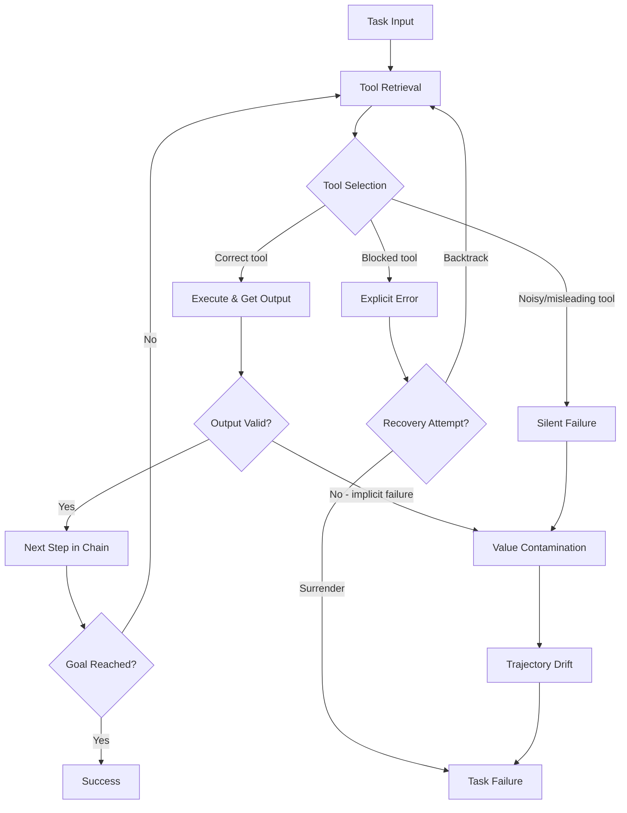
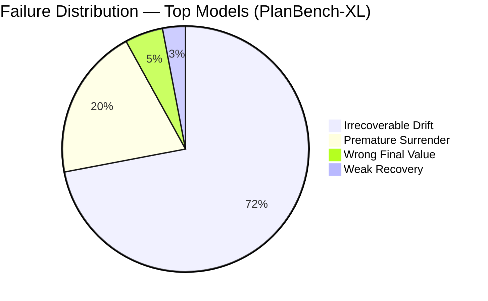

# PlanBench-XL and the Massive-Tool Planning Problem: Why Your Agent Retrieves the Right Tool but Picks the Wrong One — and How to Configure Codex CLI's MCP Pipeline


---

The conventional wisdom is that coding agents fail because they cannot find the right tool. PlanBench-XL, published by Liu et al. on 21 June 2026, demolishes that assumption [^1]. Across 327 retail tasks spanning 1,665 tools, the benchmark demonstrates that in 78% of default-setting failures the agent had already retrieved at least one tool capable of advancing the solution — and chose not to use it [^1]. The problem is not discovery. It is selection, sequencing, and recovery.

For Codex CLI users operating in MCP ecosystems that routinely expose hundreds of tools across multiple servers, PlanBench-XL's findings translate directly into configuration decisions. This article examines the benchmark's architecture, dissects its failure taxonomy, and maps every major finding to a concrete Codex CLI defence.

## The Benchmark: 1,665 Tools, Three Failure Modes

PlanBench-XL constructs its tool library from 56 domain-specific datatypes paired into input/output sets [^1]. Each tool accepts a typed input and returns a typed output, creating dependency chains where one tool's output feeds the next. Ground-truth solution paths range from five to eight or more sequential tool calls.

The benchmark's distinctive contribution is its **blocking mechanism**, which simulates three categories of real-world tool ecosystem failure:

1. **Explicit failures** — tools return clear error messages such as "endpoint unavailable" [^1]
2. **Implicit (silent) failures** — tools produce plausible but incorrect outputs that violate their documented behaviour [^1]
3. **Semantically misleading tools** — alternatives with related but different functionality that appear viable on superficial inspection [^1]

Block severity is controlled via a ratio (0.2–0.8) representing the proportion of feasible solution paths disabled. Critically, every blocked instance preserves at least one solvable path [^1].



## Results: Frontier Models Collapse Under Blocking

The headline numbers are stark. In the default (unblocked) setting [^1]:

| Model | Accuracy | EGT Precision | Avg Turns |
|-------|----------|--------------|-----------|
| Gemini-3.1-Pro | 77.06% | 91.47% | 19.55 |
| DeepSeek-V4-Flash | 63.08% | 65.57% | 31.41 |
| GPT-5.4 | 51.90% | 72.92% | 22.92 |
| Llama-3.3-70B | 18.96% | 59.67% | 19.13 |
| Qwen3-32B | 2.75% | 62.36% | 12.03 |

Under severe blocking (single feasible path remaining), Gemini-3.1-Pro drops to approximately 30% and GPT-5.4 collapses to 11.36% [^1]. Test-time computation budgets — giving agents additional continuation prompts after incorrect termination — yield less than 5% improvement on average [^1].

## Three Failure Mechanisms That Matter for Codex CLI

### 1. Recency Bias in Tool Selection

PlanBench-XL reveals that agents disproportionately select tools from their most recent retrieval window: 74.1% of non-progress calls use recently retrieved tools, yet progress-enabling tools appear in older retrieval windows 44.7% of the time [^1]. The agent forgets what it found earlier.

In Codex CLI's MCP ecosystem, this manifests when multiple servers expose overlapping functionality. The agent retrieves tools from the most recently queried server and fixates on them, ignoring better-matched tools discovered in earlier turns.

**Configuration defence:** Use `enabled_tools` and `disabled_tools` lists in your MCP server definitions to pre-filter tool namespaces [^2]. By constraining each server to its purpose-specific tools, you reduce the surface area for recency-biased selection:

```toml
[mcp_servers.payments]
command = "npx"
args = ["-y", "@company/payments-mcp"]
enabled_tools = ["process_refund", "check_payment_status", "list_transactions"]
disabled_tools = ["admin_*"]
```

### 2. Silent Failure and Value Contamination

The most damaging failure mode in PlanBench-XL is implicit failure — tools that return plausible but wrong outputs. When a tool silently fails, agents reuse the contaminated value in 42.2% of follow-up calls, compared to 0% value reuse after explicit errors [^1]. The invalid intermediate value propagates downstream, pushing trajectories irreversibly off course.

For Codex CLI, this maps directly to the `PostToolUse` hook pipeline. Silent failures from MCP tools — an API returning stale data, a database query returning the wrong row — will contaminate the agent's reasoning unless intercepted.

**Configuration defence:** Deploy `PostToolUse` hooks that validate MCP tool outputs against expected schemas or invariants [^3]:

```toml
[hooks.post_tool_use.validate_mcp_output]
command = "python3 /scripts/validate_tool_output.py"
on_fail = "abort"
```

A validation script can check that returned values match expected datatypes, fall within reasonable ranges, and do not contain sentinel error patterns that the MCP server failed to raise as proper errors.

### 3. Trajectory Drift Without Recovery

Irrecoverable drift accounts for 71–72% of failures in the top-performing models [^1]. Agents make initial progress, then drift onto non-productive tool-call sequences with minimal recovery — only 3% of failures show any form of weak recovery [^1]. GPT-5.4 surrenders in 77.3% of default failures [^1], reflecting a conservative strategy that avoids wrong answers but also avoids exploring alternative paths.



For Codex CLI, trajectory drift in long-horizon MCP workflows can exhaust token budgets without producing useful work. The v0.142.0 configurable rollout token budgets provide a circuit breaker [^4], but they treat the symptom rather than the cause.

**Configuration defence:** Combine token budgets with subagent decomposition. Rather than allowing a single agent thread to drift across a 20-turn MCP tool chain, delegate bounded subtasks to subagents with their own token limits and explicit success criteria:

```toml
[agents.tool_planner]
model = "o4-mini"
description = "Plans and executes MCP tool chains of up to 5 steps"
max_tokens = 8000

[agents.tool_validator]
model = "o3"
description = "Validates intermediate results from tool chains"
max_tokens = 4000
```

## Bidirectional Retrieval: The Strategy Gap

PlanBench-XL's most actionable finding for tool ecosystem design is the **bidirectional retrieval gap**. High-performing models balance two retrieval strategies [^1]:

- **Forward anticipation** (input-conditioned): "Given what I have, which tools can I call next?"
- **Backward anticipation** (output-conditioned): "Given what I need, which tools produce it?"

Lower-performing models rely almost exclusively on forward search, with forward-to-backward ratios of 14–16× [^1]. Output-conditioned retrieval frequency correlates with accuracy at Pearson r = 0.800 [^1].

Codex CLI's MCP tool search, which became the default in June 2026 [^5], supports this pattern by enabling the agent to search across tool descriptions rather than relying solely on the most recently listed tools. However, the quality of tool descriptions in your MCP servers directly determines whether backward retrieval succeeds.

**Configuration defence:** Ensure MCP server tool descriptions specify both input requirements and output types explicitly. Vague descriptions like "Process data" defeat backward retrieval. Prefer descriptions that name the datatype they produce:

```toml
[mcp_servers.inventory]
command = "npx"
args = ["-y", "@company/inventory-mcp"]
# Ensure each tool's description in the MCP server specifies:
# - What input it requires (and from which upstream tool)
# - What output it produces (and what downstream tools consume it)
```

## Mapping PlanBench-XL to MCP Governance

The benchmark's three blocking categories map cleanly to real MCP ecosystem risks:

| PlanBench-XL Block | MCP Equivalent | Codex CLI Defence |
|---|---|---|
| Explicit failure | MCP server crash, timeout | `tool_timeout_sec`, `startup_timeout_sec`, `required = true` [^2] |
| Implicit (silent) failure | API returning stale/wrong data | `PostToolUse` validation hooks [^3] |
| Semantically misleading | Overlapping tools across servers | `enabled_tools` / `disabled_tools` filtering [^2] |
| Recency bias | Agent fixating on last-queried server | MCP tool search mode (default since June 2026) [^5] |
| Trajectory drift | Unbounded multi-turn MCP chains | Rollout token budgets, subagent decomposition [^4] |

## Practical Checklist

For teams running Codex CLI against multiple MCP servers with large tool libraries:

1. **Audit tool descriptions** across all MCP servers. Every tool should state its input types, output types, and failure modes. PlanBench-XL shows that backward retrieval (output-conditioned search) correlates with success at r = 0.800 [^1].

2. **Filter aggressively** with `enabled_tools` and `disabled_tools`. The benchmark's "noisy tools" — semantically similar alternatives that disclose unavailability only after inspection — cost agents turns and tokens. Remove them at configuration time [^2].

3. **Set `tool_timeout_sec` conservatively**. Explicit failures (timeout, crash) are far less damaging than silent ones. A 30-second timeout that surfaces an error is safer than a 120-second timeout that returns stale data [^2].

4. **Deploy `PostToolUse` validation** for any MCP tool whose output feeds downstream tool calls. PlanBench-XL's 42.2% value-contamination rate after silent failures makes this the single highest-impact defence [^1][^3].

5. **Decompose long chains into subagents**. Accuracy decreases sharply with path length (L* = 5 to L* ≥ 8) [^1]. Keep individual subagent responsibilities to 3–5 tool calls with explicit contract handoffs.

6. **Use per-tool approval modes** for high-privilege tools. PlanBench-XL shows agents select semantically misleading alternatives when the correct tool is blocked — in an MCP context, this means an agent might escalate to an admin tool when a read-only tool fails [^2]:

```toml
[mcp_servers.database.tools.drop_table]
approval_mode = "prompt"
```

## The Broader Signal

PlanBench-XL joins a growing body of evidence — SlopCodeBench [^6], SWE-Cycle [^7], CRAB-Bench [^8] — showing that frontier coding agents fail not at capability boundaries but at planning, recovery, and self-correction. The tool is there. The agent retrieved it. It just did not pick it.

For Codex CLI practitioners, the lesson is architectural: your MCP configuration is not just plumbing. It is the agent's planning substrate. Every `enabled_tools` filter, every `PostToolUse` hook, every `tool_timeout_sec` value shapes whether your agent drifts into contaminated trajectories or recovers through alternative paths.

The benchmark's starkest number deserves repetition: GPT-5.4 drops from 51.9% to 11.4% when blocking leaves a single feasible path [^1]. Your MCP ecosystem will block paths — through server outages, API rate limits, stale caches, and misconfigured tools. Configure for recovery, not for the happy path.

## Citations

[^1]: Liu, J., Lin, Q., Qian, C., Wang, R., Acikgoz, E.C., Yang, X., Liu, J., Wang, Z., Chen, X., Ji, H. & Hakkani-Tür, D. (2026). "PlanBench-XL: Evaluating Long-Horizon Planning of LLM Tool-Use Agents in Large-Scale Tool Ecosystems." arXiv:2606.22388. [https://arxiv.org/abs/2606.22388](https://arxiv.org/abs/2606.22388)

[^2]: OpenAI. (2026). "Model Context Protocol – Codex CLI." OpenAI Developer Documentation. [https://developers.openai.com/codex/mcp](https://developers.openai.com/codex/mcp)

[^3]: OpenAI. (2026). "Features – Codex CLI." OpenAI Developer Documentation. [https://developers.openai.com/codex/cli/features](https://developers.openai.com/codex/cli/features)

[^4]: OpenAI. (2026). "Codex Changelog — June 2026." OpenAI Developer Documentation. [https://developers.openai.com/codex/changelog](https://developers.openai.com/codex/changelog)

[^5]: Releasebot. (2026). "Codex Updates by OpenAI — June 2026." [https://releasebot.io/updates/openai/codex](https://releasebot.io/updates/openai/codex)

[^6]: Orlanski, G. et al. (2026). "SlopCodeBench: Benchmarking How Coding Agents Degrade Over Long-Horizon Iterative Tasks." arXiv:2603.24755. [https://arxiv.org/abs/2603.24755](https://arxiv.org/abs/2603.24755)

[^7]: Guan, X. et al. (2026). "SWE-Cycle: Evaluating Coding Agents on FullCycle Issue Resolution." arXiv:2605.13139. [https://arxiv.org/abs/2605.13139](https://arxiv.org/abs/2605.13139)

[^8]: Wang, Z., Sivaraman, A. & Li, B. (2026). "CRAB-Bench: Complex Task Dependencies and Realistic User Simulation for Coding Agents." arXiv:2606.01815. [https://arxiv.org/abs/2606.01815](https://arxiv.org/abs/2606.01815)
