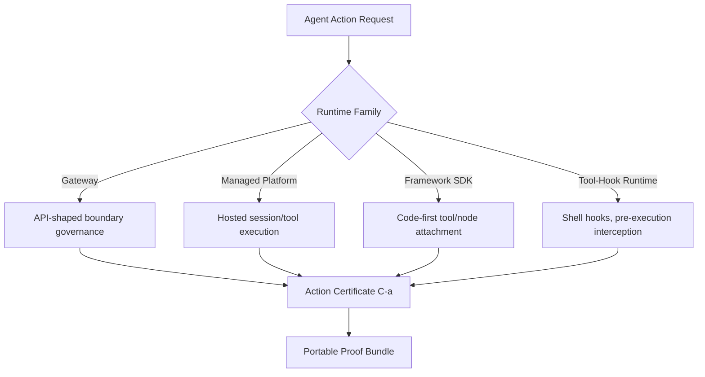
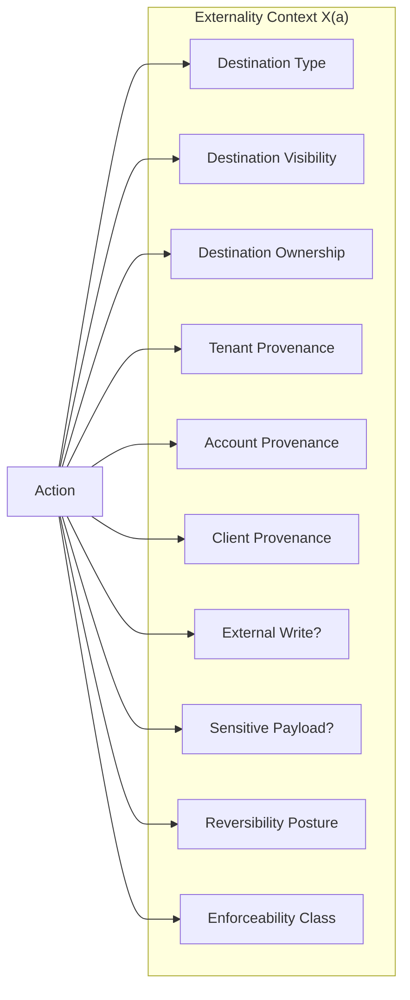
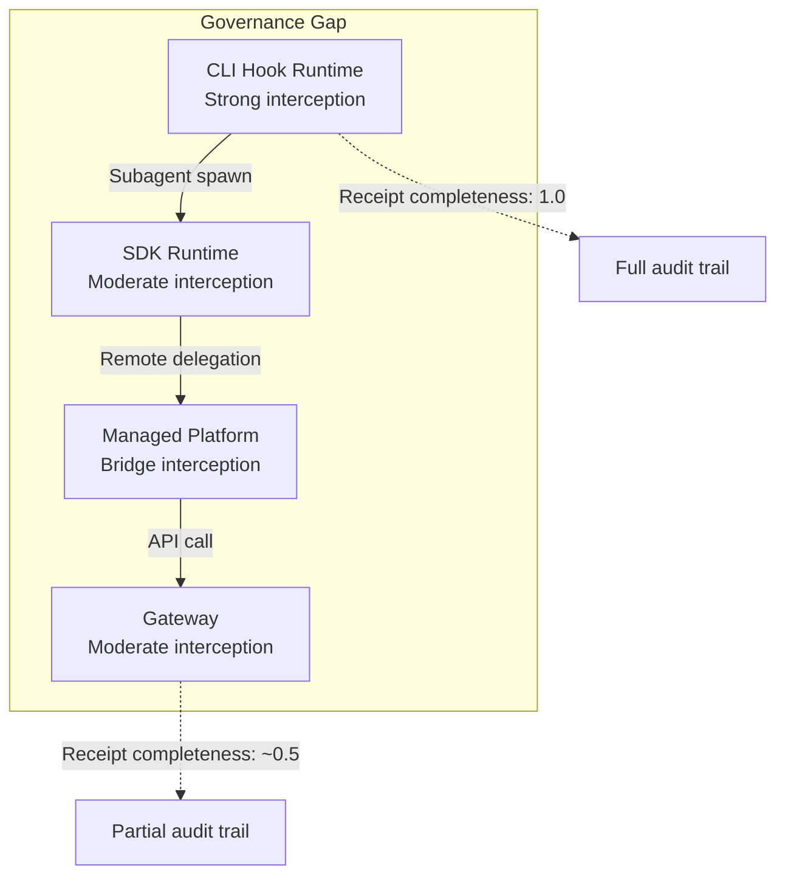

# Proof-Carrying Agent Actions: What Runtime-Neutral Governance Means for Codex CLI Hook Pipelines and Approval Audit Trails


---

A coding agent that writes to disk in one environment, calls an MCP tool in another, and triggers a hosted session transition in a third presents a governance problem that no single vendor's audit log can solve. Wang's *Proof-Carrying Agent Actions* (PCAA) framework [^1] formalises what many Codex CLI operators have been building piecemeal: a portable certificate that travels with every high-risk action, carrying its authorisation boundary, approval semantics, and replay-ready evidence regardless of which runtime executed it.

This article unpacks PCAA's model, maps its five-checkpoint contract onto Codex CLI's existing hook and approval infrastructure, and identifies the configuration patterns that close the gap between what PCAA prescribes and what the CLI delivers today.

## The Problem PCAA Solves

Agent systems execute through runtimes with fundamentally different control surfaces [^1]. A shell command in Codex CLI, a tool call through an MCP server, a hosted session in the Codex App, and an API gateway request through the Agents SDK all perform materially identical actions — publishing data externally, writing credentials, mutating infrastructure — yet each runtime records authorisation, approval, and outcome in incompatible formats.

PCAA's core insight is that governance questions — *what action was authorised, under whose authority, with what approval semantics, and with what evidence after execution* — must be answerable consistently across all four runtime families [^1]:



Static rule-based governance achieves only 0.583 exact accuracy on PCAA's evaluation corpus; scalar heuristics drop further to 0.375 [^1]. The certificate-based approach achieves 1.000 exact accuracy, 1.000 macro-F1, and perfect severe recall across 96 traces spanning all four runtime families [^1].

## The Five-Checkpoint Contract

PCAA defines five sequential checkpoints that every governed action must traverse [^1]:

| Checkpoint | PCAA Method | Purpose |
|---|---|---|
| Pre-action admissibility | `guard()` | Evaluate allow / warn / block / simulate-first / approval-gate before side effects |
| Action open | `createAction()` | Create stable trust object for remaining certificate path |
| Assumption capture | `recordAssumption()` | Preserve what the runtime believed at decision time |
| Approval | `waitForApproval()` | Pause execution when policy requires human review |
| Outcome closure | `updateOutcome()` | Write final result, evidence, and closure status for replay and proof |

This is not merely theoretical. The checkpoint latency envelope — mean 0.35ms, P95 0.54ms, P99 0.72ms — demonstrates that the governance overhead is negligible relative to typical LLM inference latency [^1].

## Mapping PCAA to Codex CLI

Codex CLI's existing governance stack already covers significant ground. The table below maps PCAA checkpoints to current CLI capabilities:

| PCAA Checkpoint | Codex CLI Equivalent | Coverage |
|---|---|---|
| Pre-action admissibility | `PreToolUse` hooks + `approval_policy` | Strong — hooks can deny actions, approval policy gates execution [^2][^3] |
| Action open | Implicit — action begins after approval | Partial — no explicit trust-object creation |
| Assumption capture | Not directly supported | Gap — runtime assumptions are not persisted |
| Approval | Interactive approval / `approvals_reviewer = "auto_review"` | Strong — three-tier policy with granular overrides [^2] |
| Outcome closure | `PostToolUse` hooks + OpenTelemetry export | Moderate — hooks validate outcomes, OTel captures events [^2][^4] |

### Pre-Action Admissibility: PreToolUse as Guard

The `PreToolUse` hook fires before Codex calls any tool — shell commands, file writes, or MCP tool invocations [^3]. In PCAA terms, this is the `guard()` checkpoint. A hook script can inspect the proposed action and return a deny decision:

```toml
[features]
codex_hooks = true

[[hooks.PreToolUse]]
matcher = { tool_name = "Bash", command_pattern = "rm -rf *" }
hook = { type = "command", command = ["python3", "scripts/guard.py"] }
timeout = 30000
status_message = "Evaluating pre-action admissibility"
```

The limitation: `PreToolUse` can deny but cannot modify tool input [^3]. PCAA's `guard()` supports richer routing decisions — simulate-first, warn-and-proceed, escalate-to-approver — that require combining `PreToolUse` denial with `approval_policy` granular settings.

### Approval Policy as the Approval Checkpoint

Codex CLI's three-tier approval policy maps directly to PCAA's enforceability classes [^1][^2]:

| PCAA Enforceability Class | Codex CLI Equivalent |
|---|---|
| `pre_execution_gate` | `approval_policy = "untrusted"` — most restrictive, pauses before any mutation |
| `delegated_runtime_control` | `approval_policy = "on-request"` — runtime-managed with selective pauses |
| `observe_only` | `approval_policy = "never"` — post-execution evidence only |
| `runtime_controlled` | `sandbox = "danger-full-access"` with `approval_policy = "never"` |

Granular policies add per-category control [^2]:

```toml
[approval_policy]
granular = { shell_write = "approve", file_write = "auto", mcp_tool = "approve" }
```

This approximates PCAA's externality-aware routing, where the approval decision depends on destination visibility, account provenance, and write posture rather than a blanket policy [^1].

### The Assumption Capture Gap

PCAA's assumption-capture checkpoint — `recordAssumption()` — preserves what the runtime believed or expected at decision time [^1]. This is the most significant gap in Codex CLI's current architecture. When a hook approves an action, the contextual basis for that decision (file state, environment variables, model confidence, prior tool outputs) is not systematically recorded.

The practical consequence: when a governed action produces an unexpected outcome, there is no replay-ready record of *why* the governance layer permitted it. PCAA's ablation study shows that removing the integrity lane — which includes assumption capture — collapses manifest stability from 1.000 to 0.000 and degrades proof closure from 1.000 to 0.708 [^1].

A partial workaround exists using `PostToolUse` hooks to capture state snapshots:

```toml
[[hooks.PostToolUse]]
matcher = { tool_name = "*" }
hook = { type = "command", command = ["python3", "scripts/capture_assumptions.py"] }
timeout = 10000
status_message = "Recording assumption context"
```

But this is post-hoc rather than pre-decision, and it lacks PCAA's formal binding between the assumption record and the approval decision.

### Outcome Closure: PostToolUse and OpenTelemetry

`PostToolUse` hooks fire after tool completion and can validate outcomes, scan generated files, or append structured metadata [^3]. Combined with OpenTelemetry export, this approximates PCAA's outcome-closure checkpoint [^4]:

```toml
[telemetry]
otel_export = true
log_user_prompt = false

[[hooks.PostToolUse]]
matcher = { tool_name = "Bash" }
hook = { type = "command", command = ["python3", "scripts/outcome_closure.py"] }
timeout = 15000
status_message = "Recording outcome evidence"
```

OpenTelemetry events capture API requests, tool approval decisions, and tool results, tagged with service name, CLI version, and environment labels [^4]. However, Codex CLI's OTel integration does not produce PCAA's structured proof bundle — the `(Summary, Evidence, Verification, Manifest)` tuple that enables independent replay and audit [^1].

## The Externality Context: What Codex CLI Misses

PCAA's most distinctive contribution is the externality context — a 10-tuple `X(a)` that captures boundary facts for every action [^1]:



Removing externality context drops PCAA's exact accuracy from 1.000 to 0.875 and explicit review routing from 29.2% to 16.7% [^1]. The framework correctly routes 25.0% of traces to hard blocks — actions that should never execute regardless of approval status.

Codex CLI's network access controls — domain allowlists, local binding restrictions, DNS rebinding protections [^2] — address *where* actions can reach, but not the richer question of *what kind of boundary is being crossed*. A write to a company-owned staging server and a write to a personal cloud account are governed identically under current Codex CLI policy, yet PCAA's account-provenance dimension would route them through different approval paths.

## Practical Configuration: Building Toward PCAA

While Codex CLI cannot implement PCAA's full certificate model today, operators can approximate its key properties through layered configuration:

### Layer 1: Enforceability-Class Routing

Map project risk profiles to approval tiers using named profiles [^5]:

```toml
# ~/.codex/internal.config.toml
approval_policy = "on-request"
sandbox = "workspace-write"

# ~/.codex/external.config.toml
approval_policy = "untrusted"
sandbox = "workspace-write"
network_access = { allow = ["*.internal.example.com"] }
```

Switch profiles per context: `codex --profile internal` for internal repositories, `codex --profile external` for boundary-crossing work.

### Layer 2: Hook-Based Guard and Closure

Implement `PreToolUse` guards that classify actions by destination type and `PostToolUse` closures that emit structured evidence:

```toml
[features]
codex_hooks = true

[[hooks.PreToolUse]]
matcher = { tool_name = "Bash", command_pattern = "curl|wget|gh api|git push" }
hook = { type = "command", command = ["python3", "hooks/externality_guard.py"] }
timeout = 5000
status_message = "Evaluating boundary crossing"

[[hooks.PostToolUse]]
matcher = { tool_name = "*" }
hook = { type = "command", command = ["python3", "hooks/proof_closure.py"] }
timeout = 10000
status_message = "Recording action evidence"
```

### Layer 3: Audit Trail Assembly

Enable OpenTelemetry export and configure history persistence to build a queryable record [^4]:

```toml
[telemetry]
otel_export = true
log_user_prompt = false

[history]
max_bytes = 104857600
```

This gives you tool-level event traces that, while not PCAA's formal proof bundles, provide the raw material for post-hoc governance review.

## What PCAA Means for Multi-Runtime Teams

Teams running Codex CLI alongside the Codex App, Agents SDK orchestrators, and MCP servers face exactly the heterogeneous-runtime problem PCAA targets [^1]. A subagent spawned via TOML definition [^6] executes in the CLI's tool-hook runtime. The same logical action orchestrated through the Agents SDK's `MCPServerStdio` [^7] executes in a framework-SDK runtime. A task delegated to Codex Remote [^8] executes in a managed-platform runtime.

PCAA's receipt completeness metric — which scored 0.516 across heterogeneous runtime mixes [^1] — quantifies how much governance evidence survives cross-runtime delegation. Teams should expect roughly half their governance trail to be incomplete when mixing runtimes without explicit certificate propagation.



## Conclusion

PCAA does not introduce new governance *mechanisms* — Codex CLI's hooks, approval policies, and OTel export already cover substantial ground. What it introduces is a *formal contract* that makes governance portable, replayable, and independently verifiable across heterogeneous runtimes. The three configuration layers above — enforceability-class profiles, hook-based guard/closure, and structured audit trails — move Codex CLI deployments toward PCAA's guarantees without waiting for native certificate support.

The critical gap is assumption capture: the systematic recording of *why* governance decisions were made, not just *what* was decided. Teams building production governance pipelines today should treat their hook scripts as proto-certificates and structure their output accordingly — the formal model is likely to inform the next generation of agent governance standards.

## Citations

[^1]: Wang, Z. (2026). "Proof-Carrying Agent Actions: Model-Agnostic Runtime Governance for Heterogeneous Agent Systems." arXiv:2606.04104. [https://arxiv.org/abs/2606.04104](https://arxiv.org/abs/2606.04104)

[^2]: OpenAI. (2026). "Agent approvals & security — Codex." OpenAI Developers. [https://developers.openai.com/codex/agent-approvals-security](https://developers.openai.com/codex/agent-approvals-security)

[^3]: OpenAI. (2026). "Hooks — Codex." OpenAI Developers. [https://developers.openai.com/codex/hooks](https://developers.openai.com/codex/hooks)

[^4]: OpenAI. (2026). "Advanced Configuration — Codex." OpenAI Developers. [https://developers.openai.com/codex/config-advanced](https://developers.openai.com/codex/config-advanced)

[^5]: OpenAI. (2026). "Config basics — Codex." OpenAI Developers. [https://developers.openai.com/codex/config-basic](https://developers.openai.com/codex/config-basic)

[^6]: OpenAI. (2026). "Subagents — Codex." OpenAI Developers. [https://developers.openai.com/codex/subagents](https://developers.openai.com/codex/subagents)

[^7]: OpenAI. (2026). "Use Codex with the Agents SDK." OpenAI Developers. [https://developers.openai.com/codex/guides/agents-sdk](https://developers.openai.com/codex/guides/agents-sdk)

[^8]: OpenAI. (2026). "Codex Remote reaches general availability." Codex Changelog, 25 June 2026. [https://developers.openai.com/codex/changelog](https://developers.openai.com/codex/changelog)
