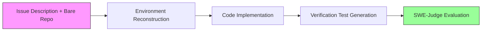
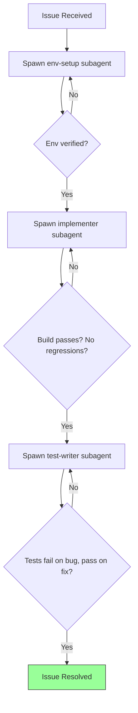

# SWE-Cycle and the FullCycle Gap: Why Coding Agents That Ace Isolated Tasks Collapse at End-to-End Issue Resolution — and How to Configure Codex CLI's Subagent Pipeline


---

## The Illusion of Competence

Coding agent benchmarks have a flattering habit: they hand the agent a pre-configured environment, a focused task, and a tidy test harness. In that world, solve rates look impressive. Guan et al.'s SWE-Cycle benchmark (arXiv:2605.13139, May 2026) punctures the illusion [^1]. When the same agents must reconstruct the environment, implement the fix, *and* generate verification tests end-to-end — the "FullCycle" setting — no model exceeds a 13.50% strict solve rate [^1]. Claude Sonnet 4.6 drops from 40.08% on isolated implementation to 12.27% FullCycle [^1]. GPT-5.4 falls from 39.67% to 10.84% [^1].

The message for teams running Codex CLI is clear: relying on a single agent turn to handle the full issue-resolution lifecycle is a losing bet. The data points toward a structured subagent pipeline where each phase — environment, implementation, verification — is isolated, validated, and handed off with explicit contracts.

## What SWE-Cycle Measures

SWE-Cycle draws 489 instances from SWE-bench Verified (225), SWE-bench Pro (203), and SWE-bench Multilingual (61), spanning nine languages with Python at 68.9% and Go at 18.0% [^1]. The benchmark defines four tasks:

1. **Environment Reconstruction** — given a bare repository and issue description, reproduce a working development environment.
2. **Code Implementation** — apply the fix or feature in a pre-configured environment.
3. **Verification Test Generation** — write tests that distinguish the buggy state from the fixed state.
4. **FullCycle** — do all three autonomously, without human scaffolding [^1].



The evaluation uses SWE-Judge, an execution-capable evaluation agent combining static code review with dynamic testing. It achieves 96.9% human alignment across all tasks and catches errors that traditional static parsers miss — removing reference patches from blind evaluation inflates static scores by 18.4 percentage points [^1].

## The Numbers That Matter

| Model | Env Recon | Code Impl | Test Gen | FullCycle |
|---|---|---|---|---|
| Claude Sonnet 4.6 | 78.12% | 40.08% | 67.28% | **12.27%** |
| GLM-5.1 | 73.01% | 37.83% | 60.53% | **13.50%** |
| GPT-5.4 | 71.78% | 39.67% | 42.13% | **10.84%** |
| Kimi-K2.5 | 61.34% | 34.46% | 52.07% | **2.15%** |
| Qwen-3.5 | 66.46% | 28.83% | 46.01% | **6.75%** |
| MiniMax-M2.7 | 45.40% | 30.88% | 33.33% | **4.29%** |

*Source: Guan et al. (2026), Tables 2–3 [^1]*

The degradation is not merely additive. If each phase were independent, the theoretical FullCycle rate for Claude Sonnet 4.6 would be roughly 0.78 × 0.40 × 0.67 ≈ 20.9%. The actual 12.27% reveals cascading failures: errors in environment reconstruction propagate into implementation, which in turn corrupts test generation [^1]. Compound failures — simultaneous defects across two or more phases — dominate unsuccessful FullCycle instances [^1].

## Why Cascading Failures Dominate

Three structural problems emerge from the SWE-Cycle data:

### 1. Environment Drift

Even when an agent achieves 78% on isolated environment reconstruction, the 22% failure rate poisons everything downstream. A misconfigured dependency version or missing build step creates a subtly wrong execution context. The implementation may appear to succeed — the code compiles — but against the wrong baseline [^1].

### 2. Test Generation Without Ground Truth

In isolation, test generation benefits from a pre-configured environment where the buggy and fixed states are clearly separated. In FullCycle, the agent must generate tests against its own implementation, without knowing whether the implementation is correct. The result: tests that pass on broken code [^1]. GPT-5.4's test generation drops from 42.13% isolated to an effective contribution rate well below that in FullCycle [^1].

### 3. Context Window Saturation

FullCycle execution demands substantially more context. Median token consumption for Claude Sonnet 4.6 in FullCycle is 11.0K tokens, with median solving time of 11.7 minutes [^1]. Longer-horizon tasks from the Pro dataset show steeper performance degradation across all models [^1], suggesting context management becomes increasingly critical as task complexity grows.

## Mapping SWE-Cycle to Codex CLI's Subagent Pipeline

Codex CLI's subagent delegation model — configured through AGENTS.md and TOML agent definitions — maps naturally onto SWE-Cycle's three-phase structure [^2][^3]. Rather than asking a single agent turn to handle the full cycle, decompose the work into phase-specific subagents with explicit validation gates between them.

### Phase 1: Environment Reconstruction Subagent

Create a dedicated agent definition for environment setup:

```toml
# .codex/agents/env-setup.toml
name = "env-setup"
model = "o4-mini"
instructions = """
You are an environment reconstruction specialist. Given an issue description
and repository, your job is to:
1. Identify required dependencies and their versions
2. Configure the build system
3. Verify the environment compiles and existing tests pass
4. Output a structured environment report

Do NOT attempt to fix the issue. Only set up the environment.
"""

[sandbox]
network = true  # needed for dependency installation
```

The key constraint is the final line of the instructions: preventing the environment agent from scope-creeping into implementation. SWE-Cycle's data shows that environment reconstruction is the highest-performing isolated task (78.12% for Claude Sonnet 4.6) [^1], so keeping it focused preserves that advantage.

### Phase 2: Implementation Subagent with PostToolUse Validation

The implementation phase benefits from a PostToolUse hook that validates the environment remains consistent after each tool invocation [^4]:

```toml
# .codex/agents/implementer.toml
name = "implementer"
model = "gpt-5.5"
instructions = """
You are an implementation specialist. You receive a verified environment
and an issue description. Apply the minimal fix or feature implementation.

Before marking complete:
1. Run the existing test suite to confirm no regressions
2. Verify your changes compile cleanly
3. Output a structured diff summary
"""
```

Wire in a PostToolUse hook to catch environment drift mid-implementation:

```bash
#!/usr/bin/env bash
# .codex/hooks/post-impl-validate.sh
# PostToolUse hook: verify build still passes after each file write
if [[ "$CODEX_TOOL_NAME" == "write_file" || "$CODEX_TOOL_NAME" == "edit_file" ]]; then
    make build 2>/dev/null || echo "WARN: build broken after edit" >&2
fi
```

### Phase 3: Test Generation Subagent

SWE-Cycle's test generation task is where the most surprising failures occur. GPT-5.4 manages only 42.13% even in isolation [^1]. The mitigation is a two-pass pattern:

```toml
# .codex/agents/test-writer.toml
name = "test-writer"
model = "claude-sonnet-4.6"
instructions = """
You are a verification test specialist. You receive:
1. The original issue description
2. The implementation diff
3. The verified environment

Write tests that:
- Fail on the original buggy code
- Pass on the fixed code
- Cover edge cases identified in the issue

Do NOT modify the implementation. Only write tests.
"""
```

The critical detail: Claude Sonnet 4.6 scores 67.28% on isolated test generation versus GPT-5.4's 42.13% [^1]. Model routing per phase — using the strongest model for each task — is a straightforward Codex CLI configuration:

```toml
# config.toml model routing per agent
[agents]
max_depth = 1

[agents.env-setup]
model = "o4-mini"

[agents.implementer]
model = "gpt-5.5"

[agents.test-writer]
model = "claude-sonnet-4.6"
```

### Orchestrating the Pipeline via AGENTS.md

Tie the phases together in your project's `AGENTS.md`:

```markdown
## Issue Resolution Pipeline

When resolving issues, use a three-phase subagent pipeline:

1. **Environment**: Spawn `env-setup` agent. Wait for environment verification
   report. Do not proceed until existing tests pass.
2. **Implementation**: Spawn `implementer` agent with the verified environment.
   Wait for implementation diff and regression test confirmation.
3. **Verification**: Spawn `test-writer` agent with the implementation diff.
   Wait for test results confirming tests fail on buggy code, pass on fix.

Never attempt all three phases in a single agent turn.
```



## Token Budget Governance

Codex CLI v0.142.0 introduced configurable rollout token budgets [^5]. SWE-Cycle's efficiency data provides concrete guidance for setting them. Median FullCycle token consumption ranges from 5.9K (GLM-5.1) to 11.0K (Claude Sonnet 4.6) [^1]. However, these are median values — the distribution has a long tail for complex instances.

A practical budget configuration for the three-phase pipeline:

```toml
# config.toml — token budgets per phase
[token_budget]
env_setup = 8000
implementer = 15000
test_writer = 12000
```

The implementation phase gets the largest allocation because code generation in complex repositories demands more context. Setting phase-specific budgets prevents a single runaway phase from consuming the entire budget — directly addressing the cascading failure pattern SWE-Cycle identifies [^1].

## SWE-Judge as a Configuration Pattern

SWE-Judge's evaluation methodology — combining static code review with dynamic testing at 96.9% human alignment [^1] — suggests a PostToolUse hook pattern for Codex CLI that mirrors the judge's workflow:

```bash
#!/usr/bin/env bash
# .codex/hooks/swe-judge-lite.sh
# Lightweight SWE-Judge-inspired validation after implementation
set -euo pipefail

# Static: check diff is minimal and scoped
DIFF_LINES=$(git diff --stat | tail -1 | awk '{print $4}')
if [[ "$DIFF_LINES" -gt 500 ]]; then
    echo "WARN: Diff exceeds 500 lines — likely overscoped" >&2
fi

# Dynamic: run test suite
if ! make test 2>/dev/null; then
    echo "FAIL: Test suite broken after changes" >&2
    exit 1
fi
```

The 18.4 percentage-point inflation that SWE-Judge found when removing reference patches from evaluation [^1] underscores why dynamic testing in hooks is non-negotiable — static analysis alone systematically overestimates correctness.

## Practical Takeaways

1. **Decompose the cycle.** SWE-Cycle proves that monolithic agent turns fail at end-to-end issue resolution. Use Codex CLI's subagent delegation to isolate environment, implementation, and verification phases [^2].

2. **Route models per phase.** Claude Sonnet 4.6 excels at environment reconstruction (78.12%) and test generation (67.28%); GPT-5.4 is competitive on implementation (39.67%) [^1]. Use per-agent model configuration in `config.toml` [^3].

3. **Gate phase transitions.** Never proceed from environment to implementation without verifying existing tests pass. Never accept implementation without regression confirmation. Never ship without tests that distinguish buggy from fixed code.

4. **Budget per phase.** Use v0.142.0 token budgets to prevent cascading resource exhaustion [^5]. SWE-Cycle's median consumption data (5.9K–11.0K tokens) provides empirically grounded starting points [^1].

5. **Prefer dynamic validation.** Static analysis alone inflates correctness estimates by 18.4 percentage points [^1]. PostToolUse hooks that run the test suite after each edit catch errors that code review cannot.

## Citations

[^1]: Guan, H., Fu, L., Zhang, S., Zhu, Y., Zhang, K., Qiu, L., Cai, X., Cao, X., Liu, W., Zhang, W., & Yu, Y. (2026). "SWE-Cycle: Benchmarking Code Agents across the Complete Issue Resolution Cycle." arXiv:2605.13139. [https://arxiv.org/abs/2605.13139](https://arxiv.org/abs/2605.13139)

[^2]: OpenAI. (2026). "Subagents — Codex CLI." OpenAI Developers. [https://developers.openai.com/codex/subagents](https://developers.openai.com/codex/subagents)

[^3]: OpenAI. (2026). "Custom instructions with AGENTS.md — Codex CLI." OpenAI Developers. [https://developers.openai.com/codex/guides/agents-md](https://developers.openai.com/codex/guides/agents-md)

[^4]: OpenAI. (2026). "Features — Codex CLI." OpenAI Developers. [https://developers.openai.com/codex/cli/features](https://developers.openai.com/codex/cli/features)

[^5]: OpenAI. (2026). "Changelog — Codex." OpenAI Developers. [https://developers.openai.com/codex/changelog](https://developers.openai.com/codex/changelog)
