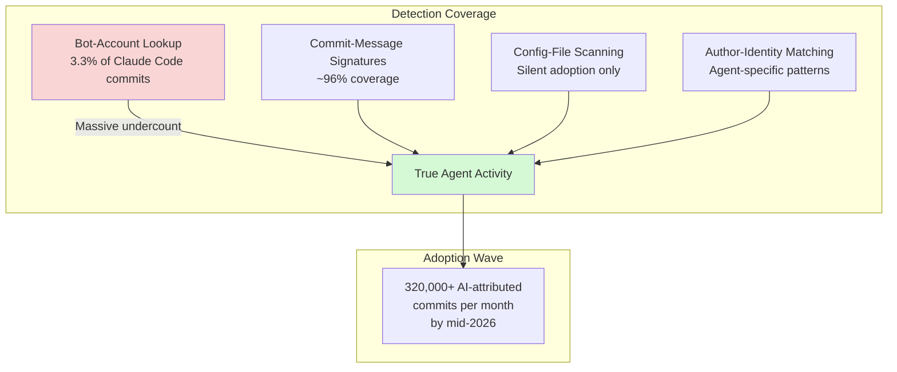
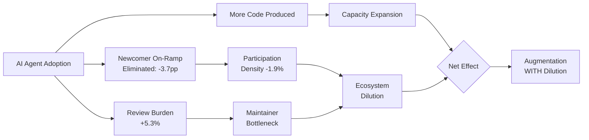
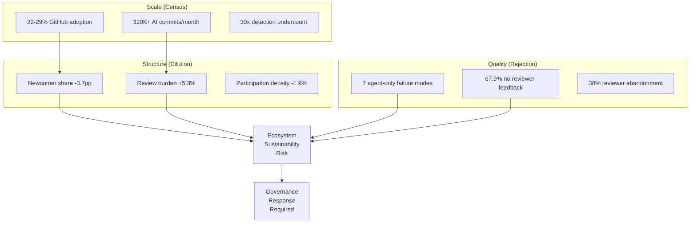

# The Agent Ecosystem Impact Report: Augmentation, Dilution, and Rejection Across 180 Million Repositories


---

Three independent research efforts published between February and June 2026 converge on a single, uncomfortable conclusion: AI coding agents are reshaping open-source ecosystems in ways that adoption dashboards do not capture. The 180-million-repository census reveals that traditional detection methods undercount agent activity by 30× [^1]. The augmentation-with-dilution study demonstrates that newcomer participation drops 3.7 percentage points immediately after agent adoption [^2]. And the first comparative study of agentic PR rejection finds seven failure modes that never appear in human-authored submissions [^3].

This report synthesises all three studies into a unified ecosystem impact framework, with concrete Codex CLI configuration responses for each finding.

## Part 1: The Invisible Footprint — 180M-Repository Census

### Detection Architecture Failures

Khosravani and Mockus's census (arXiv:2606.24429) examined three World of Code snapshots spanning December 2024 to April 2026, indexing over 180 million Git repositories across GitHub, GitLab, Bitbucket, and smaller forges [^1]. Their four-layer detection framework classifies agent traces into distinct types:

| Type | Method | Example |
|------|--------|---------|
| A | Centralised bot accounts | Exact email matching |
| B | Commit-message signatures | `Co-authored-by:` trailers, `Generated by` headers |
| C | Distributed author-name patterns | `(aider)` suffix in committer name |
| D | Configuration files only | `.cursorrules`, `CLAUDE.md`, `AGENTS.md` |

The critical finding: bot-account lookup — the signal most adoption studies rely upon — recovers only 3.3% of Claude Code commits (28,154 of 850,157) [^1]. That is a 30× undercount from a single detection channel.

### Agent Volume by Channel

The census reveals stark architectural differences between agents:

| Agent | PR Traces | Commit Traces | Dominant Channel |
|-------|-----------|---------------|------------------|
| Codex CLI | 814,522 | 843 | PR-based |
| Claude Code | 5,137 | 886,122 | Commit-based |
| GitHub Copilot SWE Agent | — | 1,127,201 | Commit-based |
| Google Jules | — | 215,804 | Commit-based |

Codex CLI's cloud-task architecture squash-merges work into pull requests, leaving virtually no commit-level trace [^1]. A commit-only census misses essentially all Codex activity. A PR-only census misses essentially all Claude Code activity. Neither method alone captures the true scale.

### The Configuration-File Signal

Between October 2025 and April 2026, AGENTS.md files went from zero to 134,810 blobs across the dataset [^1]. Claude Code's configuration footprint (CLAUDE.md plus `.claude/` directories) reached 888,177 blobs. GitHub Copilot's `copilot-instructions.md` doubled from 92,276 to 211,166 [^1]. These Type D signals represent adoption entirely invisible to commit-based or bot-based surveys.



### Adoption Patterns

Approximately 68% of projects adopt agents at inception (greenfield), whilst 32% integrate into mature codebases [^1]. The adoption rate across GitHub repositories sits between 22.20% and 28.66% as of early 2026 [^4]. Cloud-deployed agents emphasise feature development; in-editor agents focus on maintenance and bug fixes [^1].

## Part 2: Augmentation with Dilution — The Participation Squeeze

### The Causal Evidence

Zhang, Jiang, and Koziolek's study (arXiv:2606.26289) applied a staggered difference-in-differences design across 11,097 GitHub repositories from January 2023 to May 2026 [^2]. This is causal inference, not correlation:

| Metric | Average Treatment Effect | Significance |
|--------|--------------------------|--------------|
| Total human contributors | +0.014 (no significant change) | p = 0.224 |
| Human participation density | −0.019 (−1.9%) | p = 0.002 |
| Newcomer participation share | −0.037 (−3.7 pp) | p < 0.001 |
| Review depth | +0.0168 (+5.3%) | p < 0.001 |

The pattern is counterintuitive: agents do not displace humans outright. The absolute number of contributors stays flat. But the *relative structure* of participation shifts decisively [^2].

### The Newcomer On-Ramp Problem

The 3.7 percentage-point drop in newcomer participation is the most consequential finding. The "good first issue" contributions that agents now handle at scale were precisely the on-ramp that brought new developers into projects [^2]. Remove that on-ramp and you do not lose contributors today — you lose the pipeline that produces contributors tomorrow.

### The Review Burden Shift

Review depth increased by 5.3% post-adoption [^2]. This confirms what maintainers have reported anecdotally: agents shift work from the production stage to the verification stage. The code gets written faster. The review queue gets longer. Someone still has to verify what the agent wrote — and that someone is increasingly overloaded.

A companion study by Russo (arXiv:2606.28235) reinforces this finding: analysing over 930,000 agent-authored pull requests, he finds that approximately half of integration friction persists at the repository level, with agent-authored contributions concentrating friction at roughly twice the rate of human contributions (intraclass correlation 0.30 versus 0.16) [^5].



## Part 3: Why Agentic PRs Get Rejected — Seven Failure Modes

### The Rejection Taxonomy

Nakashima et al. (arXiv:2602.04226) inspected 654 rejected PRs from five coding agents alongside a human baseline drawn from the AIDev dataset [^3]. Codex leads with an 85.8% acceptance rate — three percentage points above the human baseline of 82.6%. But seven rejection modes appear *only* in agentic submissions:

1. **No confidence in AI-generated code** — Reviewers rejected PRs specifically because they were agent-authored, regardless of code quality [^3]
2. **Too large** — Agents generated PRs too large for meaningful review. All size-related rejections came from agents [^3]
3. **Not sure** — Agent PRs provoked ambiguous reviewer responses more frequently than human PRs [^3]
4. **No added value** — Changes that looked plausible but solved no real problem [^3]
5. **Context/environment limitation** — Agents lacked access to CI, private dependencies, or project-specific tooling [^3]
6. **Deferred** — Reviewers hedged rather than committed to a decision [^3]
7. **Increase complexity** — Over-engineered solutions where simpler approaches existed [^3]

Additionally, 67.9% of rejected agent PRs lacked explicit reviewer feedback [^3], and reviewer abandonment accounted for 38% of rejections — agents tend to abandon the conversational back-and-forth that code review demands [^3].

### Acceptance Rates by Agent

| Agent | Total PRs | Acceptance Rate |
|-------|-----------|-----------------|
| OpenAI Codex | 20,993 | 85.8% |
| Cursor | 1,347 | 74.6% |
| Claude Code | 380 | 71.3% |
| Devin | 4,673 | 55.5% |
| GitHub Copilot | 3,891 | 55.0% |
| Human Baseline | 6,149 | 82.6% |

Codex CLI's architectural advantages — sandboxed execution, AGENTS.md-driven project context, and explicit permission profiles — likely explain its lead [^6].

## The Unified Impact Model

Combining all three studies produces a coherent model of ecosystem transformation:



The scale is massive (320,000+ AI-attributed commits monthly). The structural effects are statistically significant (newcomer participation down, review burden up). The quality signals are clear (seven failure modes, high abandonment). Together, they describe an ecosystem that is producing more code but may be consuming its own contributor pipeline.

## Codex CLI Configuration Responses

Each finding maps to specific Codex CLI configuration decisions.

### 1. Preserve the Newcomer On-Ramp

If agents consume all entry-level work, newcomers lose their pathway in. Use AGENTS.md to declare task boundaries:

```markdown
# AGENTS.md — newcomer preservation

## Task Boundaries
- Issues labelled `good-first-issue` or `newcomer` are reserved for human contributors
- Do NOT submit PRs for documentation-only changes unless explicitly requested
- Prioritise issues labelled `agent-ok` or `automated`
```

### 2. Constrain PR Scope to Avoid Size-Related Rejection

The "too large" rejection mode is entirely avoidable:

```toml
# config.toml — scope constraints
[codex]
approval_policy = "on-request"
sandbox_mode = "workspace-write"

# Limit token budget to prevent sprawling PRs
rollout_token_budget = 8192
```

Pair with AGENTS.md guidance:

```markdown
## PR Scope
- Each PR addresses ONE issue or feature
- Maximum 400 lines changed per PR
- If scope expands beyond the original issue, stop and create sub-issues
```

### 3. Enforce Attribution for Supply-Chain Transparency

The census shows that detection methods fail without explicit attribution. Ensure Codex CLI commits carry traceable metadata:

```markdown
# AGENTS.md — attribution
## Commit Standards
- Every commit MUST include a `Co-authored-by: Codex <noreply@openai.com>` trailer
- PR descriptions MUST state the model used and the Codex CLI version
- Never strip or modify attribution trailers during squash-merge
```

### 4. Gate Review Burden with PostToolUse Hooks

Review depth increases by 5.3% after agent adoption. Automate the first pass:

```markdown
# AGENTS.md — review automation
## Pre-Submission Checks
- Run the full test suite before submitting any PR
- Run linting and formatting checks
- Include test coverage diff in PR description
- If any check fails, fix and re-run before submission
```

Configure `PostToolUse` hooks to enforce these checks programmatically, reducing the manual verification burden on reviewers.

### 5. Build Trust Through Transparency

The "no confidence in AI-generated code" rejection mode is a trust problem, not a technical one. Address it with explicit disclosure:

```markdown
# AGENTS.md — trust building
## Disclosure
- PR title MUST include [Codex] prefix
- PR body MUST include a "What I Changed and Why" section written in first person
- Link to the issue being addressed
- Describe any design decisions and trade-offs considered
```

## The Governance Imperative

The three studies converge on a single conclusion: *govern the repository, not the agent* [^5]. Individual agent behaviour is configurable. Ecosystem effects are not — they emerge from the aggregate of thousands of agent-repository interactions.

For Codex CLI teams, this means:

- **Measure** participation diversity, not just throughput. Track newcomer contribution rates monthly.
- **Configure** AGENTS.md to preserve human participation pathways explicitly.
- **Attribute** all agent work transparently using commit trailers and PR metadata.
- **Automate** the review first-pass to prevent the review burden from becoming a bottleneck.
- **Constrain** PR scope to avoid the failure modes that drive rejection.

The ecosystem impact is real, measurable, and — critically — configurable. The question is whether teams will configure for it before the contributor pipeline contracts beyond recovery.

## Citations

[^1]: Khosravani, A. & Mockus, A. (2026). *Detecting AI Coding Agents in Open Source: A Validated Multi-Method Census of 180 Million Repositories*. arXiv:2606.24429. [https://arxiv.org/abs/2606.24429](https://arxiv.org/abs/2606.24429)

[^2]: Zhang, W., Jiang, B. & Koziolek, A. (2026). *Augmentation with Dilution: A Large-Scale Empirical Study of Human Contributor Ecosystems After AI Coding Agent Adoption*. arXiv:2606.26289. [https://arxiv.org/abs/2606.26289](https://arxiv.org/abs/2606.26289)

[^3]: Nakashima, S., Ishimoto, Y., Kondo, M., McIntosh, S. & Kamei, Y. (2026). *Why Agentic-PRs Get Rejected: A Comparative Study of Coding Agents*. arXiv:2602.04226. [https://arxiv.org/abs/2602.04226](https://arxiv.org/abs/2602.04226)

[^4]: Robbes, R., Matricon, T., Degueule, T., Hora, A. & Zacchiroli, S. (2026). *Agentic Much? Adoption of Coding Agents on GitHub*. arXiv:2601.18341. [https://arxiv.org/abs/2601.18341](https://arxiv.org/abs/2601.18341)

[^5]: Russo, D. (2026). *Govern the Repository, Not the Agent*. arXiv:2606.28235. [https://arxiv.org/abs/2606.28235](https://arxiv.org/abs/2606.28235)

[^6]: OpenAI. (2026). *Codex CLI Documentation: Best Practices*. [https://developers.openai.com/codex/learn/best-practices](https://developers.openai.com/codex/learn/best-practices)
