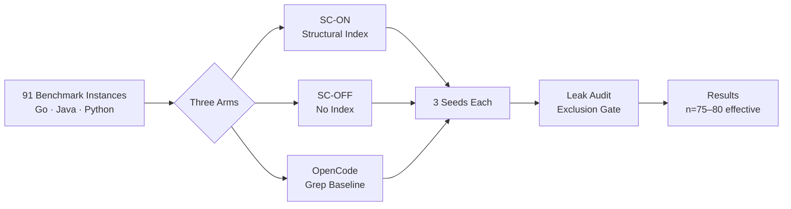
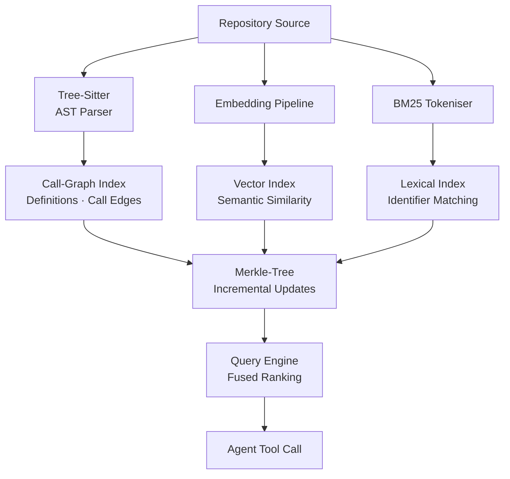
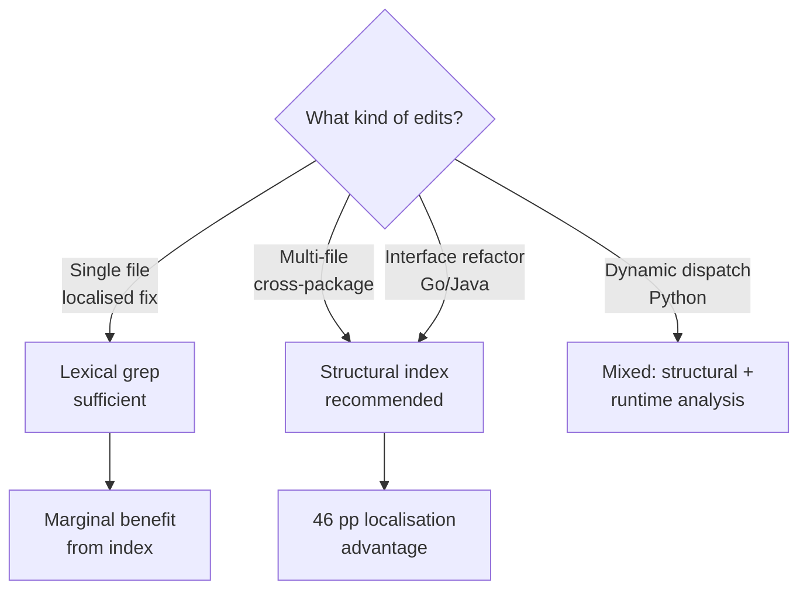

# Code Isn't Memory: What Structural Codebase Indexing Means for Codex CLI Agent Workflows


---

Coding agents waste tokens re-reading files they have already seen. They grep for symbols, scroll through hundreds of lines of irrelevant code, and still miss the call site three directories away. A new controlled ablation study from SuperAGI Research — "Code Isn't Memory" (arXiv:2606.22417, June 2026) — quantifies exactly how much a structural codebase index changes the game, and the numbers demand attention from anyone running Codex CLI on non-trivial repositories [^1].

## The Problem: Agentic Grep Is Not Enough

Every mainstream coding agent harness — OpenHands, SWE-agent, Aider, AutoCodeRover, Codex CLI — ships some variant of grep-based code search as its primary navigation tool [^1]. The model issues a text query, the harness returns matching lines, and the model decides what to read next. This works for single-file edits where the fix site is obvious from the stack trace. It falls apart on multi-file changes where the real dependency lives in a call graph the grep output never surfaces.

Codex CLI's built-in tool surface includes fuzzy file search (the `@` composer shortcut), shell-level grep via sandboxed commands, and first-party web search [^2]. These are lexical tools. They match strings, not structures. When your agent needs to trace a Go interface implementation three packages deep, or find every caller of a Java method before refactoring its signature, lexical search forces the model into a costly exploration loop: read file, grep for symbol, read another file, grep again, backtrack.

The SuperAGI paper isolates this cost precisely.

## The Study: A Clean Within-Harness Ablation

What makes this paper valuable is its methodology. Rather than comparing two different systems and attributing the delta to one variable, the authors run a causal ablation within a single harness (SuperCoder) while holding the model (Claude Opus 4.7) fixed across three seeds [^1].

Three experimental arms:

- **SC-ON**: SuperCoder with structural index tools enabled
- **SC-OFF**: Identical harness, identical model, structural index tools removed
- **OpenCode**: Independent grep-based comparator harness

The benchmark suite spans 91 instances across Go, Java, and Python from SWE-PolyBench Verified and SWE-bench Pro [^1]. Every run passes through a leak-audit pipeline that excludes cells where git history or provider truncation could contaminate results.



## The Numbers: Localization Dominates

The headline result is a 40-point localization accuracy gap. With the structural index enabled, the agent places the correct file in its top-5 search results 84.5% of the time. Without it, that drops to 44.3% (p < 0.0001) [^1].

| Metric | SC-ON | SC-OFF | Delta | p-value |
|--------|-------|--------|-------|---------|
| Resolve rate | 50.4% | 41.9% | +8.5 pp | 0.003 |
| Localization Acc@5 | 84.5% | 44.3% | +40.3 pp | <0.0001 |
| Recall@5 | 0.611 | 0.330 | +0.281 | <0.0001 |
| Mean turns | 28.3 | 36.2 | −7.9 | <0.0001 |
| Mean tokens (k) | 10.1 | 11.1 | −1.0 | 0.027 |
| $/solved | \$2.30 | \$2.84 | −\$0.54 | — |
| $/cell | \$1.15 | \$1.19 | −\$0.04 | 0.73 |

The per-cell cost is statistically indistinguishable — the index does not make individual tasks more expensive [^1]. But because the agent resolves more tasks, the cost per successful solve drops by 19%. The agent also completes tasks in fewer turns (28.3 vs 36.2), meaning fewer round-trips through the model and fewer opportunities for the reasoning chain to derail.

### Language-Specific Patterns

The localization gain is not uniform across languages. Go shows the most dramatic improvement — Acc@5 jumps from 44.8% to 95.4% — likely because Go's explicit interface satisfaction and package-level visibility make call-graph edges particularly informative [^1]. Java follows a similar pattern. Python, with its dynamic dispatch, benefits less from static structural analysis but still sees a 40-point localization gain.

| Language | Resolve (ON) | Resolve (OFF) | Acc@5 (ON) | Acc@5 (OFF) |
|----------|-------------|---------------|-----------|-----------|
| Go (n=29) | 47.1% | 29.9% | 95.4% | 44.8% |
| Java (n=20) | 60.0% | 53.3% | 71.7% | 46.7% |
| Python (n=35) | 47.6% | 45.5% | 82.9% | 42.4% |

### Multi-File Tasks Are Where It Matters

The localization gap widens as task complexity increases. For tasks requiring changes to three or more files, the structural index delivers a 46.4 percentage-point localization advantage [^1]. This is the regime where grep-based navigation degenerates into exhaustive search, and where the call-graph index earns its keep by surfacing transitive dependencies the model would otherwise never find.

## The Index Architecture

The structural index comprises three integrated components [^1]:

1. **Vector index** — code-chunk embeddings for semantic similarity search
2. **Call-graph index** — definition and call-edge relationships extracted via tree-sitter AST parsing
3. **Lexical index** — BM25-based identifier and token matching



The index builds once per repository, then updates incrementally via Merkle-tree diffs — only reprocessing files whose content hash has changed [^1]. This makes it practical for large repositories where full reindexing on every agent turn would be prohibitive.

The critical architectural insight is the fusion of all three index types. Semantic embeddings alone miss exact identifier matches. Lexical search alone misses semantic relationships. The call graph alone cannot handle natural-language queries. Combining them produces a ranking that surfaces the right file at rank 1 in 77.4% of cells, compared to 33.3% without the index [^1].

## Mapping to Codex CLI: MCP-Based Structural Indexing

Codex CLI does not ship a built-in structural codebase index. Its native search tools are lexical [^2]. But its MCP integration layer makes it straightforward to bolt one on. Several mature MCP servers now provide exactly the structural indexing architecture the SuperAGI paper validates.

### codebase-memory-mcp

The most established option is DeusData's `codebase-memory-mcp` — a single static binary with zero dependencies that parses 158 languages via tree-sitter into a persistent knowledge graph [^3]. It exposes 12 MCP tools and claims 120× fewer tokens than file-by-file search: five structural queries produce roughly 3,400 tokens versus approximately 412,000 via grep [^3].

Configure it in `~/.codex/config.toml`:

```toml
[mcp_servers.codebase-memory]
command = "codebase-memory-mcp"
args = ["--workspace", "."]
```

### codebase-index

For teams wanting more control, `codebase-index` by denfry offers a local-first hybrid of FTS5, tree-sitter, and graph search that runs fully offline [^4]. It is designed specifically for Claude Code, Codex CLI, and OpenCode, storing its index in SQLite.

```toml
[mcp_servers.codebase-index]
command = "codebase-index"
args = ["serve", "--root", "."]
```

### AGENTS.md Integration

Once a structural index MCP server is connected, encode its usage in your project's `AGENTS.md` to ensure the agent queries the index before falling back to grep [^5]:

```markdown
## Code Navigation

Before using shell grep or file search to locate code:
1. Query the structural index via the `search_codebase` tool
2. Use `find_references` for call-site discovery
3. Use `find_definitions` for symbol resolution
4. Only fall back to grep for string literals or log messages
```

This front-loads structural search in the agent's decision loop, replicating the SC-ON condition from the paper within Codex CLI's existing architecture.

### PostToolUse Verification

You can add a PostToolUse hook that checks whether the agent is falling back to grep excessively, indicating the structural index is not being used effectively:

```toml
[hooks.post_tool_use.grep_audit]
pattern = "shell"
command = "python3 scripts/check_grep_fallback.py"
```

The hook script can track the ratio of structural-index queries to raw grep invocations across the session and warn if the agent is regressing to lexical-only navigation.

## When Structural Indexing Pays Off

The paper's deployment conclusion is precise: the question is not whether the index is too expensive to run — per-cell cost is neutral — but whether your workload includes multi-file changes where structural ranking pays off [^1].



For Codex CLI users, the practical heuristic is:

- **Monorepos and polyglot projects**: structural indexing is essential. The call graph surfaces cross-language dependencies that no amount of grepping will find.
- **Single-package libraries**: the built-in lexical tools are likely sufficient. The overhead of maintaining an index may not justify the marginal localization gain.
- **Refactoring tasks**: any task that involves changing a function signature, moving a type, or modifying an interface benefits disproportionately from call-graph-aware search.

## The Broader Implication: Harness Components Matter as Much as Models

The SuperAGI paper reinforces a position that has been gaining traction throughout 2026: the harness matters as much as the model [^6]. The Gorinova et al. position paper (arXiv:2606.17799) argued that coding benchmarks conflate model quality with harness quality, making it impossible to attribute performance gains to either component [^6]. The "Code Isn't Memory" ablation provides the cleanest evidence yet: swapping a single harness component — the search index — while holding the model fixed moves the resolve rate by 8.5 percentage points and the localization accuracy by 40 points [^1].

For Codex CLI users, this means that upgrading your model from o4-mini to a more capable reasoning model may deliver less improvement than adding a structural index to your MCP stack. The marginal dollar spent on better tooling around the model yields higher returns than the marginal dollar spent on the model itself.

## Practical Checklist

1. **Audit your current navigation pattern**: run a session with `CODEX_LOG_LEVEL=debug` and count how many grep invocations the agent issues versus how many files it actually needs to edit
2. **Install a structural index MCP server**: `codebase-memory-mcp` for zero-config, `codebase-index` for offline-first control
3. **Encode index-first navigation in AGENTS.md**: front-load structural queries before grep fallback
4. **Monitor with PostToolUse hooks**: track the structural-to-grep query ratio across sessions
5. **Evaluate on your own codebase**: the paper's benchmarks are synthetic — your multi-file edit ratio and language mix will determine actual ROI

## Citations

[^1]: Bhola, I., Krishnan, A., Kurmala, S. & Mukunda, N.S. (2026). *Code Isn't Memory: A Structural Codebase Index Inside a Coding Agent*. arXiv:2606.22417. [https://arxiv.org/abs/2606.22417](https://arxiv.org/abs/2606.22417)

[^2]: OpenAI (2026). *Codex CLI Features*. OpenAI Developers Documentation. [https://developers.openai.com/codex/cli/features](https://developers.openai.com/codex/cli/features)

[^3]: DeusData (2026). *codebase-memory-mcp: High-performance code intelligence MCP server*. GitHub. [https://github.com/DeusData/codebase-memory-mcp](https://github.com/DeusData/codebase-memory-mcp)

[^4]: denfry (2026). *codebase-index: Local-first codebase indexing for Claude Code, Codex CLI, OpenCode & AI coding agents*. GitHub. [https://github.com/denfry/codebase-index](https://github.com/denfry/codebase-index)

[^5]: OpenAI (2026). *Custom instructions with AGENTS.md*. OpenAI Developers Documentation. [https://developers.openai.com/codex/guides/agents-md](https://developers.openai.com/codex/guides/agents-md)

[^6]: Gorinova, M.I. et al. (2026). *Position: Coding Benchmarks Are Misaligned with Agentic Software Engineering*. arXiv:2606.17799. [https://arxiv.org/abs/2606.17799](https://arxiv.org/abs/2606.17799)
