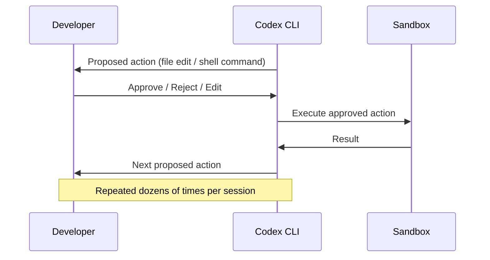

# The Codex Micro: OpenAI's First Hardware and What a Macro Pad Means for Agentic Coding Workflows


---

On 30 June 2026, OpenAI posted a teaser video on X showing a square device covered in buttons, captioned "Your favorite Codex shortcuts are getting an upgrade" [^1]. The product — the **Codex Micro** — is a programmable macro pad co-developed with boutique keyboard manufacturer Work Louder, launching on 15 July 2026 [^2]. It is OpenAI's first branded hardware product, and it is aimed squarely at the 5 million weekly Codex users [^3].

This article examines what we know about the hardware, why a physical input device matters for agentic coding, and how Codex CLI developers can prepare their workflows for hardware-accelerated interaction.

## What We Know About the Hardware

The Codex Micro is built on Work Louder's **Creator Micro 2** chassis [^4]. That platform ships with a well-documented specification:

| Component | Detail |
|---|---|
| Mechanical switches | 13 low-profile MX-style (55g/50g linear, silent or clicky options) |
| Rotary encoder | 1 clickable, supports rotation and press actions |
| Capacitive touch sensor | 1, used for cycling through up to 6 programmable layers |
| Joystick | 2D analogue, supports radial menu triggers |
| Backlighting | Per-key RGB + underglow RGB |
| Connectivity (Base) | USB-C wired |
| Connectivity (Pro) | USB-C + Bluetooth Low Energy, 2,100 mAh battery |
| Frame | CNC aluminium frame, PMMA shell |
| Platform support | macOS, Windows, Linux, iOS, Android |

The Creator Micro 2 Base retails at \$144 and the Pro at \$174 [^5]. Neither OpenAI nor Work Louder has published Codex Micro-specific pricing ahead of the 15 July reveal [^2].

The device supports two configuration tools: Work Louder's proprietary **Input configurator** (application-linked layer switching, multi-step macros) and the open-source **VIA configurator** built on QMK firmware, which allows real-time key remapping without reflashing [^5].

## Why Hardware for an AI Coding Agent?

The question is obvious: why does a coding agent need a physical accessory? The answer lies in the interaction model that agentic coding demands.

### The Approval Bottleneck

Codex CLI's `approval_policy` governs what the agent can do autonomously [^6]. In `suggest` mode — the most cautious setting — every file edit and command execution requires explicit developer approval. Even in `auto-edit` mode, shell commands still need sign-off. This creates a repetitive interaction loop:



Each approval is a context switch. The developer reads the proposal, evaluates it, and hits a key. With a keyboard, that key is buried among 100+ others. A dedicated macro pad with a prominent **Approve** button, a **Reject** button, and an **Edit-then-approve** button reduces the motor and cognitive cost of each approval cycle.

### The Slash Command Surface

Codex CLI v0.131+ ships with 45 slash commands [^7]. The most frequently used in interactive sessions include:

- `/plan` — enter plan mode for complex tasks
- `/clear` — reset the conversation
- `/undo` — revert the last change
- `/copy` — copy output to clipboard
- `/review` — trigger code review
- `/goal` — start a persistent long-running objective [^8]
- `/usage` — check token consumption and credits [^9]

Mapping these to dedicated physical keys eliminates typing and recall overhead. A six-layer macro pad with 13 keys per layer provides 78 distinct bindings — more than enough to cover every slash command, approval action, and reasoning-depth adjustment.

### Reasoning Depth as a Physical Control

Codex CLI supports real-time reasoning depth adjustment via `Alt+,` (lower) and `Alt+.` (raise) [^7]. A rotary encoder maps naturally to this: twist clockwise for deeper reasoning, anticlockwise for faster responses. The analogue joystick could similarly navigate conversation history or scroll through proposed diffs.

## Configuring a Macro Pad for Codex CLI

You do not need to wait for the Codex Micro to start mapping hardware to agentic workflows. Any QMK/VIA-compatible macro pad works. Here is a practical layer configuration:

### Layer 0: Core Approval

```toml
# Conceptual mapping — actual implementation via VIA/QMK
[layer_0]
key_1  = "y"            # Approve action
key_2  = "n"            # Reject action
key_3  = "e"            # Edit before approve
key_4  = "Escape"       # Interrupt current turn
key_5  = "Ctrl+C"       # Cancel / exit
key_6  = "/undo\n"      # Undo last change
key_7  = "/clear\n"     # Clear conversation
encoder_cw = "Alt+."    # Raise reasoning depth
encoder_ccw = "Alt+,"   # Lower reasoning depth
```

### Layer 1: Workflow Commands

```toml
[layer_1]
key_1  = "/plan\n"      # Enter plan mode
key_2  = "/goal\n"      # Start goal mode
key_3  = "/review\n"    # Trigger review
key_4  = "/copy\n"      # Copy output
key_5  = "/usage\n"     # Check token usage
key_6  = "/archive\n"   # Archive session
key_7  = "/fork\n"      # Fork conversation
encoder_cw = "Ctrl+R"   # Search prompt history
```

### Layer 2: Model and Profile Switching

```toml
[layer_2]
key_1  = "/model gpt-5.6-sol\n"     # Switch to Sol
key_2  = "/model gpt-5.6-terra\n"   # Switch to Terra
key_3  = "/model gpt-5.6-luna\n"    # Switch to Luna
key_4  = "/model gpt-5.5\n"         # Fall back to GPT-5.5
key_5  = "/profile security\n"      # Load security profile
key_6  = "/profile fast\n"          # Load fast profile
```

The touch sensor cycles between layers, so a single tap switches context between approval, workflow, and model control without lifting your hands from the pad.

## The Application-Linked Layer Opportunity

Work Louder's Input configurator supports **automatic layer switching** based on the active application [^5]. This means the macro pad can detect when a terminal running Codex CLI has focus and switch to an approval-optimised layer, then switch to an IDE layer when VS Code gains focus, and a browser layer for documentation review.

For teams running Codex alongside the Codex App (which provides workspace, PR review, and task sidebar features [^10]), this allows a single device to serve as the control surface for the entire agentic development workflow.

## What the Codex Micro Does Not Change

It is worth being explicit about limitations:

1. **No model capability improvement.** A macro pad accelerates human-agent interaction; it does not make the underlying model smarter [^3].
2. **No new CLI features.** The Codex Micro sends keystrokes. Every action it performs is already available via keyboard input.
3. **No security boundary change.** Approval gates, sandbox isolation, and `requirements.toml` constraints remain governed by software configuration, not hardware [^6].
4. **Pricing unknown.** Neither the Codex Micro's price nor whether it will be sold separately from a Codex subscription has been confirmed.

The value proposition is ergonomic and cognitive: reducing the friction of repetitive approval cycles, command entry, and reasoning-depth adjustment in workflows that already exist.

## The Broader Signal: Hardware for Human-Agent Interaction

OpenAI has stated that this is distinct from the consumer AI device being developed with Jony Ive, which remains on track for H2 2026 [^2]. The Codex Micro is a developer tool — a niche product targeting a specific interaction pattern.

But the signal is significant. As coding agents move from single-turn assistants to long-running autonomous systems (Goal Mode sessions can run for hours or days [^8]), the human oversight interface becomes the bottleneck. Physical controls that reduce approval latency have a direct impact on agent throughput.

Work Louder has followed this playbook before, building application-specific configurations with partners including Figma [^11]. The pattern — a compact, programmable input device tuned for a specific software workflow — has proven commercially viable in creative tools. Codex represents its first application to agentic coding.

## Preparing for 15 July

Developers interested in hardware-accelerated Codex workflows should:

1. **Audit your approval patterns.** Run a session with `CODEX_LOG_LEVEL=trace` and count approval events. If you approve more than 20 actions per session, a dedicated approval key saves measurable time.
2. **Identify your top 10 slash commands.** Map them to a VIA layer now, on whatever hardware you have.
3. **Consider your `approval_policy`.** If you are running `suggest` mode purely because you lack a fast approval mechanism, the Codex Micro may allow you to remain in `suggest` while matching the throughput of `auto-edit`.
4. **Wait for pricing.** The Creator Micro 2 Base at \$144 is a known quantity [^5]. The Codex Micro may carry a premium, or it may ship with Codex-specific firmware profiles that justify the cost.

The full reveal is 15 July 2026. Until then, the takeaway is clear: OpenAI considers the human-agent interaction surface important enough to ship physical hardware for it.

---

## Citations

[^1]: OpenAI. Teaser post on X, 30 June 2026. [https://aiweekly.co/node/4692](https://aiweekly.co/node/4692)

[^2]: TechTimes. "OpenAI Codex Micro Launches July 15: A Macro Pad Built With Work Louder," 30 June 2026. [https://www.techtimes.com/articles/319389/20260630/openai-codex-micro-launches-july-15-macro-pad-built-work-louder.htm](https://www.techtimes.com/articles/319389/20260630/openai-codex-micro-launches-july-15-macro-pad-built-work-louder.htm)

[^3]: Let's Data Science. "OpenAI Teases Codex Micro Input Device with Work Louder," 30 June 2026. [https://letsdatascience.com/news/openai-teases-codex-micro-input-device-with-work-louder-a1088d18](https://letsdatascience.com/news/openai-teases-codex-micro-input-device-with-work-louder-a1088d18)

[^4]: Technobezz. "OpenAI Unveils Its First Hardware Device a Macro Pad for Codex Coding Assistant," 30 June 2026. [https://www.technobezz.com/news/openai-unveils-its-first-hardware-device-a-macro-pad-for-codex-coding-assistant](https://www.technobezz.com/news/openai-unveils-its-first-hardware-device-a-macro-pad-for-codex-coding-assistant)

[^5]: Work Louder. "Creator Micro 2." [https://worklouder.cc/creator-micro-2](https://worklouder.cc/creator-micro-2)

[^6]: OpenAI Developers. "CLI — Codex." [https://developers.openai.com/codex/cli](https://developers.openai.com/codex/cli)

[^7]: Codex Knowledge Base. "Codex CLI TUI Shortcuts and Slash Commands: The Complete Reference." [https://codex.danielvaughan.com/2026/04/08/codex-cli-tui-shortcuts-slash-commands/](https://codex.danielvaughan.com/2026/04/08/codex-cli-tui-shortcuts-slash-commands/)

[^8]: OpenAI Developers. "Changelog — Codex," May 2026 (Goal Mode GA). [https://developers.openai.com/codex/changelog](https://developers.openai.com/codex/changelog)

[^9]: OpenAI Developers. "Changelog — Codex," v0.142.0, 22 June 2026. [https://developers.openai.com/codex/changelog](https://developers.openai.com/codex/changelog)

[^10]: BreezyScroll. "OpenAI's First Hardware Product Arrives July 15: Here's What We Know," 30 June 2026. [https://www.breezyscroll.com/technology-news/openais-first-hardware-product-arrives-july-15-heres-what-we-know](https://www.breezyscroll.com/technology-news/openais-first-hardware-product-arrives-july-15-heres-what-we-know)

[^11]: DevOps.com. "OpenAI Expands Into Developer Hardware With Codex Micro Keyboard," 30 June 2026. [https://devops.com/openai-expands-into-developer-hardware-with-codex-micro-keyboard/](https://devops.com/openai-expands-into-developer-hardware-with-codex-micro-keyboard/)
