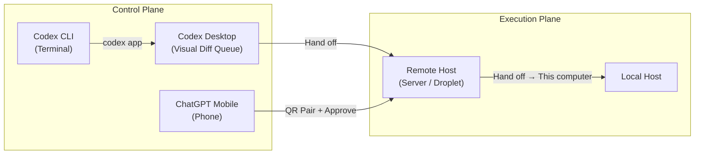
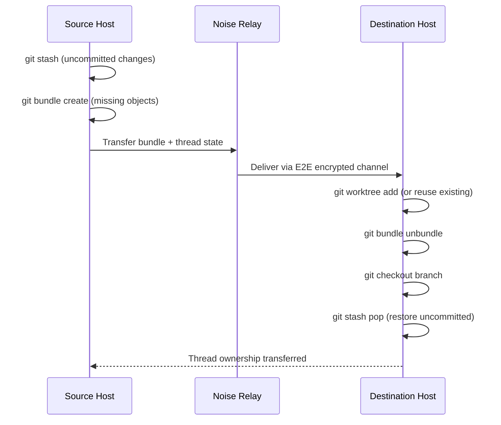
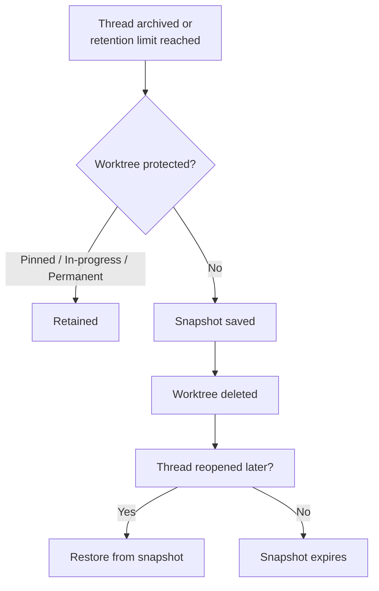

# Codex Thread Handoff: Cross-Machine Git Bundle Transfer, Worktree Isolation, and the Three-Surface Control Plane


---

Codex threads have always been persistent, but they used to be tethered. Start a thread on your laptop, and that is where it stays — until you commit, push, and manually reconstruct context elsewhere. With the Codex App 26.616 release on 18 June 2026 and Codex Remote reaching general availability on 25 June 2026, that constraint is gone [^1][^2]. Thread handoff lets you move a running thread — code, Git state, uncommitted changes — between your local machine, a remote host, and (via the CLI's `codex app` bridge) the Desktop visual surface, without losing transcript, plan history, or approval chain.

This article maps the three handoff surfaces end to end: the Git bundle transfer mechanism that makes cross-machine handoff possible, the worktree isolation model that keeps your existing checkouts untouched, the security constraints that prevent secret leakage, and the practical patterns that make handoff useful rather than merely impressive.

## Why Handoff Matters

A coding agent that can only operate on the machine where it was started creates three bottlenecks:

1. **Mobility lock** — close your laptop lid and the agent stalls at the next approval gate, wasting both your time and its token budget.
2. **Compute mismatch** — an M4 MacBook Air is fine for scaffolding, but a 64-core remote box is where you want a multi-hour migration to run.
3. **Surface mismatch** — the CLI is excellent for rapid iteration; the Desktop's visual diff queue is better for reviewing 40-file refactors; your phone is what you have on the train.

Handoff decouples the *execution plane* (where commands run inside the sandbox) from the *control plane* (where you observe, steer, and approve) [^3].



## The Three Handoff Surfaces

### Surface 1: CLI to Desktop (`codex app`)

The simplest handoff. Running `codex app` from the terminal launches Codex Desktop at the current workspace path, transferring the active thread [^4][^5].

```bash
cd ~/projects/payments-service
codex app
```

On macOS, this opens Desktop directly. On Windows, Codex prints the path for Desktop to open [^5]. The thread carries its full transcript, plan history, and approvals into the Desktop's visual surface — no re-prompting needed.

This is a *same-machine* handoff. Git state does not need transferring because both surfaces read the same filesystem. The value is surface switching: start a debugging investigation in the terminal, realise you need the Desktop's side-by-side diff review to assess 30 changed files, and hand off without context loss.

### Surface 2: Desktop to Remote Host (Cross-Machine)

This is the substantial engineering. Codex transfers a thread's entire working state — code, Git objects, uncommitted changes — from one physical machine to another [^1][^6].

#### Prerequisites

Before initiating a cross-machine handoff:

- The destination host must be connected via Settings → Connections [^6].
- A project for the *same* Git repository must be saved on the destination host.
- If the project is a subdirectory, the same subdirectory must be saved on both hosts [^6].
- Both devices must use the same ChatGPT account and workspace.

#### The Transfer Mechanism

The handoff process uses Git's bundle format to transfer only the delta between hosts [^7]:



The critical detail: Codex creates a *separate worktree* on the destination, so the remote's existing checkout — even if it has uncommitted changes of its own — stays entirely untouched [^7]. This is not a `git pull` into the main checkout. It is a parallel, isolated working copy.

#### Initiating Handoff

From the Codex App thread footer:

1. Select the current run location indicator.
2. Choose the destination host from connected hosts.
3. Review the destination and branch.
4. Select **Hand off** [^6].

To bring work back, select **This computer** as the destination [^6].

You can also ask Codex in *another* thread to hand off a named thread:

> "Hand off the payments-migration thread to my remote server."

One constraint: you cannot hand off the thread making the request [^6].

### Surface 3: Mobile Approval via QR Relay

Codex Remote GA (25 June 2026) added authenticated one-to-one QR pairing between iOS or Android devices and each host [^2][^8]. This is not technically a *thread handoff* — the thread stays on the host — but it extends the control plane to your phone, completing the mobility story.

From the ChatGPT mobile app, you can:

- Review live outputs and terminal diffs [^8].
- Approve or reject agent actions [^8].
- Switch models mid-thread [^8].
- Queue prompts or steer active turns [^3].

The relay architecture keeps the development machine off the public internet; only the authenticated relay channel is exposed [^8].

## The Git Bundle Transfer in Detail

Git bundles (`git bundle create`) package Git objects into a single file that can be transferred over any transport — USB, email, or in this case, Codex's Noise Protocol relay channel [^9][^10]. The bundle contains only the objects missing from the destination, making transfers proportional to *your work*, not the repository's full history.

### What Transfers

| Transferred | Not Transferred |
|---|---|
| Committed objects on your branch | Objects already present on destination |
| Uncommitted staged and unstaged changes | `.gitignore`d files (deliberate safety constraint) [^11] |
| Thread transcript and plan history | Secrets in `.env`, credentials files |
| Approval chain state | Worktree-local environment state |

The `.gitignore` exclusion is a security decision, not a bug. It prevents secrets from leaking across execution contexts [^11]. If you need ignored files on the destination (e.g. `.env.local` for dependencies), use the `.worktreeinclude` file:

```toml
# .worktreeinclude — root of your repository
# Listed paths are copied into new worktrees even if .gitignored
.env.local
config/local.yaml
```

Codex automatically copies listed files into local managed worktrees [^11].

## Worktree Isolation and Lifecycle

Every cross-machine handoff lands in a Git worktree, not the main checkout. This isolation model has several implications worth understanding.

### Branch Exclusivity

Git enforces single-branch-per-worktree: if `feature/payments-v3` is checked out in a worktree, you cannot check it out in the main checkout simultaneously [^11]. Codex handles this transparently during handoff, but you will see `fatal: 'feature/payments-v3' is already used by worktree` if you try to check it out manually.

### Thread Affinity

Each thread keeps the same associated worktree over time [^11]. Hand a thread to a remote host, hand it back a day later, and it returns to the same worktree — not a new one.

### Retention Policy

Codex maintains your most recent 15 managed worktrees by default [^11]. Worktrees tied to pinned conversations, in-progress threads, or marked as permanent are protected from auto-deletion. Before deleting an expired worktree, Codex saves a snapshot that can be restored if the thread reopens [^11].



### Permanent Worktrees

For long-lived environments — a staging server's checkout, a team-shared integration branch — create a permanent worktree from the project menu. These are not auto-deleted and can host multiple threads [^11].

## Security Model

The handoff security model layers three mechanisms:

1. **Noise Protocol relay channels** (v0.141.0+) — end-to-end encrypted transport between hosts, so the relay server sees only ciphertext [^10]. This is the same cryptographic architecture as WireGuard.
2. **QR-authenticated pairing** — each mobile device is individually paired with each host via QR code, validated against the account's authentication framework [^2].
3. **`.gitignore` exclusion** — secrets never cross the transport boundary [^11].

For enterprise deployments, `requirements.toml` constraints travel with the thread, ensuring that a handoff to a less-restricted host does not bypass approval policy:

```toml
# requirements.toml — enforced regardless of destination host
[policy]
approval_policy = "unless-allow-listed"

[sandbox]
sandbox_mode = "full"
```

## Practical Patterns

### Pattern 1: Laptop-to-Server for Long Migrations

Start the database migration on your laptop during design:

```bash
codex "Plan the migration from PostgreSQL 14 to 17, \
  including extension compatibility checks"
```

Review the plan, approve the first steps. When you are ready to leave, hand the thread to your always-on server. The agent continues executing against the remote database, and you approve steps from your phone via the mobile relay.

### Pattern 2: CLI Investigation, Desktop Review

Use the CLI for rapid exploration — grep, trace, hypothesise — then hand off to Desktop when you need the visual diff queue:

```bash
# Terminal: fast investigation
codex "Find all callers of deprecated PaymentGateway.charge() \
  and draft the migration to PaymentService.process()"

# When the agent produces a 40-file changeset:
codex app
```

The Desktop surface renders the diff tree, lets you expand and collapse sections, and attach inline review comments that flow back into the thread [^3].

### Pattern 3: Multi-Machine CI Pipeline

Run Codex against a CI runner with production-like resources. Hand the thread back to your laptop for final review:

1. Start thread locally with the plan.
2. Hand off to CI runner (64 cores, 256 GB RAM).
3. Agent executes compute-intensive tasks (full test suite, benchmarks).
4. Hand off back to laptop for review and commit.

### Pattern 4: DigitalOcean Droplet Workspace

The DigitalOcean plugin (GA with Codex Remote, 25 June 2026) provisions a Droplet, configures SSH, and connects it as a remote workspace [^2]. Combined with thread handoff, you can spin up ephemeral compute, hand off work, and tear it down afterwards:

```bash
# From Codex conversation:
"Provision a 16-core Droplet, hand off the load-test thread, \
  and delete the Droplet when the run completes."
```

The Droplet is billed hourly and remains accessible through the relay layer regardless of your local machine's sleep state [^2].

## Limitations and Gotchas

- **Active responses are interrupted** before a handoff completes — time your handoff between turns, not mid-generation [^6].
- **Cannot hand off the requesting thread** — use a second thread to orchestrate handoff of a named thread [^6].
- **No Codex Cloud handoff** — handoff to Codex cloud environments is not yet supported [^6].
- **Symlinks are skipped** during `.worktreeinclude` copying [^11].
- **Existing files are not overwritten** in new worktree checkouts [^11].
- **Same-subdirectory requirement** — if your project is in `monorepo/services/payments`, the destination must have the same subdirectory saved [^6].

## What This Changes

Thread handoff transforms Codex from a machine-bound tool into a *location-independent agent platform*. The agent's execution follows the compute; your control follows you. The Git bundle mechanism means transfers are fast and incremental. The worktree isolation means your existing work is never at risk.

For teams already using Codex Remote, handoff closes the last gap: you no longer need to choose where to start a task based on where you think it will finish.

## Citations

[^1]: OpenAI, "Codex App 26.616 release notes — Thread handoff between local and remote hosts," 18 June 2026. [https://developers.openai.com/codex/changelog](https://developers.openai.com/codex/changelog)

[^2]: OpenAI, "Codex Remote general availability — QR pairing, DigitalOcean plugin," 25 June 2026. [https://developers.openai.com/codex/changelog](https://developers.openai.com/codex/changelog)

[^3]: OpenAI, "Mastering Codex Remote for engineering," OpenAI Developers Blog, June 2026. [https://developers.openai.com/blog/mastering-codex-remote-for-engineering](https://developers.openai.com/blog/mastering-codex-remote-for-engineering)

[^4]: OpenAI, "Codex CLI v0.138.0 release — Desktop handoff with /app," 8 June 2026. [https://developers.openai.com/codex/changelog](https://developers.openai.com/codex/changelog)

[^5]: OpenAI, "Features — Codex CLI," OpenAI Developers, 2026. [https://developers.openai.com/codex/cli/features](https://developers.openai.com/codex/cli/features)

[^6]: OpenAI, "Remote connections — Thread handoff," OpenAI Developers, 2026. [https://developers.openai.com/codex/remote-connections](https://developers.openai.com/codex/remote-connections)

[^7]: Guinness Chen, discussion on Codex thread handoff Git bundle mechanism, cited in Digg coverage, June 2026. [https://digg.com/tech/7l39ujpi](https://digg.com/tech/7l39ujpi)

[^8]: TechTimes, "OpenAI Codex Remote Goes Live for All Plans: Phone Control Now Secured by QR Relay," 27 June 2026. [https://www.techtimes.com/articles/319201/20260627/openai-codex-remote-goes-live-all-plans-phone-control-now-secured-qr-relay.htm](https://www.techtimes.com/articles/319201/20260627/openai-codex-remote-goes-live-all-plans-phone-control-now-secured-qr-relay.htm)

[^9]: Git documentation, "git-bundle — Move objects and refs by archive," git-scm.com. [https://git-scm.com/docs/git-bundle](https://git-scm.com/docs/git-bundle)

[^10]: OpenAI, "Codex CLI v0.141.0 — Noise Protocol relay channels for remote execution," 18 June 2026. [https://developers.openai.com/codex/changelog](https://developers.openai.com/codex/changelog)

[^11]: OpenAI, "Worktrees — Codex app," OpenAI Developers, 2026. [https://developers.openai.com/codex/app/worktrees](https://developers.openai.com/codex/app/worktrees)
