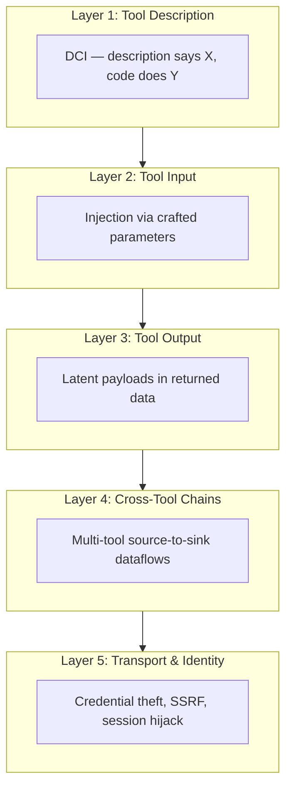
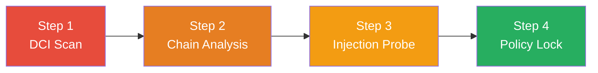
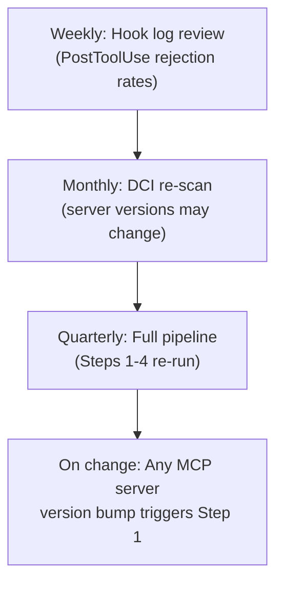

# The MCP Security Compendium: A Unified Threat Model, Per-Surface Defence Architecture, and Enterprise Governance Template for Codex CLI


---

Four independent research streams published between January and June 2026 have mapped the MCP attack surface with unprecedented precision. Description-code inconsistency affects nearly 10% of tool descriptions across 2,214 servers [^1]. Workflow-level fuzzing confirms that 19 of 20 tested agent applications harbour exploitable multi-tool chain vulnerabilities [^2]. Automated red-teaming discovers latent prompt injections that bypass every shipping defence [^3]. And the NSA's first MCP-specific Cybersecurity Information Sheet calls out serialised tool responses and missing privilege isolation as structural risks requiring architectural remediation [^4].

This compendium consolidates those findings into a single, actionable threat model, maps each threat surface to Codex CLI's layered defence controls, provides a four-step pre-deployment audit pipeline, and offers an enterprise governance template ready for adoption.

---

## The Unified MCP Threat Model

MCP's attack surface spans five distinct layers. Each layer has been independently validated by at least one 2026 study. The taxonomy below draws on MCP-DPT's defence-placement analysis [^5] and integrates findings from each source study.



### Layer 1 — Tool Description Integrity

Shi et al. found that 9.93% of 19,200 description-code pairs exhibit description-code inconsistency (DCI), with 35% of servers containing at least one inconsistent tool [^1]. Their seven-subtype taxonomy identifies overclaimed functionality (35.4%), misclaimed functionality (14.6%), undeclared functionality (9.2%), ambiguous descriptions (3.3%), undeclared state mutations (22.8%), data leakage (13.6%), and resource overconsumption (1.0%) [^1]. Li et al. independently confirmed approximately 13% mismatch rates across 10,240 servers, documenting specific cases of hidden financial trading operations and undisclosed process-kill capabilities [^6].

DCIChecker achieves 96.73% F1 in automated detection, combining structure-aware static analysis with Direct-Reverse-Arbitration prompting [^1].

### Layer 2 — Tool Input Manipulation

ChainFuzzer's static analysis extracts exploitable input vectors from 998 tools across 20 applications [^2]. The framework identifies high-impact operations through strict source-to-sink dataflow evidence, then synthesises stable prompts that drive agents to execute target chains with 95.45% reachability (up from 27.05% baseline) [^2]. Guardrail-aware fuzzing further raises payload trigger rates from 18.20% to 88.60% [^2].

### Layer 3 — Tool Output Contamination

PI-Hunter demonstrates that latent prompt injections embedded in tool outputs survive PIGuard, Spotlight, and MELON defences [^3]. Source-aware seeding achieves 2.5x the Source Recall of generic approaches (0.4796 vs 0.1918) [^3]. Evolutionary exploitation discovers injection paths that static analysis misses entirely, with Instruction Recall rising from 0.000 to 0.194 for previously undetectable payloads [^3].

### Layer 4 — Cross-Tool Chain Exploitation

ChainFuzzer confirms 365 unique, reproducible vulnerabilities across 19 of 20 tested applications, with 302 requiring multi-tool execution [^2]. The critical insight: data produced by one tool persists and becomes input to another, creating exploitable source-to-sink dataflows visible only through tool composition [^2]. Tool-chain extraction achieves 96.49% edge precision [^2].

### Layer 5 — Transport and Identity

The NSA CSI (May 2026) flags serialised tool responses carrying malicious payloads, and agents operating across multiple MCP servers lacking adequate privilege isolation [^4]. A 2026 audit found that 40% of MCP servers still require no authentication, 43% carry command-injection vulnerabilities, and 79% handle credentials in plaintext [^7]. The Five Eyes joint guidance on agentic AI services reinforces that authentication and prompt injection defences are required mitigations, not optional hardening [^8].

---

## Per-Surface Defence Architecture in Codex CLI

Codex CLI provides layered controls that map directly to each threat surface. The table below provides a defence-to-surface mapping.

| Threat Surface | Codex CLI Control | Config Location |
|---|---|---|
| DCI (Layer 1) | `enabled_tools` / `disabled_tools` allow-lists | `config.toml` |
| DCI (Layer 1) | Per-tool `approval_mode` escalation | `config.toml` |
| Input manipulation (Layer 2) | `PreToolUse` hook validation | Hook scripts |
| Output contamination (Layer 3) | `PostToolUse` hook scanning | Hook scripts |
| Cross-tool chains (Layer 4) | `tool_timeout_sec` bounds | `config.toml` |
| Cross-tool chains (Layer 4) | Granular approval policy | `config.toml` |
| Transport/identity (Layer 5) | Sandbox network isolation | `config.toml` |
| Transport/identity (Layer 5) | `requirements.toml` enforcement | Enterprise config |

### Defence 1: Tool Allow-Lists Against DCI

The most direct mitigation for description-code inconsistency is to deny-by-default and explicitly allow only audited tools:

```toml
# config.toml — project-scoped MCP tool governance
[mcp]
enabled_tools = [
  "github--get_file_contents",
  "github--search_code",
  "github--create_pull_request",
]
# Everything not listed is blocked
```

For servers where you need broad access but want to exclude specific risky tools:

```toml
[mcp]
disabled_tools = [
  "longport--submit_order",
  "longport--cancel_order",
  "zerops--updateUser",
]
```

### Defence 2: Pre- and Post-Tool Hooks

Hooks reached general availability on 2026-05-14[^9]. They provide the primary runtime defence against input manipulation and output contamination.

A `PreToolUse` hook validates inputs before execution:

```bash
#!/usr/bin/env bash
# hooks/pre-tool-validate.sh
# Block tools attempting to access sensitive paths
TOOL_INPUT="$CODEX_TOOL_INPUT"
if echo "$TOOL_INPUT" | grep -qE '(/etc/passwd|\.env|credentials)'; then
  echo '{"status": "reject", "reason": "Sensitive path access blocked"}'
  exit 0
fi
echo '{"status": "approve"}'
```

A `PostToolUse` hook scans outputs for injection markers:

```bash
#!/usr/bin/env bash
# hooks/post-tool-scan.sh
# Detect common injection patterns in tool output
TOOL_OUTPUT="$CODEX_TOOL_OUTPUT"
if echo "$TOOL_OUTPUT" | grep -qiE '(ignore previous|system prompt|<\|im_start\|>)'; then
  echo '{"status": "reject", "reason": "Potential injection detected in output"}'
  exit 0
fi
echo '{"status": "approve"}'
```

### Defence 3: Granular Approval Policy

Codex CLI's granular approval policy provides per-category control:

```toml
[approval_policy]
granular = {
  sandbox_approval = true,
  rules = true,
  mcp_elicitations = true,
  request_permissions = true,
  skill_approval = true,
}
```

For MCP-specific escalation, per-tool approval modes force human review for high-risk operations while allowing automated flow for read-only tools [^10].

### Defence 4: Sandbox and Network Isolation

Every Codex sandbox mode starts with network access disabled during the agent phase — where the model executes shell commands and reads files — which is where prompt injection and data exfiltration risks are highest [^10].

```toml
# Restrict sandbox to workspace writes only
sandbox_mode = "workspace-write"

# Control network access granularly
[sandbox_workspace_write]
network_access = false

# Or allow specific domains only
[features.network_proxy]
enabled = true
domains = { "api.github.com" = "allow" }
```

---

## The Four-Step Pre-Deployment Audit Pipeline

Before any MCP server reaches production Codex CLI workflows, run this pipeline:



### Step 1 — DCI Scan

Run DCIChecker or equivalent static analysis against every MCP server in your `config.toml`. Cross-validate tool descriptions against source code. Flag any tool exhibiting Func-Over, Func-Un, or Eff-DL subtypes for immediate review [^1]. Automated scanning at 96.73% F1 means false negatives are rare; false positives are cheap to verify manually [^1].

### Step 2 — Chain Analysis

Map cross-tool dataflows. ChainFuzzer's static extraction identifies source-to-sink paths with 96.49% edge precision [^2]. For each identified chain, ask: does data from Tool A flow into a privileged operation in Tool B without sanitisation? If yes, insert a `PostToolUse` hook between the two operations or split the workflow across separate sandbox sessions.

### Step 3 — Injection Probe

Use PI-Hunter's source-aware methodology: enumerate every external data source each tool interacts with, then generate targeted test cases against each source [^3]. Evolutionary exploitation over even a small number of iterations discovers latent injections that static defences miss [^3]. Run probes against your actual Codex CLI configuration — hooks, approval policies, and sandbox settings included — to verify defence coverage.

### Step 4 — Policy Lock

Once Steps 1-3 pass, lock the configuration:

```toml
# requirements.toml — enterprise enforcement
[enterprise]
allowed_sandbox_modes = ["workspace-write", "read-only"]
allowed_approval_policies = ["on-request"]

[enterprise.mcp]
allowlisted_servers = [
  "github-mcp-server",
  "internal-jira-mcp",
]
# All other MCP servers blocked at the enterprise level
```

Commit `requirements.toml` to the repository root. Codex CLI enforces these constraints regardless of individual developer `config.toml` settings [^10].

---

## Enterprise Governance Template

The following template codifies the four-step pipeline into repeatable enterprise governance. Adapt to your organisation's change management process.

### MCP Server Onboarding Checklist

```markdown
## MCP Server: [server-name]
## Requested by: [team]
## Date: YYYY-MM-DD

### 1. DCI Scan
- [ ] DCIChecker run against all tool descriptions
- [ ] Zero Func-Un (undeclared functionality) findings
- [ ] Zero Eff-DL (data leakage) findings
- [ ] All Func-Over findings reviewed and accepted/mitigated

### 2. Chain Analysis
- [ ] Cross-tool dataflow map generated
- [ ] No unmediated source-to-sink paths to privileged operations
- [ ] PostToolUse hooks inserted for any mediated chains

### 3. Injection Probe
- [ ] PI-Hunter source-aware scan completed
- [ ] All identified injection vectors mitigated by hooks or approval policy
- [ ] Evolutionary exploitation run (minimum 3 iterations)

### 4. Policy Lock
- [ ] Server added to requirements.toml allowlist
- [ ] enabled_tools list defined (deny-by-default)
- [ ] Per-tool approval_mode set for write operations
- [ ] Sandbox mode confirmed as workspace-write or read-only

### Sign-off
- [ ] Security team approval
- [ ] config.toml and requirements.toml committed
```

### Continuous Monitoring

MCP servers update independently of your configuration. Establish a recurring audit cadence:



Use Codex CLI's OpenTelemetry export to feed hook invocation data into your observability stack:

```toml
[otel]
environment = "production"
exporter = "otlp-http"
log_user_prompt = false
```

Monitor `PostToolUse` rejection rates as a leading indicator. A sudden spike suggests either a server update introduced new behaviour or an active attack is in progress.

---

## What the Research Consensus Tells Us

Six months of intensive MCP security research has produced a clear consensus: MCP's flexibility-first design creates structural security gaps that cannot be patched at any single layer [^5]. The NSA's architectural framing is correct — individual deployments cannot patch their way out without defence-in-depth [^4].

The good news: Codex CLI's control surface — tool allow-lists, PreToolUse/PostToolUse hooks, granular approval policies, sandbox isolation, and enterprise `requirements.toml` — provides coverage across all five threat layers. The bad news: none of these controls are enabled by default in a configuration that addresses all layers simultaneously. Security requires deliberate architecture.

This compendium provides that architecture. Use the threat model as your map, the per-surface defences as your controls, the four-step pipeline as your gate, and the governance template as your process. MCP's flexibility remains an asset — but only when bounded by systematic defence.

---

## Citations

[^1]: Shi, Y., et al. "Description-Code Inconsistency in Real-world MCP Servers: Measurement, Detection, and Security Implications." arXiv:2606.04769, June 2026. [https://arxiv.org/abs/2606.04769](https://arxiv.org/abs/2606.04769)

[^2]: ChainFuzzer authors. "ChainFuzzer: Greybox Fuzzing for Workflow-Level Multi-Tool Vulnerabilities in LLM Agents." arXiv:2603.12614, March 2026. [https://arxiv.org/abs/2603.12614](https://arxiv.org/abs/2603.12614)

[^3]: He, P., Miculicich, L., Sharma, V., Fox, A., Lee, G., Tang, J., Pfister, T., and Le, L.T. "PI-Hunter: Automated Red-Teaming for Exposing and Localizing Prompt Injections." arXiv:2606.12737, June 2026. [https://arxiv.org/abs/2606.12737](https://arxiv.org/abs/2606.12737)

[^4]: NSA Cybersecurity Information Sheet. "Model Context Protocol Security." U/OO/6030316-26, PP-26-1834, May 2026. [https://www.nsa.gov/Portals/75/documents/Cybersecurity/CSI_MCP_SECURITY.pdf](https://www.nsa.gov/Portals/75/documents/Cybersecurity/CSI_MCP_SECURITY.pdf)

[^5]: Rostamzadeh, M., Narula, S., Birhan, N., Ghasemigol, M., and Takabi, D. "MCP-DPT: A Defense-Placement Taxonomy and Coverage Analysis for Model Context Protocol Security." arXiv:2604.07551, April 2026. [https://arxiv.org/abs/2604.07551](https://arxiv.org/abs/2604.07551)

[^6]: Li, Z., et al. "Don't Believe Everything You Read: Understanding and Measuring MCP Behavior under Misleading Tool Descriptions." arXiv:2602.03580, February 2026. [https://arxiv.org/abs/2602.03580](https://arxiv.org/abs/2602.03580)

[^7]: Codersera. "How to Secure MCP Servers: Auth, Prompt Injection & Defenses." 2026. [https://codersera.com/blog/how-to-secure-mcp-servers-2026/](https://codersera.com/blog/how-to-secure-mcp-servers-2026/)

[^8]: Five Eyes joint guidance. "Careful Adoption of Agentic AI Services." May 2026. Referenced via [Secure Code Warrior analysis](https://www.securecodewarrior.com/article/the-nsa-just-issued-its-first-mcp-security-guidance-heres-what-it-means-for-developer-capability)

[^9]: OpenAI. "Codex CLI Changelog — Hooks GA, 2026-05-14." [https://developers.openai.com/codex/changelog](https://developers.openai.com/codex/changelog)

[^10]: OpenAI. "Agent Approvals & Security — Codex CLI." [https://developers.openai.com/codex/agent-approvals-security](https://developers.openai.com/codex/agent-approvals-security)
