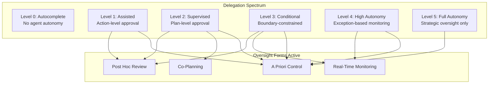
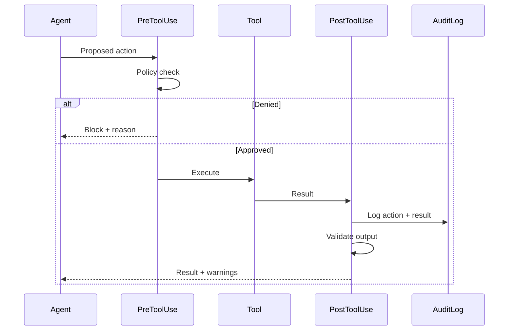
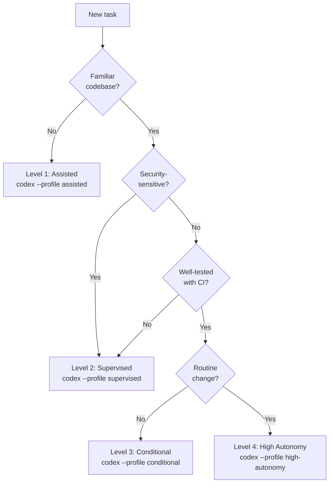

# The Oversight Architecture Guide: Mapping the Delegation Spectrum to Codex CLI Approval Profiles, Hooks, and Named Configurations


---

Two separate conversations dominate the discourse around coding agent oversight, and they rarely intersect. The first asks *what forms does oversight take?* — the practical work developers perform when supervising agents. The second asks *how autonomous should the agent be?* — where on the delegation spectrum a given task belongs. This guide bridges the gap, synthesising the Dhanorkar et al. four-forms taxonomy [^1], the Shapiro five-level autonomy model [^2], and the CSA six-level governance framework [^3] into a unified oversight architecture, then mapping every layer to concrete Codex CLI configuration.

## Two Taxonomies, One Problem

### The Four Forms of Oversight Work

Dhanorkar, Passi, and Vorvoreanu's qualitative study of 17 experienced developers identified four distinct forms of emergent oversight work [^1]:

1. **A priori control** — configuration, instruction files, and constraints set before the agent runs
2. **Co-planning** — collaborative plan formulation where the developer steers decomposition and ordering
3. **Real-time monitoring** — watching agent execution, intervening on anomalous behaviour
4. **Post hoc review** — reviewing completed output, diffs, and test results after execution

The study's key insight: oversight is not primarily reactive. Two of the four forms occur *before* the agent writes code [^1]. Developers described their instruction files as "the most important asset," yet many still relied on ad hoc prompts rather than persistent configuration [^1].

### The Delegation Spectrum

The Shapiro five-level model classifies coding agent autonomy along a single axis — how much work the agent completes before returning for feedback [^2]:

| Level | Label | Developer Role | Oversight Form |
|-------|-------|---------------|----------------|
| 0 | Spicy Autocomplete | Author | A priori control |
| 1 | Coding Intern | Delegator + line-reviewer | A priori + post hoc |
| 2 | Junior Developer | Reviewer-with-veto | All four forms |
| 3 | Developer | Full-time reviewer of parallel agents | Real-time + post hoc |
| 4 | Engineering Team | Spec author + harness designer | A priori + automated post hoc |
| 5 | Dark Software Factory | Factory architect | Automated only |

The CSA extends this with an enterprise governance lens, defining six levels (0–5) with escalating requirements: from minimal controls at Level 0 to "not appropriate for enterprise deployment" at Level 5 [^3]. Their Level 3 — "Conditional: AI Decision within Boundaries" — maps most directly to how mature Codex CLI teams operate today.



## Mapping Each Level to Codex CLI Configuration

The practical value of the delegation spectrum emerges when each level maps to a named Codex CLI profile. Profiles live as separate TOML files under `~/.codex/` and activate with `--profile <name>` [^4] [^5].

### Level 1 — Assisted: Action-Level Approval

Every tool invocation pauses for human review. This is appropriate for unfamiliar codebases, security-sensitive operations, or onboarding new team members to agent workflows.

```toml
# ~/.codex/assisted.config.toml
model = "o4-mini"
approval_policy = "untrusted"
sandbox_mode = "read-only"
```

The `untrusted` policy requires approval for all state-mutating commands [^6]. Combined with `read-only` sandbox mode, the agent cannot modify files without explicit permission at every step.

**Active oversight forms:** A priori control (the config itself), post hoc review (every action reviewed before execution).

### Level 2 — Supervised: Plan-Level Approval

The developer approves a plan, then the agent executes within that scope. This maps to Codex CLI's `on-request` policy with workspace-write sandbox, where the agent can edit files but pauses for sensitive operations [^6]:

```toml
# ~/.codex/supervised.config.toml
model = "gpt-5-codex"
approval_policy = "on-request"
sandbox_mode = "workspace-write"

[sandbox_workspace_write]
network_access = false
writable_roots = []
```

Network access is disabled by default in workspace-write mode [^7]. The agent operates freely within the workspace but escalates for anything outside its sandbox boundary.

**Active oversight forms:** A priori control, co-planning (via plan mode), post hoc review.

### Level 3 — Conditional: Boundary-Constrained Autonomy

This is where granular approval policies earn their keep. Rather than a single policy string, the granular form controls five independent prompt categories [^5] [^6]:

```toml
# ~/.codex/conditional.config.toml
model = "gpt-5-codex"
model_reasoning_effort = "high"

approval_policy = { granular = {
  sandbox_approval = true,
  rules = false,
  mcp_elicitations = true,
  request_permissions = false,
  skill_approval = false
} }

sandbox_mode = "workspace-write"

[sandbox_workspace_write]
network_access = true

[features.network_proxy]
enabled = true
domains = { "api.github.com" = "allow", "registry.npmjs.org" = "allow", "*" = "deny" }
```

This profile auto-approves rule-based and skill-based actions but requires human sign-off for sandbox escalations and MCP tool elicitations [^5]. The network proxy constrains outbound traffic to an explicit allowlist [^7].

**Active oversight forms:** A priori control (config + AGENTS.md), real-time monitoring (sandbox escalation alerts), post hoc review (selective).

### Level 4 — High Autonomy: Exception-Based Monitoring

The agent operates broadly; humans monitor for anomalies and handle exceptions. This requires the automatic review subagent:

```toml
# ~/.codex/high-autonomy.config.toml
model = "gpt-5-codex"
model_reasoning_effort = "xhigh"
approval_policy = "on-request"
approvals_reviewer = "auto_review"

sandbox_mode = "workspace-write"

[sandbox_workspace_write]
network_access = true

[auto_review]
policy = "Approve file edits within the workspace. Deny credential access, production deployments, and destructive git operations. Escalate ambiguous cases to user."
```

The `auto_review` reviewer routes eligible approval requests through an automatic assessment that checks for data exfiltration, credential probing, and destructive behaviours [^5] [^8]. The default policy denies critical-risk actions; high-risk actions escalate to the user.

**Active oversight forms:** A priori control (config + auto-review policy), real-time monitoring (automated).

## AGENTS.md: The A Priori Control Surface

Across all delegation levels, AGENTS.md files serve as the primary vehicle for a priori control [^9]. Codex CLI supports a hierarchical structure where project-root instructions cascade to subdirectories, with per-directory overrides:

```
project-root/
├── AGENTS.md              # Global constraints
├── src/
│   └── AGENTS.md          # Source-specific rules
├── tests/
│   └── AGENTS.md          # Test-specific rules
└── infra/
    └── AGENTS.md          # Infrastructure constraints
```

Each level on the delegation spectrum should encode its constraints in AGENTS.md rather than relying on conversational prompts. Dhanorkar et al. found that developers who treated instruction files as living documents — "constant maintaining, improving, and iterating" — reported significantly better oversight outcomes [^1].

## Hooks: Programmatic Oversight at Every Level

Codex CLI's PreToolUse and PostToolUse hooks provide programmatic oversight that scales across delegation levels [^5] [^10]. Hooks execute custom scripts before or after tool invocations, enabling policy enforcement without manual review.



Define hooks in `~/.codex/hooks.json` or project-level `.codex/hooks.json`:

```json
{
  "PreToolUse": [
    {
      "matcher": "^Bash$",
      "hooks": [
        {
          "type": "command",
          "command": "/usr/bin/python3 .codex/policies/pre-bash-check.py",
          "timeout": 30,
          "statusMessage": "Checking command against policy"
        }
      ]
    }
  ],
  "PostToolUse": [
    {
      "matcher": ".*",
      "hooks": [
        {
          "type": "command",
          "command": "/usr/bin/python3 .codex/policies/audit-log.py",
          "timeout": 10,
          "statusMessage": "Recording audit trail"
        }
      ]
    }
  ]
}
```

At Level 1, hooks are redundant — the developer reviews everything manually. At Level 3 and above, they become essential for enforcing boundaries that the approval policy alone cannot express.

## Choosing Your Level: A Decision Framework

The delegation level is not a property of the team — it is a property of the *task*. The same developer should switch profiles throughout a single working session:



The Anthropic 2026 Agentic Coding Trends Report found that developers use AI in roughly 60% of their work but can fully delegate only 0–20% of tasks [^11]. This aligns with the CSA's position that Level 5 is "not appropriate for enterprise deployment today" [^3]. The practical ceiling for most teams is Level 3–4, with frequent drops to Level 1–2 for unfamiliar or high-stakes work.

## Trust Calibration Over Time

Codex CLI's project trust system provides a meta-layer of oversight [^4]. When you first open a repository, Codex presents a trust prompt. Untrusted projects skip all project-scoped `.codex/` configuration — hooks, rules, and skills are ignored [^4].

```toml
# ~/.codex/config.toml — project trust settings
[projects]
"/home/dev/trusted-monorepo" = { trust_level = "trusted" }
"/tmp/external-pr" = { trust_level = "untrusted" }
```

This maps to the CSA's emphasis on "machine-readable boundary definitions" and "technical enforcement mechanisms" at Level 3 [^3]. Trust is not assumed; it is explicitly granted per workspace.

Longitudinal data suggests the relationship evolves: auto-approve rates increase from approximately 20% at fewer than 50 sessions to over 40% by 750 sessions [^12]. This natural calibration should be reflected in periodic profile reviews — tightening or loosening constraints as the team's understanding of agent behaviour matures.

## The Oversight Maturity Model

Combining the four forms of oversight with the delegation spectrum produces a maturity model for teams adopting coding agents:

| Maturity | Primary Oversight | Delegation Levels | Key Codex CLI Features |
|----------|------------------|-------------------|----------------------|
| **Reactive** | Post hoc review only | 0–1 | Default config, manual review |
| **Structured** | A priori + post hoc | 1–2 | AGENTS.md, named profiles, `on-request` |
| **Proactive** | All four forms | 2–3 | Granular approval, hooks, network proxy |
| **Automated** | A priori + automated monitoring | 3–4 | `auto_review`, PostToolUse audit, OpenTelemetry export |

Most teams begin at Reactive, treating the agent as a faster typist. The shift to Structured — investing in AGENTS.md and named profiles — produces the largest marginal improvement in oversight quality. The shift to Proactive adds hooks and granular policies. Automated oversight at Level 4 requires significant investment in review policies and audit infrastructure.

## Practical Recommendations

1. **Create at least three named profiles** — `assisted`, `supervised`, and `conditional` — and switch between them based on task risk, not habit.

2. **Treat AGENTS.md as code** — version it, review changes in PRs, and iterate continuously. Dhanorkar et al. found this single practice distinguished effective oversight from theatre [^1].

3. **Deploy PostToolUse hooks for audit logging at Level 2+** — even if you review everything manually today, the audit trail becomes essential when you move to higher delegation levels.

4. **Set explicit network allowlists** — the network proxy feature (`features.network_proxy`) enforces the CSA's Level 3 requirement for "machine-readable boundary definitions" [^3] [^7].

5. **Review your profiles quarterly** — as trust calibrates, update your conditional profile's granular settings. What required `sandbox_approval = true` three months ago may be safely relaxed for well-understood operations.

6. **Never skip from Level 1 to Level 4** — the Shapiro model's key insight is that 90% of developers plateau at Level 2 [^2]. Progression through intermediate levels builds the oversight muscle memory that Level 4 demands.

## Citations

[^1]: Dhanorkar, S., Passi, S., & Vorvoreanu, M. (2026). "Human oversight of agentic systems in practice: Examining the oversight work, challenges, and heuristics of developers using software agents." arXiv:2606.05391. [https://arxiv.org/abs/2606.05391](https://arxiv.org/abs/2606.05391)

[^2]: Shapiro, O. (2026). "Agentic Coding Levels (Shapiro Five Levels)." env.dev. [https://env.dev/ai/agentic-coding-levels](https://env.dev/ai/agentic-coding-levels)

[^3]: Cloud Security Alliance. (2026). "Autonomy Levels for Agentic AI." CSA Blog, 28 January 2026. [https://cloudsecurityalliance.org/blog/2026/01/28/levels-of-autonomy](https://cloudsecurityalliance.org/blog/2026/01/28/levels-of-autonomy)

[^4]: OpenAI. (2026). "Advanced Configuration — Codex CLI." OpenAI Developers. [https://developers.openai.com/codex/config-advanced](https://developers.openai.com/codex/config-advanced)

[^5]: OpenAI. (2026). "Configuration Reference — Codex CLI." OpenAI Developers. [https://developers.openai.com/codex/config-reference](https://developers.openai.com/codex/config-reference)

[^6]: OpenAI. (2026). "Agent Approvals & Security — Codex CLI." OpenAI Developers. [https://developers.openai.com/codex/agent-approvals-security](https://developers.openai.com/codex/agent-approvals-security)

[^7]: OpenAI. (2026). "Config Basics — Codex CLI." OpenAI Developers. [https://developers.openai.com/codex/config-basic](https://developers.openai.com/codex/config-basic)

[^8]: Vaughan, D. (2026). "Codex CLI Granular Approval Policies and the Auto-Review Subagent." Codex Knowledge Base. [https://codex.danielvaughan.com/2026/05/07/codex-cli-granular-approval-policies-auto-review-subagent-autonomous-secure-workflows/](https://codex.danielvaughan.com/2026/05/07/codex-cli-granular-approval-policies-auto-review-subagent-autonomous-secure-workflows/)

[^9]: Vaughan, D. (2026). "Codex CLI Configuration Complete Guide: Hierarchy, Profiles, and Trust." Codex Knowledge Base. [https://codex.danielvaughan.com/2026/04/16/codex-cli-configuration-complete-guide-hierarchy-profiles-trust/](https://codex.danielvaughan.com/2026/04/16/codex-cli-configuration-complete-guide-hierarchy-profiles-trust/)

[^10]: Vaughan, D. (2026). "The --full-auto Deprecation: Migrating to Codex CLI's Explicit Permission Profiles and Trust Flows." Codex Knowledge Base. [https://codex.danielvaughan.com/2026/05/02/codex-cli-full-auto-deprecation-permission-profiles-trust-flows/](https://codex.danielvaughan.com/2026/05/02/codex-cli-full-auto-deprecation-permission-profiles-trust-flows/)

[^11]: Anthropic. (2026). "2026 Agentic Coding Trends Report." [https://resources.anthropic.com/hubfs/2026%20Agentic%20Coding%20Trends%20Report.pdf](https://resources.anthropic.com/hubfs/2026%20Agentic%20Coding%20Trends%20Report.pdf)

[^12]: Swarmia. (2026). "Five levels of AI coding agent autonomy, and why higher isn't always better." Swarmia Blog. [https://www.swarmia.com/blog/five-levels-ai-agent-autonomy/](https://www.swarmia.com/blog/five-levels-ai-agent-autonomy/)
