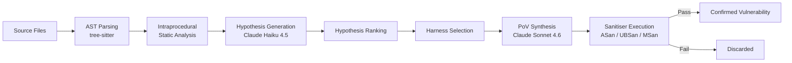
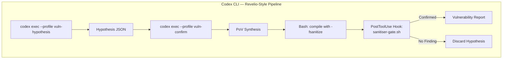

# Revelio and the Harness-First Thesis: What Agentic Memory-Safety Vulnerability Detection Means for Codex CLI Security Workflows


---

Memory-safety vulnerabilities remain the dominant class of exploitable bug in production C and C++ codebases, even after years of continuous fuzzing under OSS-Fuzz[^1]. Hou et al.'s Revelio paper (arXiv:2606.22263, June 2026) demonstrates that an agentic framework using cheap models and a well-engineered harness can find vulnerabilities that eight years of fuzzing missed — and it does so for roughly \$42 per project with zero false positives[^2]. The central claim — that harness engineering matters more than model choice — has direct implications for how we configure Codex CLI security workflows.

## What Revelio Does

Revelio is a two-stage agentic pipeline for discovering memory-safety vulnerabilities in repository-scale C/C++ codebases[^2].



**Stage 1 — Hypothesis Generation.** Revelio parses every source file with tree-sitter, runs lightweight intraprocedural static analysis to identify unchecked parameters and suspicious patterns, then passes each candidate through Claude Haiku 4.5 to generate vulnerability hypotheses[^2]. Multiple LLM passes examine different code perspectives to maximise recall. The use of a cheap model here is deliberate: hypothesis generation is a coverage problem, not a precision problem[^3].

**Stage 2 — Hypothesis Confirmation.** For each ranked hypothesis, Revelio selects an executable test harness (an existing fuzz target or program entry point that can reach the suspect code), invokes Claude Sonnet 4.6 to synthesise a Proof-of-Vulnerability (PoV) input, and validates it by executing the programme under AddressSanitizer, UndefinedBehaviorSanitizer, or MemorySanitizer[^2]. Only sanitiser-confirmed bugs are reported.

The entire system is implemented in 4,100 lines of Python, uses YAML-based Jinja templates for dynamic prompt generation, and runs each confirmation step inside Docker containers for isolation[^2].

## The Numbers

Revelio was evaluated on two corpora: seven production-quality OSS-Fuzz projects that had been continuously fuzzed for five to eight years, and 100 randomly selected Arvo projects from the CyberGym benchmark[^2].

### Zero-Day Discovery

| Metric | Result |
|---|---|
| Previously unknown vulnerabilities | 19 |
| CVEs assigned/requested | 7 |
| Median cost per project | \$42 |
| Median runtime per project | 65 minutes |
| Total cost (all projects) | ~\$300 |
| False positive rate | 0% |

The vulnerability breakdown: 7 integer overflows, 7 heap buffer overflows, 3 out-of-bounds reads, 1 integer underflow, 1 out-of-bounds write[^2].

### Benchmark Comparison (CyberGym, 100 Projects)

| Agent | Vulns Found | Known Vuln Recall | False Positive Rate |
|---|---|---|---|
| **Revelio** | **175** | **69%** | **0%** |
| Claude Code | 55 | 53% | 49% |
| Codex | 39 | 39% | 60% |
| Sorcar | 31 | 31% | 28% |

Revelio identified 122 vulnerabilities missed by all three baseline agents[^2]. The cost per vulnerability was \$9.10, comparable to the baselines — but with zero false positives versus 28–60% for competitors[^2].

## The Harness-First Thesis

The paper's most consequential finding comes from its ablation study. Running Claude Sonnet uniformly across four progressively structured harness tiers[^2]:

| Tier | Description | Vulns Found | False Positive Rate | Recall |
|---|---|---|---|---|
| T1 | Bare prompt | 6 | 33% | — |
| T2 | Pipeline-described | 7 | 22% | — |
| T2.5 | Structured handoff | 11 | 31% | — |
| T3 | Full harness | 14 | 0% | 80% |

The progression from T1 to T3 — same model, same budget, different harness — demonstrates that programmatic workflow guidance is necessary beyond prompting alone[^3]. As the authors put it: "you don't need a secret model or complex orchestration to find real security issues — you need an effective, affordable, and reliable harness"[^3].

This result has broader implications. The harness-first thesis argues that the agent's operational framework — how it decomposes tasks, validates outputs, and chains verification steps — determines outcome quality more than the underlying model's raw capability.

## Mapping Revelio's Architecture to Codex CLI

Revelio's two-stage design maps directly onto Codex CLI's hook pipeline and configuration surface. Here is how to replicate the core pattern.

### Stage 1: Hypothesis Generation via Subagent Delegation

Codex CLI's multi-agent delegation modes (v0.142.0) support spawning cheap-model subagents for high-coverage scanning[^4]. Configure a named profile for the hypothesis generation stage:

```toml
# ~/.codex/profiles/vuln-hypothesis.toml
model = "gpt-5.5"  # cheaper model for coverage
approval_policy = "unless-allow-listed"
sandbox_mode = "full"
rollout_token_budget = 50000
```

Run the hypothesis sweep with:

```bash
codex --profile vuln-hypothesis exec \
  "Scan src/ for memory-safety vulnerability candidates. \
   For each, output a JSON hypothesis with file, line, type, \
   and confidence. Focus on unchecked buffer operations, \
   integer arithmetic near allocation sizes, and missing \
   bounds checks."
```

### Stage 2: Confirmation via PostToolUse Sanitiser Hook

The confirmation stage requires executing synthesised PoV inputs under sanitisers and gating on sanitiser output. Codex CLI's PostToolUse hooks provide exactly this checkpoint[^5]:

```json
{
  "hooks": [
    {
      "event": "PostToolUse",
      "matcher": "^Bash$",
      "hooks": [
        {
          "type": "command",
          "command": "/usr/local/bin/sanitiser-gate.sh",
          "timeout": 120,
          "statusMessage": "Validating with sanitiser"
        }
      ]
    }
  ]
}
```

The gate script checks for sanitiser-confirmed findings:

```bash
#!/usr/bin/env bash
# sanitiser-gate.sh — PostToolUse hook for vulnerability confirmation

INPUT=$(cat)
COMMAND=$(echo "$INPUT" | jq -r '.tool_input.command // empty')
OUTPUT=$(echo "$INPUT" | jq -r '.tool_response // empty')

# Check if the command was a sanitiser-instrumented execution
if echo "$COMMAND" | grep -q 'ASAN_OPTIONS\|UBSAN_OPTIONS\|MSAN_OPTIONS'; then
  # Parse sanitiser output for confirmed findings
  if echo "$OUTPUT" | grep -qE 'ERROR: (Address|Memory|UndefinedBehavior)Sanitizer'; then
    SUMMARY=$(echo "$OUTPUT" | grep -A3 'ERROR:' | head -4)
    echo "{\"hookSpecificOutput\": {\"additionalContext\": \"CONFIRMED VULNERABILITY: ${SUMMARY}\"}}"
  else
    echo "{\"hookSpecificOutput\": {\"additionalContext\": \"No sanitiser finding — discard this hypothesis.\"}}"
  fi
fi
```

### Combining Both Stages with AGENTS.md

Wire the two-stage pattern into your project's `AGENTS.md` so Codex follows the Revelio workflow regardless of the prompt:

```markdown
# Security Scanning Rules

## Memory-Safety Vulnerability Detection

When asked to scan for vulnerabilities in C/C++ code:

1. **Hypothesis phase**: Scan every source file. For each candidate,
   record file path, line number, vulnerability type, and confidence.
   Do NOT attempt exploitation yet.

2. **Confirmation phase**: For each hypothesis ranked above 0.6 confidence:
   - Identify an existing test harness or fuzz target that reaches the code
   - Synthesise a minimal input that triggers the suspected bug
   - Execute under AddressSanitizer: `ASAN_OPTIONS=detect_leaks=0 ./target input`
   - Only report vulnerabilities confirmed by sanitiser output

3. **Never report a vulnerability without sanitiser confirmation.**
```

### The Full Pipeline



### PreToolUse Guards for Safety

Since we are synthesising exploit inputs, add a PreToolUse hook to prevent the agent from running unsandboxed commands or exfiltrating data[^5]:

```json
{
  "event": "PreToolUse",
  "matcher": "^Bash$",
  "hooks": [
    {
      "type": "command",
      "command": "/usr/local/bin/vuln-scan-guard.py",
      "timeout": 10,
      "statusMessage": "Security policy check"
    }
  ]
}
```

```python
#!/usr/bin/env python3
"""PreToolUse guard: block network access and restrict to project directory."""
import json, sys, re

data = json.loads(sys.stdin.read())
cmd = data.get("tool_input", {}).get("command", "")

# Block network-facing commands during vulnerability scanning
blocked = ["curl", "wget", "nc ", "ncat", "ssh", "scp"]
if any(b in cmd for b in blocked):
    print(json.dumps({
        "hookSpecificOutput": {
            "permissionDecision": "deny",
            "permissionDecisionReason": "Network commands blocked during vuln scan"
        }
    }))
    sys.exit(0)

# Allow sanitiser-instrumented execution
print(json.dumps({"hookSpecificOutput": {"permissionDecision": "allow"}}))
```

## Why This Matters for Codex CLI Users

Three takeaways from Revelio's results:

**1. Cheap models plus structured harness beat expensive models plus bare prompts.** Revelio's T1-to-T3 ablation shows a 2.3× improvement in vulnerability discovery and complete elimination of false positives by adding harness structure — not by upgrading the model[^2]. For Codex CLI, this means investing in AGENTS.md instructions, PostToolUse hooks, and structured workflows will yield better security outcomes than simply switching to a more expensive model tier.

**2. Deterministic verification eliminates hallucination.** Revelio's zero false-positive rate comes from requiring sanitiser confirmation for every finding[^2]. The same principle applies to any Codex CLI security workflow: gate your pipeline on deterministic tool output (sanitisers, linters, type checkers), not on model assertions.

**3. Two-stage decomposition reduces cost.** Using a cheap model for the high-coverage hypothesis sweep and reserving the expensive model for targeted confirmation kept Revelio's cost at \$9.10 per confirmed vulnerability[^2]. Codex CLI's named profiles and multi-agent delegation make this decomposition straightforward — route the expensive confirmation stage through a higher-tier model profile with a tighter token budget.

## Limitations

Revelio's evaluation covers C/C++ memory-safety vulnerabilities only. The two-stage pattern generalises to other vulnerability classes (SQL injection, command injection, XSS), but the sanitiser confirmation step requires language-appropriate tooling — DAST scanners, taint-tracking frameworks, or property-based testing harnesses rather than ASan/UBSan/MSan. ⚠️ Whether the harness-first thesis holds equally for these classes remains unvalidated.

The CyberGym benchmark comparison uses Codex (likely the web product, not CLI) as a baseline[^2]. Direct CLI-specific performance data is not available. ⚠️

## Citations

[^1]: Google, "OSS-Fuzz: Continuous Fuzzing for Open Source Software," [https://github.com/google/oss-fuzz](https://github.com/google/oss-fuzz)

[^2]: Y. Hou, H. Wang, M. Lyu, M. Momeu, E. Nguyen, T. Yang, K. Sen, D. Song, D. Wagner, "Revelio: Cost-Efficient Agentic Memory Safety Vulnerability Detection For Repository-Scale Codebases," arXiv:2606.22263, June 2026. [https://arxiv.org/abs/2606.22263](https://arxiv.org/abs/2606.22263)

[^3]: Y. Hou, "Revelio: Agent Harness Is as Important as the Model for Cybersecurity," project page, June 2026. [https://m1-llie.github.io/Revelio-agent-harness-is-as-important-as-model-for-cybersecurity/](https://m1-llie.github.io/Revelio-agent-harness-is-as-important-as-model-for-cybersecurity/)

[^4]: OpenAI, "Codex Changelog — v0.142.0," June 2026. [https://developers.openai.com/codex/changelog](https://developers.openai.com/codex/changelog)

[^5]: OpenAI, "Hooks — Codex CLI," [https://developers.openai.com/codex/hooks](https://developers.openai.com/codex/hooks)
