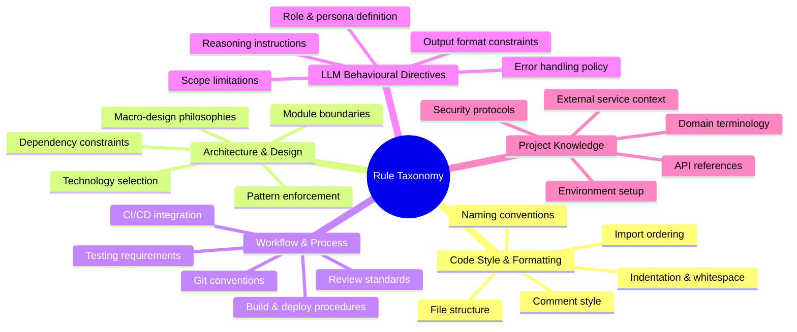
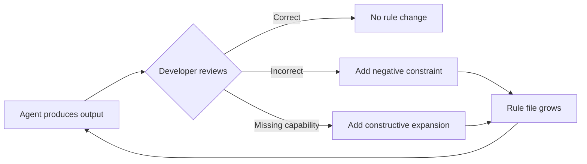
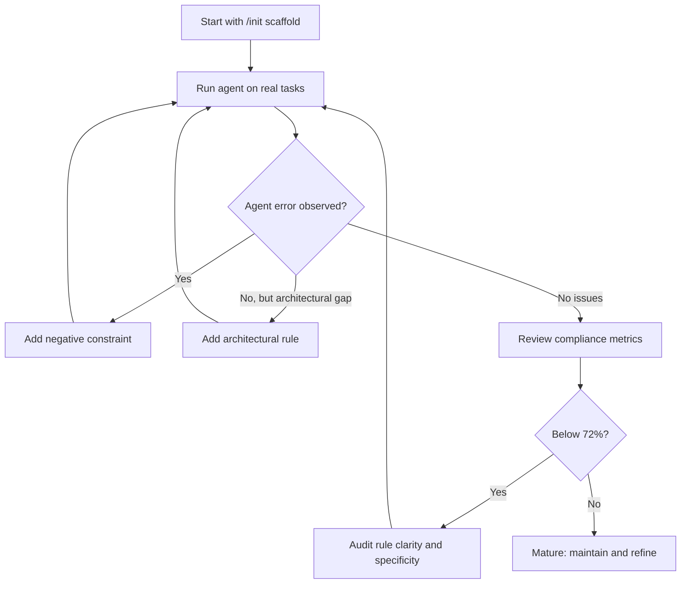

# Rule Taxonomy and Evolution in AI IDEs: What 7,310 Mined Rules Reveal About How Developers Configure Coding Agents — and How to Structure Codex CLI's AGENTS.md


---

Rule files — AGENTS.md, CLAUDE.md, `.cursor/rules/*.mdc`, `.windsurfrules` — have become the primary mechanism through which developers inject persistent context into coding agents[^1]. Yet until recently, nobody had systematically studied what developers actually write in these files, how those rules evolve over time, or whether they measurably improve agent output. Two complementary studies published in 2026 change that picture.

Cai et al. mined 7,310 rules from 83 open-source projects and surveyed 99 practitioners, tracking 1,540 rule evolution events across commit histories[^2]. Independently, Jiang et al. analysed 401 repositories with Cursor rules at MSR '26 and developed a five-theme taxonomy of the project context developers encode[^3]. Together, these studies offer the first empirical ground truth for a question every Codex CLI user faces: *what should your AGENTS.md actually contain?*

## The Five-Category Taxonomy

Cai et al.'s taxonomy comprises five primary categories with 25 secondary subcategories[^2]:



Jiang et al.'s independent taxonomy from Cursor rules converges on five analogous themes: Conventions, Guidelines, Project Information, LLM Directives, and Examples[^3]. The convergence across different AI IDEs and different research teams suggests these categories are structural properties of the problem, not artefacts of any single tool.

## The Perception–Practice Gap

The most striking finding from both studies is the gap between what developers *say* matters and what they *actually write*. Cai et al. found that practitioners rate Architecture & Design rules as the most important category in surveys, yet real-world rule files are dominated by Code Style & Formatting and Workflow & Process constraints — low-level, mechanical rules that are easiest to specify and verify[^2].

This gap is not irrational. Architectural constraints are harder to express in declarative markdown. A rule like "use the repository pattern for all data access" requires the agent to understand the codebase's layering, whereas "use 2-space indentation in TypeScript files" is unambiguous and immediately enforceable. The implication for AGENTS.md authors: the rules you *most* need to write are the architectural ones you are *least* likely to write.

## How Rules Evolve: 1,540 Events

Tracking rule files across commit histories, Cai et al. classified 1,540 evolution events into constructive and corrective categories[^2]:

| Evolution Type | Share | Description |
|---|---|---|
| Constructive expansion | 29.17% | Adding entirely new rule categories |
| Constructive enrichment | 26.59% | Deepening existing rules with more detail |
| Corrective negative constraint | 77.78%* | Adding "do not" rules to fix observed agent errors |
| Corrective narrowing | ~15% | Tightening scope after agent over-generalisation |

*Of all corrective actions, 77.78% are negative constraints — developers primarily evolve their rules by telling the agent what *not* to do after observing a mistake[^2].

This pattern has a direct structural implication. Rule files are not written top-down from a specification; they accrete bottom-up from observed failures. The developer sees the agent import `moment.js` instead of `date-fns`, adds `Do not use moment.js`, and moves on. Over time, these negative constraints accumulate into the most detailed section of the file.



## The Compliance Dividend: 22.99%

The most actionable finding is the compliance measurement. Cai et al. tracked rule compliance before and after evolution events and found an average improvement of 22.99 percentage points — from 49.14% to 72.13%[^2]. This means that the average rule file starts at roughly coin-flip compliance and needs at least one iteration cycle to reach acceptable levels.

The compliance trajectory suggests a maturity model:

1. **Scaffold** (0–50% compliance): Initial rules generated by `/init` or copied from templates. The agent follows roughly half of them.
2. **Corrective** (50–72% compliance): Developer adds negative constraints after observing failures. Most rules are reactive.
3. **Architectural** (72%+ compliance): Developer adds the harder architectural and design constraints that close the perception–practice gap.

Most teams plateau at stage two. Reaching stage three requires deliberate effort to write the architectural rules that developers say matter most but rarely commit to file.

## Mapping the Taxonomy to Codex CLI's AGENTS.md

Codex CLI's AGENTS.md system supports freeform markdown with a hierarchical lookup from `~/.codex/AGENTS.md` through every directory level to the current working directory[^4]. The per-directory override mechanism (`AGENTS.override.md`) provides an escape hatch for temporary or personal rules[^5]. Here is how the five-category taxonomy maps to AGENTS.md structure:

### Code Style & Formatting

These rules belong in the project-root AGENTS.md where they apply universally:

```markdown
## Code Style

- Use 2-space indentation in all TypeScript and JavaScript files.
- Prefer `const` over `let`; never use `var`.
- Import order: node builtins, external packages, internal modules, relative imports.
- Do not use default exports; use named exports exclusively.
```

### Architecture & Design

The highest-value, most-neglected category. Place these prominently at the top of the root AGENTS.md:

```markdown
## Architecture

- All data access goes through repository classes in `src/repositories/`.
  Do not query the database directly from controllers or services.
- Use the Result pattern (`Result<T, E>`) for all fallible operations.
  Do not throw exceptions for expected error paths.
- New API endpoints must follow the existing versioned routing pattern
  in `src/routes/v2/`. Do not create routes outside the versioning scheme.
```

### Workflow & Process

These rules often benefit from per-directory placement. A `services/billing/AGENTS.md` might enforce different testing requirements than `packages/ui/AGENTS.md`:

```markdown
## Testing

- Every new function must have at least one unit test.
- Integration tests go in `__tests__/integration/` and must use the
  test database, not mocks.
- Do not mock the payment gateway in integration tests; use the
  sandbox environment.
- Run `npm run test:affected` before committing.
```

### LLM Behavioural Directives

These are the meta-rules that govern how the agent itself behaves:

```markdown
## Agent Behaviour

- When uncertain about a requirement, ask for clarification before
  implementing. Do not guess.
- Limit each response to the specific files being changed.
  Do not refactor unrelated code.
- When writing commit messages, use conventional commits format.
- Do not add dependencies without explicit approval.
```

### Project Knowledge

Domain-specific context that the agent cannot infer from code alone:

```markdown
## Domain Context

- "Settlement" in this codebase refers to the T+1 clearing process,
  not the legal definition.
- The `legacy-api` service is deprecated; route all new integrations
  through `gateway-v3`.
- Environment variables are managed via Vault; never hardcode secrets.
```

## Enforcing Compliance with PostToolUse Hooks

Writing rules is necessary but not sufficient — the 49.14% baseline compliance figure demonstrates that agents routinely ignore instructions[^2]. Codex CLI's hook system provides a programmatic enforcement layer. A `PostToolUse` hook can validate agent output against rule-file constraints before the change is accepted[^6]:

```toml
# .codex/config.toml
[[hooks]]
event = "PostToolUse"
command = "python .codex/scripts/check-compliance.py"
timeout_ms = 10000
```

The compliance script can check for common violations:

```bash
#!/usr/bin/env python3
"""PostToolUse hook: check staged changes against AGENTS.md rules."""
import subprocess, sys, re

diff = subprocess.check_output(
    ["git", "diff", "--cached", "--name-only"],
    text=True
)

violations = []

for path in diff.strip().splitlines():
    if path.endswith(".ts") or path.endswith(".tsx"):
        content = open(path).read()
        # Architecture rule: no direct DB queries outside repositories
        if "/repositories/" not in path and "prisma." in content:
            violations.append(
                f"{path}: direct Prisma access outside repository layer"
            )
        # Style rule: no default exports
        if re.search(r"export\s+default\s+", content):
            violations.append(f"{path}: default export detected")

if violations:
    print("AGENTS.md compliance violations:")
    for v in violations:
        print(f"  - {v}")
    sys.exit(1)
```

## The Evolution Strategy: Reactive Then Proactive

The research evidence suggests a practical workflow for maintaining AGENTS.md:



The 77.78% negative-constraint pattern from Cai et al. is not a problem to fix — it is the natural first phase of rule development[^2]. The problem is *stopping there*. Teams that iterate beyond reactive "do not" rules into proactive architectural constraints see the largest compliance gains.

## Practical Recommendations

Based on the combined evidence from both studies:

1. **Audit your current AGENTS.md against the five categories.** Most files over-index on Code Style and under-index on Architecture & Design. The taxonomy provides a checklist.

2. **Treat AGENTS.md as a living document.** The 1,540 evolution events show that rule files that do not evolve stagnate at ~49% compliance[^2]. Schedule periodic reviews — monthly at minimum.

3. **Write the architectural rules first, even if they are harder to express.** The perception–practice gap shows developers know these matter most but defer writing them. Front-load them in your AGENTS.md so they appear early in the context window.

4. **Use per-directory AGENTS.md for workflow divergence.** Codex CLI's hierarchical lookup means a `services/billing/AGENTS.md` can enforce strict testing rules without burdening the frontend team[^5].

5. **Enforce programmatically what you can.** PostToolUse hooks close the gap between stated rules and actual compliance. Start with the rules you see violated most frequently.

6. **Track your negative-to-positive rule ratio.** If more than 80% of your rules are "do not" constraints, you are likely in the reactive phase. Deliberately add constructive rules to move toward architectural maturity.

## Conclusion

The empirical evidence is clear: rule files are not optional configuration — they are the primary lever for aligning coding agent behaviour with project intent. The five-category taxonomy provides structure. The evolution data shows that rules must be iterated, not merely written. And the 22.99% compliance improvement demonstrates that the iteration pays off. For Codex CLI users, the path forward is to audit your AGENTS.md against the taxonomy, fill the architectural gap, enforce compliance through hooks, and treat your rule file as a living document that evolves with every agent interaction.

---

## Citations

[^1]: AGENTS.md specification, Linux Foundation, adopted by 60,000+ repositories across Codex CLI, Cursor, Copilot, Gemini CLI, Aider, Windsurf, and Zed. [https://agents-md.org/](https://agents-md.org/)

[^2]: Cai, G., Li, R., Liang, P., Li, Z. & Shahin, M. (2026). "Rule Taxonomy and Evolution in AI IDEs: A Mining and Survey Study." arXiv:2606.12231. Mined 7,310 rules from 83 projects, surveyed 99 practitioners, analysed 1,540 evolution events. [https://arxiv.org/abs/2606.12231](https://arxiv.org/abs/2606.12231)

[^3]: Jiang, S. et al. (2026). "Beyond the Prompt: An Empirical Study of Cursor Rules." Proc. 23rd International Conference on Mining Software Repositories (MSR '26), Rio de Janeiro. 401 repositories analysed. arXiv:2512.18925. [https://arxiv.org/abs/2512.18925](https://arxiv.org/abs/2512.18925)

[^4]: OpenAI. "Custom instructions with AGENTS.md." Codex Developer Documentation, 2026. [https://developers.openai.com/codex/guides/agents-md](https://developers.openai.com/codex/guides/agents-md)

[^5]: OpenAI. "Configuration Reference." Codex Developer Documentation, 2026. Covers `project_doc_fallback_filenames`, `project_doc_max_bytes` (default 32 KiB), and hierarchical lookup order. [https://developers.openai.com/codex/config-reference](https://developers.openai.com/codex/config-reference)

[^6]: OpenAI. "Features — Codex CLI." Codex Developer Documentation, 2026. Covers hooks, including `PreToolUse` and `PostToolUse` events. [https://developers.openai.com/codex/cli/features](https://developers.openai.com/codex/cli/features)
