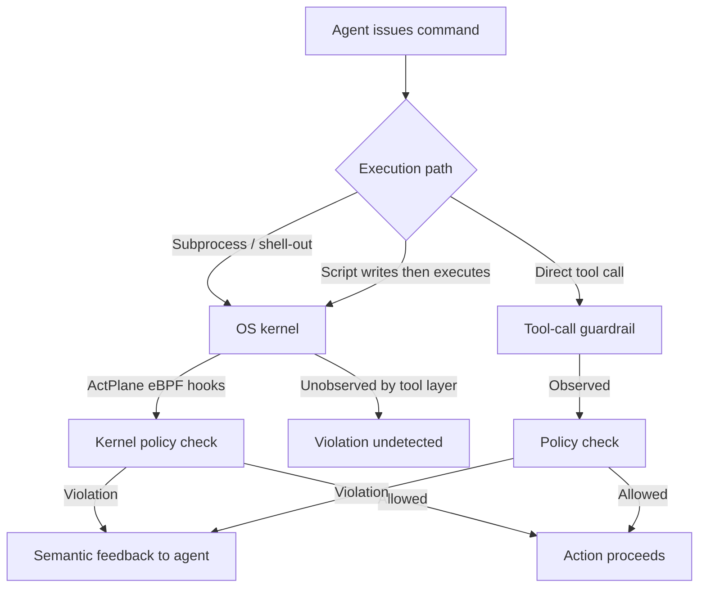

# ActPlane and the OS-Level Policy Gap: Why Tool-Call Guardrails Miss Half Your Agent's Violations — and How eBPF Kernel Enforcement Closes the Loop for Codex CLI


---

## The Enforcement Gap You Cannot See

Every production coding agent runs inside a harness — the software wrapper that gates what the model can do. Codex CLI has its sandbox. Claude Code has its permission tiers. OpenHands has its Docker boundary. Each enforces policies at the **tool-call layer**: intercept the function call, check the arguments, approve or deny.

The trouble is that tool-call interception only observes actions that pass through the tool layer. When an agent shells out via `bash -c`, spawns a subprocess that spawns another subprocess, or writes a script that later executes a forbidden command, the guardrail never fires. Zheng et al. quantify this blind spot in a June 2026 paper: of 607 OS-enforceable policies mined from 64 real projects, **83% require OS-level enforcement**, yet tool-call baselines detect only **34–40% of violations** [^1]. The remaining violations travel indirect execution paths that bypass the tool layer entirely.

ActPlane [^2] — an eBPF-based policy engine released alongside the paper — proposes a different architecture: let the agent declare policies in a lightweight information-flow control (IFC) DSL, compile them to eBPF programs, and enforce them in the Linux kernel with semantic feedback that helps the agent self-correct.

This article examines what ActPlane's findings mean for Codex CLI's security model, where the current hook pipeline fits, and how kernel-level enforcement could complement — not replace — existing defences.

---

## The Semantic Gap Problem

The core insight is architectural. Policy intent lives close to the task — expressed in AGENTS.md, config.toml, or natural language instructions. Enforcement must happen at the OS level to cover every execution path. Bridging this gap requires solving three problems simultaneously [^1]:

1. **Translation**: Converting natural-language policies ("run tests before committing") into concrete enforcement rules
2. **Coverage**: Observing all system actions, including subprocesses, shell escapes, and compiled binaries
3. **Feedback**: Returning human-readable explanations when enforcement fires, so the agent can retry rather than fail silently

Existing approaches solve at most one of these. Prompt-based constraints handle translation but offer zero enforcement. Tool-call guardrails enforce at the API boundary but miss indirect paths. OS sandboxes (Landlock, seccomp, Docker) enforce broadly but return opaque `EPERM` errors that leave the agent confused [^1].



---

## How ActPlane Works

### The IFC DSL

ActPlane policies are declared in a YAML file using a five-component rule syntax: **source** (process, file, or network origin), **target operation** (exec, open, read, write, connect), **effect** (notify, block, or kill), an optional **temporal gate**, and a **reason** string for agent feedback [^2].

A practical example — enforcing "run tests before committing" with staleness invalidation:

```yaml
version: 1
policy: |
  source AGENT = exec "codex"
  source SCHEMA_CHANGED = file "src/**/*.proto"

  rule test-before-commit:
    block exec "git" "commit"
      if AGENT unless after exec "pnpm" "test" since write "src/**"
    because "Run tests after modifying source before committing."
```

The `since write "src/**"` clause is critical: it invalidates a prior test pass if the agent writes to source files afterwards, preventing stale-test-then-commit sequences that tool-call guardrails cannot detect [^1].

### eBPF Kernel Engine

The enforcement engine comprises ~1,800 lines of BPF C attaching to BPF-LSM hooks (pre-operation) and tracepoints (post-operation) [^2]. Labels are stored as 64-bit bitmasks in per-object BPF maps and propagate monotonically across `fork`, `exec`, `read`, `write`, and `connect` operations. Once a process acquires a label, it cannot shed it — ensuring that information-flow tracking is irrevocable [^1].

The userspace compiler (~3,200 lines of Rust) parses the DSL and emits eBPF configuration. Installation requires no build-time dependencies thanks to CO-RE (Compile Once, Run Everywhere):

```bash
cargo install actplane
actplane init          # creates starter actplane.yaml
actplane compile       # validates rules, no privileges needed
actplane doctor        # diagnoses kernel support
sudo -E actplane run codex -p "refactor the auth module"
```

### Three Effect Types

| Effect | Timing | Use case |
|--------|--------|----------|
| `kill` | Post-operation | Terminate immediately when a forbidden action fires |
| `block` | Pre-operation | Deny the syscall before it executes (requires BPF-LSM) |
| `notify` | Non-blocking | Alert the agent without stopping execution |

The `block` effect is the most powerful — it prevents the action from ever executing, unlike `kill` which terminates after the fact [^2].

---

## Evaluation: The Numbers That Matter

Zheng et al. evaluate ActPlane against three baselines — prompt-filter, tool-regex, and FIDES (a tool-level IFC system) — across 190 enforcement traces [^1]:

| Metric | Prompt-filter | Tool-regex | FIDES | ActPlane |
|--------|--------------|------------|-------|----------|
| Decision compliance | 45–49% | 45–49% | 45–49% | **75.8%** |
| Violation detection | 34–40% | 34–40% | 34–40% | **77.2%** |
| Cross-event policies | ~0% | ~0% | Partial | **Full** |

The compliance gap is stark: tool-call baselines miss **over half** of all violations. ActPlane's advantage comes from observing subprocess trees, shell escapes, and indirect file operations that never surface as tool calls [^1].

### Real-World Coding Tasks

On OctoBench (21 tasks, 61 rules), ActPlane improved user-query reward by **+9.9 points** and implementation/test reward by **+9.7 points** over baseline, with 110 runtime policy deltas submitted as the agent refined its approach [^1].

### Safety Enforcement

On OpenAgentSafety (361 tasks across workplace and personal-assistant scenarios), ActPlane blocked **74% of baseline-unsafe behaviours** (78 of 106 unsafe actions) using description-only policy generation — no access to evaluation criteria. False positives affected 16% of baseline-safe tasks, reflecting rule conservatism [^1].

### Overhead

The performance cost is modest: **1.9% overhead** on agent replay traces and **6.5–8.4%** on kernel builds with 100 active rules. Per-syscall latency adds 3–69µs for `fork`/`exec` and under 1µs for `write`/`connect` [^1].

---

## Where Codex CLI's Current Model Fits

Codex CLI already implements a layered defence stack [^3] [^4]:

1. **Sandbox isolation** — filesystem and network containment via platform-specific sandboxing
2. **Approval policies** — `suggest`, `auto-edit`, and `full-auto` tiers controlling what runs without confirmation
3. **PreToolUse / PostToolUse hooks** — custom scripts that fire before and after tool execution
4. **Network allowlisting** — domain-level restrictions on outbound connections
5. **AGENTS.md constraints** — natural-language instructions loaded hierarchically per directory

This is a strong model — but it operates at the tool-call layer. ActPlane's empirical data suggests that **34–40% of violations occur on paths this model cannot observe** [^1]. A subprocess spawned by a tool-approved `bash` command inherits no hook coverage. A script written to `/tmp` and later executed bypasses PreToolUse entirely.

### Codex CLI Hook Integration

ActPlane ships with explicit Codex CLI integration [^2]. The PostToolUse hook feeds kernel enforcement feedback back into the agent's context:

```json
{
  "hooks": {
    "PostToolUse": [{
      "matcher": ".*",
      "hooks": [{
        "type": "command",
        "command": "actplane feedback-hook"
      }]
    }]
  }
}
```

The MCP server mode provides an alternative integration path, automatically attaching to the parent process tree:

```bash
actplane mcp --auto-attach-parent
```

This creates a **two-layer enforcement model**: Codex CLI's native hooks handle tool-level policies, while ActPlane's eBPF engine catches everything that escapes to the OS.

---

## Defence-in-Depth Configuration Recipe

For teams running Codex CLI on Linux with kernel 5.8+ and BTF support, the following configuration layers ActPlane beneath the existing Codex CLI security model:

```yaml
# actplane.yaml — project-level kernel policies
version: 1
policy: |
  source AGENT = exec "codex"
  source TESTS = exec "pytest" or exec "jest" or exec "go" "test"

  # Enforce test-before-commit with staleness tracking
  rule test-before-commit:
    block exec "git" "commit"
      if AGENT unless after TESTS since write "src/**"
    because "Tests must pass after source changes before committing."

  # Prevent direct network access outside allowed domains
  rule no-arbitrary-network:
    kill connect * if AGENT
      unless connect "api.openai.com" or connect "github.com"
    because "Network access restricted to approved endpoints."

  # Block secret file reads
  rule no-secrets:
    kill read ".env" or read "**/*.pem" or read "**/credentials*"
      if AGENT
    because "Agent must not read secret files."
```

```toml
# .codex/config.toml — tool-level policies
[sandbox]
writable_roots = ["./src", "./tests", "./docs"]

[approval]
mode = "auto-edit"

[hooks]
PostToolUse = [
  { matcher = ".*", command = "actplane feedback-hook" }
]
```

The two layers are complementary: config.toml handles tool-level gating and filesystem scoping; actplane.yaml handles OS-level enforcement, cross-event ordering, and subprocess tracking.

---

## Limitations and Open Questions

ActPlane is not a silver bullet. Several constraints merit attention:

- **Linux-only**: eBPF requires Linux kernel 5.8+ with BTF. macOS and Windows — where many developers run Codex CLI locally — are unsupported [^2]. ⚠️ Whether a userspace fallback mode is planned remains unconfirmed.
- **Root required**: Loading eBPF programs requires `CAP_BPF + CAP_SYS_ADMIN` or root, which may conflict with enterprise security policies [^2].
- **False positive rate**: The 16% false-positive rate on safe tasks in OpenAgentSafety suggests that overly conservative rules can impede legitimate agent actions [^1].
- **Policy authoring burden**: While LLM-generated policy translation costs only \$0.028 per policy versus ~\$11 for manual authoring [^1], the DSL still requires understanding information-flow semantics.
- **Domain hierarchy complexity**: The hierarchical policy domain model (child domains inherit parent rules, cannot weaken them) adds conceptual overhead for multi-team configurations [^1].

---

## What This Means for Codex CLI Users

The ActPlane paper makes a quantitative case that **tool-call guardrails alone are insufficient** for policy enforcement in coding agent harnesses. The 34–40% detection rate of tool-level baselines is not a theoretical concern — it reflects real violation paths in production agent workflows.

For Codex CLI practitioners, the practical takeaways are:

1. **Hooks are necessary but not sufficient** — PreToolUse and PostToolUse cover the tool layer; subprocess trees and shell escapes require OS-level enforcement
2. **eBPF enforcement is production-ready** — 1.9% overhead on agent traces, MIT-licensed, with explicit Codex CLI integration
3. **Temporal policies fill a gap** — "test before commit with staleness invalidation" is not expressible in AGENTS.md or config.toml but is a single ActPlane rule
4. **Semantic feedback matters** — opaque `EPERM` errors from sandboxes confuse agents; ActPlane's reason strings enable self-correction, improving compliance from 27 to 86 correct responses [^1]
5. **Defence-in-depth stacks** — ActPlane beneath Codex CLI's native security model covers both the tool layer and the OS layer without either component needing to change

The semantic gap between policy intent and enforcement action is a structural problem in every agent harness. ActPlane offers the first empirically validated approach to closing it at the kernel level.

---

## Citations

[^1]: Zheng, Y., Wu, T., Fu, Q., Yu, T., Mao, W., Ma, T., Williams, D., Wang, W., & Quinn, A. (2026). "ActPlane: Programmable OS-Level Policy Enforcement for Agent Harnesses." arXiv:2606.25189. [https://arxiv.org/abs/2606.25189](https://arxiv.org/abs/2606.25189)

[^2]: eunomia-bpf. (2026). "ActPlane: eBPF-Based Information Flow Policy Engine for AI Agent Harnesses." GitHub. [https://github.com/eunomia-bpf/ActPlane](https://github.com/eunomia-bpf/ActPlane)

[^3]: OpenAI. (2026). "Features — Codex CLI." OpenAI Developers. [https://developers.openai.com/codex/cli/features](https://developers.openai.com/codex/cli/features)

[^4]: OpenAI. (2026). "Changelog — Codex." OpenAI Developers. [https://developers.openai.com/codex/changelog](https://developers.openai.com/codex/changelog)
