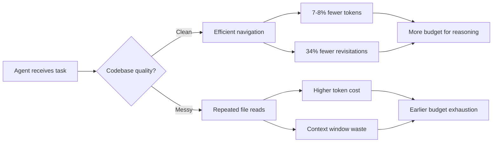
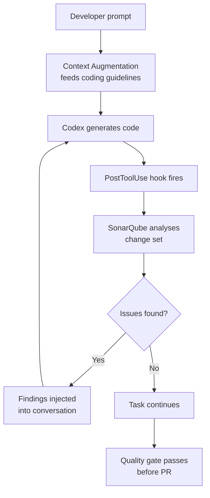

# Does Code Cleanliness Matter for Coding Agents? What 660 Trials Reveal About Token Cost, Navigation, and Codex CLI Configuration


---

Technical debt debates usually centre on human productivity. The implicit assumption: clean code matters because developers read it. But what happens when the reader is an LLM-powered coding agent that processes your entire codebase through a context window? Does cognitive complexity affect agent task completion, or are agents immune to the kind of structural noise that slows humans down?

A controlled study from SonarSource — the team behind SonarQube — provides the first rigorous empirical answer, and the implications for how you configure Codex CLI are significant.

## The Study: Minimal Pairs at Scale

Trivedi and Schmitt (2026) designed an evaluation protocol built around *minimal pairs*: repository versions that match on architecture, dependencies, and external behaviour but differ on static-analysis rule violations and cognitive complexity [^1]. The construction is bidirectional — clean codebases are systematically degraded by introducing complexity violations, and messy codebases are refactored to reduce them. This dual-direction approach controls for project-specific confounders that plague observational studies.

The researchers authored 33 tasks across six repository pairs spanning Java and Python (including Apache Commons BCEL and Netflix Genie), then ran 660 trials with Claude Code [^1]. Tasks were validated against hidden test suites exercising the application's public surface, ensuring agents couldn't game metrics by writing tests that match their own output.

Three research questions drove the study:

1. Does code cleanliness affect **task completion** (pass rate)?
2. Does it affect **operational footprint** — tokens consumed, files read, file revisitations, lines edited, conversation length?
3. Does the effect vary with **task topology** — single-region work versus multi-module spanning tasks?

## The Headline Finding: Pass Rates Don't Move

The first result is counterintuitive: code cleanliness produces **no statistically significant difference in pass rates** between clean and messy repository versions [^1]. An agent working on a codebase riddled with cognitive complexity violations completes tasks at the same rate as one working on a well-maintained equivalent.

This challenges the common assumption that clean code universally improves outcomes. For task completion, the agent's reasoning capability dominates — the model can navigate messy code well enough to produce correct patches. If your only metric is "did the task pass," code quality appears irrelevant.

But task completion is a dangerously narrow lens.

## Where Cleanliness Pays: Tokens and Navigation

The operational metrics tell a different story entirely:

| Metric | Clean vs Messy | Implication |
|--------|---------------|-------------|
| Token consumption | **7–8% fewer tokens** on clean code | Direct cost reduction per task |
| File revisitations | **34% fewer** on clean code | Agent navigates more efficiently |
| Lines edited | Comparable | Patch size is task-determined |

Agents working on cleaner code consume 7–8% fewer tokens [^1]. At scale, this is material. Consider a team running 500 agent tasks per week at an average cost of \$2 per task: an 8% reduction saves roughly \$4,160 annually — just from maintaining code quality standards.

The file revisitation finding is arguably more revealing. A 34% reduction means the agent backtracks significantly less when the codebase is well-structured [^1]. Each revisitation represents wasted context window capacity and additional API calls. In Codex CLI, where `rollout_token_budget` caps total token spend per thread, fewer revisitations mean more budget available for actual reasoning.



## Task Topology Matters

The study's third finding adds nuance: the cleanliness effect varies with task topology [^1]. Tasks concentrated in a single dense code region show smaller differences — the agent can brute-force its way through local complexity. Multi-module spanning tasks, where the agent must navigate across package boundaries, show amplified effects. This aligns with intuition: structural clarity matters most when the agent needs to build a mental model of cross-cutting concerns.

For Codex CLI users, this means code quality investment delivers the highest return in large, modular codebases — precisely the kind of repositories where agent-assisted development is most valuable.

## Mapping Findings to Codex CLI Configuration

The study's results translate directly into actionable Codex CLI configuration patterns. The goal: maintain code cleanliness as a cost-reduction and efficiency measure, not because it changes pass rates, but because it reduces operational overhead.

### 1. SonarQube Plugin Integration

SonarSource ships a first-party Codex CLI plugin that wires SonarQube analysis directly into the agent loop [^2]. Installation is a single command:

```bash
codex plugin marketplace add SonarSource/sonarqube-agent-plugins
sonar integrate codex --project <your-project-key>
```

This configures three hooks automatically [^2]:

- **`UserPromptSubmit`** — scans every prompt for hardcoded credentials before it reaches the model, blocking prompts containing detected secret patterns
- **`PostToolUse` on `apply_patch`** — runs SonarQube Agentic Analysis against the change set after each file edit, surfacing findings inline so the agent fixes issues before completing its response
- **Context Augmentation** — feeds your organisation's coding guidelines, architectural intent, and dependency health to Codex at prompt time

The `PostToolUse` hook is the critical piece. It creates a closed verification loop: the agent writes code, SonarQube analyses the diff, findings are injected back into the conversation, and the agent remediates — all within a single turn [^2].

### 2. AGENTS.md Complexity Rules

Even without the SonarQube plugin, you can encode complexity constraints directly in your `AGENTS.md` [^3]:

```markdown
## Code Quality

- Maximum cognitive complexity per function: 15
- No nested conditionals deeper than 3 levels
- Extract helper functions rather than adding branches
- Run `sonar-scanner` before marking any task complete
- Prefer early returns over nested if/else chains
```

Front-load these rules in the first 50 lines of your AGENTS.md — Codex reads the instruction chain once per session, and critical rules should appear before any context window pressure [^3].

### 3. PostToolUse Linting Hooks

For teams using linters other than SonarQube, configure a PostToolUse hook in `.codex/config.toml` to run complexity checks after every file write:

```toml
[[hooks]]
event = "PostToolUse"
tool = "apply_patch"
command = "ruff check --select C901 --max-complexity 15 ${FILE}"
on_failure = "inject"
```

The `on_failure = "inject"` directive feeds linter output back into the agent's context, triggering automatic remediation [^4]. This mirrors the SonarQube plugin's closed-loop pattern without requiring a SonarQube instance.

### 4. Token Budget Awareness

Given the 7–8% token savings on clean code, configure `rollout_token_budget` to account for codebase quality:

```toml
[model]
rollout_token_budget = 200000

[profiles.legacy-codebase]
rollout_token_budget = 240000
```

Named profiles let you allocate higher budgets for legacy codebases where the agent will consume more tokens navigating messy code, while keeping tighter budgets on well-maintained repositories [^5].

## The AC/DC Loop: Deterministic Verification of Probabilistic Output

SonarSource frames their integration as the "Agent Centric Development Cycle" (AC/DC) — a philosophy that acknowledges LLM output is probabilistic while static analysis is deterministic [^2]. The study validates this framing empirically: agents produce correct output regardless of code quality, but the *cost* of reaching that output varies with codebase structure.



This loop ensures that even when agents are working on messy code — and consuming those extra tokens — the output still meets your quality standards. The study suggests this matters not for correctness, but for preventing further quality degradation that would compound token costs across future agent runs.

## Practical Implications

The study's findings crystallise into three principles for Codex CLI configuration:

**Code quality is a cost lever, not a correctness lever.** Don't invest in code cleanliness because agents produce wrong output on messy code — they don't. Invest because every percentage point of cognitive complexity you reduce translates to fewer tokens, fewer file revisitations, and more efficient use of your `rollout_token_budget`.

**Multi-module codebases benefit most.** If your repository is a monolith with clear module boundaries, code quality improvements in navigation-heavy areas — shared libraries, cross-cutting utilities, API surface layers — deliver outsized returns on agent efficiency.

**Closed-loop verification pays for itself.** The SonarQube PostToolUse hook adds a small per-edit overhead, but prevents the codebase from degrading under agent-generated patches. Without it, today's clean codebase becomes tomorrow's messy one — and the study shows that costs 7–8% more per agent task, compounding with every run.

## Limitations

The study tests only Claude Code across 33 tasks and six repository pairs [^1]. Whether the effect sizes generalise to other agent frameworks (including Codex CLI's own model backends) remains unvalidated. ⚠️ The 7–8% token reduction and 34% revisitation reduction are specific to Claude Code with SonarSource's minimal-pair protocol — actual savings in production will vary with codebase size, task complexity, and model choice.

Additionally, the study measures cognitive complexity as defined by SonarQube's rule set. Other dimensions of code quality — naming, documentation, test coverage — were not isolated. ⚠️ It is unclear whether improvements in these areas would produce similar operational benefits.

## Citations

[^1]: Trivedi, P. & Schmitt, O. (2026). "Does Code Cleanliness Affect Coding Agents? A Controlled Minimal-Pair Study." arXiv:2605.20049. [https://arxiv.org/abs/2605.20049](https://arxiv.org/abs/2605.20049)

[^2]: SonarSource. (2026). "Now Available: SonarQube Plugin for Codex." Sonar Blog. [https://www.sonarsource.com/blog/now-available-sonarqube-plugin-for-codex/](https://www.sonarsource.com/blog/now-available-sonarqube-plugin-for-codex/)

[^3]: OpenAI. (2026). "Custom Instructions with AGENTS.md." Codex Developer Documentation. [https://developers.openai.com/codex/guides/agents-md](https://developers.openai.com/codex/guides/agents-md)

[^4]: OpenAI. (2026). "Configuration Reference — Codex CLI." Codex Developer Documentation. [https://developers.openai.com/codex/config-reference](https://developers.openai.com/codex/config-reference)

[^5]: OpenAI. (2026). "Config Basics — Codex." Codex Developer Documentation. [https://developers.openai.com/codex/config-basic](https://developers.openai.com/codex/config-basic)
