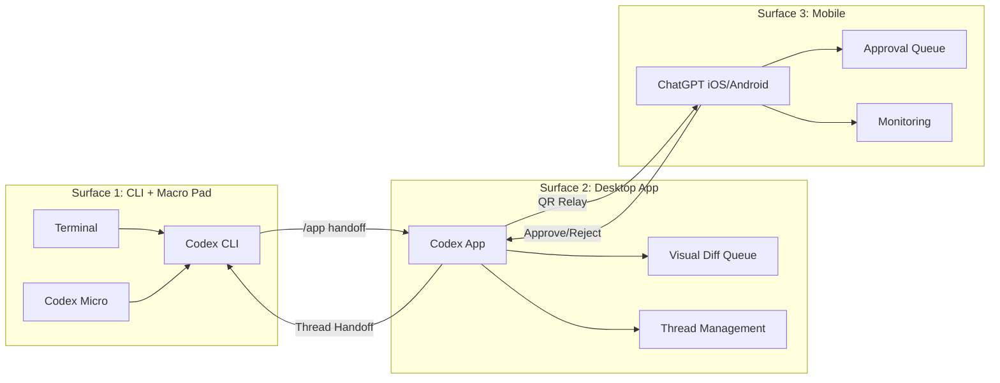
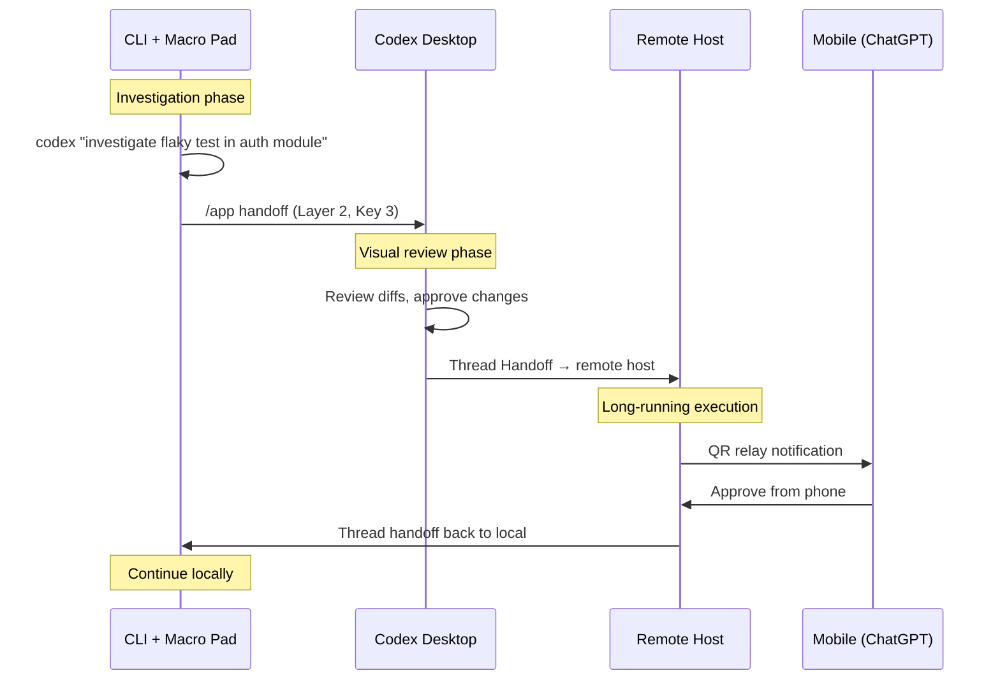
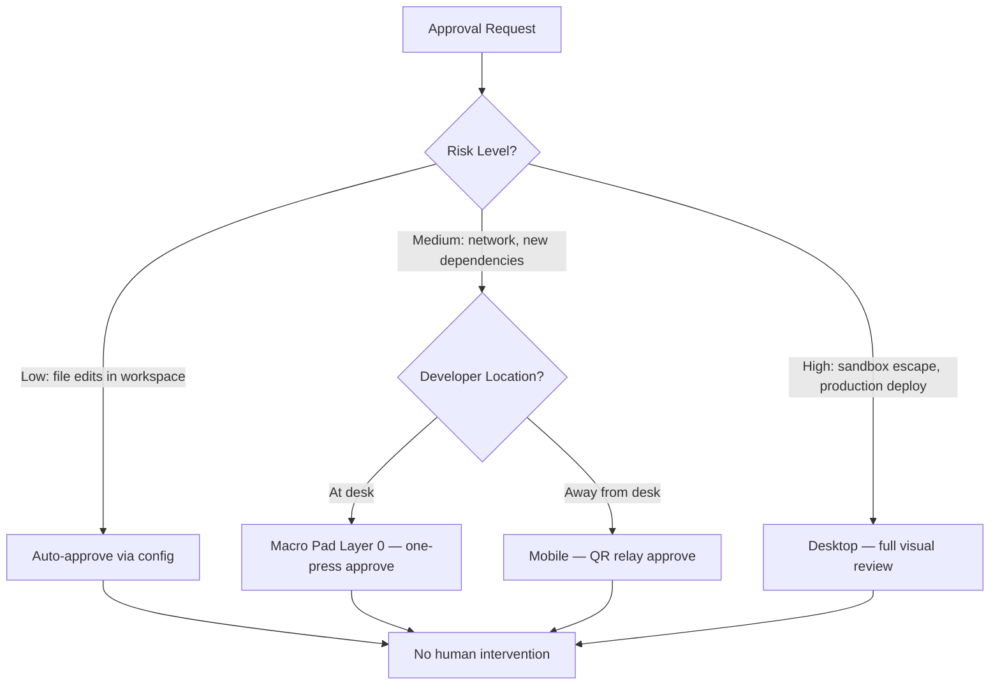

# The Hardware-Augmented Agentic Workflow Guide


---

Agentic coding sessions have three bottlenecks that software alone cannot eliminate: the latency of switching approval contexts, the friction of migrating work across machines, and the cognitive load of juggling CLI, Desktop, and mobile surfaces simultaneously. OpenAI's recent hardware and infrastructure releases — the Codex Micro macro pad (launching 15 July 2026) [^1], thread handoff (Codex App 26.616, 18 June 2026) [^2], and Codex Remote GA (25 June 2026) [^3] — converge on a single thesis: the developer cockpit should be a physical, multi-surface control plane.

This guide consolidates those three capabilities into reference configurations, switching frameworks, and concrete VIA/QMK layer definitions that turn a keyboard, a desktop app, and a phone into a unified agent-steering interface.

## The Three Surfaces

Before wiring hardware, establish what each surface is for. The decision framework rests on a simple principle: route each interaction to the surface with the lowest-friction path to the required action.



| Surface | Strengths | Use when |
|---------|-----------|----------|
| **CLI + Macro Pad** | Raw speed, scriptable, profile switching, slash commands | Investigating, prototyping, batch operations |
| **Desktop App** | Visual diffs, thread history, drag-and-drop | Code review, multi-thread orchestration, complex merges |
| **Mobile** | Location-independent, notification-driven | Approving long-running tasks, monitoring CI agents, commute steering |

## The Codex Micro: Hardware Specifications

The Codex Micro is a programmable macro pad co-developed with Work Louder, based on the Creator Micro 2 chassis [^1]. Its hardware profile:

- **13 MX-compatible mechanical switches** — hot-swappable, low-profile
- **Clickable rotary encoder** — maps to reasoning depth, scroll, or model tier cycling
- **Capacitive touch sensor** — layer cycling across up to six programmable layers [^4]
- **2D analogue joystick** — triggers radial menus in supported applications
- **Connectivity** — USB-C (Base), Bluetooth Low Energy with 2,100 mAh battery (Pro) [^4]
- **Firmware** — VIA-compatible (QMK-based), plus Work Louder's Input configurator for multi-step macros and application-linked layer switching [^4]

### Reference VIA Layer Definitions

The six layers map cleanly to Codex CLI's interaction model. Below is a reference layout — adapt to your own workflow, but this structure covers the approval bottleneck, model routing, and surface switching that consume most interaction time.

```toml
# Layer 0: Core Approval (default layer)
# Touch sensor LED: solid green
[layer.0]
key_1  = "approve"           # Enter/Return — approve pending action
key_2  = "reject"            # Escape — reject pending action
key_3  = "approve_all"       # Approve remaining batch
key_4  = "explain"           # Request explanation before approving
key_5  = "/permissions"      # Cycle approval mode
key_6  = "/review"           # Open review presets
key_7  = "/clear"            # Wipe terminal, fresh chat
key_8  = "/copy"             # Copy latest output (Ctrl+O equivalent)
key_9  = "/exit"             # Close session
key_10 = "/status"           # Session info
key_11 = "surface_handoff"   # /app — hand off to Desktop
key_12 = "/model"            # Switch model mid-session
key_13 = "undo"              # Ctrl+Z — undo last edit
encoder = "scroll_output"    # Scroll through agent output
joystick = "navigate_diff"   # Navigate visual diff hunks

# Layer 1: Model & Reasoning Control
# Touch sensor LED: solid blue
[layer.1]
key_1  = "model_gpt55"       # codex --model gpt-5.5
key_2  = "model_o4_mini"     # codex --model o4-mini
key_3  = "model_sol"         # codex --model gpt-5.6-sol
key_4  = "model_terra"       # codex --model gpt-5.6-terra
key_5  = "model_luna"        # codex --model gpt-5.6-luna
key_6  = "reasoning_low"     # model_reasoning_effort = "low"
key_7  = "reasoning_medium"  # model_reasoning_effort = "medium"
key_8  = "reasoning_high"    # model_reasoning_effort = "high"
key_9  = "reasoning_xhigh"  # model_reasoning_effort = "xhigh"
key_10 = "reasoning_ultra"   # model_reasoning_effort = "ultra"
key_11 = "profile_dev"       # codex --profile dev
key_12 = "profile_ci"        # codex --profile ci
key_13 = "profile_prod"      # codex --profile prod
encoder = "reasoning_dial"   # Rotate to adjust reasoning effort
```

```toml
# Layer 2: Thread & Surface Management
# Touch sensor LED: solid amber
[layer.2]
key_1  = "handoff_remote"    # Hand off thread to remote host
key_2  = "handoff_local"     # Bring thread back to local
key_3  = "handoff_desktop"   # /app — CLI to Desktop
key_4  = "new_thread"        # Start new thread
key_5  = "continue_thread"   # Continue most recent thread
key_6  = "worktree_create"   # Create isolated worktree
key_7  = "worktree_list"     # List active worktrees
key_8  = "git_bundle"        # Manual git bundle create
key_9  = "git_status"        # Quick git status check
key_10 = "git_diff"          # View staged changes
key_11 = "subagent_spawn"    # Spawn parallel subagent
key_12 = "subagent_status"   # Check subagent progress
key_13 = "thread_list"       # List all threads
encoder = "thread_scroll"    # Scroll through thread history

# Layer 3: Security & Sandbox
# Touch sensor LED: solid red
[layer.3]
key_1  = "sandbox_readonly"    # sandbox_mode = "read-only"
key_2  = "sandbox_workspace"   # sandbox_mode = "workspace-write"
key_3  = "sandbox_full"        # sandbox_mode = "danger-full-access"
key_4  = "approval_untrusted"  # approval_policy = "untrusted"
key_5  = "approval_onrequest"  # approval_policy = "on-request"
key_6  = "approval_never"      # approval_policy = "never"
key_7  = "network_allow"       # Toggle network access
key_8  = "network_deny"        # Block network access
key_9  = "features_list"       # codex features list
key_10 = "features_enable"     # Enable feature flag
key_11 = "features_disable"    # Disable feature flag
key_12 = "audit_log"           # View recent audit events
key_13 = "kill_agent"          # Emergency stop — kill running agent
encoder = "log_scroll"         # Scroll audit log
```

Layers 4 and 5 are left free for project-specific macros — CI triggers, deployment scripts, or MCP server management.

## Thread Handoff: The Transfer Mechanism

Thread handoff moves an existing thread and its Git state between surfaces [^2]. The mechanism relies on `git bundle` transfers over Noise Protocol relay channels with end-to-end encryption (v0.141.0) [^5].

### Prerequisites

Before handoff works, both ends must share:

1. **Connected host** — the destination must appear in Settings → Connections
2. **Matching project** — the same Git repository saved on both machines
3. **Matching subdirectory** — if working in a monorepo subdirectory, save identical paths on both hosts [^3]

### Handoff Patterns



**Pattern 1 — Laptop to Server Migration.** Start an investigation on your laptop. When the task requires heavy compute (large test suites, builds), hand off to a remote host. The Codex Micro's Layer 2 keys make this a single button press rather than a multi-step GUI interaction.

**Pattern 2 — CLI Investigation, Desktop Review.** Use the CLI for rapid exploration, then hand off to Desktop when you need the visual diff queue. The `/app` command (mapped to Layer 0, Key 11) transfers the thread with full Git state [^2].

**Pattern 3 — DigitalOcean Ephemeral Compute.** The DigitalOcean plugin provisions a Droplet pre-configured with Codex CLI and common tooling, connects it via SSH, and makes it available as a remote workspace [^6]. Hand off compute-intensive threads, let them run, approve from mobile, and pull results back.

### Worktree Isolation

Handoff creates or reuses a Git worktree on the destination, preserving existing checkouts [^2]. The system maintains up to 15 worktrees with snapshot-before-delete semantics, and thread affinity ensures a worktree association survives round-trips between surfaces [^5].

A `.worktreeinclude` file controls which dependency files transfer with the bundle, while `.gitignore` exclusion prevents secret leakage during cross-machine transfers [^5].

## Codex Remote GA: Mobile as Approval Surface

Codex Remote reached general availability on 25 June 2026, adding authenticated QR pairing between iOS/Android devices and Mac/Windows hosts [^3]. The security model replaced the previous open-relay approach with one-to-one device pairing.

### QR Pairing Setup

1. On the host: open Codex App → sidebar → "Set up Codex mobile"
2. Scan the displayed QR code with your phone's ChatGPT app
3. Complete authentication (including SSO/MFA if required by your workspace)
4. The host appears in the mobile Codex project list [^3]

Connections established since 8 June 2026 remain paired; older connections require re-pairing [^3].

### Mobile Capabilities

From the mobile surface you can:

- Start new threads or continue existing ones on the connected host
- Send follow-up instructions and steer active work
- Approve or reject commands and actions
- Review outputs, diffs, test results, and screenshots
- Receive push notifications when tasks complete or need attention [^3]

### The Approval Routing Decision

The three-surface model creates an approval routing question: which surface should handle which approval? The answer depends on the approval's risk profile and the developer's context.



Configure this routing through named profiles:

```toml
# ~/.codex/mobile-approved.config.toml
# For tasks you'll approve from your phone
approval_policy = "on-request"
sandbox_mode = "workspace-write"
model = "gpt-5.5"

# Keep diffs small and reviewable on a phone screen
rollout_token_budget = 8192
```

```toml
# ~/.codex/desk-deep.config.toml
# For deep work at your desk with macro pad
approval_policy = { granular = { sandbox_approval = false } }
sandbox_mode = "workspace-write"
model = "gpt-5.6-sol"
model_reasoning_effort = "xhigh"
```

## Putting It Together: The Developer Cockpit

The hardware-augmented workflow eliminates the three bottlenecks identified at the start:

1. **Approval latency** — the Codex Micro's Layer 0 reduces approval to a single key press; mobile QR relay handles approvals when away from desk
2. **Migration friction** — thread handoff via Layer 2 keys moves work between machines with Git state intact, no manual branch management required
3. **Cognitive load** — each surface has a defined purpose; the layer LEDs on the Codex Micro provide ambient awareness of current mode

The control plane is no longer purely software. It is a physical cockpit: a macro pad for speed, a desktop app for depth, and a phone for reach. The configurations above are starting points — the real value emerges when you adapt the layers to match your own approval patterns, model preferences, and surface-switching habits.

## Citations

[^1]: "OpenAI Codex Micro Launches July 15: A Macro Pad Built With Work Louder," *TechTimes*, 30 June 2026. [https://www.techtimes.com/articles/319389/20260630/openai-codex-micro-launches-july-15-macro-pad-built-work-louder.htm](https://www.techtimes.com/articles/319389/20260630/openai-codex-micro-launches-july-15-macro-pad-built-work-louder.htm)

[^2]: "Changelog — Codex," *OpenAI Developers*, June 2026. [https://developers.openai.com/codex/changelog](https://developers.openai.com/codex/changelog)

[^3]: "Remote connections — Codex," *OpenAI Developers*, June 2026. [https://developers.openai.com/codex/remote-connections](https://developers.openai.com/codex/remote-connections)

[^4]: "Creator Micro 2," *Work Louder*, 2026. [https://worklouder.cc/creator-micro-2](https://worklouder.cc/creator-micro-2)

[^5]: "Codex Thread Handoff: Cross-Machine Git Bundle Transfer, Worktree Isolation, and the Three-Surface Control Plane," *Codex Knowledge Base*, 1 July 2026. [https://codex.danielvaughan.com/2026/07/01/codex-thread-handoff-cross-machine-git-bundle-worktree-transfer-remote-cli-desktop/](https://codex.danielvaughan.com/2026/07/01/codex-thread-handoff-cross-machine-git-bundle-worktree-transfer-remote-cli-desktop/)

[^6]: "Run Codex in the cloud — DigitalOcean for Codex is now available," *DigitalOcean Blog*, June 2026. [https://www.digitalocean.com/blog/run-codex-in-the-cloud](https://www.digitalocean.com/blog/run-codex-in-the-cloud)
