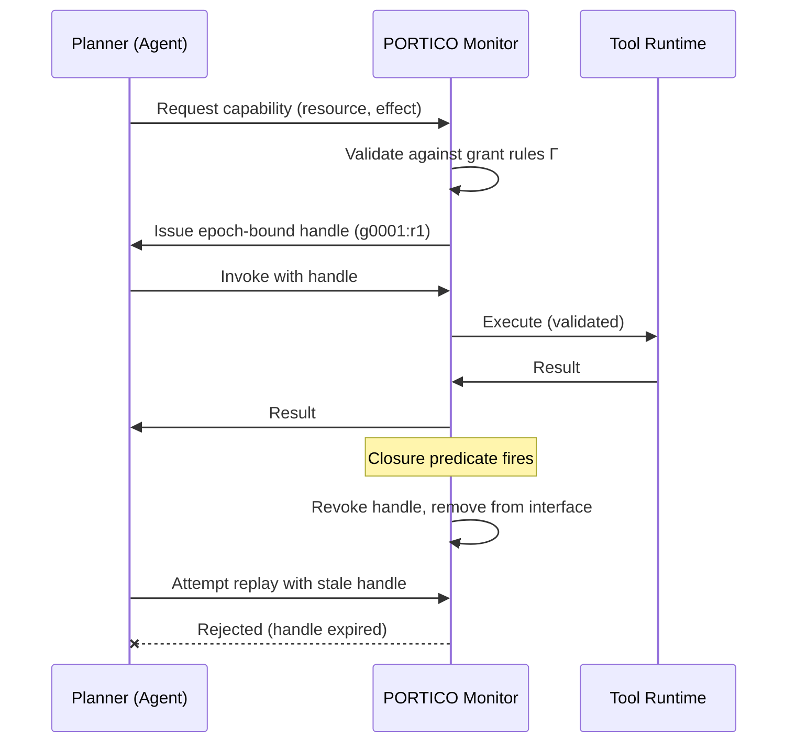
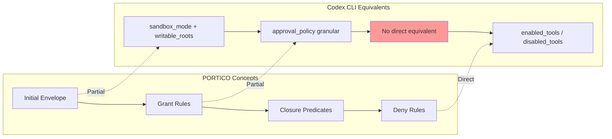

# Lingering Authority and Revocable Capabilities: What PORTICO Reveals About the Permission Gap in Coding Agents — and How Codex CLI's Approval Architecture Compares


---

## The Problem: Capabilities That Outlive Their Purpose

Every coding agent needs tool access. The trouble is how long that access persists. When you grant a coding agent write access to a database migration file, that permission typically remains active for the entire session — long after the migration subtask is complete and the agent has moved on to unrelated work.

Santos-Grueiro formalises this as **lingering authority**: a resource or effect capability that remains exposed after the episode that justified it has closed [^1]. The concept is borrowed from capability-based security in operating systems, but its application to coding agents is new — and the empirical evidence is striking.

In controlled evaluations, a full-access baseline produced a 1.00 violation rate with an average blast radius of 6.65 across safety-critical scenarios [^1]. Even a static allowlist only reduced violations to 0.82 with a blast radius of 2.73 [^1]. The fundamental issue is that coarse permission envelopes — whether "allow everything" or "allow these N resources" — cannot express temporal scoping.

## PORTICO: A Reference Monitor for Epoch-Bound Capabilities

PORTICO (the paper's reference monitor implementation) addresses lingering authority through a **request–grant–invoke** lifecycle that binds capabilities to specific task epochs.

### Architecture

The system compiles an explicit task contract into four policy elements [^1]:

| Element | Purpose |
|---------|---------|
| **Initial envelope ℰ₀** | Resources available at task start |
| **Grant rules Γ** | Conditions under which new capabilities may be minted |
| **Closure rules Λ** | Predicates that trigger capability revocation |
| **Global deny rules G** | Resources that are never accessible |

At runtime, PORTICO maintains the current phase, live grants, and an observable audit state. Capabilities are issued as **epoch-bound handles** — opaque server-side references encoding task identity, epoch number, resource, privilege, and effect [^1].

### The Grant Lifecycle



The critical property is **closure before reuse** (Guarantee G4): closed-grant capabilities are removed from the planner's interface before the next adjudication turn [^1]. This is not merely policy enforcement — the revoked capability becomes invisible to the agent's planning context, reducing the likelihood of even attempting stale access.

### Four Nested Capability Sets

PORTICO defines four progressively narrower descriptor sets [^1]:

1. **Available** — all registered tool primitives
2. **Reachable** — resources the runtime can physically access
3. **Policy-admissible** — resources permitted by current policy or future grants
4. **Executable** — capabilities that pass the full executability test at this instant

The executability test combines global deny checks, phase validation, and either initial-envelope membership or live-handle presence. This layered model means a tool can be *available* and *reachable* yet not *executable* because its grant has been closed.

## Empirical Results

### Safety (Suite A)

| Condition | Violation Rate | Avg Blast Radius |
|-----------|---------------|------------------|
| Full access | 1.00 | 6.65 |
| Static allowlist | 0.82 | 2.73 |
| Coarse sandbox | 0.86 | 4.09 |
| **PORTICO full** | **0.00** | **0.00** |

Zero violations across 85 repeated executions [^1]. The result held across all tested models, including GPT-5.5, Gemini 3.5 Flash, and Claude Opus 4.8 in frontier model slices [^1].

### Utility (Suite B)

The safety improvement comes at a cost: task success dropped from 0.97 (full access) to 0.87 (PORTICO full) across 37 episodes [^1]. The 10-percentage-point utility tax reflects cases where the agent needed capabilities that the contract did not anticipate — a contract-authoring problem rather than a runtime one.

Critically, PORTICO's core-only variant (without grant expansion) dropped to 0.21 success rate [^1], demonstrating that the grant mechanism is essential — static restriction alone destroys utility.

### Stale-Effect Prevention

The most compelling result is in post-closure behaviour. Across six deterministic stale-write scenarios spanning file, git, and network domains [^1]:

- **PORTICO**: 0/6 stale capabilities accepted, 0/6 forbidden effects executed
- **Non-revoking comparator**: 6/6 stale capabilities accepted, 6/6 forbidden effects executed

The non-revoking variant maintained the same policy rules but did not remove handles from the planner interface after closure. Every stale access attempt succeeded. This isolates revocation as the mechanism that prevents lingering authority — policy enforcement alone is insufficient when the agent can still see and invoke expired capabilities.

## Mapping to Codex CLI's Permission Architecture

Codex CLI does not implement epoch-bound revocable capabilities. Its permission model operates at a different level of abstraction — but the gap analysis reveals where PORTICO's concepts apply and where Codex CLI's existing mechanisms already address parts of the problem.

### Codex CLI's Two-Layer Model

Codex CLI enforces security through two independent layers [^2]:

1. **Sandbox** — OS-enforced containment (macOS Seatbelt / Linux Landlock) restricting filesystem access, network connectivity, and process spawning [^3]
2. **Approval policy** — runtime consent gates controlling when the agent must pause and request human confirmation [^2]

The approval policy supports three modes: `suggest` (approve everything), `auto-edit` (auto-approve file edits, confirm commands), and `full-auto` (no confirmation required) [^2]. Granular approval policies allow per-category control over sandbox approvals, MCP prompts, exec-policy rules, and skill-script approvals [^4].

### Where Codex CLI Aligns with PORTICO



| PORTICO Concept | Codex CLI Equivalent | Gap |
|-----------------|---------------------|-----|
| Initial envelope ℰ₀ | `sandbox_mode` + `writable_roots` in `config.toml` | Static for session duration |
| Grant rules Γ | Granular `approval_policy` categories | No temporal scoping; approval is per-action, not per-epoch |
| Closure rules Λ | **None** | No mechanism to revoke previously granted access |
| Global deny G | `enabled_tools` / `disabled_tools` allow-lists [^5] | Direct match for tool-level denial |
| Epoch-bound handles | **None** | Permissions are session-scoped, not task-scoped |
| Four-guarantee model | Two-layer sandbox + approval | Missing visibility invariant (G1) and closure-before-reuse (G4) |

### The Closure Gap

The most significant architectural difference is the absence of **closure predicates** in Codex CLI. Once an agent operating in `full-auto` mode gains write access to a directory through `writable_roots`, that access persists until the session ends. There is no mechanism to say "grant write access to `db/migrations/` until the migration subtask completes, then revoke."

This matters in practice for multi-step workflows where the agent transitions between subgoals with different trust requirements — for example, writing database migrations (high-risk) followed by updating documentation (low-risk). In PORTICO's model, the migration-write capability would be revoked before the documentation phase begins.

### Approximating Epoch-Bound Permissions Today

While Codex CLI lacks native revocable capabilities, its existing features can approximate temporal scoping:

**1. Subagent Delegation with Isolated Sandboxes**

Codex CLI's subagent system allows delegating subtasks to child agents with their own sandbox configuration [^6]. Each subagent operates in an isolated context, and its permissions expire when it completes:

```toml
# Subagent definition for migration task
[subagent.migration]
sandbox_mode = "workspace-write"
writable_roots = ["db/migrations"]
approval_policy = "on-request"

# Subagent definition for docs task
[subagent.docs]
sandbox_mode = "workspace-write"
writable_roots = ["docs/"]
approval_policy = "never"
```

This achieves a form of epoch-bound permissions — the migration subagent's write access to `db/migrations/` ends when it returns control to the parent agent. However, it requires explicit decomposition of the task into subagents rather than automatic grant/revoke cycles.

**2. PreToolUse / PostToolUse Hooks as Soft Closure**

Codex CLI's hook system [^7] can enforce post-hoc validation of capability usage:

```toml
# hooks.toml — flag stale-phase file access
[[hooks]]
event = "PreToolUse"
match_tools = ["write_file"]
command = "python3 scripts/phase_guard.py"
```

A `phase_guard.py` script could track the current task phase and reject writes to resources that belong to a completed phase. This approximates PORTICO's closure predicates but operates at the enforcement layer rather than the visibility layer — the agent can still *see* the capability and may waste tokens attempting to use it.

**3. Per-Directory AGENTS.md Overrides**

AGENTS.md files at different directory levels can encode phase-appropriate constraints [^8]. While these are loaded at session start rather than dynamically revoked, they provide a static version of PORTICO's initial envelope:

```markdown
<!-- db/migrations/AGENTS.md -->
# Migration Rules
- Only modify files in this directory during migration tasks
- Run `make migrate-test` after every change
- Do NOT modify files outside db/migrations/ during this phase
```

## What a PORTICO-Like Extension to Codex CLI Would Look Like

The gap between Codex CLI's current model and PORTICO's revocable capabilities suggests a possible future direction for agent permission systems.

A minimal implementation would require three additions:

1. **Task contract declarations** — TOML or YAML manifests specifying which resources each task phase requires, with explicit closure conditions
2. **Handle-based capability tokens** — replacing session-scoped permissions with epoch-bound references that the runtime can invalidate
3. **Visibility filtering** — removing revoked capabilities from the agent's tool interface (not just enforcing denial at execution time)

The third point is particularly important. PORTICO's evaluation showed that visibility filtering (removing handles from the planner interface) and policy enforcement (rejecting stale invocations) are both necessary [^1]. The "all-visible same-policy" variant — which enforced the same rules but kept revoked capabilities visible — generated 25% more blocked proposals (84 vs 67) because the agent wasted planning steps attempting to use capabilities it could see but not execute [^1].

## Practical Implications

For teams using Codex CLI today, the lingering authority problem manifests most acutely in three scenarios:

1. **Multi-phase workflows** — CI/CD pipelines where the agent moves from code generation to testing to deployment, each requiring different resource access
2. **Shared repository work** — agents operating on monorepos where different directories have different trust levels
3. **MCP server interactions** — external tool access (databases, APIs, cloud providers) that should be scoped to specific subtasks

The subagent delegation pattern offers the most practical mitigation: decompose high-risk workflows into isolated subagents with minimal permission envelopes, rather than granting the parent agent broad access for the entire session.

## Citations

[^1]: Santos-Grueiro, I. (2026). *Lingering Authority: Revocable Resource-and-Effect Capabilities for Coding Agents*. arXiv:2606.22504. [https://arxiv.org/abs/2606.22504](https://arxiv.org/abs/2606.22504)

[^2]: OpenAI. (2026). *Agent approvals & security — Codex CLI*. OpenAI Developers. [https://developers.openai.com/codex/agent-approvals-security](https://developers.openai.com/codex/agent-approvals-security)

[^3]: OpenAI. (2026). *Sandbox — Codex CLI*. OpenAI Developers. [https://developers.openai.com/codex/concepts/sandboxing](https://developers.openai.com/codex/concepts/sandboxing)

[^4]: SmartScope. (2026). *Codex CLI approval_policy: Legacy Patterns vs Official 2026 Approval Settings*. [https://smartscope.blog/en/generative-ai/chatgpt/codex-cli-approval-policy-implementation/](https://smartscope.blog/en/generative-ai/chatgpt/codex-cli-approval-policy-implementation/)

[^5]: OpenAI. (2026). *Configuration Reference — Codex CLI*. OpenAI Developers. [https://developers.openai.com/codex/config-reference](https://developers.openai.com/codex/config-reference)

[^6]: OpenAI. (2026). *Advanced Configuration — Codex CLI*. OpenAI Developers. [https://developers.openai.com/codex/config-advanced](https://developers.openai.com/codex/config-advanced)

[^7]: OpenAI. (2026). *Codex CLI Features*. OpenAI Developers. [https://developers.openai.com/codex/cli/features](https://developers.openai.com/codex/cli/features)

[^8]: OpenAI. (2026). *Custom instructions with AGENTS.md — Codex CLI*. OpenAI Developers. [https://developers.openai.com/codex/guides/agents-md](https://developers.openai.com/codex/guides/agents-md)
