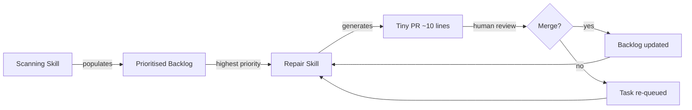
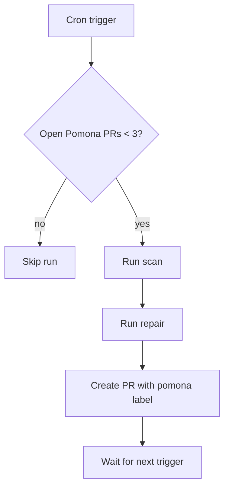

# Pomona and the Kaizen Loop: What Bloomberg's Tiny-Diff Code Quality Agent Teaches Us About Building Scanning-Repair Workflows with Codex CLI


---

## The Problem Nobody Schedules Time For

Technical debt accrues silently. Dead imports, stale TODO markers, unreachable branches, disabled lint rules — individually harmless, collectively corrosive. Teams know they should fix these things. Sprint planners nod sagely. The backlog grows.

Bloomberg's answer, published in June 2026 as *Pomona: Continuous Code Quality Improvement via Small, Automated Changes at Bloomberg* [^1], is to stop pretending humans will volunteer for this work and let an agent handle it — but constrain that agent to changes so small they barely register as review overhead. Over a one-month production deployment, 15 of 17 generated pull requests merged, with a median time-to-close of under two hours [^1].

The architecture is simple enough to replicate with Codex CLI today.

## What Pomona Actually Does

Pomona is a two-skill agent loop inspired by the Kaizen philosophy of continuous incremental improvement [^1]. The loop cycles between **Scanning** (finding work) and **Repair** (doing it), mediated by a prioritised backlog.



### The Scanning Skill

Three parallel sub-agents feed the backlog [^1]:

1. **Static analysis expansion** — surfaces violations from stricter rule sets (ruff rules not yet enforced, mypy strict mode)
2. **Technical debt markers** — harvests `TODO`, `FIXME`, `HACK`, `XXX` annotations and flags dead code
3. **Test coverage gaps** — identifies uncovered branches and coding standard deviations

### The Priority Matrix

Tasks are scored on a 2×2 grid of **benefit** versus **ease-of-review** [^1]:

| | Easy to review | Hard to review |
|---|---|---|
| **High benefit** | P1 — do first | P3 — do carefully |
| **Low benefit** | P2 — cheap wins | P4 — avoid |

High-benefit changes catch real bugs (mutable defaults, loop variable capture, missing exception chains), reduce maintenance burden (dead code removal, misleading comments), or improve developer experience [^1]. Pomona only picks from P1 and P2 when the queue is non-empty; the Repair skill triggers a fresh scan when those buckets run dry.

### The Repair Skill

Each repair targets roughly 10 lines of diff [^1]. The skill:

1. Selects the highest-priority backlog item
2. Implements the fix
3. Validates against the project's testing and linting commands
4. Updates the backlog — deletes the completed task, adds any follow-up tasks discovered during the fix
5. Commits with a clear motivation message
6. Creates a pull request for human review

The constraint on diff size is deliberate. Bloomberg's survey of 10 senior engineers found that 90% valued small diffs specifically because they could be reviewed in seconds rather than minutes [^1]. The preferred cadence was 2–3 PRs per week (70% of respondents) [^1].

## Production Results

The one-month deployment produced striking numbers [^1]:

| Metric | Value |
|---|---|
| PRs generated | 17 |
| PRs merged | 15 (88.2%) |
| Median time-to-close | 1h 43m |
| Closed within 4 hours | 70.5% |
| Median files changed | 4 |
| Median lines changed | 16 |
| Required human commits | 4 of 15 |

Fourteen of the 17 PRs addressed linting violations; the remaining three targeted other categories [^1]. The two rejections stemmed from a race condition: Pomona executed twice before the first PR was reviewed, creating duplicates. The fix was to skip tasks already addressed in open PRs [^1].

## Building the Pomona Loop with Codex CLI

Codex CLI's architecture maps cleanly onto Pomona's two-skill design. The Scanning skill becomes a `codex exec` call in read-only mode; the Repair skill becomes a second `codex exec` call with write permissions and a constrained diff budget.

### Step 1: Define the Scanning AGENTS.md

Create a dedicated `AGENTS.md` for the scanning phase:

```markdown
# Scanning Agent

You are a code quality scanner. Your job is to identify small, high-value
improvement tasks in this repository.

## Sources to check
- Run `ruff check . --statistics` and note any rule categories with > 5 violations
- Run `mypy app/ --strict 2>&1 | head -50` and categorise error types
- Search for `TODO`, `FIXME`, `HACK`, `XXX` markers older than 6 months
- Identify functions exceeding 50 lines
- Find commented-out code blocks (> 3 consecutive lines)
- Check for unused imports and dead code

## Output format
Write a JSON file `quality-backlog.json` with an array of tasks:
```json
[
  {
    "id": "001",
    "category": "lint",
    "priority": "P1",
    "file": "src/auth.py",
    "description": "Mutable default argument on line 42",
    "benefit": "Prevents shared-state bug",
    "estimated_lines": 3
  }
]
```

## Rules
- Do NOT modify any source files
- Do NOT create PRs
- Focus on P1 and P2 items only
- Maximum 20 tasks per scan
```

### Step 2: Run the Scan

```bash
codex exec \
  --mode read-only \
  --model gpt-5.5 \
  "Scan this repository for code quality improvements. \
   Follow the instructions in AGENTS.md. \
   Write results to quality-backlog.json."
```

The `--mode read-only` flag [^2] ensures the scanner cannot modify source files — it can only observe and report. The output is a structured backlog that feeds the repair phase.

### Step 3: Define the Repair AGENTS.md

A separate instructions file for the repair phase:

```markdown
# Repair Agent

You are a code quality repair agent. You fix ONE task at a time from
quality-backlog.json.

## Constraints
- Change no more than 15 lines of diff
- Run `ruff check .` after every change — exit 0 required
- Run `pytest -v` after every change — all tests must pass
- Run `mypy app/ --strict` — no new errors introduced
- Update quality-backlog.json to remove the completed task

## Commit message format
fix(<category>): <short description>

Body explains the benefit, not the mechanics.
```

### Step 4: Run the Repair

```bash
codex exec \
  --mode workspace-write \
  --model gpt-5.5 \
  "Read quality-backlog.json. Pick the first P1 task. \
   Fix it following the Repair Agent instructions. \
   Commit the change."
```

### Step 5: Automate with GitHub Actions

The full loop can run on a schedule via `openai/codex-action@v1` [^3]:


```yaml
name: Pomona-style quality sweep
on:
  schedule:
    - cron: '0 6 * * 1,3,5'  # Mon/Wed/Fri at 06:00 UTC

jobs:
  scan:
    runs-on: ubuntu-latest
    steps:
      - uses: actions/checkout@v4
      - uses: openai/codex-action@v1
        with:
          codex_args: >-
            exec --mode read-only
            "Scan for code quality improvements per AGENTS.md.
             Write quality-backlog.json."
          sandbox: read-only
        env:
          OPENAI_API_KEY: ${{ secrets.OPENAI_API_KEY }}
      - uses: actions/upload-artifact@v4
        with:
          name: quality-backlog
          path: quality-backlog.json

  repair:
    needs: scan
    runs-on: ubuntu-latest
    steps:
      - uses: actions/checkout@v4
      - uses: actions/download-artifact@v4
        with:
          name: quality-backlog
      - uses: openai/codex-action@v1
        with:
          codex_args: >-
            exec --mode workspace-write
            "Pick the first P1 task from quality-backlog.json.
             Fix it. Commit. Create a PR."
          sandbox: workspace-write
        env:
          OPENAI_API_KEY: ${{ secrets.OPENAI_API_KEY }}
          GITHUB_TOKEN: ${{ secrets.GITHUB_TOKEN }}
```


The action drops sudo permissions so that Codex cannot access its own API key [^3] — critical for public repositories.

### Step 6: Guard Against Pomona's Failure Modes

Bloomberg identified two key failure modes worth defending against [^1]:

1. **Race conditions** — the agent fixes the same issue twice before the first PR is reviewed. Add a pre-flight check: query the GitHub API for open PRs with the `pomona` label before selecting a task.

2. **Review overload** — engineers found 2–3 PRs per week optimal. Cap the cron schedule accordingly and use `rollout_token_budget` [^4] to enforce a per-run token ceiling.



## Where Pomona Meets Codex CLI's Existing Tooling

Several Codex CLI features align directly with Pomona's design:

- **`codex exec` non-interactive mode** [^2] enables headless scanning and repair — no human at the terminal required
- **`openai/codex-action@v1`** [^3] wraps the CLI for GitHub Actions with sandboxed permissions
- **AGENTS.md** [^5] provides per-directory instruction injection, letting you scope scanning rules to specific modules
- **PostToolUse hooks** can validate that every repair pass leaves the linter in a clean state before committing [^6]
- **Configurable rollout token budgets** [^4] prevent runaway repair sessions from consuming excessive tokens

The combination of read-only scanning and constrained write-mode repair mirrors Pomona's separation of concerns — and Codex CLI's sandbox modes enforce it at the infrastructure level rather than relying on prompt compliance alone.

## What Bloomberg's Results Mean for the Rest of Us

The 88% merge rate on tiny diffs is the headline, but the subtler finding matters more: **11 of 15 accepted PRs required zero human commits** [^1]. The agent's fixes were correct as-is. This suggests that constraining diff size does not merely reduce review burden — it also reduces the error rate of the fixes themselves. Smaller changes leave fewer places for the model to hallucinate.

The Kaizen framing is apt. Nobody refactors a codebase in one heroic sprint. But an agent that files three clean, four-file PRs per week, each removing a mutable default or clearing dead code, compounds. Over a quarter, that is 36–39 merged improvements that no human had to plan, schedule, or remember.

The tooling to build this exists today. The discipline to constrain diff size, validate with real linters, and respect human review cadence — that is the engineering contribution Pomona demonstrates.

---

## Citations

[^1]: Williams, D., Evripiotis, A., Kirbas, S., Morgan, H., Magidovich, S., Wainwright, P. and Sarro, F. (2026) *Pomona: Continuous Code Quality Improvement via Small, Automated Changes at Bloomberg.* arXiv:2606.06752. Available at: [https://arxiv.org/abs/2606.06752](https://arxiv.org/abs/2606.06752)

[^2]: OpenAI (2026) *Codex CLI Features.* Available at: [https://developers.openai.com/codex/cli/features](https://developers.openai.com/codex/cli/features)

[^3]: OpenAI (2026) *Codex GitHub Action.* Available at: [https://developers.openai.com/codex/github-action](https://developers.openai.com/codex/github-action)

[^4]: OpenAI (2026) *Codex Changelog — configurable rollout token budgets.* Available at: [https://developers.openai.com/codex/changelog](https://developers.openai.com/codex/changelog)

[^5]: OpenAI (2026) *Custom instructions with AGENTS.md.* Available at: [https://developers.openai.com/codex/guides/agents-md](https://developers.openai.com/codex/guides/agents-md)

[^6]: OpenAI (2026) *Automating Code Quality and Security Fixes with Codex CLI on GitLab.* Available at: [https://developers.openai.com/cookbook/examples/codex/secure_quality_gitlab](https://developers.openai.com/cookbook/examples/codex/secure_quality_gitlab)
