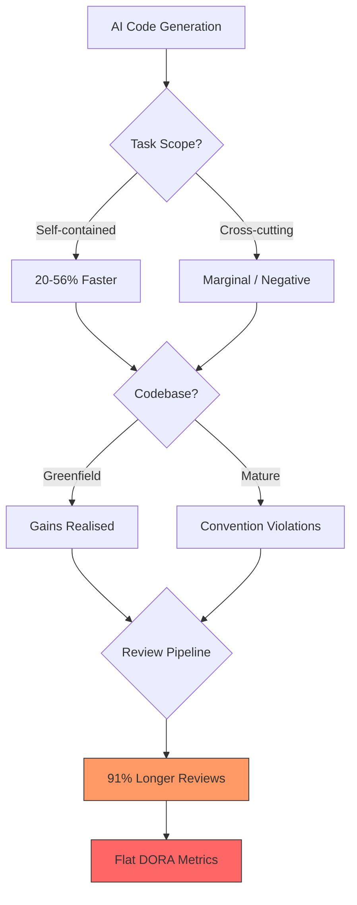
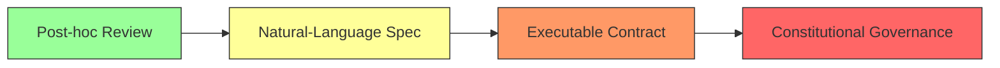
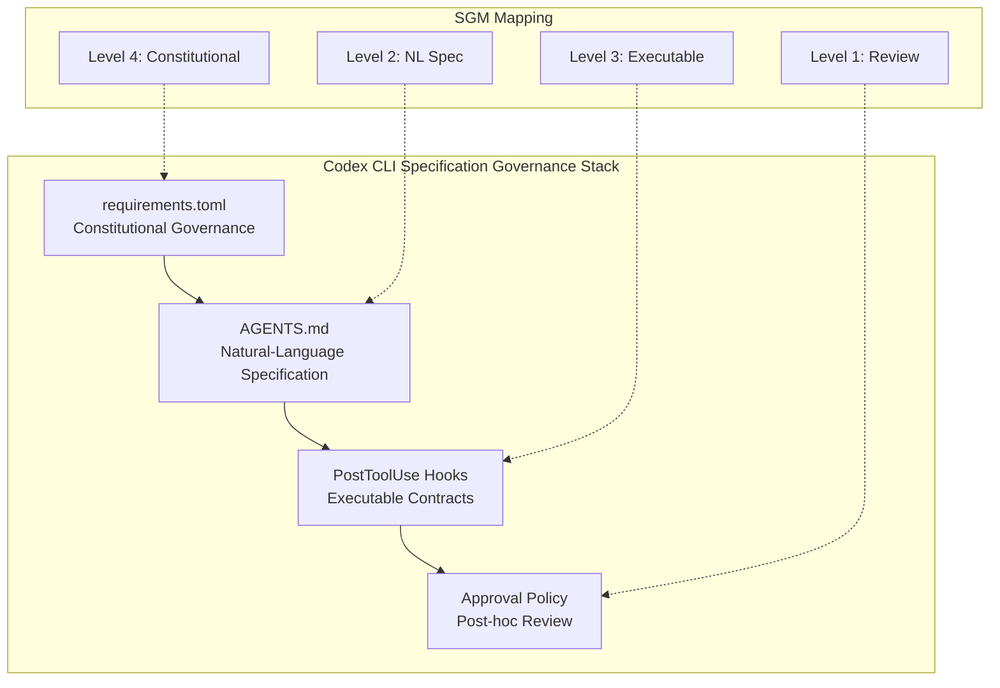

# The Productivity-Reliability Paradox: Why 98 Per Cent More Pull Requests Broke Nothing — Except Your Review Pipeline — and How Specification Governance Fixes It with Codex CLI


---

## The Numbers That Should Worry You

Your team adopted Codex CLI six months ago. Individual throughput is up. Pull requests are flowing. Everyone feels faster. And yet, lead time is flat, rollbacks haven't budged, and reviewers are drowning.

You are not imagining this. In May 2026, Sabry Farrag of the University of East London published a systematic multivocal literature review spanning 67 sources (January 2022 through April 2026) that gave this phenomenon a name: the **Productivity-Reliability Paradox** (PRP) [^1]. The headline statistics paint an uncomfortable picture:

- Teams using AI coding tools merge **98% more pull requests** [^2]
- PR review time increases by **91%** [^2]
- Average PR size grows by **154%** [^2]
- Bug counts rise by **9%** [^2]
- Organisational DORA metrics remain **flat** [^3]

Meanwhile, the most methodologically rigorous randomised controlled trial — 16 experienced open-source developers across 246 tasks — found that AI tooling produced a **19% slowdown**, despite developers forecasting a 24% speed-up beforehand and estimating a 20% speed-up afterwards [^4].

The paradox is real, it is structural, and it will not fix itself.

---

## Anatomy of the Paradox

Farrag identifies **three moderating variables** that determine whether AI-assisted coding delivers genuine gains or amplifies organisational drag [^1]:

### 1. Task Abstraction Level

Well-scoped, self-contained tasks (adding a utility function, writing a data-transfer object) consistently show 20–56% productivity gains across multiple controlled studies [^5]. Cross-cutting changes touching multiple modules — the kind that matter in production systems — show far weaker or negative effects.

### 2. Codebase Maturity

Greenfield projects benefit most. Mature codebases with established conventions, implicit architectural constraints, and accumulated technical debt punish AI-generated code that plausibly compiles but subtly violates project norms.

### 3. Developer Experience

Senior developers suffer the "verification tax": an average of 4.3 minutes per AI suggestion reviewing code that looks correct but may not be [^1]. Junior developers face a different problem — they accept suggestions they cannot fully evaluate, creating latent defects.



### The Two Amplifying Mechanisms

Even where individual gains are real, two mechanisms erode them at the organisational level [^1]:

**Code Review Bottleneck.** AI-generated code is plausible by construction, not correct by construction [^1]. Every additional PR requires human review. When generation accelerates without proportional acceleration of the review pipeline, queues grow. The Faros AI 2026 study — doubling the sample to 22,000 developers across 4,000 teams — showed the paradox worsening: bugs per developer up 54%, production incidents per PR tripled [^6].

**Context Window Constraint.** Coding agents operate within finite context windows. As sessions lengthen, earlier specification context gets compacted or evicted, causing the agent to drift from the original intent. The semantic distance between what the developer means and what the program does widens silently.

---

## The Specification Governance Model

Farrag's core thesis is pointed: **specification discipline, not model capability, is the binding constraint on AI-assisted software dependability** [^1].

Drawing on Transaction Cost Economics [^7], the paper frames AI code generation as a principal-agent transaction characterised by:

| Property | Effect |
|----------|--------|
| **Asset specificity** | Domain-specific code has limited portability, creating lock-in costs |
| **Behavioural uncertainty** | Non-deterministic generators produce unpredictable output |
| **Frequency** | Dozens of daily invocations amortise governance investment |

This combination makes upfront specification investment economically rational — the same logic that drives formal contracts in high-frequency, high-uncertainty procurement.

### Four Governance Levels

The Specification Governance Model (SGM) proposes four levels of increasing rigour [^1]:



| Task Profile | Recommended Level |
|-------------|-------------------|
| Self-contained, greenfield, cosmetic risk | Post-hoc review |
| Self-contained, mature codebase, functional risk | Natural-language spec + tests |
| Cross-cutting, any codebase, functional risk | Executable contract |
| Cross-cutting, any codebase, security/data risk | Constitutional governance |

---

## Practical Instantiations: Spec Kit and TDAD

Two tools validate the SGM framework in practice.

### GitHub Spec Kit

Released under MIT licence in May 2026 and now at v0.11.0 with 93,000+ GitHub stars [^8], Spec Kit provides a four-phase workflow:

1. **`/speckit.constitution`** — non-negotiable project principles
2. **`/speckit.specify`** — formal specification of what to build
3. **`/speckit.plan`** — technical implementation design
4. **`/speckit.tasks`** — decomposition into verifiable units

Spec Kit works with 30+ coding agents including Codex CLI [^8]. Over 70 community extensions add compliance gates, architecture guards, and visibility hooks.

### TDAD (Test-Driven AI Agent Definition)

The TDAD pipeline [^9] treats agent prompts as compiled artefacts:

1. Engineers provide behavioural specifications
2. **TestSmith** converts specifications to executable tests
3. **PromptSmith** iteratively refines prompts until tests pass
4. **MutationSmith** generates faulty prompt variants post-compilation to validate test suite quality

Across 24 independent trials, TDAD achieves [^9]:

- 92% v1 compilation success
- 97% mean hidden-test pass rate
- 86–100% mutation scores
- 97% regression safety under specification evolution

---

## The Pilot Evidence

Farrag ran a four-month within-subject pilot with 14 mid-to-senior engineers across three full-stack projects (React/Node, Vue/NestJS, React/Go microservices) [^1]:

| Metric | Baseline (2 months) | Spec Kit Phase (2 months) |
|--------|---------------------|---------------------------|
| Median lead time | 8–12 days | 6–9 days |
| Late-stage hotfixes per sprint | 3–5 | 1–2 |
| Rollbacks per month | 2–4 | 0–1 |
| Code churn (reverted <2 weeks) | 12–18% | 6–10% |
| Developer confidence (Likert 1–5) | 3.1 | 3.9 |
| Spec authoring overhead | — | 45–90 min per medium feature |

The critical finding: specification-driven workflows **shift verification effort earlier** (spec authorship costs 45–90 minutes) rather than eliminating it. The payoff comes in reduced late-stage regressions and rollbacks [^1].

---

## Mapping the SGM to Codex CLI

Codex CLI's configuration architecture maps cleanly onto all four SGM governance levels.

### Level 1: Post-hoc Review (Low-Risk Tasks)

Default Codex CLI behaviour — the agent generates, the developer reviews. Suitable for isolated utility functions in greenfield code.

### Level 2: Natural-Language Specification via AGENTS.md

AGENTS.md files provide hierarchical, repository-scoped natural-language constraints that Codex CLI reads automatically [^10]. Research across 138 repositories found that developer-written AGENTS.md files reduce agent-generated bugs by 35–55% [^11].

```markdown
<!-- AGENTS.md -->
# Specification Constraints

## Architecture
- All new endpoints MUST have an OpenAPI schema before implementation
- Database migrations require a rollback script in the same PR

## Testing
- Minimum 80% branch coverage for new modules
- Integration tests required for any cross-service communication
```

### Level 3: Executable Contracts via PostToolUse Hooks

PostToolUse hooks execute after every tool call, enforcing executable contracts in real time [^12]:

```toml
# config.toml — executable specification enforcement
[hooks.post_tool_use]
command = "bash -c 'npm run lint && npm run test:affected -- --bail'"
timeout_ms = 60000
on_failure = "block"
```

Combined with Spec Kit's `/speckit.tasks` output as a structured specification, this creates a closed loop: the specification defines what should be true, and the hook verifies it after every agent action.

### Level 4: Constitutional Governance via requirements.toml

For enterprise environments, `requirements.toml` provides admin-enforced, non-overridable constraints [^13]:

```toml
# requirements.toml — constitutional constraints
[approval_policy]
default = "unless-allow-listed"

[sandbox]
mode = "full"

[hooks.post_tool_use]
command = "bash -c './scripts/security-scan.sh && ./scripts/spec-compliance.sh'"
on_failure = "block"
```

This maps directly to Spec Kit's `/speckit.constitution` — principles that no individual developer or agent can override.



---

## Breaking the Review Bottleneck

The review bottleneck amplifies the paradox because human review capacity is fixed whilst AI generation capacity is unbounded. Codex CLI offers three mechanisms to compress the review burden without abandoning it:

### 1. Hook-Based Pre-Review Filtering

PostToolUse hooks catch specification violations before a PR reaches a human reviewer. If the hook blocks, the agent self-corrects. The reviewer sees only compliant diffs.

### 2. Subagent Delegation with Scoped Specifications

Codex CLI's subagent model supports per-directory AGENTS.md files [^10]. Each subagent inherits a narrower specification scope, producing smaller, more reviewable diffs:

```markdown
<!-- services/payments/AGENTS.md -->
# Payment Service Specification
- All monetary values use decimal types, never floating-point
- PCI DSS: never log card numbers, even in debug mode
- Every state transition requires an idempotent retry test
```

### 3. Structured Diff Review via Stop Hooks

A Stop hook can generate a structured summary of all changes made during a session, formatted for rapid reviewer consumption:

```toml
[hooks.stop]
command = "bash -c './scripts/generate-review-brief.sh'"
```

---

## The Practitioner Decision Framework

Adapted from Farrag's governance decision guide and mapped to Codex CLI configuration [^1]:

| Situation | Governance Level | Codex CLI Configuration |
|-----------|-----------------|------------------------|
| Isolated function, greenfield | Post-hoc review | Default behaviour |
| Module change, mature codebase | NL specification | AGENTS.md per-directory |
| Cross-module refactor | Executable contract | PostToolUse hooks + Spec Kit tasks |
| Security-critical, regulated | Constitutional | requirements.toml + approval_policy |

**One caveat the paper stresses:** specification authorship cannot replace code literacy. Junior developers must develop dual competency in both implementation and specification authorship [^1]. Using Codex CLI's `suggest` mode — where the agent proposes but the developer decides — provides deliberate practice that `full-auto` mode does not.

---

## Conclusion

The Productivity-Reliability Paradox is not a bug in AI coding tools. It is an emergent property of accelerating generation without proportionally governing the output. The fix is not better models — it is better specifications.

Codex CLI already ships the machinery to implement specification governance at every level: AGENTS.md for natural-language constraints, PostToolUse hooks for executable contracts, requirements.toml for constitutional governance, and subagent delegation for scope isolation. The missing piece, for most teams, is the discipline to write the specification before prompting the agent.

Forty-five minutes of specification authorship per feature is the tax. Halving your rollbacks and late-stage hotfixes is the return.

---

## Citations

[^1]: Farrag, S.E. (2026). "The Productivity-Reliability Paradox: Specification-Driven Governance for AI-Augmented Software Development." arXiv:2605.01160. [https://arxiv.org/abs/2605.01160](https://arxiv.org/abs/2605.01160)

[^2]: Faros AI (2025). "AI Engineering Impact Report." Based on telemetry from 10,000+ developers across 1,255 teams. [https://www.faros.ai/research](https://www.faros.ai/research)

[^3]: DORA (2024). "Accelerate State of DevOps Report." Survey of 3,000 organisations showing 7.2% delivery stability decrease with high AI adoption. [https://dora.dev/research/](https://dora.dev/research/)

[^4]: Becker, J. et al. (2025). "Measuring the Impact of Early-2025 AI on Experienced Open-Source Developer Productivity." METR RCT, 16 developers, 246 tasks. [https://arxiv.org/abs/2507.09089](https://arxiv.org/abs/2507.09089)

[^5]: Peng, S. et al. (2023). "The Impact of AI on Developer Productivity: Evidence from GitHub Copilot." RCT with 95 developers showing 55–56% faster task completion. [https://arxiv.org/abs/2302.06590](https://arxiv.org/abs/2302.06590)

[^6]: Faros AI (2026). "Acceleration Whiplash: AI Coding Throughput vs. Quality." 22,000 developers, 4,000 teams. Bugs per developer up 54%, production incidents per PR tripled. [https://www.faros.ai/research](https://www.faros.ai/research)

[^7]: Williamson, O.E. (1985). *The Economic Institutions of Capitalism.* Free Press.

[^8]: GitHub (2026). "Spec Kit: Toolkit for Spec-Driven Development." v0.11.0, MIT licence, 93,000+ stars. [https://github.com/github/spec-kit](https://github.com/github/spec-kit)

[^9]: TDAD (2026). "Test-Driven AI Agent Definition: Compiling Tool-Using Agents from Behavioral Specifications." arXiv:2603.08806. [https://arxiv.org/abs/2603.08806](https://arxiv.org/abs/2603.08806)

[^10]: OpenAI (2026). "Custom instructions with AGENTS.md." Codex CLI documentation. [https://developers.openai.com/codex/guides/agents-md](https://developers.openai.com/codex/guides/agents-md)

[^11]: On the Impact of AGENTS.md Files on the Efficiency of AI Coding Agents. arXiv:2601.20404. [https://arxiv.org/abs/2601.20404](https://arxiv.org/abs/2601.20404)

[^12]: OpenAI (2026). "Codex CLI Features — Hooks." [https://developers.openai.com/codex/cli/features](https://developers.openai.com/codex/cli/features)

[^13]: OpenAI (2026). "Codex CLI Configuration Reference." [https://developers.openai.com/codex/config-reference](https://developers.openai.com/codex/config-reference)
