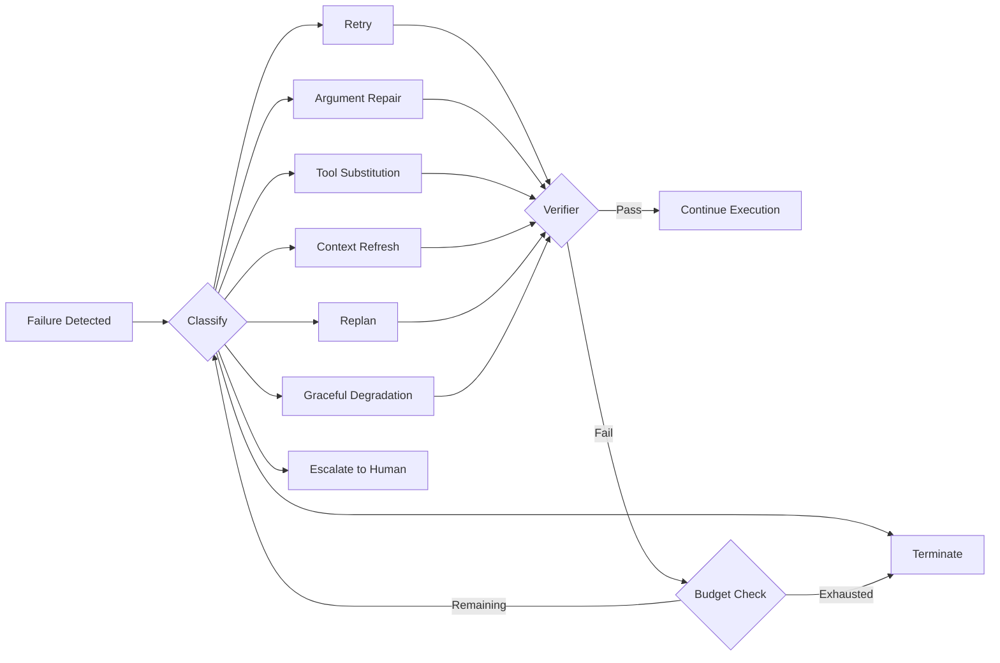
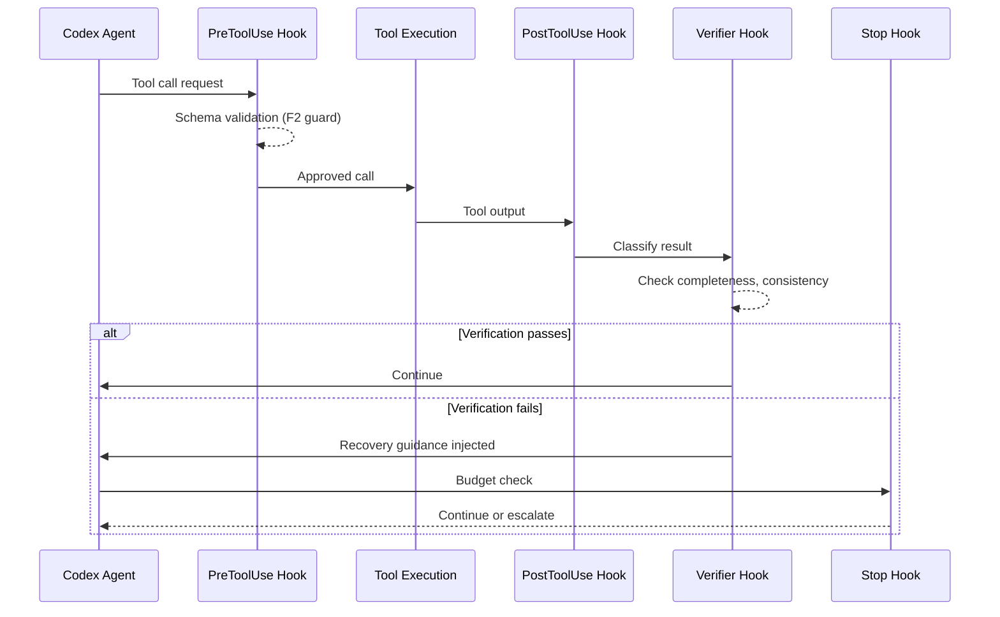

# Self-Healing Orchestration for Coding Agents: What Targeted Recovery Teaches Us About Building Resilient Codex CLI Workflows


---

When a tool call fails inside a coding agent, most harnesses do one of two things: retry blindly or abandon the plan and start over. Neither is good enough. Blind retries waste budget on faults that will not resolve themselves — a malformed argument will fail identically on the second attempt. Full replanning discards valid intermediate state, burning tokens to reconstruct context the agent already held. A pair of recent papers formalise a better approach: *targeted, budgeted self-healing*, where the orchestrator classifies the failure, selects the cheapest plausible recovery action, and verifies the result before continuing [^1 [^2].

This article examines those findings and maps them onto Codex CLI's hook pipeline — showing how `PreToolUse`, `PostToolUse`, and the proposed `PostToolUseFailure` event can implement the same recovery architecture inside your terminal agent.

## The Problem: Orchestration-Level Fragility

Model accuracy gets all the attention. But production tool-augmented agents fail at the *orchestration* level far more often than they hallucinate answers. Suresh Babu and Agrawal's controlled benchmark injected faults at rates between 0.1 and 0.5 per tool call across 100 tasks (9,000 total executions) and found that a static workflow — no recovery at all — achieved only 70.1% task success [^1]. The remaining 30% of failures were not model errors; they were timeouts, schema violations, stale context, and retry storms.

Jeong and Shin's parallel work reinforces the point: hallucinations, execution errors, and inconsistent reasoning propagate across multi-step workflows when the agent has no mechanism to detect and correct them mid-flight [^2].

## A Seven-Class Failure Taxonomy

The self-healing orchestrator paper defines seven failure classes that cover the observable fault space of tool-augmented agents [^1]:

| Class | Description | Example in Codex CLI |
|-------|-------------|---------------------|
| **F1: Tool timeout / unavailability** | Endpoint failures, rate limits | MCP server unreachable, API rate-limited |
| **F2: Schema / argument failure** | Invalid JSON, type mismatches | Malformed `apply_patch` input |
| **F3: Malformed / incomplete output** | Empty responses, parse failures | Shell command returns partial JSON |
| **F4: Incorrect tool selection** | Wrong tool for the task | Agent uses `write_file` when `apply_patch` was needed |
| **F5: Stale / insufficient context** | Outdated retrieved content | Reading a file that was modified by a parallel subagent |
| **F6: Contradictory evidence** | Conflicting tool outputs | Two MCP servers return incompatible schema versions |
| **F7: Control-loop failure** | Retry storms, no progress | Agent repeatedly running the same failing test |

This taxonomy matters because each class has a different optimal recovery action. Treating all failures as "retry" is why retry-only baselines plateau at 94.5% even under moderate fault intensity [^1].

## Eight Recovery Actions and a Budget Mechanism

The orchestrator selects from eight recovery actions, ordered by cost [^1]:



The budget mechanism enforces realistic cost accounting through six dimensions [^1]:

- **b_r** — remaining retry attempts
- **b_p** — remaining replanning operations
- **b_s** — tool-substitution attempts
- **b_m** — model-escalation opportunities
- **b_l** — latency budget
- **b_k** — cost budget

Failed recovery attempts consume budget even when they do not succeed. This prevents the degenerate case where an agent burns its entire token allocation on a fault that was never going to resolve through the action it kept attempting.

## The Numbers: Targeted Beats Blind

The controlled benchmark results are unambiguous [^1]:

| Strategy | Success (normal) | Success (high stress) | Silent failures |
|----------|------------------|-----------------------|-----------------|
| Static workflow | 70.1% | — | — |
| Retry-only | 94.5% | 86.7% | 13.2–17.6% |
| Full replanning | 93.8% | 85.2% | 13.2–17.6% |
| **Self-healing** | **98.8%** | **97.3%** | **0.0%** |

The silent-failure column is the most striking. Non-verifying methods produced wrong-but-plausible outputs 13.2–17.6% of the time — the agent reported success on tasks it had actually failed [^1]. The verifier-guided self-healing approach eliminated silent failures entirely.

Under constrained recovery budgets (a single attempt), self-healing still achieved 94.0% versus 85.3% for retry-only and 88.2% for full replanning [^1]. Targeted classification pays for itself even when you cannot afford multiple rounds.

## Mapping to Codex CLI's Hook Pipeline

Codex CLI's hook system provides the control-plane primitives needed to implement this pattern. The lifecycle events — `SessionStart`, `PreToolUse`, `PostToolUse`, `Stop` — map to the orchestrator's observe-classify-recover-verify loop [^3].

### Failure Detection: PostToolUse and the Missing PostToolUseFailure

Today, `PostToolUse` fires only after a tool produces a *successful* output — the dispatch is gated on success in the tool registry [^4]. Tool failures are invisible to the hook pipeline. The proposed `PostToolUseFailure` event would add the missing failure branch, delivering the same matcher semantics as `PostToolUse` plus an `error_message` field describing why the invocation failed [^4].

Until `PostToolUseFailure` ships, you can approximate failure detection with a `PostToolUse` hook that inspects the tool output for error patterns:

```json
{
  "hooks": {
    "PostToolUse": [
      {
        "matcher": { "tool_name": "shell" },
        "type": "command",
        "command": "./hooks/detect-tool-failure.sh",
        "timeout": 10
      }
    ]
  }
}
```

The hook script receives the tool output on stdin and can classify the failure:

```bash
#!/usr/bin/env bash
# detect-tool-failure.sh — classify shell tool failures
INPUT=$(cat)
EXIT_CODE=$(echo "$INPUT" | jq -r '.output.exit_code // 0')
OUTPUT=$(echo "$INPUT" | jq -r '.output.stdout // ""')

if [ "$EXIT_CODE" -ne 0 ]; then
  # Classify and inject recovery guidance
  if echo "$OUTPUT" | grep -q "ECONNREFUSED\|ETIMEDOUT\|rate limit"; then
    GUIDANCE="Tool timeout or unavailability (F1). Suggest: retry after delay or substitute tool."
  elif echo "$OUTPUT" | grep -q "SyntaxError\|invalid JSON\|parse error"; then
    GUIDANCE="Schema or argument failure (F2). Suggest: repair arguments."
  elif echo "$OUTPUT" | grep -q "No such file\|not found"; then
    GUIDANCE="Stale context (F5). Suggest: refresh file listing."
  else
    GUIDANCE="Unclassified failure. Suggest: retry once, then escalate."
  fi

  echo "{\"additionalContext\": \"RECOVERY GUIDANCE: $GUIDANCE\"}"
fi
```

### Prevention: PreToolUse as a Guard

`PreToolUse` hooks can prevent entire failure classes before they occur [^3]. A schema-validation hook catches F2 (argument failures) at the gate:

```json
{
  "hooks": {
    "PreToolUse": [
      {
        "matcher": { "tool_name": "apply_patch" },
        "type": "command",
        "command": "./hooks/validate-patch-schema.sh",
        "timeout": 5
      }
    ]
  }
}
```

If the hook exits with code `2`, the tool call is blocked and the agent receives the denial reason — effectively implementing the "repair arguments before execution" recovery action without consuming a retry budget [^3].

### Budget Enforcement: Stop Hook as a Circuit Breaker

The `Stop` hook controls whether the agent continues after each turn [^3]. This is where you implement budget exhaustion:

```bash
#!/usr/bin/env bash
# budget-check.sh — circuit breaker for recovery budgets
RETRIES=$(cat /tmp/codex-recovery-retries 2>/dev/null || echo 0)
MAX_RETRIES=3

if [ "$RETRIES" -ge "$MAX_RETRIES" ]; then
  echo '{"decision": "block", "additionalContext": "Recovery budget exhausted. Escalating to human review."}'
else
  echo '{"decision": "continue"}'
fi
```

### Verification: The Missing Piece

The self-healing orchestrator's verifier is a first-class control-plane component that checks schema validity, output completeness, consistency with evidence, and response support [^1]. Codex CLI does not have a dedicated verifier event, but `PostToolUse` hooks can serve the purpose. A verifier hook inspects the tool output against expected constraints and injects corrective context if validation fails:



## Practical Configuration: A Resilient Codex CLI Profile

Combining these patterns into a named profile gives you a self-healing workflow out of the box. In your `~/.codex/config.toml`:

```toml
[profiles.resilient]
model = "o3"
approval_policy = "auto-edit"

[profiles.resilient.hooks]
# Guard: validate tool arguments before execution
[[profiles.resilient.hooks.PreToolUse]]
matcher = { tool_name = ".*" }
type = "command"
command = "./hooks/schema-guard.sh"
timeout = 5

# Detect: classify failures from tool output
[[profiles.resilient.hooks.PostToolUse]]
matcher = { tool_name = "shell|unified_exec" }
type = "command"
command = "./hooks/failure-classifier.sh"
timeout = 10

# Verify: check output completeness
[[profiles.resilient.hooks.PostToolUse]]
matcher = { tool_name = "apply_patch" }
type = "command"
command = "./hooks/patch-verifier.sh"
timeout = 10

# Budget: circuit breaker
[[profiles.resilient.hooks.Stop]]
type = "command"
command = "./hooks/budget-check.sh"
timeout = 5
```

Activate it with `codex --profile resilient` or set `CODEX_PROFILE=resilient` in your shell.

## The Gap: What Codex CLI Still Needs

The self-healing research exposes three gaps in Codex CLI's current hook architecture:

1. **No failure-branch hook.** `PostToolUse` only fires on success. The proposed `PostToolUseFailure` event [^4] would close this gap and eliminate the need for exit-code sniffing in `PostToolUse` hooks.

2. **Limited tool coverage.** Only `shell`, `unified_exec`, `apply_patch`, and MCP tools emit hook events. Every other tool handler falls back to the trait default and never fires hooks [^4]. Full coverage would let the failure taxonomy apply uniformly.

3. **No native budget tracking.** The `rollout_token_budget` configuration tracks token spend [^5], but there is no built-in mechanism for tracking recovery-specific budgets (retry count, substitution count, escalation count). Hook authors must implement this themselves via filesystem state.

4. **No verifier event.** A dedicated `PostToolVerify` hook that runs *after* `PostToolUse` and has explicit pass/fail semantics would make verification a first-class citizen rather than a pattern layered onto `PostToolUse`.

## Conclusion

The self-healing orchestrator research demonstrates that targeted, classified recovery outperforms both blind retries and expensive replanning — achieving 98.8% task success and eliminating silent failures entirely [^1]. The architecture is not exotic; it maps onto the observe-classify-recover-verify loop that Codex CLI's hook pipeline already partially supports.

The practical gap is narrow: a `PostToolUseFailure` event, broader hook coverage across tool handlers, and native budget tracking would let Codex CLI implement the full self-healing pattern without external orchestration. Until then, the `PostToolUse` + `Stop` hook combination gives you the 80% solution — failure classification through output inspection and budget enforcement through circuit breakers.

The deeper lesson is structural: reliability in tool-augmented agents is not a model problem. It is an orchestration problem, and orchestration is where hooks live.

---

## Citations

[^1]: Suresh Babu, R. and Agrawal, A., "Self-Healing Agentic Orchestrators for Reliable Tool-Augmented Large Language Model Systems," arXiv:2606.01416, May 2026, [https://arxiv.org/abs/2606.01416](https://arxiv.org/abs/2606.01416)

[^2]: Jeong, C. and Shin, Y., "A Self-Healing Framework for Reliable LLM-Based Autonomous Agents," arXiv:2605.06737, May 2026, [https://arxiv.org/abs/2605.06737](https://arxiv.org/abs/2605.06737)

[^3]: OpenAI, "Hooks – Codex CLI," OpenAI Developers, 2026, [https://developers.openai.com/codex/hooks](https://developers.openai.com/codex/hooks)

[^4]: GitHub, "Feature: PostToolUseFailure hook (failure-branch sibling of PostToolUse)," openai/codex Issue #24907, 2026, [https://github.com/openai/codex/issues/24907](https://github.com/openai/codex/issues/24907)

[^5]: OpenAI, "Features – Codex CLI," OpenAI Developers, 2026, [https://developers.openai.com/codex/cli/features](https://developers.openai.com/codex/cli/features)

[^6]: OpenAI, "Changelog – Codex," OpenAI Developers, 2026, [https://developers.openai.com/codex/changelog](https://developers.openai.com/codex/changelog)
