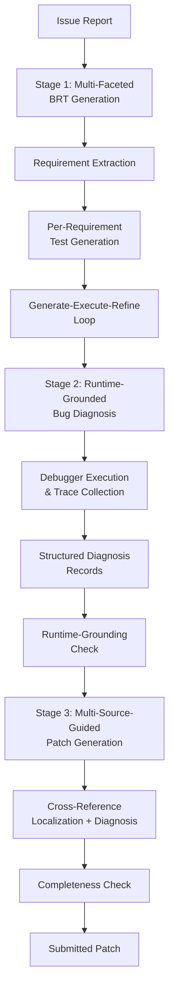

# SWE-Doctor and the Runtime Diagnosis Gap: Why Bug Reproduction Tests Alone Mislead Your Coding Agent — and How Multi-Faceted Test Generation Closes the Loop for Codex CLI


---

Bug reproduction tests (BRTs) have become the default signal that coding agents use to validate patches. The logic seems sound: reproduce the bug, generate a fix, confirm the test passes. But a paper published on 1 July 2026 demonstrates that this straightforward pipeline fails in ways most practitioners never see — and that the fix requires rethinking how agents consume test results entirely.

## The Problem with Naive BRT Pipelines

Guo et al. introduce **SWE-Doctor** [^1], a three-stage agent framework that achieves 75.7% resolution on SWE-bench Verified and 59.4% on SWE-bench Pro — an 8.0–8.9 percentage point improvement over baseline agents on the harder Pro dataset. The headline numbers matter, but the *why* matters more.

Their preliminary study identifies two failure modes that naive BRT usage introduces:

1. **Fail-to-pass tests cover only partial issue manifestations.** When an issue report describes multiple broken behaviours, a single BRT typically captures one symptom. The agent generates a patch that fixes that symptom and declares victory, leaving the remaining manifestations unaddressed [^1].

2. **Fail-to-fail tests mislead agents when treated as direct targets.** Some BRTs expose internal state corruption without a clean pass/fail boundary. Agents that try to make these tests pass end up chasing the wrong signal [^1].

The result is a systematic bias towards incomplete patches — fixes that satisfy the immediate test gate but leave the underlying defect partially resolved.

## Three-Stage Architecture

SWE-Doctor addresses this with a pipeline that transforms raw BRT signals into structured diagnostic evidence before the patch generation step ever begins.



### Stage 1: Multi-Faceted BRT Generation

Rather than generating a single BRT from the issue report, the system extracts multiple behavioural requirements and generates targeted tests for each. A generate-execute-refine loop screens tests to ensure failures expose meaningful runtime behaviour — not just assertion errors [^1]. This is requirement-level bug localisation: each test targets a specific facet of the reported problem.

### Stage 2: Runtime-Grounded Bug Diagnosis

Generated tests execute under a debugger. The system collects runtime evidence — stack traces, variable states, exception propagation paths — and constructs structured diagnosis records containing [^1]:

- **Suspected fault locations** with file and line references
- **Failure symptoms** grounded in actual runtime state
- **Propagation paths** showing how the defect manifests across call chains
- **Suggested fix directions** derived from the observed behaviour

A runtime-grounding check prevents the agent from producing text-only diagnoses that sound plausible but lack executable evidence. If the diagnosis cannot be traced back to debugger output, it is rejected and regenerated [^1].

### Stage 3: Multi-Source-Guided Patch Generation

The patch generator (a mini-SWE-agent) receives enriched context from both prior stages. It cross-references requirement-level localisation data with diagnosis records, ensuring the patch addresses all identified facets rather than just the most obvious one. A completeness check runs before submission to reduce partial patches [^1].

## Results That Matter

The evaluation spans five LLM backends — GPT-5.4, GPT-5.4-mini, Claude Sonnet 4.6, DeepSeek-V4-Pro, and MiMo-V2.5-Pro — across SWE-bench Verified and SWE-bench Pro [^1].

| Benchmark | SWE-Doctor | mini-SWE-agent | live-SWE-agent |
|-----------|-----------|---------------|---------------|
| SWE-bench Verified | **75.7%** | 73.7% | 71.8% |
| SWE-bench Pro | **59.4%** | 50.5% | 51.4% |

The Pro benchmark gap is telling. SWE-bench Pro tasks are harder, drawn from larger commercial-style codebases [^2], and the 8.0–8.9pp improvement there demonstrates that runtime diagnosis scales better than raw BRT usage when issue complexity increases.

The ablation study on 50 Pro issues isolates the contribution of each component [^1]:

- **Full SWE-Doctor:** 56.0%
- **Without multi-faceted generation:** 46.0–48.0%
- **Without runtime diagnosis:** 48.0%
- **Baselines:** 40.0–44.0%

Both multi-faceted test generation and runtime diagnosis contribute independently. Removing either degrades performance by 8–10 percentage points.

SWE-Doctor also uniquely resolves 108 issues (67 on Verified, 41 on Pro) that neither baseline agent can fix [^1] — evidence that the approach expands the frontier of resolvable issues, not merely improving accuracy on easy ones.

## Mapping SWE-Doctor to Codex CLI Workflows

The three-stage architecture maps cleanly onto Codex CLI's existing execution model and hook pipeline.

### Multi-Faceted Test Generation via `codex exec`

Codex CLI's `codex exec` command [^3] provides non-interactive execution suitable for the generate-execute-refine loop. An AGENTS.md directive can encode the multi-faceted requirement:

```toml
# AGENTS.md (project root)
# Bug fix workflow: generate multiple BRTs before patching
When fixing a bug from an issue report:
1. Extract all distinct behavioural requirements from the issue
2. Generate a separate test for each requirement
3. Run each test to confirm it fails for the right reason
4. Only proceed to patching once all facets are covered
```

The sandbox isolation ensures test execution cannot corrupt the working tree. Read-only sandbox mode for the test generation phase prevents the agent from prematurely modifying source code whilst still allowing test file creation in a designated directory [^4].

### Runtime Diagnosis via PostToolUse Hooks

Codex CLI's `PostToolUse` hooks fire after every shell command execution [^5]. A diagnosis hook can intercept test failures and extract structured runtime evidence:

```bash
#!/bin/bash
# .codex/hooks/post-tool-use-diagnosis.sh
# Fires after shell commands; captures debugger output for diagnosis

if [[ "$CODEX_TOOL_NAME" == "shell" ]]; then
  EXIT_CODE=$(echo "$CODEX_TOOL_OUTPUT" | jq -r '.exit_code // empty')
  if [[ "$EXIT_CODE" != "0" ]]; then
    # Extract stack traces and failure context
    echo "$CODEX_TOOL_OUTPUT" | jq -r '.stderr // .stdout' \
      | grep -A 20 "Traceback\|FAILED\|Error:" \
      > /tmp/diagnosis-record-$(date +%s).txt
    echo '{"verdict": "needs_diagnosis", "note": "Test failure captured for runtime diagnosis"}'
  fi
fi
```

This approximates SWE-Doctor's runtime-grounding check: the agent receives structured failure evidence rather than a bare pass/fail signal.

### Completeness Verification via Stop Hooks

The `Stop` hook [^5] fires before a turn ends, providing a natural checkpoint for SWE-Doctor's completeness check:

```bash
#!/bin/bash
# .codex/hooks/stop-completeness.sh
# Verify all faceted tests pass before declaring the fix complete

TEST_RESULTS=$(cd "$CODEX_WORKSPACE" && python -m pytest tests/bug_facets/ --tb=short 2>&1)
FAILURES=$(echo "$TEST_RESULTS" | grep -c "FAILED")

if [[ "$FAILURES" -gt 0 ]]; then
  echo '{"verdict": "reject", "note": "Incomplete fix: not all faceted BRTs pass"}'
else
  echo '{"verdict": "approve"}'
fi
```

### Model Routing for Cost Efficiency

SWE-Doctor's evaluation across five model backends reveals that smaller models (GPT-5.4-mini, MiMo-V2.5-Pro) still benefit substantially from the runtime diagnosis pipeline [^1]. Codex CLI's `--model` flag and named profiles [^6] enable cost-efficient routing:

```toml
# config.toml — named profile for bug-fix workflows
[profiles.bugfix]
model = "gpt-5.4-mini"          # Cheaper model for test generation stages
approval_policy = "unless-allow-listed"
```

```toml
# config.toml — escalation profile for complex patches
[profiles.bugfix-complex]
model = "gpt-5.5"               # Frontier model for patch generation
approval_policy = "on-failure"
```

The test generation and diagnosis stages consume most tokens but tolerate cheaper models. Reserve the frontier model for the final patch generation stage where reasoning quality has the highest marginal return.

## The Broader Pattern: Diagnosis Before Repair

SWE-Doctor joins a growing body of evidence that coding agents perform better when they *understand* failures before attempting fixes. Google's agentic bug reproduction work [^7] demonstrates that BRT generation at scale improves automated program repair, whilst SWT-Bench [^8] shows that test generation quality directly predicts patch quality.

The pattern is consistent: **interpose a diagnostic stage between failure detection and repair**. Agents that skip diagnosis produce patches that satisfy the immediate test gate but fail on held-out tests — the partial-patch problem that SWE-Doctor's multi-faceted approach specifically targets.

For Codex CLI practitioners, the practical takeaway is to structure AGENTS.md directives and hook pipelines around this three-stage pattern: generate tests covering all issue facets, extract runtime diagnosis from failures, and verify completeness before submission. The hook infrastructure already supports it; the missing piece is the workflow encoding.

## What This Does Not Cover

SWE-Doctor evaluates exclusively on Python repositories via SWE-bench [^1]. Whether the multi-faceted BRT approach transfers to compiled languages with different debugging toolchains (Go's `delve`, Rust's `rust-gdb`) remains untested. The 75.7% Verified score, whilst strong, trails the current SWE-bench Verified leaderboard leader at 95.5% [^9] — though SWE-Doctor's contribution is architectural (harness-level) rather than model-level, and the two are complementary.

The runtime-grounding check assumes debugger output is available and parseable. In production Codex CLI workflows, not all test frameworks produce structured failure output suitable for automated diagnosis extraction. ⚠️ Teams adopting this pattern should validate that their test runner's output format supports structured trace extraction.

## Citations

[^1]: Guo, Y., Liu, Y., Zhang, J. M., Ma, Y., Lou, Y., & Chen, Z. (2026). "SWE-Doctor: Guiding Software Engineering Agents with Runtime Diagnosis from Multi-Faceted Bug Reproduction Tests." arXiv:2607.00990. [https://arxiv.org/abs/2607.00990](https://arxiv.org/abs/2607.00990)

[^2]: Jimenez, C. E., et al. (2025). "SWE-bench Pro: A Harder, Contamination-Resistant Benchmark for Repository-Level Issue Resolution." arXiv:2509.16941. [https://arxiv.org/abs/2509.16941](https://arxiv.org/abs/2509.16941)

[^3]: OpenAI. (2026). "Codex CLI Features — Non-interactive exec mode." OpenAI Developers. [https://developers.openai.com/codex/cli/features](https://developers.openai.com/codex/cli/features)

[^4]: OpenAI. (2026). "Codex CLI Configuration Reference — Sandbox and approval modes." OpenAI Developers. [https://developers.openai.com/codex/config-reference](https://developers.openai.com/codex/config-reference)

[^5]: OpenAI. (2026). "Codex Hooks — PreToolUse, PostToolUse, Stop events." OpenAI Developers. [https://developers.openai.com/codex/hooks](https://developers.openai.com/codex/hooks)

[^6]: OpenAI. (2026). "Codex CLI Changelog — v0.142.0 stable release with named profiles and token budgets." OpenAI Developers. [https://developers.openai.com/codex/changelog](https://developers.openai.com/codex/changelog)

[^7]: Kang, S., et al. (2025). "Agentic Bug Reproduction for Effective Automated Program Repair at Google." arXiv:2502.01821. [https://arxiv.org/abs/2502.01821](https://arxiv.org/abs/2502.01821)

[^8]: Mundler, N., et al. (2024). "SWT-Bench: Testing and Validating Real-World Bug-Fixes with Code Agents." NeurIPS 2024. [https://arxiv.org/abs/2406.12952](https://arxiv.org/abs/2406.12952)

[^9]: BenchLM.ai. (2026). "SWE-bench Verified Benchmark 2026 Leaderboard." [https://benchlm.ai/benchmarks/sweVerified](https://benchlm.ai/benchmarks/sweVerified)
