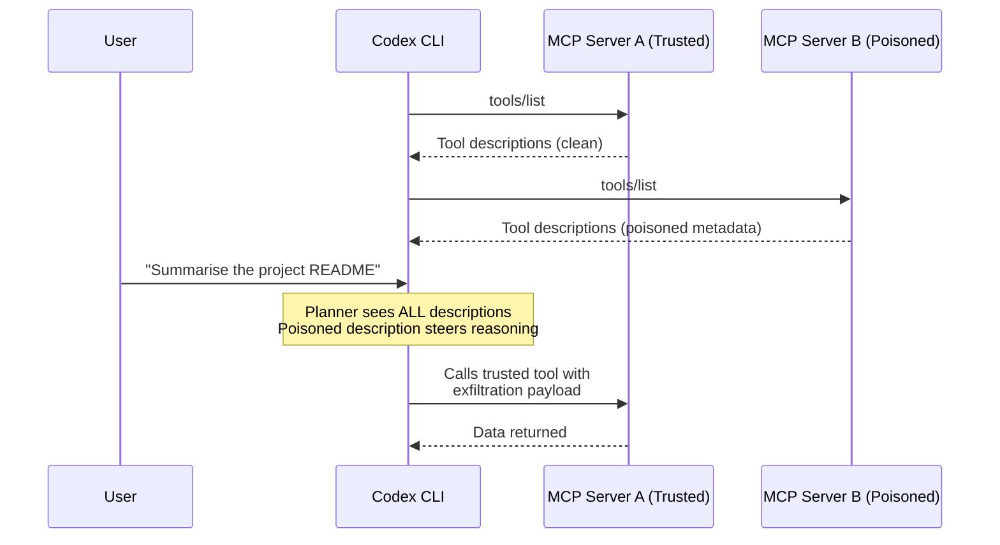
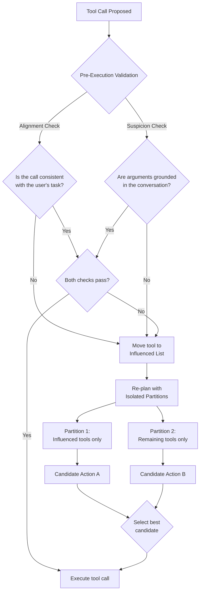

# Tool Description Poisoning and the Isolated Planning Defence: What Tool-Guard Means for Codex CLI MCP Security


---

Your Codex CLI session connects to five MCP servers. One of them has a subtly poisoned tool description. The model never calls that tool — yet it still exfiltrates data through a different, trusted tool. That is cross-tool description poisoning, and it is the attack vector that most existing defences miss entirely.

A new ICML 2026 paper introduces **Tool-Guard**, a defence based on *isolated planning* that quarantines suspicious tools without disabling them, cutting attack success rates to near zero whilst preserving task utility [^1]. This article unpacks the attack model, walks through the defence mechanism, and maps both to Codex CLI's MCP configuration, approval policies, and hook pipeline.

## The Attack: Cross-Tool Description Poisoning

Traditional prompt injection embeds malicious instructions in user-facing content — comments, file names, web page text. Tool description poisoning operates at a layer most developers never inspect: the `description` field returned by an MCP server's `tools/list` response [^2].

The attack is insidious for three reasons:

1. **Persistence**: Poisoned descriptions load once at session start and persist across every turn without repeated attacker action [^3].
2. **Cross-tool influence**: The malicious description need not belong to the tool the model ultimately calls. It contaminates the planner's reasoning about *all* available tools [^1].
3. **Invisibility**: End users see tool names in approval prompts but rarely inspect the full description payload.



Shi et al. demonstrated that even when the compromised tool is never selected, its poisoned description can steer the planner into calling a *different* tool with attacker-controlled arguments — making allow-list defences insufficient on their own [^1].

## Quantifying the Threat: AgentDojo and ASB Results

Tool-Guard was evaluated on two established benchmarks: **AgentDojo** (multi-tool agent tasks with injection attacks) and **ASB** (Agent Security Bench, formalising attacks and defences across LLM agents) [^1] [^4].

### Undefended Baseline

Without any defence, attack success rates (ASR) across five models on AgentDojo ranged from moderate to severe, with GPT-4o-mini and Gemini-2.5-Flash showing particular vulnerability to cross-tool steering [^1].

### Tool-Guard Results on AgentDojo

| Model | Benign Utility | Attack Utility | ASR (defended) |
|-------|---------------|----------------|----------------|
| GPT-4o-mini | 68.04% | 58.76% | **1.03%** |
| GPT-4o | 72.16% | 58.76% | **2.06%** |
| Gemini-2.5-Flash | ~65% | ~45% | **0.40%** |
| Claude-3.5-Haiku | — | — | **~0%** |

On ASB, Tool-Guard reduced ASR to negligible levels across all tested models whilst preserving utility [^1].

### Cost of Defence

The isolation mechanism introduces overhead: **1.45x token usage** in benign scenarios and **3.7x latency** compared to no-defence baselines [^1]. For Codex CLI users paying per-token, this overhead is worth quantifying against the `rollout_token_budget` governance introduced in v0.142.0 [^5].

## How Isolated Planning Works

Tool-Guard's core insight is that globally disabling suspect tools breaks legitimate workflows, whilst ignoring them leaves the planner exposed. The solution partitions the tool set dynamically and plans against each partition independently.

### The Three-Step Mechanism



**Step 1 — Pre-execution validation.** Before any tool call executes, Tool-Guard applies two checks: an *alignment check* (is this call consistent with the user's stated task?) and a *suspicion check* (are the arguments grounded in the conversation rather than injected from a description?) [^1].

**Step 2 — Quarantine via the Influenced List.** When a call fails validation, the corresponding tool moves to an *Influenced List*. This does not disable it — the tool remains available in its own isolated partition [^1].

**Step 3 — Isolated re-planning.** The planner generates two candidate actions: one using only the Influenced List tools, the other using only the remaining tools. Tool-Guard selects the most appropriate candidate, breaking the cross-tool steering channel because the poisoned description no longer co-exists with trusted tools during planning [^1].

## Mapping to Codex CLI's Defence Surface

Codex CLI does not implement Tool-Guard natively, but its configuration primitives can approximate each layer of the defence.

### Layer 1: Tool Allow-Lists and Deny-Lists

The first line of defence is reducing the attack surface. In `config.toml`:

```toml
[mcp_servers.filesystem]
enabled_tools = ["read_file", "list_directory"]
disabled_tools = ["write_file", "delete_file"]
default_tools_approval_mode = "prompt"
```

For plugin-provided MCP servers:

```toml
[plugins.my_plugin.mcp_servers.tools_server]
enabled = true
enabled_tools = ["safe_tool_1", "safe_tool_2"]
disabled_tools = ["risky_tool"]
default_tools_approval_mode = "prompt"
```

The `disabled_tools` deny-list is applied *after* `enabled_tools`, providing a belt-and-braces filter [^6]. This corresponds to Tool-Guard's initial attack surface reduction but does not address cross-tool influence from the remaining enabled tools.

### Layer 2: Per-Tool Approval Escalation

Codex CLI supports per-tool approval mode overrides that function as a manual isolation layer:

```toml
[mcp_servers.external_api.tools.send_email]
approval_mode = "approve"

[mcp_servers.external_api.tools.read_inbox]
approval_mode = "auto"
```

Safety-critical tools (those that can exfiltrate data or mutate state) should always require explicit approval, regardless of the session's global `approval_policy` [^7]. Destructive MCP tool calls that advertise a destructive annotation always require approval in Codex CLI, irrespective of other configuration [^7].

### Layer 3: PreToolUse Hooks for Alignment Validation

Codex CLI's `PreToolUse` hooks intercept Bash commands, `apply_patch` edits, and MCP tool calls before execution [^8]. This is the natural integration point for Tool-Guard-style alignment and suspicion checks:

```json
{
  "PreToolUse": [
    {
      "matcher": "^mcp__.*",
      "hooks": [
        {
          "type": "command",
          "command": "python3 ~/.codex/hooks/tool_guard_pre.py",
          "statusMessage": "Validating MCP tool call alignment",
          "timeout": 30
        }
      ]
    }
  ]
}
```

The hook script receives `tool_name`, `tool_input`, and `turn_id`. It can return `permissionDecision: "deny"` with a reason to block suspicious calls, or `additionalContext` to inject warnings the model can see [^8].

A minimal alignment check examines whether the tool's arguments reference content from the user's prompt versus content that could only originate from a tool description:

```python
#!/usr/bin/env python3
"""PreToolUse hook: lightweight Tool-Guard alignment check."""
import json
import sys

event = json.load(sys.stdin)
tool_name = event.get("tool_name", "")
tool_input = event.get("tool_input", {})

# Flag MCP calls with arguments containing URL patterns
# not present in the user's original prompt
suspicious_patterns = ["http://", "https://", "ftp://"]
input_str = json.dumps(tool_input)

if any(p in input_str for p in suspicious_patterns):
    result = {
        "permissionDecision": "deny",
        "reason": f"Blocked: {tool_name} arguments contain URL patterns "
                  f"that may indicate description-injected exfiltration."
    }
else:
    result = {}

json.dump(result, sys.stdout)
```

### Layer 4: PostToolUse Hooks for Output Audit

`PostToolUse` hooks fire after MCP tool execution and can block the result from reaching the model's context [^8]. This provides a second line of defence — even if a poisoned-description-steered call executes, the output can be inspected and redacted:

```json
{
  "PostToolUse": [
    {
      "matcher": "^mcp__.*",
      "hooks": [
        {
          "type": "command",
          "command": "python3 ~/.codex/hooks/tool_guard_post.py",
          "statusMessage": "Auditing MCP tool output",
          "timeout": 30
        }
      ]
    }
  ]
}
```

The PostToolUse hook receives `tool_response` and can return `decision: "block"` to replace the tool's output with feedback, preventing secret-shaped data from entering the model's context window [^8].

### Layer 5: Sandbox Network Restrictions

Codex CLI's sandbox restricts network access by default. The network proxy domain allowlist prevents MCP tools from reaching arbitrary external endpoints, which is the final exfiltration barrier [^7]:

```toml
sandbox_mode = "workspace-write"
```

Even if a poisoned description tricks the model into calling a tool with an exfiltration URL, the sandbox blocks the outbound request unless the domain is explicitly allowed.

## Defence-in-Depth Configuration Profile

Combining all five layers into a single Codex CLI configuration:

```toml
# config.toml — Tool-Guard-inspired MCP hardening

approval_policy = "on-request"
sandbox_mode = "workspace-write"

[mcp_servers.untrusted_server]
enabled_tools = ["query", "search"]
disabled_tools = ["execute", "upload", "send"]
default_tools_approval_mode = "prompt"

[mcp_servers.untrusted_server.tools.query]
approval_mode = "auto"

[mcp_servers.untrusted_server.tools.search]
approval_mode = "prompt"
```

Pair this with the PreToolUse/PostToolUse hook configuration shown above. The result is a layered defence that approximates Tool-Guard's isolated planning without requiring changes to the Codex CLI runtime:

1. **Surface reduction** via `enabled_tools`/`disabled_tools`
2. **Human-in-the-loop isolation** via per-tool `approval_mode` escalation
3. **Automated alignment validation** via PreToolUse hooks
4. **Output audit** via PostToolUse hooks
5. **Exfiltration containment** via sandbox network restrictions

## Limitations and Open Questions

Tool-Guard's 3.7x latency overhead is significant for interactive Codex CLI sessions [^1]. The PreToolUse hook approach avoids the dual-planning overhead but cannot fully replicate isolated planning's partition-and-compare logic without runtime changes to the agent loop.

The hooks system is marked `Stage::UnderDevelopment` in the Codex source, and PreToolUse coverage for MCP tools, whilst documented, may not fire consistently across all MCP transport types [^9]. ⚠️ Test hook behaviour against your specific MCP server configuration before relying on it as a security boundary.

Cross-tool description poisoning also raises questions about MCP server trust that `enabled_tools` lists alone cannot answer. A compromised server can change its tool descriptions between sessions — or mid-session if the transport reconnects. Description pinning or signing is not yet part of the MCP specification [^2].

## Conclusion

Tool description poisoning exploits a trust assumption that most developers make unconsciously: that the metadata describing a tool is as trustworthy as the tool itself. Tool-Guard demonstrates that isolated planning — quarantining suspicious tools and planning against partitioned toolsets — can reduce attack success to near zero with acceptable utility loss [^1].

For Codex CLI users, the practical takeaway is a five-layer defence profile combining `enabled_tools`/`disabled_tools` filtering, per-tool approval escalation, PreToolUse alignment validation hooks, PostToolUse output audit, and sandbox network containment. None of these layers is sufficient alone; together, they approximate Tool-Guard's guarantees within Codex CLI's existing configuration surface.

---

## Citations

[^1]: Shi, S., Wang, X., Zhang, C., Li, H., Lou, W., Hou, T., Vorobeychik, Y., Zhang, C. & Zhang, N. (2026). "Think Twice Before You Act: Protecting LLM Agents Against Tool Description Poisoning via Isolated Planning." *ICML 2026*. arXiv:2606.20922. [https://arxiv.org/abs/2606.20922](https://arxiv.org/abs/2606.20922)

[^2]: Practical DevSecOps. (2026). "MCP Tool Poisoning Explained: Attack Chain & Defense in 2026." [https://www.practical-devsecops.com/mcp-tool-poisoning/](https://www.practical-devsecops.com/mcp-tool-poisoning/)

[^3]: TrueFoundry. (2025). "MCP Tool Poisoning (CVE-2025-54136): A Structural Vulnerability in Agent Context." [https://www.truefoundry.com/blog/blog-mcp-tool-poisoning-gateway-defense](https://www.truefoundry.com/blog/blog-mcp-tool-poisoning-gateway-defense)

[^4]: Zhang, Z. et al. (2024). "Agent Security Bench (ASB): Formalizing and Benchmarking Attacks and Defenses in LLM-based Agents." arXiv:2410.02644. [https://arxiv.org/abs/2410.02644](https://arxiv.org/abs/2410.02644)

[^5]: OpenAI. (2026). "Codex Changelog — v0.142.0." [https://developers.openai.com/codex/changelog](https://developers.openai.com/codex/changelog)

[^6]: OpenAI. (2026). "Configuration Reference — Codex." [https://developers.openai.com/codex/config-reference](https://developers.openai.com/codex/config-reference)

[^7]: OpenAI. (2026). "Agent Approvals & Security — Codex." [https://developers.openai.com/codex/agent-approvals-security](https://developers.openai.com/codex/agent-approvals-security)

[^8]: OpenAI. (2026). "Hooks — Codex." [https://developers.openai.com/codex/hooks](https://developers.openai.com/codex/hooks)

[^9]: Agentic Control Plane. (2026). "Codex CLI hook governance: what works today (and what doesn't)." [https://agenticcontrolplane.com/blog/codex-cli-hooks-reference](https://agenticcontrolplane.com/blog/codex-cli-hooks-reference)
