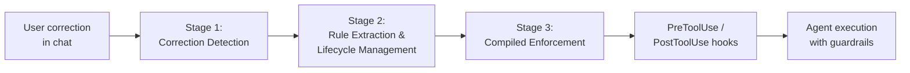
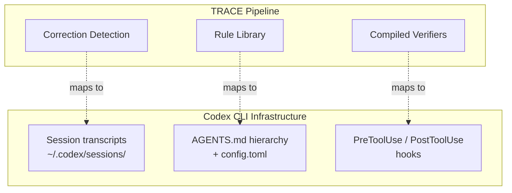
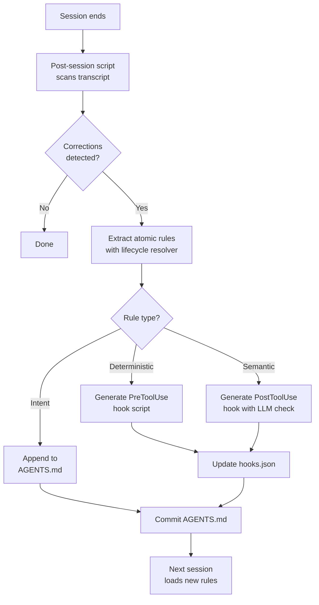

# TRACE and the Correction-to-Enforcement Pipeline: Why Your Coding Agent Keeps Ignoring What You Told It — and How to Fix That with Codex CLI Hooks


---

## The Access-Compliance Gap

You correct your coding agent once. It apologises, fixes the output, and moves on. Next session, it makes the same mistake. You correct it again. This cycle is so familiar that most developers have stopped noticing it.

Zhou et al. quantified the problem in their June 2026 paper, *Getting Better at Working With You* [^1]. When a leading memory layer (Mem0) successfully retrieved a stored user preference, the agent still violated it 57.5% of the time [^1]. The researchers call this the **access-compliance gap**: retrieving a correction is not the same as enforcing it.

Their proposed solution, **TRACE** (Test-time Rule Acquisition and Compiled Enforcement), reduced held-out preference violations from 100% to 2.0% on out-of-distribution tasks [^1] — an order of magnitude below every memory baseline tested. The key insight is architectural: corrections should compile into runtime checks, not merely persist as context.

This maps directly onto Codex CLI's hook pipeline.

---

## How TRACE Works

TRACE operates as a three-stage pipeline inserted between the user and the agent runtime [^1]:



### Stage 1 — Correction Detection

A lightweight model (Gemma 4 31B in the paper) scans each user message for correction signals — durable preferences, repeated errors, or workflow friction [^1]. Ordinary messages pass through unchanged. This is triage, not analysis: the goal is to separate "I prefer tabs over spaces" from "change line 42 to use `async`."

### Stage 2 — Rule Extraction and Lifecycle Management

Detected corrections become **atomic rules** with applicability conditions. A lifecycle resolver assigns one of five actions to each candidate [^1]:

| Action | Effect |
|--------|--------|
| **Noop** | Append evidence to an existing identical rule |
| **Update** | Refine an active rule with compatible new details |
| **Supersede** | Deactivate contradicted older rules |
| **Split** | Separate multi-preference corrections into distinct rules |
| **New** | Create a novel rule |

The deployed library in the paper contained 47 entries: 37 atomic rules (79%), 7 refinement rules (15%), and 3 composite parents (6%) [^1].

### Stage 3 — Compiled Enforcement

Each rule compiles into three enforcement artefacts [^1]:

1. **Applicability check** — determines whether the rule applies to the current task
2. **Behaviour instruction** — injected into the agent's context window
3. **Verifier** — runtime validation logic hooked to specific events (prompt submission, tool use, file write, or task termination)

Enforcement operates at three tiers: **deterministic** (regex on tool calls and file names), **semantic** (model-based text and file checks), and **intent-level** (runtime reminders for subjective preferences) [^1].

---

## The Numbers

The paper evaluated TRACE against memory baselines across two benchmark suites [^1]:

### ClawArena Results

| Method | Violation Rate (ID) | Violation Rate (OOD) | Mean User Corrections |
|--------|:-------------------:|:--------------------:|:---------------------:|
| No memory | 100.0% | 100.0% | 2.00 |
| Mem0 | 74.3% | 68.0% | 1.51 |
| ReMe-Light | 50.0% | 94.0% | 1.26 |
| **TRACE** | **37.6%** | **2.0%** | **1.02** |

The out-of-distribution result is the headline: 2.0% violation rate, with three of four tested model backends recording zero observed violations [^1]. TRACE's wall-clock overhead was 42.5 seconds per round — within seconds of the no-memory baseline and well below ReMe-Light's 228 seconds [^1].

### Access-Compliance Diagnostic

A six-model panel on 19 held-out tasks with 29 preference checks showed the enforcement gap clearly [^1]:

| Condition | Compliance |
|-----------|:---------:|
| No rules | 31.6% |
| Mem0 memory | 42.5% |
| All rules in prompt | 55.0% |
| Relevant rules (filtered) | 54.0% |
| **Compiled rules** | **70.1%** |

Even when the correct rules are in the prompt, compliance sits at 55%. Compiled enforcement — where verifiers actively block non-compliant outputs — pushes it to 70.1% [^1].

---

## Mapping TRACE to Codex CLI

Codex CLI already ships the infrastructure that TRACE's architecture requires [^2] [^3]. The mapping is direct:



### Correction Detection → Session Transcripts

Codex CLI stores full session transcripts under `~/.codex/sessions/` [^4]. A post-session script can scan these for correction patterns — the same lightweight-model triage that TRACE's Stage 1 performs. The `/feedback` command already captures explicit user dissatisfaction signals [^4].

### Rule Library → AGENTS.md Hierarchy

TRACE's atomic rules map naturally to AGENTS.md directives [^3]. The hierarchical lookup — global (`~/.codex/AGENTS.md`), project root, then per-directory — mirrors TRACE's applicability scoping:

```markdown
<!-- ~/.codex/AGENTS.md — global preferences -->
# Personal Coding Preferences

- Always use British English in comments and documentation
- Never commit directly to main; create feature branches
- Prefer named exports over default exports in TypeScript

<!-- repo/.codex/AGENTS.md — project-level rules -->
# Project Rules

- Run `make lint` before any commit
- API endpoints must include OpenAPI annotations
- Test files must use vitest, not jest

<!-- repo/services/payments/.codex/AGENTS.md — module-level -->
# Payments Service Rules

- All database queries must use parameterised statements
- Log PCI-relevant operations to the audit trail
- Never store card numbers in application logs
```

Each layer can be auto-generated from mined corrections. The `AGENTS.override.md` mechanism allows temporary rule injection without modifying shared files [^3]. Codex rebuilds the instruction chain on every run, so new rules take effect immediately.

### Compiled Verifiers → PreToolUse and PostToolUse Hooks

The enforcement layer is where the real power sits. TRACE's deterministic verifiers translate directly to Codex CLI hooks [^2]:

```toml
# ~/.codex/config.toml — PreToolUse hook blocking destructive git commands

[[hooks.PreToolUse]]
matcher = "^Bash$"

[[hooks.PreToolUse.hooks]]
type = "command"
command = "python3 ~/.codex/hooks/enforce_no_force_push.py"
timeout = 10
statusMessage = "Checking git safety rules"
```

The enforcement script reads the tool input from stdin and returns exit code 2 with a reason on stderr to deny execution [^2]:

```python
#!/usr/bin/env python3
"""PreToolUse hook: block git force-push commands."""
import json
import sys

payload = json.load(sys.stdin)
command = payload.get("tool_input", {}).get("command", "")

BLOCKED_PATTERNS = [
    "git push --force",
    "git push -f ",
    "git reset --hard origin",
    "git checkout -- .",
]

for pattern in BLOCKED_PATTERNS:
    if pattern in command:
        print(
            f"Blocked: '{pattern}' violates rule: "
            "Never run destructive git commands without explicit approval.",
            file=sys.stderr,
        )
        sys.exit(2)

# Allow
sys.exit(0)
```

PostToolUse hooks handle TRACE's semantic verification tier — checking outputs after execution [^2]:

```toml
[[hooks.PostToolUse]]
matcher = "^Bash$"

[[hooks.PostToolUse.hooks]]
type = "command"
command = "python3 ~/.codex/hooks/verify_lint_clean.py"
timeout = 30
statusMessage = "Verifying lint compliance"
```

When a PostToolUse hook returns exit code 2, Codex blocks the result and feeds the reason back to the agent, forcing a retry [^2] — precisely the verify-retry loop that TRACE's enforcement markers implement.

---

## Building a Correction-to-Enforcement Pipeline

Here is a practical architecture for implementing TRACE-style enforcement in Codex CLI:



### Step 1 — Mine Corrections from Transcripts

Write a `SessionStop` hook that invokes a local model to scan the completed transcript for correction signals:

```toml
[[hooks.Stop]]

[[hooks.Stop.hooks]]
type = "command"
command = "python3 ~/.codex/hooks/mine_corrections.py"
timeout = 60
statusMessage = "Mining session for preference corrections"
```

### Step 2 — Route Rules by Enforcement Tier

Deterministic rules (file naming conventions, blocked commands, required tool flags) become hook scripts. Semantic rules (code style preferences, documentation standards) become PostToolUse checks that invoke a lightweight model. Intent-level rules (architectural preferences, design philosophy) go into AGENTS.md where they influence the agent's planning rather than blocking execution.

### Step 3 — Trust and Review

Codex CLI's trust model requires explicit review before executing non-managed hooks [^2]. Use `/hooks` to inspect newly generated enforcement scripts before trusting them. For team environments, commit hooks to the repository's `.codex/hooks.json` and manage them through code review — the same workflow as linter configuration.

---

## Limitations and Open Questions

TRACE's in-distribution violation rate of 37.6% shows that compiled enforcement does not eliminate violations — it reduces them substantially [^1]. Several factors constrain effectiveness:

- **Hook coverage**: Codex CLI hooks reliably fire for Bash tool calls but coverage for `apply_patch` file edits and MCP tool calls varies [^2]. ⚠️ Rules targeting file-edit patterns may not trigger consistently.
- **Semantic verification cost**: PostToolUse hooks that invoke an LLM for semantic checks add latency and token cost. TRACE's 42.5-second overhead was measured with deterministic verifiers; semantic tiers will be slower.
- **Rule drift**: As the rule library grows, applicability checks must scale. TRACE's 47-rule library is manageable; hundreds of rules will require indexing or categorisation to avoid prompt bloat against Codex CLI's 32 KiB `project_doc_max_bytes` default [^3].
- **Intent-level enforcement**: Rules that encode subjective preferences ("prefer functional style") resist deterministic verification. AGENTS.md placement is the best available mechanism, but compliance depends on the model's instruction-following fidelity — precisely the gap TRACE identified [^1].

---

## Key Takeaways

1. **Remembering is not enforcing.** Memory layers retrieve corrections but agents violate retrieved preferences 57.5% of the time. Compiled runtime checks close the gap.
2. **Three enforcement tiers.** Deterministic rules → PreToolUse hooks. Semantic rules → PostToolUse hooks with verification. Intent rules → AGENTS.md directives.
3. **Codex CLI already has the plumbing.** PreToolUse/PostToolUse hooks, hierarchical AGENTS.md, session transcripts, and the trust model provide every component TRACE requires.
4. **Automate the pipeline.** A `SessionStop` hook that mines corrections and generates enforcement artefacts turns a manual process into a self-improving system.
5. **Start deterministic.** The biggest wins come from the simplest rules — blocked commands, required flags, naming conventions. Add semantic checks only where deterministic matching falls short.

---

## Citations

[^1]: Zhou, Y., Guo, K., Zhuang, H., Wang, X., Huang, Y., Liang, Z., Chen, P.-Y., Gao, T., Moniz, N., Chawla, N. V., & Zhang, X. (2026). "Getting Better at Working With You: Compiling User Corrections into Runtime Enforcement for Coding Agents." *arXiv:2606.13174*. [https://arxiv.org/abs/2606.13174](https://arxiv.org/abs/2606.13174)

[^2]: OpenAI. (2026). "Hooks — Codex CLI." *OpenAI Developers*. [https://developers.openai.com/codex/hooks](https://developers.openai.com/codex/hooks)

[^3]: OpenAI. (2026). "Custom Instructions with AGENTS.md — Codex." *OpenAI Developers*. [https://developers.openai.com/codex/guides/agents-md](https://developers.openai.com/codex/guides/agents-md)

[^4]: OpenAI. (2026). "CLI Features — Codex CLI." *OpenAI Developers*. [https://developers.openai.com/codex/cli/features](https://developers.openai.com/codex/cli/features)
