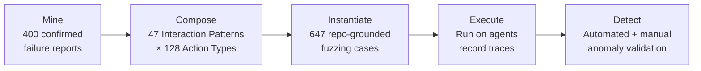
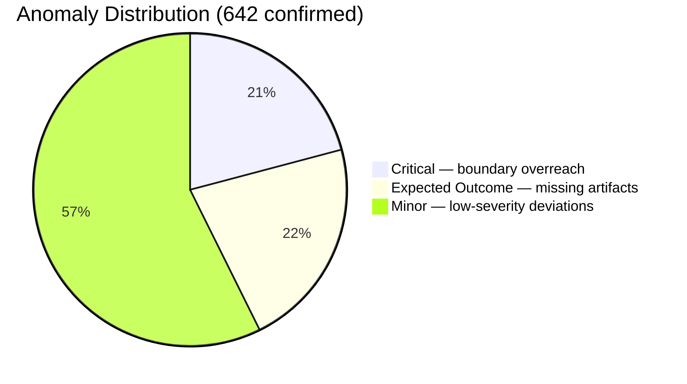

# ABTest and Behaviour-Driven Fuzzing: What 647 Fuzzing Cases Reveal About Coding Agent Robustness — and How to Defend Your Codex CLI Workflows


---

## The Problem: Benchmarks Measure Correctness, Not Robustness

Most coding agent evaluations — SWE-bench Verified, Terminal-Bench, PolyBench — ask a single question: *did the agent produce the right output?* They say nothing about what happens when workflows hit edge cases, conflicting instructions, interrupted operations, or boundary conditions. Dai et al.'s ABTest framework (arXiv:2604.03362, April 2026) addresses this gap directly by fuzzing three production coding agents — including Codex CLI — with systematically generated behavioural tests derived from real user-reported failures [^1].

The results are sobering. Across 647 repository-grounded fuzzing cases, ABTest flagged 1,573 behavioural anomalies, of which 642 were manually confirmed as genuine — a 40.8% detection precision that exposes failure modes invisible to conventional benchmarks [^1].

## How ABTest Works: A Five-Stage Pipeline

ABTest's architecture converts historical bug reports into executable behavioural tests through a structured pipeline:



**Stage 1 — Mine.** The researchers collected 400 developer-confirmed bug reports from the GitHub issue trackers of Claude Code, Codex CLI, and Gemini CLI between July 2025 and January 2026. Each report was abstracted into reusable patterns [^1].

**Stage 2 — Compose.** Two taxonomies emerged: 47 *Interaction Patterns* (workflow skeletons describing multi-step agent behaviours) and 128 *Action Types* (specific tool-level operations that stress failure boundaries). Templates pair compatible patterns with actions [^1].

**Stage 3 — Instantiate.** An LLM-based task generator binds each template to a real repository, filling in concrete file paths, command targets, and validation criteria [^1].

**Stage 4 — Execute.** Each test case runs against the target agent whilst recording prompts, step traces, file changes, and final artifacts [^1].

**Stage 5 — Detect.** Automated checks flag suspicious behaviours, followed by manual verification against two criteria: instruction-following consistency and action consistency between expected and observed repository effects [^1].

## The Interaction Pattern Taxonomy

The 47 Interaction Patterns encode recurring workflow structures that historically trigger agent failures. Several are directly relevant to Codex CLI users:

| Pattern | Description | Anomalies Found |
|---------|-------------|-----------------|
| IP-28 | Validate outcome against constraints, then emit result | 23 |
| IP-39 | Run operation → derive structured result → validate → persist | 19 |
| IP-26 | Generate output → persist narrative → persist structured → validate both | 18 |
| IP-44 | Attempt restricted-path transformation → validate permission handling | 17 |
| IP-41 | Start operation → interrupt mid-run → verify partial artifact → re-run | — |
| IP-47 | Set usage cap → run → verify bounded stop → capture evidence | — |

The pattern that should concern Codex CLI users most is IP-44: when an agent encounters a restricted path (outside `writable_roots`, for instance), does it fail gracefully or escalate with misleading claims? [^1]

## The 128 Action Types: Where Agents Actually Break

Action Types capture the specific operations that expose failure modes:

- **"Satisfy conflicting output instructions"** — 19 anomalies. When AGENTS.md says one thing and the user prompt says another, agents often silently pick one without acknowledging the conflict [^1].
- **"Run with verbose logging while protecting sensitive values"** — 17 anomalies. Agents leak secrets into trace output or suppress logging entirely [^1].
- **"Write result without overwriting existing artifact"** — 14 anomalies. File-write operations that should append or create new files instead clobber existing work [^1].
- **"Run with configuration plus conflicting environment overrides"** — 13 anomalies. Config.toml settings vs. environment variables produce unpredictable precedence [^1].

## Per-Agent Results: Model Choice Dramatically Affects Robustness

The per-agent breakdown reveals that robustness varies wildly not just between agents but between model configurations within the same agent:

| Agent | Model | Anomalies Flagged | Verified | Precision |
|-------|-------|-------------------|----------|-----------|
| Codex CLI | GPT-5.1-Codex-Mini | 277 | 166 | 59.9% |
| Codex CLI | GPT-4o-mini | 334 | 95 | 28.4% |
| Claude Code | Claude 4.5 Haiku | 259 | 119 | 45.9% |
| Claude Code | Claude 3.5 Haiku | 376 | 87 | 23.1% |
| Gemini CLI | Gemini 2.5 Flash-Lite | 327 | 175 | 53.5% |

Two findings stand out for Codex CLI users:

1. **GPT-5.1-Codex-Mini produced 74% more verified anomalies than GPT-4o-mini** (166 vs 95), with nearly double the precision (59.9% vs 28.4%). The larger model "keeps pushing to complete under pressure and over-acts," whilst the smaller model "stops short of required effects and substitutes helper workflows" [^1].

2. **The two Codex CLI configurations share only one critical anomaly**, suggesting that model capability doesn't uniformly improve robustness — it shifts failure modes [^1].

## Anomaly Severity: Three Tiers

ABTest classifies confirmed anomalies into three severity tiers [^1]:



- **Critical (134):** Boundary overreach, permission violations, or misleading escalation claims (e.g., reporting "files are lost" rather than acknowledging uncertainty) [^1].
- **Expected Outcome (140):** The agent fails to materialise required artifacts or reach the expected completion state [^1].
- **Minor (368):** Low-severity deviations — formatting inconsistencies, unnecessary verbose output, or suboptimal but functional solutions [^1].

Gemini CLI showed the highest critical anomaly concentration at 36.0% of its verified set, whilst Codex CLI's critical anomalies concentrated in the GPT-5.1-Codex-Mini configuration [^1].

## Mapping ABTest Findings to Codex CLI Defence Patterns

ABTest's findings map directly to Codex CLI's configuration and hook system. Here's a defence-in-depth configuration that addresses the most common anomaly categories:

### 1. Conflict Detection via AGENTS.md

The "conflicting output instructions" action type (19 anomalies) points to a need for explicit precedence rules in your `AGENTS.md`:

```markdown
# AGENTS.md — Conflict Resolution Rules

## Instruction Precedence
1. AGENTS.md constraints are non-negotiable
2. If user prompt conflicts with AGENTS.md, flag the conflict explicitly
3. Never silently resolve ambiguity — ask for clarification

## File Safety
- Never overwrite existing files without explicit confirmation
- Use timestamped suffixes for new artifacts: `result-YYYYMMDD-HHMMSS.ext`
```

### 2. PostToolUse Hooks for Artifact Validation

The "expected outcome" anomaly tier (140 cases where agents failed to produce required artifacts) can be mitigated with PostToolUse validation hooks [^2]:

```toml
# config.toml — PostToolUse validation hook
[hooks.post_tool_use]
command = "bash /path/to/validate-artifacts.sh"
```

```bash
#!/bin/bash
# validate-artifacts.sh — Check that expected outputs exist
# Runs after every tool invocation

LAST_CMD="$CODEX_LAST_COMMAND"
WORKDIR="$CODEX_WORKING_DIR"

# If the last command was supposed to create files, verify they exist
if echo "$LAST_CMD" | grep -qE "(write|create|generate|save)"; then
  MODIFIED=$(git diff --name-only HEAD 2>/dev/null)
  if [ -z "$MODIFIED" ]; then
    echo "WARNING: Command claimed to create files but no changes detected"
    exit 1
  fi
fi
```

### 3. Sensitive Value Protection

The "verbose logging while protecting sensitive values" action type (17 anomalies) maps to Codex CLI's trace log controls. The v0.142.5 release (1 July 2026) specifically addressed this by preventing full Responses WebSocket request payloads from being written to trace logs [^3]:

```toml
# config.toml — Restrict trace verbosity
[logging]
trace_level = "summary"  # Avoid full payload logging
```

### 4. Profile-Based Model Routing for Robustness

Given ABTest's finding that model choice shifts failure modes rather than eliminating them, consider routing different workflow types to different models via named profiles [^4]:

```toml
# config.toml — Route by workflow risk level

[profile.exploration]
model = "gpt-5.4-mini"
# Lower-capability model for read-only exploration — less overreach

[profile.implementation]
model = "o4-mini"
# Reasoning model for complex implementation — better constraint adherence

[profile.validation]
model = "gpt-5.4-mini"
approval_policy = "suggest"
# Conservative model + strict approval for validation workflows
```

## Repeatability and Production Implications

ABTest achieved over 90% repeatability across reruns, confirming that the anomalies represent genuine behavioural patterns rather than transient model stochasticity [^1]. This has a practical implication: if your Codex CLI workflow hits one of these failure modes, it will likely hit it again under similar conditions.

The framework also complements recent work on property-based testing for coding agents. PBT-Bench (arXiv:2605.15229, May 2026) demonstrates that agents struggle with semantic invariant derivation — the kind of deep specification reasoning that ABTest's IP-28 pattern ("validate outcome against constraints") also stresses [^5]. Together, these benchmarks suggest that the robustness gap in coding agents is structural, not merely a matter of scaling model capability.

## What This Means for Your Codex CLI Practice

Three actionable takeaways:

1. **Don't assume model upgrades improve robustness.** ABTest shows that GPT-5.1-Codex-Mini produces *more* verified anomalies than GPT-4o-mini, not fewer. Test your specific workflows when switching models [^1].

2. **Validation patterns trigger the most failures.** Workflows combining generation → persistence → validation → re-validation (IP-39, IP-26, IP-28) are where agents most commonly break. Add explicit PostToolUse hooks at each validation checkpoint [^2].

3. **Conflicting instructions are your biggest risk.** When AGENTS.md rules, user prompts, and environment configuration disagree, agents silently resolve ambiguity. Make your instruction hierarchy explicit and add PreToolUse hooks that flag conflicts before execution [^2].

The broader lesson from ABTest is that end-result correctness — the metric our benchmarks optimise for — masks a substantial process-level fragility. Codex CLI's hook system gives you the tools to catch these failures at runtime, but only if you know where to look.

---

## Citations

[^1]: Dai, W., Openja, M., Pham, H.V., Uddin, G., Yang, J., & Wang, S. (2026). "ABTest: Behavior-Driven Testing for AI Coding Agents." arXiv:2604.03362v2. [https://arxiv.org/abs/2604.03362](https://arxiv.org/abs/2604.03362)

[^2]: OpenAI. (2026). "Codex CLI Hooks — Events, Policy, and Patterns." OpenAI Developers Documentation. [https://developers.openai.com/codex/cli/hooks](https://developers.openai.com/codex/cli/hooks)

[^3]: OpenAI. (2026). "Codex CLI v0.142.5 Release Notes." GitHub Releases. [https://github.com/openai/codex/releases/tag/v0.142.5](https://github.com/openai/codex/releases/tag/v0.142.5)

[^4]: OpenAI. (2026). "Codex CLI Configuration Reference — Named Profiles." OpenAI Developers Documentation. [https://developers.openai.com/codex/config-reference](https://developers.openai.com/codex/config-reference)

[^5]: Jing, L., Wang, X., Zhang, L., & Du, S.S. (2026). "PBT-Bench: Benchmarking AI Agents on Property-Based Testing." arXiv:2605.15229v3. [https://arxiv.org/abs/2605.15229](https://arxiv.org/abs/2605.15229)
