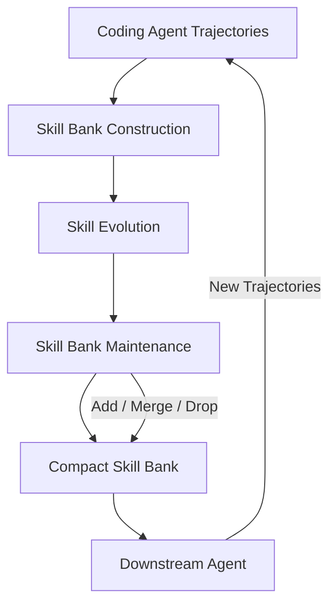
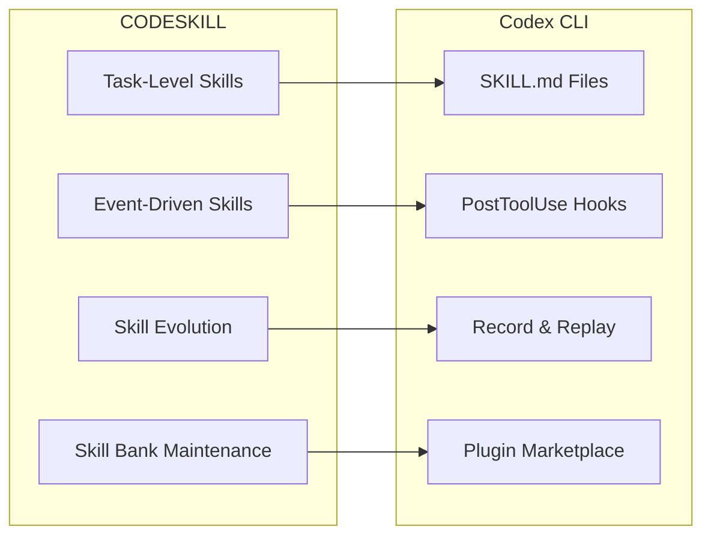

# CODESKILL and Self-Evolving Skill Banks: What RL-Trained Procedural Skill Management Means for Codex CLI Workflows


---

Coding agents generate thousands of tool-call trajectories every week. Most of that experience evaporates at session end. CODESKILL — a May 2026 framework from Li et al. — demonstrates that systematically extracting, evolving, and maintaining procedural skills from those trajectories yields a **9.69% average pass-rate improvement** across three major benchmarks, while reducing average reasoning steps by 20% [^1]. The result is not incremental: it outperforms the strongest prompt-based and memory-based baselines by 4.01 percentage points [^1].

This article unpacks CODESKILL's architecture, explains why naive skill accumulation fails, and maps every mechanism onto Codex CLI's skill system, plugin lifecycle, and hook pipeline — showing how to build a self-evolving skill bank with the tools you already have.

## Why Fixed Skills Plateau

Every Codex CLI user has written a `SKILL.md` that worked brilliantly for a fortnight and then quietly stopped helping. The underlying problem is well-characterised in the research literature: static skill libraries suffer from three failure modes [^1]:

1. **Coverage drift** — new task distributions arrive (a framework upgrade, a new CI provider) and existing skills no longer match.
2. **Redundancy bloat** — skills accumulate without deduplication, inflating context and confusing retrieval.
3. **Stale procedures** — a skill encodes a workflow that was correct six months ago but now references deprecated APIs or flags.

CODESKILL addresses all three through a learnable management policy rather than manual curation.

## CODESKILL Architecture

The framework operates as a three-stage loop around a frozen downstream coding agent [^1]:



### Multi-Granularity Skills

CODESKILL maintains two complementary skill types [^1]:

| Skill Type | Scope | Example |
|---|---|---|
| **Task-level** | High-level procedures for entire task families | Repository inspection → issue localisation → fix validation |
| **Event-driven** | Local trigger-response patterns for recurring execution events | `ModuleNotFoundError` → check virtualenv activation → install missing package |

Task-level skills abstract patterns from trajectory clusters solving related problems. Event-driven skills fire immediately when specific conditions occur — a command failure, a test output pattern, an error message [^1]. The combination gives the agent both strategic guidance and tactical reflexes.

### The RL-Trained Management Policy

The critical insight is that skill management itself is a learnable policy. CODESKILL trains a small model (Qwen3.5-4B) using Group Relative Policy Optimisation (GRPO) with a hybrid reward combining three signals [^1]:

- **Quality reward (R_Q)** — an LLM-as-judge scores grounding, reusability, specificity, format, and actionability on a 0–1 scale.
- **Execution reward (R_E)** — measures the skill's incremental effect on the downstream agent's verifier score versus a no-skill baseline.
- **Alignment factor (R_A)** — judges whether the agent's rollout trajectory actually matched the skill's trigger conditions and followed its workflow.

The combined reward ensures that only skills which demonstrably improve downstream performance survive [^1].

### Three-Stage Curriculum

Training follows a curriculum [^1]:

1. **Stage 1 (130 steps)** — skill extraction only, generating task-level and event-driven skills from trajectories.
2. **Stage 2 (120 steps)** — adds skill evolution, revising existing skills when new evidence reveals missing cases or better procedures.
3. **Stage 3 (250 steps)** — full pipeline with maintenance operations: **add** (insert uncovered knowledge), **merge** (combine overlapping skills), **drop** (remove redundant or weakly grounded candidates).

## Benchmark Results

The numbers are compelling. With Qwen3.5-35B-A3B as the downstream policy [^1]:

| Benchmark | No Skill | CODESKILL | Δ |
|---|---|---|---|
| EnvBench-Python | 6.98% | 18.60% | +11.62 |
| EnvBench-Java | 27.10% | 38.32% | +11.22 |
| SWE-Bench Verified | 57.33% | 66.00% | +8.67 |
| Terminal-Bench 2 | 25.88% | 34.12% | +8.24 |
| **Average** | **29.57%** | **39.26%** | **+9.69** |

Crucially, CODESKILL skills transfer across architectures. When applied to GPT-5.4-mini (a model not used during training), average pass rate improves from 21.80% to 30.73% [^1]. The skill bank is not overfitted to a single model's quirks.

Solved instances also require fewer reasoning steps — 35.15 on average versus 44.12 for the no-skill baseline, a 20% reduction [^1]. Better skills mean less floundering.

## The Companion Research Wave

CODESKILL is not an isolated result. A cluster of May–June 2026 papers converges on the same thesis:

- **SkillAdaptor** (arXiv:2606.01311) takes a training-free approach: given a failed trajectory, it identifies the first actionable fault step, attributes responsibility to candidate skills, and applies targeted updates under explicit acceptance checks [^2]. It improves over baselines on WebShop, PinchBench, and Claw-Eval without any gradient updates.
- **SkillCAT** (arXiv:2606.13317) adds contrastive assessment and topology-aware organisation, building a skill graph that captures prerequisite relationships between skills [^3].
- **Skill1** (arXiv:2605.06130) unifies skill evolution with tool evolution under a single RL objective [^4].

The convergence is clear: the field has moved beyond "give the agent a prompt library" toward treating skill management as a first-class optimisation problem.

## Mapping to Codex CLI

Codex CLI already ships the building blocks for a CODESKILL-style feedback loop. The gap is the orchestration — connecting them into a closed cycle.

### CODESKILL Concept → Codex CLI Mechanism



| CODESKILL Concept | Codex CLI Mechanism | Configuration Surface |
|---|---|---|
| Task-level skill | `SKILL.md` in `.codex/skills/` or plugin-bundled skill [^5] | Skill name, description, procedure steps |
| Event-driven skill | `PostToolUse` hook matching error patterns [^6] | Hook script with pattern matching and corrective action |
| Skill retrieval | Implicit invocation via skill description matching [^5] | Codex matches task to skill description automatically |
| Skill evolution | Record & Replay capture → manual or scripted revision [^7] | `codex record` captures trajectories; diff against existing skill |
| Skill bank maintenance | Plugin versioning and `[[skills.config]]` toggles [^6] | Disable stale skills without deletion; semantic versioning |
| Downstream feedback | Rollout traces in `.codex/traces/` [^8] | JSONL trace files with tool calls, outputs, and timing |

### Building the Feedback Loop

Here is a concrete implementation pattern using Codex CLI's current feature set:

**Step 1 — Capture trajectories.** Enable rollout tracing in `config.toml`:

```toml
[tracing]
enabled = true
output_dir = ".codex/traces"
format = "jsonl"
```

Every session writes a JSONL trace file containing tool calls, outputs, errors, and timing [^8].

**Step 2 — Extract skills from trajectories.** Use a dedicated Codex CLI skill (or subagent) to analyse trace files and extract procedural patterns:

```markdown
<!-- .codex/skills/skill-extractor/SKILL.md -->
# Skill Extractor

## Description
Analyse Codex CLI trace files to extract reusable procedural skills.

## Procedure
1. Read all JSONL trace files from the specified directory
2. Cluster traces by task type (bug fix, feature, refactor, test)
3. For each cluster, identify the common successful procedure
4. Extract event-driven patterns from error-recovery sequences
5. Write candidate skills as SKILL.md drafts to .codex/skills/candidates/
6. Score each candidate on grounding, reusability, and specificity
```

**Step 3 — Validate with execution feedback.** Run the candidate skill against held-out tasks using `codex exec`:

```bash
# Test a candidate skill against a known-good task
codex exec --skill .codex/skills/candidates/django-migration-fix \
  --prompt "Fix the failing migration in PR #1842" \
  --sandbox full-auto \
  2> /tmp/skill-test-trace.jsonl
```

Compare the trace output against the no-skill baseline. If the candidate reduces reasoning steps or improves pass rate, promote it.

**Step 4 — Evolve existing skills.** When a promoted skill encounters a failure, the `PostToolUse` hook captures the failure context:

```bash
#!/bin/bash
# .codex/hooks/post-tool-use-skill-feedback.sh
if [ "$CODEX_TOOL_EXIT_CODE" -ne 0 ]; then
  echo "{\"skill\": \"$CODEX_ACTIVE_SKILL\", \"error\": \"$CODEX_TOOL_STDERR\", \"timestamp\": \"$(date -u +%Y-%m-%dT%H:%M:%SZ)\"}" \
    >> .codex/skill-feedback.jsonl
fi
```

Periodically run the skill-extractor against `skill-feedback.jsonl` to update skill procedures with new failure cases — CODESKILL's evolution stage.

**Step 5 — Maintain the bank.** Schedule a weekly automation to audit the skill bank:

```bash
# Codex App automation or cron job
codex exec --prompt "Review .codex/skills/ for redundant or stale skills. \
  Merge overlapping skills, drop any that haven't been invoked in 30 days \
  (check .codex/traces/ for invocation evidence), and update the skill index."
```

This implements CODESKILL's add/merge/drop maintenance loop with Codex CLI's existing tooling.

### Profile-Based Skill Routing

CODESKILL's cross-architecture transfer result suggests that different models benefit from different skill subsets. Codex CLI's named profiles support this pattern:

```toml
# ~/.codex/config.toml

[profiles.complex-reasoning]
model = "gpt-5-codex"
skills = [".codex/skills/architecture-planning", ".codex/skills/design-review"]

[profiles.mechanical]
model = "gpt-5-codex-mini"
skills = [".codex/skills/test-generation", ".codex/skills/linting-fix"]
```

Route complex tasks to expensive models with high-level task skills; route mechanical tasks to cheaper models with event-driven skills [^5]. CODESKILL's transfer results confirm this works — skills trained with one model improve performance on a different model [^1].

## What CODESKILL Gets Right That Prompt Libraries Miss

Three design decisions separate CODESKILL from naive skill accumulation:

1. **Execution-grounded rewards.** Skills are scored by their measurable impact on downstream task resolution, not by how well-written they look. A beautifully formatted skill that does not improve pass rates gets dropped [^1].

2. **Bounded bank size.** The merge/drop maintenance loop prevents unbounded growth. CODESKILL's skill bank stabilises rather than growing linearly with experience [^1]. In Codex CLI terms: disable or merge skills that no longer earn their context-window cost.

3. **Multi-granularity coverage.** Task-level skills provide strategic direction; event-driven skills provide tactical recovery. Neither alone is sufficient — the combination yields the full 9.69% improvement [^1].

## Limitations and Open Questions

⚠️ CODESKILL's RL training requires a frozen downstream agent and a verifiable reward signal. Most real-world Codex CLI tasks lack automated verifiers — manual review remains the feedback mechanism. Bridging this gap with test-suite pass rates or linter scores is practical but incomplete.

⚠️ The framework has been evaluated on single-agent settings. Whether multi-granularity skill banks compose cleanly across Codex CLI's subagent hierarchy (where parent and child agents may need different skill sets) remains untested.

⚠️ Skill bank transfer across models was demonstrated between two specific models (Qwen3.5-35B-A3B and GPT-5.4-mini). Whether transfer holds for the full range of models available through Codex CLI's custom provider system requires further validation.

## Practical Takeaways

1. **Stop accumulating skills — start curating them.** Review your `.codex/skills/` directory monthly. Merge overlapping skills, drop unused ones, and version the survivors.
2. **Capture trajectories systematically.** Enable tracing. Without execution data, you cannot measure whether a skill helps or hurts.
3. **Separate task-level from event-driven skills.** Write high-level workflow skills as `SKILL.md` files; encode error-recovery patterns as `PostToolUse` hooks. The combination outperforms either approach alone.
4. **Test skills against baselines.** Run `codex exec` with and without a candidate skill on the same task. Promote only skills that measurably improve outcomes.
5. **Route skills by model.** Use named profiles to assign skill subsets to different models based on task complexity.

## Citations

[^1]: Li, Y., Zhang, Y., Zhang, X., Liu, X., & Liu, Y. (2026). *CODESKILL: Learning Self-Evolving Skills for Coding Agents*. arXiv:2605.25430. [https://arxiv.org/abs/2605.25430](https://arxiv.org/abs/2605.25430)

[^2]: SkillAdaptor: Self-Adapting Skills for LLM Agents from Trajectories. arXiv:2606.01311. [https://arxiv.org/abs/2606.01311](https://arxiv.org/abs/2606.01311)

[^3]: SkillCAT: Contrastive Assessment and Topology-Aware Skill Self-Evolution for LLM Agents. arXiv:2606.13317. [https://arxiv.org/abs/2606.13317](https://arxiv.org/abs/2606.13317)

[^4]: Skill1: Unified Evolution of Skill-Augmented Agents via Reinforcement Learning. arXiv:2605.06130. [https://arxiv.org/abs/2605.06130](https://arxiv.org/abs/2605.06130)

[^5]: OpenAI. *Agent Skills — Codex*. [https://developers.openai.com/codex/skills](https://developers.openai.com/codex/skills)

[^6]: OpenAI. *Plugins — Codex*. [https://developers.openai.com/codex/plugins](https://developers.openai.com/codex/plugins)

[^7]: OpenAI. *Codex App 26.616 Release Notes — Record & Replay skill feature (macOS)*. [https://developers.openai.com/codex/changelog](https://developers.openai.com/codex/changelog)

[^8]: OpenAI. *Features — Codex CLI*. [https://developers.openai.com/codex/cli/features](https://developers.openai.com/codex/cli/features)
