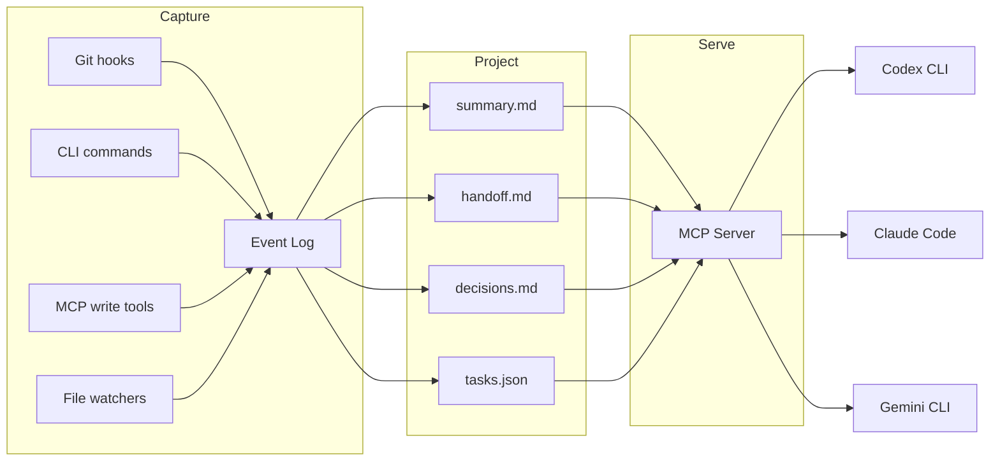
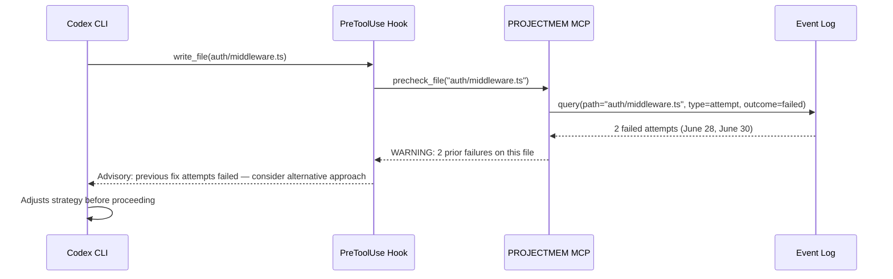

# Event-Sourced Memory Layers for Coding Agents: What PROJECTMEM and ESAA-Conversational Reveal About Memory-as-Governance — and How to Wire Them into Codex CLI


---

Your coding agent is stateless. Every new session, it re-reads your project, re-derives the decisions you already made last Tuesday, and — most expensively — retries the exact fix that failed three sessions ago. Reconstructing this context costs an estimated 5,000–20,000 tokens per session[^1]. Two recent papers propose the same architectural antidote: treat development history as an append-only event log that agents consume through the Model Context Protocol (MCP), turning passive memory into active governance.

This article examines PROJECTMEM[^1] and ESAA-Conversational[^2], maps their patterns to Codex CLI's hook and MCP infrastructure, and provides configuration recipes for wiring event-sourced memory into your own workflows.

## The Problem: Conversational State Drift

When developers switch between coding agents — or even between sessions of the same agent — two forms of drift emerge:

1. **Intra-agent amnesia.** Codex CLI's native Memories feature auto-generates session summaries, but these are machine-local, unsearchable beyond keyword match, and capped at 32 KiB by default[^3]. They cannot encode structured causal chains like "we tried approach X, it failed because of constraint Y, so we pivoted to Z."

2. **Cross-agent state loss.** A developer who uses Codex CLI for implementation and Claude Code for review loses all conversational context at the boundary. ESAA-Conversational calls this *conversational state drift* — the silent evaporation of decisions, failed attempts, and unresolved issues whenever the tool changes[^2].

Both papers converge on event sourcing as the solution.

## Event Sourcing as Agent Memory

Event sourcing is a well-established pattern in distributed systems[^4]: instead of storing current state, you store every state-changing event in an append-only log. Current state is a deterministic projection of that log. Applied to coding agents, the event log records what happened during development — issues opened, fixes attempted, decisions made — and projections create compact, AI-readable summaries served to agents at session start.



### PROJECTMEM: Five Event Types, One Judgment Gate

Malo and Qiu's PROJECTMEM[^1] defines five core event types:

| Event Type | Purpose | Example |
|-----------|---------|---------|
| **Issue** | A problem is opened | `auth token refresh fails on expired JWT` |
| **Attempt** | A fix is tried (outcome: worked/failed/partial) | `tried rotating key in middleware — failed, broke session store` |
| **Fix** | A confirmed resolution closing an issue | `moved rotation to auth service, added retry` |
| **Decision** | An architectural or product choice | `chose PostgreSQL over DynamoDB for audit log` |
| **Note** | Durable gotchas or setup details | `CI runner needs NODE_OPTIONS=--max-old-space-size=4096` |

Each event carries an ISO-8601 timestamp, optional file:line location references, and free-text descriptions. The log is stored as plain text under `.projectmem/`, fully offline, with no telemetry[^1].

The system ships as a three-dependency Python package exposing 14 MCP tools (9 read, 5 write) and 19 CLI commands[^1]. In MCP mode, session-start context loads in 800–1,500 tokens — compared to the 5,000–20,000 token baseline of stateless context reconstruction[^1].

### ESAA-Conversational: Cross-Agent Continuity

Dos Santos Filho's ESAA-Conversational[^2] tackles the multi-agent handoff problem specifically. Hooks and file watchers capture conversation turns into an append-only `activity.jsonl`, then deterministic projections generate read models:

- `handoff.md` — what the next agent needs to know
- `state.md` — current project state
- `decisions.md` — architectural choices with rationale
- `tasks.json` — outstanding work items

The key insight is that capture is *mechanical*, not inferential — no LLM call is required to record events. The case study accumulated 570 events across a two-month development cycle[^2], demonstrating that the overhead is negligible compared to the context savings.

## Memory-as-Governance: From Passive Recall to Active Intervention

The most significant contribution of PROJECTMEM is the concept of *Memory-as-Governance* — memory that acts on the agent's next action rather than merely being available for retrieval[^1].

Previous work categorised agent memory as either *Memory-as-Tool* (passive retrieval, exemplified by Mem0[^5]) or *Memory-as-Cognition* (internalised learned behaviour). PROJECTMEM adds a third category: memory that *deterministically intervenes* before an action proceeds.

The mechanism is the `precheck_file(path)` judgment gate. When an agent is about to modify a file, the gate consults the event log for:

- Previously failed attempts targeting that location
- Open issues associated with the file
- High-churn indicators suggesting fragility

The response is an advisory warning — "you tried this approach 2 days ago; it failed because the session store depends on the key format" — returned *before* the edit proceeds. Critically, this is a deterministic lookup, not an LLM call. It reads only memory, never file contents[^1].



## Wiring Event-Sourced Memory into Codex CLI

Codex CLI already has the infrastructure to support this pattern. Here is how the pieces connect.

### Step 1: Register the MCP Server

PROJECTMEM exposes its 14 tools through a standard MCP stdio server. Register it in your Codex CLI configuration:

```toml
# ~/.codex/config.toml

[mcp_servers.projectmem]
command = "python"
args = ["-m", "projectmem.mcp"]
env = { PROJECTMEM_ROOT = "." }
```

On session start, Codex CLI automatically launches configured MCP servers and exposes their tools alongside built-in ones[^6]. The PROJECTMEM server loads its session-start summary, consuming approximately 800–1,500 tokens[^1].

### Step 2: Capture Events via PostToolUse

Use Codex CLI's PostToolUse hook to automatically log significant events. When a test suite fails after a code change, record it as an Attempt:

```toml
# ~/.codex/config.toml

[hooks.post_tool_use.log_failures]
match = "bash"
command = "python"
args = ["-c", """
import sys, json
event = json.load(sys.stdin)
if event.get('exit_code', 0) != 0 and 'test' in event.get('command', ''):
    import subprocess
    subprocess.run(['pjm', 'attempt', '--outcome', 'failed',
                    '--desc', event.get('command', 'unknown command')])
print(json.dumps({"status": "pass"}))
"""]
```

### Step 3: Wire the Judgment Gate to PreToolUse

The most powerful integration maps PROJECTMEM's `precheck_file` to Codex CLI's PreToolUse hook, creating a pre-action governance layer:

```toml
# ~/.codex/config.toml

[hooks.pre_tool_use.memory_gate]
match = "write|edit|apply_patch"
command = "python"
args = ["scripts/memory-gate.py"]
```

The gate script calls `precheck_file` via the MCP server and returns an advisory warning if the file has a history of failed modifications[^1]. ⚠️ Note: as of Codex CLI v0.142.5, PreToolUse only fires for Bash tool interception; Read, Write, Edit, and MCP tool calls do not yet trigger PreToolUse events[^7]. The gate script would need to operate via a wrapper until this limitation is resolved.

### Step 4: Cross-Agent Handoff with ESAA-Conversational

For teams using multiple coding agents, layer ESAA-Conversational's capture hooks alongside PROJECTMEM's structured events:

```toml
# ~/.codex/config.toml

[hooks.post_tool_use.esaa_capture]
match = "*"
command = "pwsh"
args = ["-File", "scripts/esaa-capture.ps1"]
```

The `handoff.md` projection then serves as a portable context document that any MCP-capable agent can consume — Codex CLI, Claude Code, or Gemini CLI[^2].

## What This Architecture Gives You

| Capability | Stateless Baseline | With Event-Sourced Memory |
|-----------|-------------------|--------------------------|
| Session-start context cost | 5,000–20,000 tokens | 800–1,500 tokens[^1] |
| Repeated failure prevention | None | Deterministic pre-action gate |
| Cross-agent continuity | Manual copy-paste | Automated handoff projections |
| Decision traceability | Lost between sessions | Immutable, append-only audit trail |
| LLM inference for memory | Required (Mem0, vector search) | None — deterministic lookups[^1] |

## Limitations and Open Questions

Both papers acknowledge significant constraints:

**Cold-start problem.** The judgment gate only functions with accumulated history. A new project or a project migrated from another memory system starts with no protective memory[^1].

**Evaluation rigour.** PROJECTMEM's evaluation is a two-month self-study across 10 projects with 207 events — usage estimates, not a controlled benchmark[^1]. ESAA-Conversational's 570-event case study is similarly self-referential[^2]. Neither paper measures causal productivity improvement or failure-prevention rates.

**No semantic retrieval.** PROJECTMEM deliberately avoids vector search, trading fuzzy recall for determinism[^1]. This means it cannot answer "what was that library issue we hit last month?" if the query does not match stored keywords exactly.

**PreToolUse coverage gap.** Codex CLI's PreToolUse hook currently only fires for Bash commands[^7], limiting the judgment gate's coverage. A feature request for broader tool interception (Issue #24907) is tracked but unresolved[^7].

**Single-user design.** PROJECTMEM is local-only; multi-user synchronisation via conflict-free append-only merge is proposed but not implemented[^1]. ESAA-Conversational supports single-developer workflows with public distribution excluding private conversation history[^2].

## The Emerging Pattern

PROJECTMEM and ESAA-Conversational arrive independently at the same architectural insight: coding agent memory should be event-sourced, locally stored, deterministically projected, and served through MCP. The Memorix project[^8] and Mem0's MCP integration[^5] fill adjacent niches — semantic retrieval and cross-agent compatibility respectively — but neither implements pre-action governance.

For Codex CLI users, the practical takeaway is clear: the native Memories feature is a starting point, not a destination. Layer an event-sourced MCP memory server for structured recall, wire its judgment gate to your hook pipeline for governance, and use deterministic projections for cross-agent handoff. Your agent should start each session experienced, not amnesiac.

## Citations

[^1]: Malo, R.C. and Qiu, T. (2026) 'PROJECTMEM: A Local-First, Event-Sourced Memory and Judgment Layer for AI Coding Agents', *arXiv:2606.12329*. Available at: [https://arxiv.org/abs/2606.12329](https://arxiv.org/abs/2606.12329)

[^2]: dos Santos Filho, E.B. (2026) 'ESAA-Conversational: An Event-Sourced Memory Layer for Continuity, Handoff, and Curation Across Heterogeneous LLM Coding Agents', *arXiv:2606.23752*. Available at: [https://arxiv.org/abs/2606.23752](https://arxiv.org/abs/2606.23752)

[^3]: OpenAI (2026) 'Codex CLI Features', *OpenAI Developers*. Available at: [https://developers.openai.com/codex/cli/features](https://developers.openai.com/codex/cli/features)

[^4]: Fowler, M. (2005) 'Event Sourcing', *martinfowler.com*. Available at: [https://martinfowler.com/eaaDev/EventSourcing.html](https://martinfowler.com/eaaDev/EventSourcing.html)

[^5]: Mem0 (2026) 'Codex + Mem0 MCP: Build a Coding Agent That Remembers Your Codebase', *mem0.ai*. Available at: [https://mem0.ai/blog/codex-mem0-mcp-build-a-coding-agent-that-remembers-your-codebase](https://mem0.ai/blog/codex-mem0-mcp-build-a-coding-agent-that-remembers-your-codebase)

[^6]: OpenAI (2026) 'Codex CLI Reference', *OpenAI Developers*. Available at: [https://developers.openai.com/codex/cli/reference](https://developers.openai.com/codex/cli/reference)

[^7]: openai/codex (2026) 'Add PreToolUse and PostToolUse hook events for code quality enforcement', *GitHub Issue #14754*. Available at: [https://github.com/openai/codex/issues/14754](https://github.com/openai/codex/issues/14754)

[^8]: AVIDS2 (2026) 'Memorix: Open-source cross-agent memory layer for coding agents via MCP', *GitHub*. Available at: [https://github.com/AVIDS2/memorix](https://github.com/AVIDS2/memorix)
