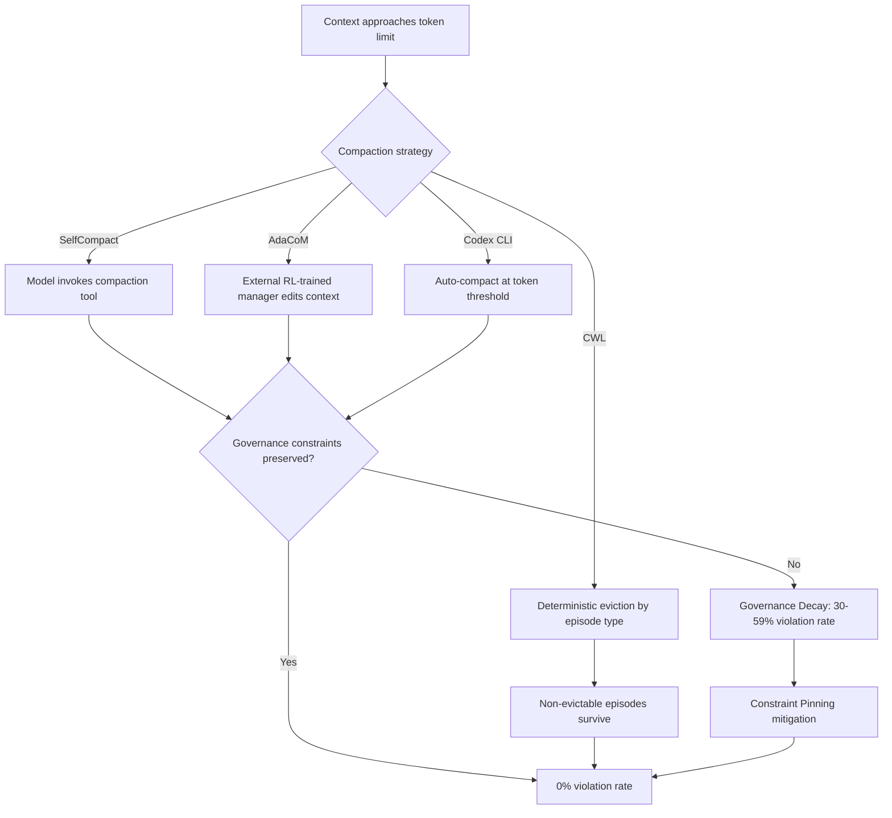
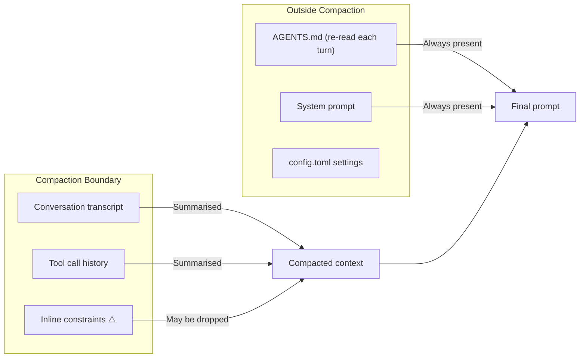

# Governance Decay and Self-Compacting Agents: What Happens When Context Compaction Silently Erases Your Safety Constraints


---

Every coding agent harness shipping today — Codex CLI, Claude Code, Amp, OpenCode — relies on context compaction to keep long sessions alive. When the token count approaches the model's context window, the harness summarises older turns and replaces the full transcript with a compressed version. The mechanism works. Sessions that would otherwise crash at the context ceiling can now run for hours.

The problem nobody talks about: compaction is lossy, and the information it discards is not uniformly unimportant. Three papers published in May–June 2026 converge on the same uncomfortable finding — context compaction systematically drops governance constraints, and neither users nor harnesses notice until the agent has already violated them.

## The Governance Decay Problem

Chen's *Governance Decay* study (arXiv:2606.22528) [^1] introduces **ConstraintRot**, a benchmark of long-horizon agent scenarios with deterministic tool-call grading across 1,323 episodes and seven model families. The headline result is stark: constraint violations rise from 0% with the policy in full context to **30% after compaction**, reaching **59% for some models**. When constraints survive summarisation, violations remain at 0%. When they are dropped, violations reach 38%.

The mechanism is straightforward. Most compaction strategies treat the conversation as a uniform stream and summarise based on recency or information density. Governance constraints — "never write to production databases," "always run tests before committing," "do not access files outside the project root" — look like low-information-density boilerplate to a summariser. They get compressed away first.

Chen also demonstrates a **Compaction-Eviction Attack**: adversarial content deliberately biases the summariser into omitting legitimate policies. This is not theoretical — it exploits the same statistical properties that make compaction work in the first place.

## Three Competing Approaches to Context Lifecycle

The June 2026 research wave produced three distinct architectures for managing context in long-horizon agents:

### SelfCompact: Let the Model Decide

Li et al.'s *Self-Compacting Language Model Agents* (arXiv:2606.23525) [^2] gives the model itself a compaction tool and a lightweight rubric specifying when to fire (sub-task resolved, trajectory converging) and when to suppress (mid-derivation, stuck states). Across six benchmarks and seven open-weight models, SelfCompact matches or exceeds fixed-interval summarisation at **30–70% lower token cost**, with improvements of up to 18.1 points on competitive maths and 5–9 points on agentic search.

The insight is that models cannot reliably recognise context degradation without guidance — a "meta-cognitive gap" that the rubric closes. But SelfCompact inherits the governance decay vulnerability: the rubric does not distinguish safety constraints from task context, so the model's own summarisation can still drop them.

### AdaCoM: Train an External Manager

Yi et al.'s *Adaptive Context Management* (arXiv:2605.30785) [^3] takes the opposite approach: an external LLM, trained via end-to-end reinforcement learning, manages the context of a frozen agent through flexible modification actions. The key finding is a **Fidelity-Reliability Trade-off** — stronger agents benefit from higher-fidelity context preservation, while weaker agents need more aggressive compression to stay within a reliable reasoning regime.

AdaCoM generalises across agents with similar capability levels, suggesting practical reusability. However, the RL training loop is expensive, and the external manager introduces its own failure modes — including the potential to learn that governance constraints are low-reward and should be pruned.

### Context Window Lifecycle: Structured Eviction

Semenov and Dorofeev's *Context Window Lifecycle* (arXiv:2606.11213) [^4] avoids summarisation entirely. Agents annotate their trajectories as typed, dependency-linked episodes. When token limits approach, a deterministic policy evicts content in priority order — removing action episodes whose effects already persist in the environment, while preserving active reasoning and user interactions. A single agent session completed **89 sequential tasks across 80 million tokens** with no measurable degradation in task accuracy relative to per-task isolated sessions.

CWL's advantage for governance is that constraints can be typed as non-evictable episodes, making them structurally immune to compaction. The cost is implementation complexity — every tool call must be annotated with episode metadata and dependency links.



## Constraint Pinning: The Training-Free Fix

Chen's proposed mitigation, **Constraint Pinning**, is elegant in its simplicity [^1]. It extracts governance constraints into a pinned buffer exempt from compaction. After every compaction step, the pinned constraints are re-injected verbatim, with integrity checking at each step.

The results are compelling:

| Condition | Violation Rate | Allowed Actions Completed |
|---|---|---|
| Full context (no compaction) | 0% | 100% |
| Standard compaction | 30–59% | ~100% |
| Compaction + Constraint Pinning | **0%** | **99%** |

The pinned policy averages approximately 47 tokens, re-injected once per compaction — under 0.5% of a 10K-token context [^1]. Constraint Pinning completes 99% of allowed actions with only 1% over-refusal. It is training-free and harness-local: it modifies only how the harness manages memory, not the model or the tools.

## How Codex CLI's Compaction Architecture Works

Codex CLI's context compaction is controlled by two configuration keys in `config.toml` [^5]:

```toml
# Trigger compaction at 120K tokens (60% of a 200K window)
model_context_window = 200000
model_auto_compact_token_limit = 120000
```

When the session transcript exceeds `model_auto_compact_token_limit`, the harness fires an automatic compaction pass. The server enforces a hard cap: you cannot set the threshold above 90% of the context window [^6]. An optional `compact_prompt` key (or the experimental `experimental_compact_prompt_file`) lets you customise the summarisation prompt [^5].

### The 60% Rule

The single most effective mitigation for compaction stability is triggering compaction well before the context window fills [^6]. Setting `model_auto_compact_token_limit` to roughly 60% of the effective window gives the compact endpoint a smaller payload to process, reducing stream disconnection risk and — crucially — giving the summariser more room to preserve important context including governance constraints.

### AGENTS.md as Structural Constraint Pinning

Codex CLI's `AGENTS.md` files function as a form of structural constraint pinning [^7]. Unlike conversation-embedded constraints, AGENTS.md rules are re-read from the filesystem on every turn. They are never part of the compacted conversation history, so they survive compaction intact.

This is architecturally equivalent to Chen's Constraint Pinning — governance constraints live outside the compaction boundary:



### The Gap: Conversational Constraints

The vulnerability remains for constraints established *during* the conversation — instructions the user gives mid-session that are not codified in AGENTS.md. A user who says "don't touch the database migration files" at turn 3 of a 200-turn session has no guarantee that instruction survives compaction at turn 150.

## A Defence-in-Depth Configuration

Combining the research findings with Codex CLI's configuration surface produces a layered defence against governance decay:

### 1. Move All Constraints to AGENTS.md

Every governance constraint belongs in `AGENTS.md`, not in conversational instructions [^7]. This is the simplest and most effective defence — constraints outside the compaction boundary cannot be compacted away.

```markdown
<!-- .codex/AGENTS.md -->
## Constraints
- NEVER modify files in `migrations/` without explicit approval
- ALWAYS run `make test` before committing
- DO NOT access environment variables containing credentials
- NEVER push directly to main; create a branch
```

### 2. Tune Compaction Thresholds

Trigger compaction early to give the summariser headroom [^6]:

```toml
# config.toml — aggressive early compaction
model_context_window = 200000
model_auto_compact_token_limit = 120000
tool_output_token_limit = 8192
```

### 3. Use a Custom Compact Prompt

Instruct the summariser to preserve constraint-like content explicitly [^5]:

```toml
compact_prompt = """Summarise the conversation history, preserving:
1. All user-stated constraints and prohibitions verbatim
2. Current task state and pending actions
3. Key decisions and their rationale
Drop: verbose tool output, redundant file reads, resolved sub-tasks."""
```

### 4. Leverage PostToolUse Hooks for Constraint Verification

A PostToolUse hook can verify that critical constraints are still present in the model's context after compaction, flagging if governance rules have decayed [^8]:

```markdown
<!-- AGENTS.md hook specification -->
## PostToolUse hooks
- After any file write: verify the change does not touch prohibited paths
- After compaction events: log a constraint-check confirmation
```

### 5. Profile-Based Constraint Layering

Use Codex CLI profiles to enforce different constraint sets per environment [^5]:

```toml
[profiles.production]
model_auto_compact_token_limit = 100000  # More aggressive compaction
# Production-specific AGENTS.md loaded via per-directory hierarchy

[profiles.development]
model_auto_compact_token_limit = 150000  # Looser threshold for exploration
```

⚠️ Note: as of v0.141.0, there is a known issue where `model_auto_compact_token_limit` set within profile sections may be ignored — top-level values work reliably [^9].

## Implications for Long-Running Automation

The governance decay problem is amplified in `codex exec` automation pipelines where no human is watching. A seven-hour autonomous session that compacts multiple times has multiple opportunities for constraint erosion. The `codex exec resume` workflow, where sessions are resumed with `--last` and new instructions appended [^10], compounds the risk: each resume adds context that pushes toward compaction, and each compaction is another opportunity to drop constraints.

For CI/CD pipelines and scheduled automations, the defence is clear: never rely on conversational context for safety. Encode every constraint in AGENTS.md, set compaction thresholds conservatively, and treat the conversation transcript as ephemeral working memory — not as a governance mechanism.

## Key Takeaways

1. **Context compaction is not semantically neutral.** It systematically under-weights governance constraints because they look like low-information-density boilerplate to a summariser.
2. **Constraint Pinning works.** Exempting governance constraints from compaction restores violation rates to 0% at negligible token cost (~47 tokens per re-injection).
3. **AGENTS.md is structural pinning.** Codex CLI's architecture of re-reading AGENTS.md each turn already provides the equivalent of Constraint Pinning — but only for constraints that live in those files.
4. **Conversational constraints are fragile.** Any instruction given mid-session that is not codified in AGENTS.md is at risk of compaction-induced decay.
5. **Tune compaction thresholds aggressively.** The 60% rule gives the summariser room to preserve important context.

---

## Citations

[^1]: Chen, S. (2026). *Governance Decay: How Context Compaction Silently Erases Safety Constraints in Long-Horizon LLM Agents*. arXiv:2606.22528. [https://arxiv.org/abs/2606.22528](https://arxiv.org/abs/2606.22528)

[^2]: Li, T., Zhang, J., Jurayj, W., Wang, X., Jin, C., Farajtabar, M., Nalisnick, E. & Khashabi, D. (2026). *Self-Compacting Language Model Agents*. arXiv:2606.23525. [https://arxiv.org/abs/2606.23525](https://arxiv.org/abs/2606.23525)

[^3]: Yi, L., Lei, R., Yao, L., Xie, Y., Li, Y., Zhang, W., Wei, Z., Li, Y. & Nie, J.-Y. (2026). *Learning Agent-Compatible Context Management for Long-Horizon Tasks*. arXiv:2605.30785. [https://arxiv.org/abs/2605.30785](https://arxiv.org/abs/2605.30785)

[^4]: Semenov, A. & Dorofeev, S. (2026). *Beyond Compaction: Structured Context Eviction for Long-Horizon Agents*. arXiv:2606.11213. [https://arxiv.org/abs/2606.11213](https://arxiv.org/abs/2606.11213)

[^5]: OpenAI. (2026). *Configuration Reference — Codex CLI*. [https://developers.openai.com/codex/config-reference](https://developers.openai.com/codex/config-reference)

[^6]: OpenAI. (2026). *Codex CLI Context Compaction: Architecture, Configuration, and Managing Long Sessions*. Codex Knowledge Base. [https://codex.danielvaughan.com/2026/03/31/codex-cli-context-compaction-architecture/](https://codex.danielvaughan.com/2026/03/31/codex-cli-context-compaction-architecture/)

[^7]: OpenAI. (2026). *AGENTS.md — Codex CLI Documentation*. [https://developers.openai.com/codex/cli](https://developers.openai.com/codex/cli)

[^8]: OpenAI. (2026). *Advanced Configuration — Codex CLI*. [https://developers.openai.com/codex/config-advanced](https://developers.openai.com/codex/config-advanced)

[^9]: OpenAI. (2026). *Support model_context_window/model_auto_compact_token_limit in profiles*. GitHub Issue #14456. [https://github.com/openai/codex/issues/14456](https://github.com/openai/codex/issues/14456)

[^10]: OpenAI. (2026). *Non-interactive mode — Codex CLI*. [https://developers.openai.com/codex/noninteractive](https://developers.openai.com/codex/noninteractive)
