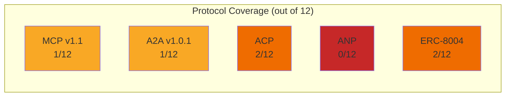
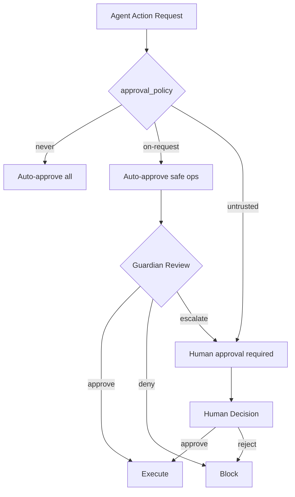
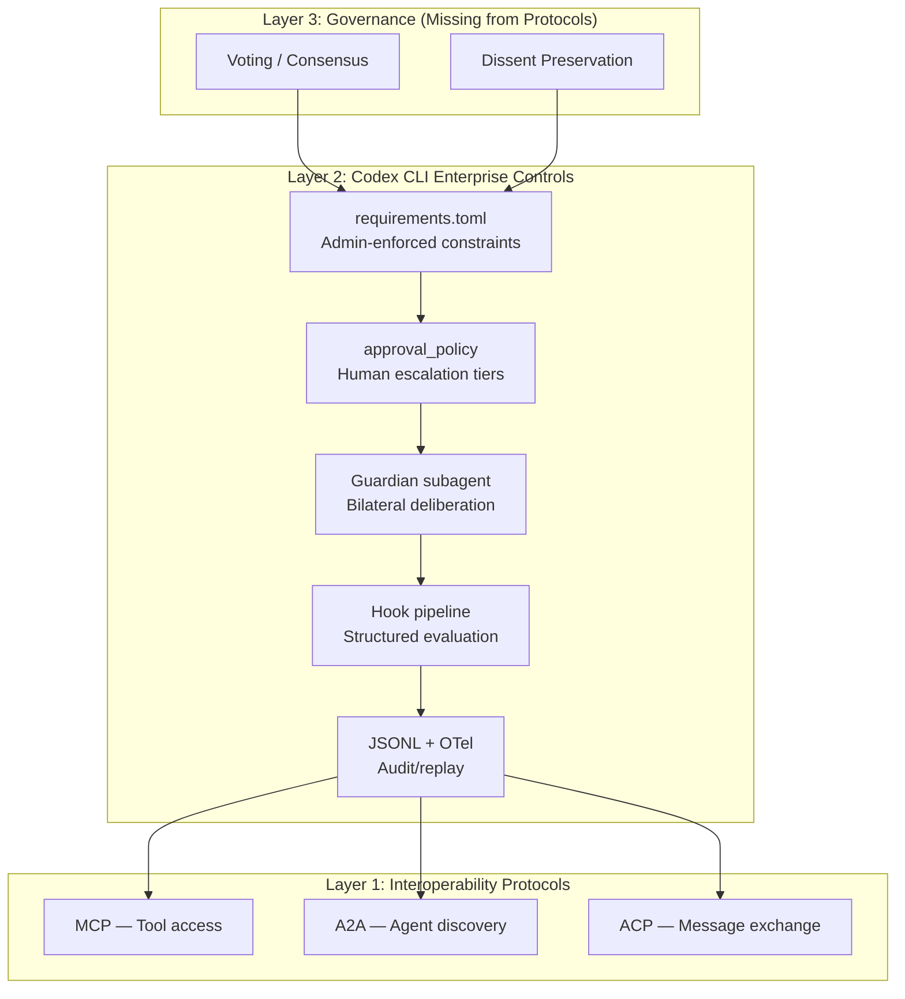

# Governance Gaps in Agent Interoperability Protocols: What MCP, A2A, and ACP Cannot Express — and How Codex CLI's Layered Architecture Fills the Void


---

The three protocols that dominate agent interoperability — MCP, Google's A2A, and ACP — solve discovery, tool access, and message exchange convincingly. What they do not solve, and what Kang and Diponegoro's systematic gap analysis published on 30 June 2026 makes painfully clear, is *governance* [^1]. For teams running multi-agent Codex CLI fleets in production, the paper's findings land as both a warning and a design brief.

## The Six-Dimension Governance Taxonomy

The authors derive six governance requirements from organisational theory and enterprise standards [^1]:

| Dimension | What It Requires |
|---|---|
| **G1 — Membership** | Formal admission, role assignment, and removal of agents from a governed community |
| **G2 — Deliberation** | Structured, multilateral reasoning with turn-taking before a collective decision |
| **G3 — Voting** | Preference aggregation across agents to reach a binding outcome |
| **G4 — Dissent Preservation** | Retention of minority positions and dissenting rationale in the decision record |
| **G5 — Human Escalation** | Protocol-native triggers that route unresolvable disputes to a human authority |
| **G6 — Audit/Replay** | Tamper-evident, replayable records of the full decision lifecycle |

These are not theoretical niceties. The paper's motivating scenario — five agents collectively deciding whether a proposed architecture meets regulatory requirements — maps directly to enterprise compliance workflows already running in Codex CLI fleets [^2].

## The Score: 0–2 out of 12

Kang and Diponegoro assess five protocols against the taxonomy, scoring each dimension as Supported, Partial, or Absent [^1]:



The detail is worse than the aggregate:

- **MCP v1.1**: Absent across membership, deliberation, voting, dissent, and human escalation. Only partial audit capability via session state, with no tamper-evidence guarantees [^1].
- **A2A v1.0.1**: Agent Cards provide partial membership (capability discovery, not admission/removal). Everything else is absent — despite A2A shipping an extension mechanism six months ago, zero governance extensions have been proposed or implemented [^1].
- **ACP**: Partial membership through communication roles and partial deliberation via bilateral negotiation, but no multilateral reasoning. Voting, dissent, escalation, and audit are all absent [^1].
- **ANP**: Universally absent — it functions as a routing protocol without governance semantics [^1].
- **ERC-8004**: Blockchain-native identity registry and audit properties provide partial coverage on G1 and G6, but on-chain latency and cost constraints are incompatible with real-time multi-agent deliberation [^1].

The two dimensions that are *universally absent* across all five protocols — voting (G3) and dissent preservation (G4) — are precisely the ones that enterprise compliance teams ask about first.

## Extensible Gaps vs Structural Gaps

The paper's most useful contribution is distinguishing remediation difficulty [^1]:

**Extensible gaps** could theoretically be patched via protocol updates. A2A's extension framework is the obvious candidate, yet the zero-extension adoption rate after six months suggests the community does not view governance as a protocol-layer concern.

**Structural gaps** reflect shared architectural philosophy rather than individual protocol limitations. All five protocols treat agents as task-executing peers; none model agents as members of a governed community with collective decision-making obligations.

**Scope-limiting gaps** apply to protocols whose design constraints prevent governance even in theory. ERC-8004's on-chain model cannot support real-time deliberation without fundamental architectural change.

The authors' conclusion is stark: "agent community governance constitutes a missing architectural layer above current interoperability standards" [^1].

## Where Codex CLI Already Covers the Gaps

Codex CLI does not implement a governance protocol. But its layered architecture — `config.toml` for developer preferences, `requirements.toml` for admin-enforced constraints, `AGENTS.md` for per-directory instructions, and the hook pipeline for runtime enforcement — provides governance primitives that the interoperability protocols lack [^3 [^4].

### G1 — Membership: Subagent Delegation Controls

Since v0.142.0, app-server clients can configure multi-agent delegation as `disabled`, `explicit-request-only`, or `proactive` at thread and turn levels [^5]. Combined with `max_threads` and `max_depth` limits in `config.toml`, this controls which agents can join a workflow and how deeply they can nest [^6]:

```toml
[agents]
max_threads = 6
max_depth = 1       # children can spawn, no deeper recursion

[delegation]
mode = "explicit-request-only"  # no proactive spawning
```

The `enabled_tools` and `disabled_tools` arrays further restrict what capabilities any spawned agent can access — a functional equivalent of role-based membership [^3].

### G2 — Deliberation: Structured Hook Pipelines

Codex CLI's `PreToolUse` and `PostToolUse` hooks create a structured evaluation pipeline where multiple checks execute in sequence before any action proceeds [^3]. While not multilateral agent deliberation in the protocol sense, hooks provide the turn-taking and challenge-response structure that the governance taxonomy requires:

```toml
[[hooks]]
event = "PreToolUse"
command = "python3 compliance-check.py"

[[hooks]]
event = "PostToolUse"
command = "python3 security-audit.py"
```

The auto-review subagent (Guardian) adds a second evaluating agent to the pipeline, creating bilateral deliberation between the primary agent and the security reviewer [^7].

### G3/G4 — Voting and Dissent: The Remaining Gap

Codex CLI does not implement voting or dissent preservation natively. For workflows requiring collective agent decisions, the current workaround is a PostToolUse hook that aggregates outputs from parallel subagents and applies a decision function:

```bash
#!/usr/bin/env bash
# PostToolUse hook: aggregate subagent compliance votes
RESULTS=$(cat /tmp/compliance-votes/*.json)
APPROVE_COUNT=$(echo "$RESULTS" | jq '[.[] | select(.verdict == "approve")] | length')
TOTAL=$(echo "$RESULTS" | jq 'length')

if [ "$APPROVE_COUNT" -lt "$((TOTAL * 2 / 3))" ]; then
  echo "DENY: insufficient consensus ($APPROVE_COUNT/$TOTAL)"
  exit 1
fi
```

This is application-layer improvisation — exactly the fragmentation the paper warns against [^1].

### G5 — Human Escalation: Approval Policy Tiers

Codex CLI's granular approval policies map directly to G5. The `approval_policy` configuration provides escalation from autonomous execution through to mandatory human review [^7]:



The Guardian's 96.1% malicious-behaviour detection rate while reducing human interruptions by roughly 200x demonstrates that protocol-native escalation can be both safe and practical [^7].

### G6 — Audit/Replay: JSONL Event Streams and OpenTelemetry

Every Codex CLI session emits a structured JSONL event stream that records tool calls, approval decisions, hook results, and agent outputs with timestamps [^8]. OpenTelemetry export provides tamper-evident audit trails when connected to an immutable log sink:

```toml
[telemetry]
export = "otlp"
endpoint = "https://otel-collector.internal:4317"
```

Combined with `requirements.toml` enforcement — where admins can mandate telemetry export and prevent users from disabling it — this provides stronger audit guarantees than any of the five assessed protocols [^4].

## The Enterprise Fleet Governance Stack

For teams running multi-agent Codex CLI deployments, the paper's findings suggest a three-layer governance architecture:



Layer 1 handles what the protocols do well: tool access, capability discovery, and message routing. Layer 2, provided by Codex CLI's existing architecture, covers membership, escalation, deliberation (partial), and audit. Layer 3 — voting and dissent preservation — remains the genuinely missing piece.

## The MDM Enforcement Path

For organisations deploying Codex CLI at scale, managed device management (MDM) integration closes the policy distribution gap [^4]. macOS deployments via Jamf Pro, Fleet, or Kandji can distribute `requirements.toml` as encoded constraints under the `com.openai.codex` preference domain:

```
config_toml_base64    — defaults unless overridden by project config
requirements_toml_base64 — constraints that reject conflicting user config
```

Group-based administration allows different governance policies for different teams — compliance-heavy workflows get stricter delegation controls and mandatory audit export, while internal tooling teams get lighter constraints [^4].

## What Needs Building

The paper's gap analysis points to three concrete engineering tasks for the Codex CLI ecosystem:

1. **A PostToolUse consensus primitive** — a first-class hook type that aggregates verdicts from multiple parallel evaluators and applies a configurable threshold (majority, supermajority, unanimity) before proceeding.

2. **A dissent log format** — extending the JSONL event stream with a `dissent` event type that preserves minority positions when a consensus hook overrides a subagent's objection.

3. **An A2A governance extension** — implementing Kang and Diponegoro's taxonomy as an A2A extension would benefit the broader ecosystem. The extension mechanism exists; the governance semantics do not.

Until these arrive, Codex CLI's layered architecture provides 8 of the 12 governance coverage points that all five interoperability protocols combined fail to deliver. The protocols connect agents. The governance layer — whether it lives in Codex CLI hooks or in a future protocol extension — decides what those connected agents are *allowed to decide together*.

---

## Citations

[^1]: Kang, R. and Diponegoro, Y. (2026) 'Governance Gaps in Agent Interoperability Protocols: What MCP, A2A, and ACP Cannot Express', arXiv:2606.31498v1. Available at: [https://arxiv.org/abs/2606.31498v1](https://arxiv.org/abs/2606.31498v1)

[^2]: OpenAI (2026) 'Codex Enterprise Analytics and Compliance APIs', OpenAI Developers. Available at: [https://developers.openai.com/codex/enterprise](https://developers.openai.com/codex/enterprise)

[^3]: OpenAI (2026) 'Configuration Reference', Codex CLI Documentation. Available at: [https://developers.openai.com/codex/config-reference](https://developers.openai.com/codex/config-reference)

[^4]: OpenAI (2026) 'Managed Configuration', Codex Enterprise Documentation. Available at: [https://developers.openai.com/codex/enterprise/managed-configuration](https://developers.openai.com/codex/enterprise/managed-configuration)

[^5]: OpenAI (2026) 'Changelog — CLI 0.142.0', Codex Developers. Available at: [https://developers.openai.com/codex/changelog](https://developers.openai.com/codex/changelog)

[^6]: OpenAI (2026) 'Subagents', Codex CLI Documentation. Available at: [https://developers.openai.com/codex/subagents](https://developers.openai.com/codex/subagents)

[^7]: OpenAI (2026) 'Codex CLI Granular Approval Policies and the Auto-Review Subagent', Codex Knowledge Base. Available at: [https://codex.danielvaughan.com/2026/05/07/codex-cli-granular-approval-policies-auto-review-subagent-autonomous-secure-workflows/](https://codex.danielvaughan.com/2026/05/07/codex-cli-granular-approval-policies-auto-review-subagent-autonomous-secure-workflows/)

[^8]: OpenAI (2026) 'Features — Codex CLI', OpenAI Developers. Available at: [https://developers.openai.com/codex/cli/features](https://developers.openai.com/codex/cli/features)
