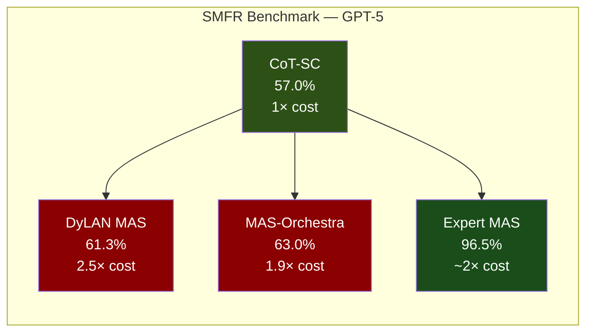
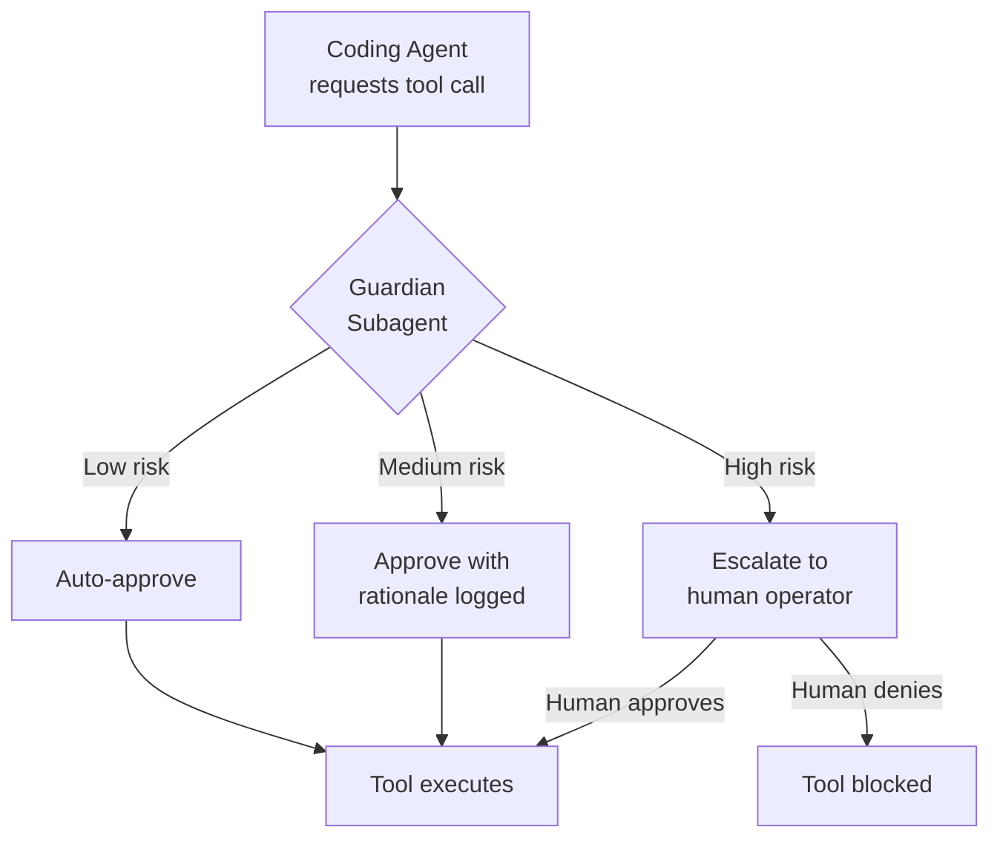

# The Illusion of Multi-Agent Advantage: When Codex CLI Subagents Help and When a Single Agent Wins


---

Multi-agent systems are having a moment. Every coding agent vendor now ships some form of subagent spawning, parallel delegation, or specialised reviewer orchestration. Codex CLI joined this trend with its `[agents]` configuration block, custom TOML agent definitions, and Guardian auto-review subagent. The implicit message: more agents equals better results.

A June 2026 paper from Jwalapuram et al. — "The Illusion of Multi-Agent Advantage" — methodically dismantles that assumption [^1]. Their findings carry direct implications for how you configure Codex CLI's subagent system. This article maps the paper's evidence to practical Codex CLI decisions: when to spawn, when to stay single-agent, and how to avoid architectural bloat that costs ten times more for negligible gains.

## The Research: CoT-SC Versus Automatic Multi-Agent Systems

Jwalapuram et al. evaluated six automatic multi-agent system (MAS) design frameworks — DyLAN, MAS-Zero, ADAS, AFlow, MaAS, and MAS-Orchestra — against a single-agent baseline: Chain-of-Thought with Self-Consistency (CoT-SC) [^1]. CoT-SC generates multiple reasoning trajectories from a single model instance and selects outputs via majority voting.

The results were stark. Across traditional reasoning benchmarks and interactive multi-step workflows (BrowseComp-Plus), **automatic MAS consistently underperformed CoT-SC whilst consuming up to 10× the computational cost** [^1].

On their custom Synthetic Multi-Hop Financial Reasoning (SMFR) benchmark — 588 test samples designed with explicit parallelisation opportunities — GPT-5 achieved 57.0% with CoT-SC. The automatic MAS frameworks managed only marginal improvements: DyLAN added 4.3 percentage points at 2.5× cost; MAS-Orchestra added 6.0 percentage points at 1.9× cost [^1]. Neither justifies the complexity overhead for most production workflows.

### Expert-Designed MAS: The Exception That Proves the Rule

The critical nuance: **expert-designed MAS reached 96.5% on SMFR with GPT-5**, compared to CoT-SC's 57.0% [^1]. The gap between automatic and expert-designed multi-agent architectures is far larger than the gap between single-agent and automatic multi-agent. This tells us that multi-agent orchestration works — but only when the decomposition is deliberate, verifiable, and grounded in genuine task structure.



## Architectural Bloat: The Core Failure Mode

The paper identifies three failure mechanisms in automatic MAS that map directly to common Codex CLI anti-patterns:

### 1. Expensive Witnesses

Automatically spawned agents frequently have **minimal causal influence** on the final output [^1]. They consume tokens, occupy threads, and add latency — but their outputs are either ignored or trivially summarised by the orchestrator. In Codex CLI terms, spawning a subagent to "review" output that the parent agent then rewrites from scratch is an expensive witness.

### 2. Trivial Ensembles

Under complex task labels, automatic MAS degenerate into functionally equivalent copies of CoT-SC [^1]. Each "specialist" agent applies the same general reasoning pattern. This is the Codex CLI equivalent of defining five custom agents in `.codex/agents/` with near-identical `developer_instructions` but different names.

### 3. Positional Bias in Verifiers

MAS controllers and verifiers disproportionately favour early reasoning steps [^1]. In a Codex CLI subagent fan-out, this means the first agent to return a result may dominate the synthesis — regardless of quality.

## Codex CLI's Subagent Architecture: A Practical Map

Codex CLI's subagent system provides the building blocks for both expensive-witness anti-patterns and expert-designed orchestration. Understanding the configuration surface is the first step toward using it wisely.

### Global Controls in `config.toml`

```toml
[agents]
max_threads = 6                    # Concurrent agent thread cap
max_depth = 1                      # Nesting depth (1 = children only)
job_max_runtime_seconds = 1800     # Timeout per worker
```

`max_threads` defaults to 6 and `max_depth` defaults to 1 [^2]. The depth constraint is critical: setting `max_depth` above 1 enables recursive delegation, where a subagent spawns its own subagents. The Jwalapuram findings suggest this is almost never beneficial for automated decomposition — it compounds the expensive-witness problem geometrically.

### Custom Agent Definitions

Project-scoped definitions live in `.codex/agents/`:

```toml
name = "security-reviewer"
description = "Reviews code changes for security vulnerabilities"
developer_instructions = """
You are a security-focused reviewer. Check for:
- Injection vulnerabilities (SQL, command, path traversal)
- Authentication/authorisation bypasses
- Secrets in code or configuration
- Unsafe deserialisation
Report findings with severity, location, and remediation.
"""
model = "gpt-5.4"
model_reasoning_effort = "high"
sandbox_mode = "read-only"
```

This is an expert-designed agent: a narrow mandate, specific evaluation criteria, and an appropriate sandbox restriction [^2]. Compare this to a vague "general helper" definition — that produces the trivial-ensemble failure the paper identifies.

### Guardian Auto-Review

The Guardian subagent (`approvals_reviewer = "auto_review"`) exemplifies expert-designed single-purpose delegation [^3]. It evaluates each tool-call request against a security policy, producing structured assessments with risk level, authorisation decision, and rationale [^3]. The Guardian session persists across approvals to reuse prompt cache, avoiding the startup overhead that makes automatic MAS expensive [^3].



## The Decision Framework: When to Spawn, When to Stay

Drawing on both the Jwalapuram findings and practitioner evidence from Augment Code's scaling guidelines [^4], here is a decision framework for Codex CLI subagent use:

### Spawn Subagents When:

1. **Work decomposes into genuinely independent units** — separate files, separate test suites, separate services. Each agent operates on a distinct context window without needing the others' outputs [^4].

2. **Specialised review domains are needed** — security review, performance profiling, API contract validation. These execute independently against the same codebase and benefit from different `developer_instructions` and `model_reasoning_effort` settings [^4].

3. **CSV/batch processing** — Codex CLI's `spawn_agents_on_csv` explicitly parallelises row-level work where each row is independent [^2].

4. **The decomposition is written in a specification** — not inferred by the model. Expert-designed MAS outperformed automatic MAS by 33.5 percentage points on SMFR precisely because the task decomposition was explicit [^1].

### Stay Single-Agent When:

1. **Tasks are sequential** — each step depends on the previous step's output. Multi-agent performance degrades by 39–70% on strictly sequential reasoning tasks [^5].

2. **The codebase is tightly coupled** — changes in one file require awareness of changes in another. Context fragmentation across agents produces conflicting implicit decisions [^4].

3. **Single-agent accuracy exceeds ~45%** — above this threshold, adding agents frequently produces negative returns because coordination costs outweigh marginal improvement [^5].

4. **Requirements are ambiguous** — without a clear specification constraining choices, parallel agents will make inconsistent assumptions and produce merge conflicts [^4].

### Configuration Recommendations

```toml
# Conservative default — matches research findings
[agents]
max_threads = 3          # Fewer threads, less coordination overhead
max_depth = 1            # Never enable recursive delegation
job_max_runtime_seconds = 900  # Fail fast rather than burn tokens

# Enable Guardian for autonomous workflows
[auto_review]
approvals_reviewer = "auto_review"
```

For most workflows, reducing `max_threads` from the default 6 to 3 or 4 limits the blast radius of expensive-witness spawning whilst still permitting genuine parallel work. Keep `max_depth` at 1 — the research provides no evidence that recursive delegation improves outcomes [^1].

## Cost Implications

The cost arithmetic is straightforward. Codex CLI subagents consume tokens across every spawned thread — there is no free parallelism [^2]. A fan-out to six subagents on a task that a single agent handles at 57% accuracy will cost roughly 6× more tokens for a potential improvement of 4–6 percentage points [^1].

At current GPT-5.4 pricing (\$5/\$30 per 1M input/output tokens) [^6], a single-agent session consuming 50K tokens costs approximately \$0.25–\$1.50 depending on output ratio. A six-thread fan-out on the same task: \$1.50–\$9.00. Over hundreds of daily invocations, this compounds.

The Guardian subagent is the exception: its persistent session and prompt cache reuse mean the incremental cost per approval is minimal compared to the security value it provides [^3].

## Practical Recommendations

1. **Default to single-agent with CoT-SC-style reasoning.** Codex CLI's `model_reasoning_effort = "high"` already produces multi-step reasoning chains. This is your cheapest, most reliable baseline.

2. **Design subagents like the Guardian: narrow, specialised, persistent.** Each custom agent in `.codex/agents/` should have a specific mandate that differs materially from the parent agent's capabilities.

3. **Write the decomposition, don't infer it.** Use AGENTS.md to specify which tasks should fan out and which should remain sequential. The 33.5 percentage point gap between expert and automatic MAS is the cost of letting the model decide the architecture [^1].

4. **Measure before scaling.** Run the same task single-agent and multi-agent. Compare accuracy and token cost. If the multi-agent version doesn't clear at least a 10 percentage point improvement, the overhead isn't justified.

5. **Keep `max_depth` at 1.** Recursive delegation is the fastest path to architectural bloat. No current evidence supports nesting beyond direct children [^1][^2].

## Conclusion

The Illusion of Multi-Agent Advantage is not that multi-agent never works — expert-designed systems clearly outperform single-agent approaches on parallelisable tasks. The illusion is that *automatic* multi-agent orchestration reliably delivers that advantage. It does not. Codex CLI's subagent system gives you the tools for both expert-designed orchestration and expensive architectural bloat. The difference is whether you design the decomposition deliberately or let the model generate it.

Default to single-agent. Spawn deliberately. Measure ruthlessly.

---

## Citations

[^1]: Jwalapuram, P., Lin, H., Li, C., Jiao, F., Wang, S., Ming, Y., Ke, Z., Qin, C., Carenini, G. & Joty, S. (2026). "The Illusion of Multi-Agent Advantage." arXiv:2606.13003v2. [https://arxiv.org/abs/2606.13003](https://arxiv.org/abs/2606.13003)

[^2]: OpenAI. (2026). "Subagents — Codex CLI Documentation." [https://developers.openai.com/codex/subagents](https://developers.openai.com/codex/subagents)

[^3]: OpenAI. (2026). "Agent Approvals & Security — Codex CLI Documentation." [https://developers.openai.com/codex/agent-approvals-security](https://developers.openai.com/codex/agent-approvals-security)

[^4]: Augment Code. (2026). "Single-Agent vs Multi-Agent AI: When to Scale Your Dev Workflow." [https://www.augmentcode.com/guides/single-agent-vs-multi-agent-ai](https://www.augmentcode.com/guides/single-agent-vs-multi-agent-ai)

[^5]: Vibecoding.app. (2026). "Multi-Agent vs Single-Agent Coding: Data-Driven Comparison." [https://vibecoding.app/blog/multi-agent-vs-single-agent-coding](https://vibecoding.app/blog/multi-agent-vs-single-agent-coding)

[^6]: OpenAI. (2026). "API Pricing." [https://openai.com/api/pricing](https://openai.com/api/pricing)
