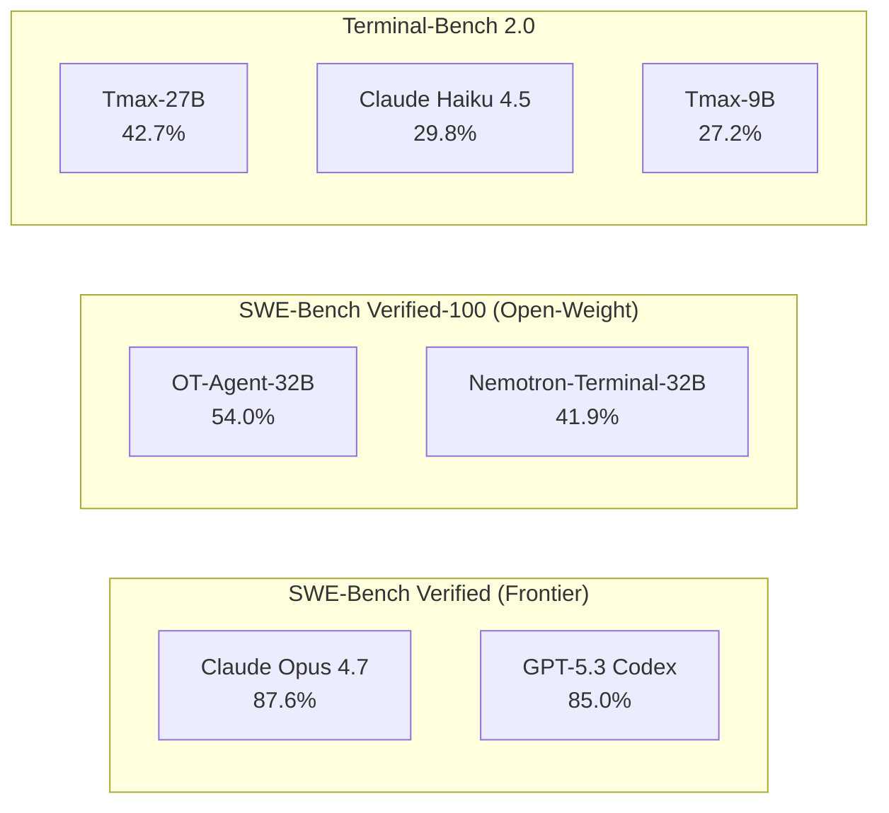

# Open-Weight Agentic Models Are Closing the Gap: What OpenThoughts-Agent and Tmax Mean for Codex CLI Custom Provider Workflows


---

Two papers landed on arXiv within 48 hours of each other in late June 2026 and, taken together, they mark a step change in what open-weight models can do inside agentic coding harnesses. OpenThoughts-Agent (OT-Agent) from a 50-researcher consortium released a six-stage data curation pipeline and a 100K-example training set that pushes a fine-tuned Qwen3-32B to 54.0% on SWE-Bench Verified-100 — a 12.1 percentage point jump over the previous best open agentic model.[^1] One day earlier, Allen AI's Tmax delivered an RL-only recipe that gets a 9B model to 27.2% on Terminal-Bench 2.0, approaching Claude Haiku 4.5's 29.8% at a fraction of the parameter count.[^2]

For Codex CLI users, the practical question is straightforward: can you wire these models into your terminal agent today, and should you? This article covers the research, the benchmark numbers, the Codex CLI custom provider configuration, and the trade-offs you need to weigh.

## The Research: Two Complementary Recipes

### OpenThoughts-Agent — Data Diversity as the Bottleneck

The OT-Agent team ran over 100 controlled ablation experiments to isolate what matters when curating training data for agentic models.[^1] Their six-stage SFT pipeline covers task sourcing, mixing, augmentation, filtering, teacher model selection, and rollout filtering. Three findings stand out:

1. **Task sourcing strategy selection shifts performance by up to 30 percentage points on SWE-Bench.** The team evaluated 95 different task generation strategies; synthetic issue-resolution tasks and human-written infrastructure questions scored highest.[^1]

2. **The best teacher model is not the strongest model.** GLM 4.7 produced higher-quality training traces than newer, more capable models — a counterintuitive result suggesting that teacher selection deserves its own ablation budget.[^1]

3. **Rollout traces with fewer than five tool-use turns degraded downstream performance.** Filtering for depth, not just correctness, matters.[^1]

The resulting OpenThinkerAgent-32B achieves 44.8% averaged across seven benchmarks — SWE-Bench Verified-100, Terminal-Bench 2.0, OpenThoughts-TBLite, Aider Polyglot, BFCL-Parity, GAIA-127, and FinanceAgent-Terminal — versus 40.9% for the previous state-of-the-art Nemotron-Terminal-32B.[^1]

### Tmax — RL Without Reward Models

Tmax takes a different approach: pure reinforcement learning with outcome-only rewards and no learned reward model.[^2] The recipe uses DPPO (Decoupled Proximal Policy Optimisation) with several stability innovations:

- **FP32 language model head** to minimise train-time vs inference-time logprob mismatches that cause training collapse at 200–300 steps.[^2]
- **Active sampling** that filters zero-gradient groups and uses a group size of 32 with 64 maximum tool calls per episode.[^2]

The TMAX-15K dataset comprises 14,600 RL environment instances — 2.5x larger than any prior open terminal-agent dataset — generated through a compositional taxonomy combining difficulty tiers, personas, and verifier diversification.[^2] Domain balance across nine categories reaches 0.998, and the dataset's pass@8 score of 53% indicates sustained challenge compared to easier alternatives.[^2]

Key results on Terminal-Bench 2.0:[^2]

| Model | Parameters | Score |
|---|---|---|
| Tmax-9B | 9B | 27.2% |
| Tmax-27B | 27B | 42.7% |
| Claude Haiku 4.5 | — | 29.8% |
| Kimi K2.5 | ~1T | 43.2% |

Tmax-27B at 42.7% approaches Kimi K2.5 (43.2%) despite being 10–40x smaller.[^2] Crucially, improvements transfer: the Tmax recipe applied to Qwen3-8B yields a +9.5 point gain on SWE-Bench and +9–15 points across different evaluation harnesses.[^2]

## What This Means for Codex CLI

### The Custom Provider Path

Codex CLI supports custom model providers through `config.toml`.[^3] Since the Chat Completions API was deprecated in favour of the Responses API, any provider — including local inference servers — must implement the Responses wire protocol.[^4] For open-weight models served through Ollama or vLLM, the built-in `--oss` flag simplifies configuration.[^5]

A minimal provider configuration for a locally served OpenThinkerAgent-32B:

```toml
[model_providers.openthoughts]
name = "OpenThoughts-Agent via Ollama"
base_url = "http://localhost:11434/v1"
env_key = "OLLAMA_API_KEY"
wire_api = "responses"
```

Then create a profile at `~/.codex/openthoughts.config.toml`:

```toml
model = "openthoughts-agent-32b"
model_provider = "openthoughts"
```

Activate with:

```bash
codex --oss --profile openthoughts
```

For Tmax-27B via vLLM or LM Studio, the same pattern applies — swap the model name and base URL.[^5]

### Profile-Based Model Routing

The real power emerges when you combine open-weight models with frontier models in a profile-based routing strategy.[^6] Consider three profiles:

```toml
# ~/.codex/frontier.config.toml — complex multi-file tasks
model = "gpt-5.5"
```

```toml
# ~/.codex/open-swe.config.toml — SWE-style issue resolution
model = "openthoughts-agent-32b"
model_provider = "openthoughts"
```

```toml
# ~/.codex/open-terminal.config.toml — terminal/infra tasks
model = "tmax-27b"
model_provider = "local_vllm"
```

This gives you cost control without sacrificing capability. Terminal tasks where Tmax-27B scores within a point of Kimi K2.5 can run locally at zero marginal token cost, whilst complex multi-file refactors still route through GPT-5.5.[^6]

### The Capability Gap Remains — But It Is Narrower



On SWE-Bench Verified, frontier models still lead by 30+ percentage points.[^7] But the trajectory matters: OT-Agent closed 12.1 points in a single release, and Tmax showed that RL-only training on a 9B model can match a frontier lightweight model on terminal tasks.[^1][^2]

For Codex CLI workflows, the practical implication is that certain task categories — bounded terminal operations, infrastructure scripting, routine issue triage — are now viable candidates for local open-weight execution.

## Configuration Hardening for Open-Weight Providers

Open-weight models lack the safety fine-tuning depth of frontier APIs. When routing through Codex CLI, compensate with harness-level controls:

### Sandbox Constraints

```toml
# In your open-weight profile
sandbox = "read-only"
```

Start with `read-only` sandbox mode and escalate to `workspace-write` only after validating output quality on your codebase.[^3]

### Token Budget Caps

```toml
rollout_token_budget = 50000
tool_output_token_limit = 8000
```

Open-weight models exhibit higher token variance than frontier models.[^8] Hard budget caps prevent runaway sessions. The `rollout_token_budget` key enforces a ceiling across the entire session.[^3]

### PostToolUse Verification Hooks

Add verification hooks in your project's `AGENTS.md` to catch quality regressions:

```markdown
## Quality Gates

- After every file write, run the project's lint and type-check commands
- After every test execution, verify no regressions in the existing suite
- Never commit directly; always create a branch for review
```

These rules apply regardless of which model is active, but they matter more when the model has lower baseline accuracy.[^9]

### AGENTS.md as Structural Constraint

The hierarchical `AGENTS.md` lookup — user-level, project root, per-directory — provides structural constraints that survive model swaps.[^9] A well-written `AGENTS.md` file compensates for model capability differences by encoding project-specific rules that any model must follow.

## Training Your Own: The Data Recipe Takeaways

Both papers offer actionable lessons for teams considering fine-tuning their own agentic models:

1. **Source diversity trumps source volume.** OT-Agent found that mixing the top 4–8 task sources outperformed scaling any single source.[^1]

2. **Skip synthetic augmentation of task descriptions.** Every augmentation strategy OT-Agent tested — rephrasing, elaboration, decomposition — failed to improve on leaving the original task description untouched.[^1]

3. **Filter for depth.** Rollouts with fewer than five turns should be discarded. Shallow traces teach the model to give up early.[^1]

4. **RL stability requires FP32 LM heads.** Tmax's key engineering insight: numerical mismatches between training and inference logprobs cause training collapse. Promoting the language model head to FP32 resolves this.[^2]

5. **Strong models may resist SFT warm-up.** Tmax found that Qwen 3.5-9B — already heavily post-trained — actually degraded with SFT initialisation, whilst the less-tuned Qwen3-8B benefited substantially.[^2]

## What to Watch

The OT-Agent team released all training sets, pipeline code, and models at openthoughts.ai.[^1] Tmax released models, the TMAX-15K dataset, and training code on GitHub and Hugging Face.[^2] Both are Apache 2.0 licensed.

The gap between open-weight and frontier agentic performance is compressing faster than many expected. For Codex CLI users, the custom provider infrastructure is already in place — the question is no longer _whether_ you can run open-weight agents in your terminal, but _when_ the accuracy-cost trade-off tips in their favour for your specific workload.

---

## Citations

[^1]: Raoof, N., Zhuang, R., Nezhurina, M., et al. (2026). "OpenThoughts-Agent: Data Recipes for Agentic Models." arXiv:2606.24855. [https://arxiv.org/abs/2606.24855](https://arxiv.org/abs/2606.24855)

[^2]: Ivison, H., Yin, J.O., Shao, R., Xiao, T., Lambert, N., & Hajishirzi, H. (2026). "Tmax: A Simple Recipe for Terminal Agents." arXiv:2606.23321. [https://arxiv.org/abs/2606.23321](https://arxiv.org/abs/2606.23321)

[^3]: OpenAI. (2026). "Advanced Configuration — Codex CLI." [https://developers.openai.com/codex/config-advanced](https://developers.openai.com/codex/config-advanced)

[^4]: OpenAI. (2026). "Configuration Reference — Codex CLI." [https://developers.openai.com/codex/config-reference](https://developers.openai.com/codex/config-reference)

[^5]: OpenAI. (2026). "Codex CLI — Command Line Options." [https://developers.openai.com/codex/cli/reference](https://developers.openai.com/codex/cli/reference)

[^6]: Vaughan, D. (2026). "Codex CLI Custom Model Providers: The Complete Configuration Guide." [https://codex.danielvaughan.com/2026/04/23/codex-cli-custom-model-providers-configuration-guide/](https://codex.danielvaughan.com/2026/04/23/codex-cli-custom-model-providers-configuration-guide/)

[^7]: SWE-bench Verified Leaderboard. (2026). [https://www.morphllm.com/swe-bench-pro](https://www.morphllm.com/swe-bench-pro)

[^8]: Bai, Y. et al. (2026). "Where Do Your Tokens Go? Empirical Analysis of Token Consumption in Coding Agents." arXiv:2604.22750. [https://arxiv.org/abs/2604.22750](https://arxiv.org/abs/2604.22750)

[^9]: OpenAI. (2026). "Custom Instructions with AGENTS.md — Codex." [https://developers.openai.com/codex/guides/agents-md](https://developers.openai.com/codex/guides/agents-md)
