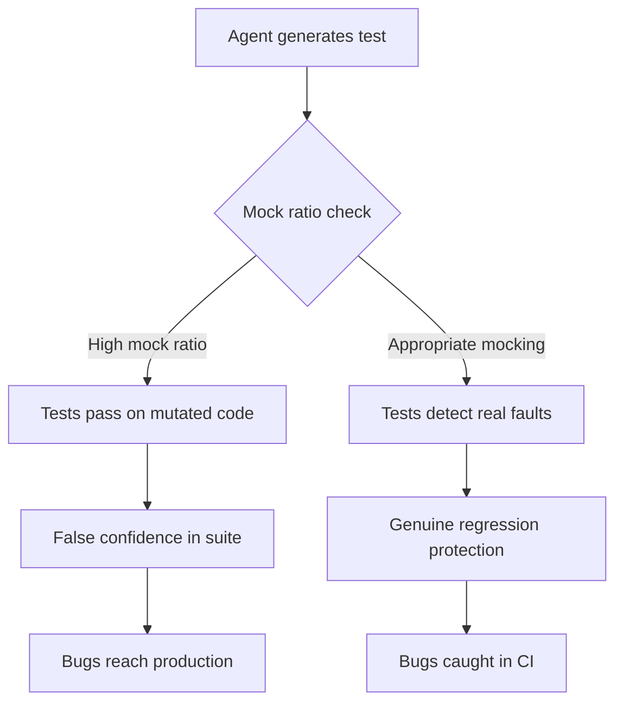
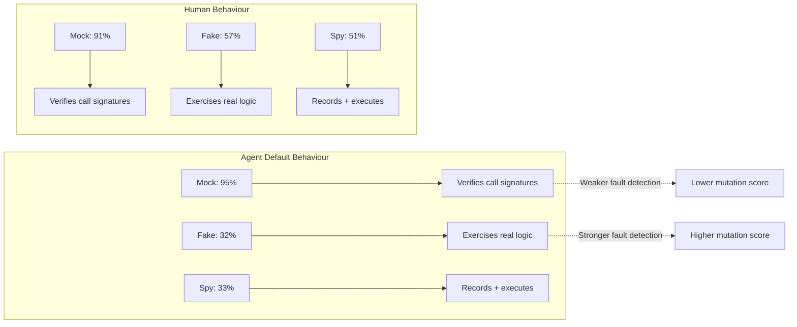

# The Over-Mocking Problem: What Empirical Research Reveals About Agent-Generated Test Quality — and How to Defend Your Suite with Codex CLI


---

Coding agents write more tests than you might expect — and they mock more aggressively than humans do. Two empirical studies published at MSR 2026 and ICSE 2026 quantify the gap, and the numbers should concern anyone relying on agent-generated test suites without review gates. This article unpacks the findings and shows how to wire Codex CLI's configuration and hook system into a defence that catches shallow tests before they reach your main branch.

## The Evidence: Agents Mock More Than Humans

Hora and Robbes analysed 1,254,878 commits across 2,168 repositories throughout 2025, tracking testing behaviour by Claude Code, GitHub Copilot, Cursor, and seven other coding agents [^1]. The headline numbers:

| Metric | Agent commits | Non-agent commits |
|--------|--------------|-------------------|
| Commits that modify tests | 23% | 13% |
| Test commits that add mocks | 36% | 26% |
| Repositories with agent mock activity | 68% | — |

The gap widens with usage intensity. In repositories with 50 or more agent commits, agents produced mocks at 36% versus 28% for human developers [^1]. Python projects showed the highest mock ratio at 37%, followed by JavaScript and TypeScript at 35% [^1].

The mock type distribution is equally telling. Agents reached for `Mock` objects 95% of the time, compared to 91% for humans, whilst underusing `Fake` (32% vs 57%) and `Spy` (33% vs 51%) test doubles [^1]. This suggests agents default to the easiest isolation mechanism rather than selecting the double most appropriate for the integration boundary under test.

## Why Over-Mocking Matters

A mock replaces a real dependency with a controlled substitute. Used surgically, mocks isolate the unit under test. Used indiscriminately, they create tests that verify the agent's assumptions about collaborator behaviour rather than the actual system. The result: tests that pass on mutated code.

Yoshimoto et al. studied 2,232 test-related commits and found that agent-generated tests exhibit higher assertion density and longer method bodies than human-written tests, yet maintain lower cyclomatic complexity through linear logic [^2]. On the surface, this looks like thorough testing. In practice, high assertion density combined with heavy mocking means the assertions verify mock return values — not real behaviour.

The mutation testing literature confirms this concern. The MutGen study found that AI-generated tests achieved only 53% mutation scores without feedback, improving to 89.5% only when surviving mutants were fed back into the generation loop [^3]. High coverage with low mutation scores is the signature of over-mocked tests: the test exercises the code path but fails to detect when the logic changes.



## The Instruction Gap

Hora and Robbes found a striking asymmetry in agent configuration files: among 112,000 `CLAUDE.md` files on GitHub, 102,000 contained test-related instructions but only 13,000 included mock-related guidance [^1]. The same pattern applies to `AGENTS.md` in Codex CLI projects. Teams tell the agent *to write tests* but rarely tell it *how to mock* — leaving the agent to default to the path of least resistance.

## Defence Layer 1: AGENTS.md Mock Policy

The first line of defence is explicit mocking policy in your project's `AGENTS.md`. Codex CLI loads instruction files from a well-defined hierarchy [^4], and the agent applies these rules to every test it generates.

```markdown
# Testing Standards

## Mock Policy
- NEVER mock the module under test
- ONLY mock external I/O boundaries: HTTP clients, databases, file system, message queues
- PREFER Fakes (in-memory implementations) over Mock objects for repository/store interfaces
- PREFER Spies over Mocks when you only need to verify a call was made
- NEVER mock value objects, DTOs, or pure functions
- Every mock MUST include a comment explaining WHY the real dependency cannot be used
- Maximum 3 mocks per test method — if you need more, the unit is too large; refactor first

## Test Doubles Hierarchy (prefer higher)
1. Real dependency (no double)
2. Fake (in-memory implementation)
3. Spy (real implementation + call recording)
4. Stub (canned responses)
5. Mock (behaviour verification) — last resort

## Anti-Patterns to Reject
- Mocking the return value of the function under test
- Chained mock returns (mock.returns(mock.returns(...)))
- Mocking language primitives or standard library functions
- Tests where removing all assertions still passes
```

The `project_doc_max_bytes` limit of 32 KiB [^4] gives ample room for this level of specificity. The key insight from the research is that agents follow explicit instructions about mock selection when provided — the problem is that teams rarely provide them [^1].

## Defence Layer 2: PostToolUse Mutation Validation

AGENTS.md sets policy; PostToolUse hooks enforce it. Codex CLI's hook engine [^5] lets you run a validation script after every tool execution. A PostToolUse hook that triggers mutation testing on newly written tests catches shallow suites before the agent moves on.

```toml
# .codex/config.toml

[[hooks.PostToolUse]]
matcher = "^Bash$"

[[hooks.PostToolUse.hooks]]
type = "command"
command = '/usr/bin/python3 ".codex/hooks/mutation_gate.py"'
timeout = 120
statusMessage = "Running mutation analysis on new tests"
```

The hook script receives JSON on stdin containing the tool name, input, and output. A minimal mutation gate for a Python project using `mutmut`:

```python
#!/usr/bin/env python3
"""PostToolUse hook: mutation-test newly written test files."""
import json
import subprocess
import sys

data = json.loads(sys.stdin.read())
tool_input = data.get("tool_input", "")

# Only trigger on pytest/test runs
if "pytest" not in tool_input and "test" not in tool_input:
    sys.exit(0)

# Run mutmut on changed test files
result = subprocess.run(
    ["mutmut", "run", "--no-progress", "--CI"],
    capture_output=True, text=True, timeout=90
)

# Parse mutation score
if "killed" in result.stdout.lower():
    lines = result.stdout.strip().split("\n")
    score_line = [l for l in lines if "killed" in l.lower()]
    if score_line:
        print(json.dumps({
            "systemMessage": f"Mutation analysis: {score_line[-1].strip()}. "
            "If mutation score < 70%, strengthen assertions or reduce mocking."
        }))

# Exit 2 replaces tool output with feedback
if result.returncode != 0:
    print(f"Mutation testing flagged weak tests: {result.stderr[:500]}",
          file=sys.stderr)
    sys.exit(2)

sys.exit(0)
```

Exit code 2 replaces the tool result the agent sees with stderr feedback [^5]. The agent then receives the mutation analysis results and can strengthen its assertions or reduce mocking before proceeding.

## Defence Layer 3: Mock Ratio Auditing

For JavaScript and TypeScript projects, a lighter-weight check can count mock-to-assertion ratios in generated test files:

```bash
#!/usr/bin/env bash
# .codex/hooks/mock_ratio_check.sh
# Count mocks vs assertions in staged test files

MOCK_COUNT=$(git diff --cached --name-only -- '*.test.*' '*.spec.*' | \
  xargs grep -c 'jest\.fn\|vi\.fn\|sinon\.stub\|mock(' 2>/dev/null | \
  awk -F: '{sum += $2} END {print sum+0}')

ASSERT_COUNT=$(git diff --cached --name-only -- '*.test.*' '*.spec.*' | \
  xargs grep -c 'expect(\|assert\.\|should\.' 2>/dev/null | \
  awk -F: '{sum += $2} END {print sum+0}')

if [ "$ASSERT_COUNT" -gt 0 ]; then
  RATIO=$(echo "scale=2; $MOCK_COUNT / $ASSERT_COUNT" | bc)
  if (( $(echo "$RATIO > 0.5" | bc -l) )); then
    echo "Mock-to-assertion ratio: $RATIO (threshold: 0.5)" >&2
    echo "Consider replacing mocks with fakes or testing against real implementations." >&2
    exit 2
  fi
fi
exit 0
```

## Defence Layer 4: MuMuTestUp-Style Multi-Agent Strengthening

Tian et al. demonstrated that a multi-agent approach using mutation analysis, coverage analysis, and semantic retrieval agents can systematically strengthen test assertions [^6]. Codex CLI's subagent system supports this pattern. A parent session can spawn a dedicated test-strengthening subagent:

```bash
codex exec "Review the tests in src/__tests__/. For each test file:
1. Run mutation testing with mutmut
2. Identify surviving mutants
3. Add or strengthen assertions to kill surviving mutants
4. Do NOT add new mocks — prefer testing against real implementations
5. Verify mutation score exceeds 70% before moving to the next file" \
  --approval-mode suggest \
  -c rollout_token_budget=200000
```

The `rollout_token_budget` cap [^7] prevents runaway token consumption during iterative mutation-test-fix cycles.

## The Mock Type Selection Problem

The research data reveals a specific tactical failure: agents over-index on `Mock` objects (95%) and under-use `Fake` implementations (32% vs 57% for humans) [^1]. This matters because Fakes exercise real logic through an in-memory implementation, whilst Mocks only verify that an interface was called with expected arguments.



The AGENTS.md mock hierarchy shown earlier directly addresses this by ranking Fakes above Mocks. When given explicit ordering, agents follow the preference.

## Practical Checklist

Before relying on agent-generated tests in production:

1. **Add mock policy to AGENTS.md** — specify when each test double type is appropriate
2. **Set a mock-to-assertion ratio threshold** — 0.5 is a reasonable starting point
3. **Wire mutation testing into PostToolUse hooks** — catch weak tests during generation
4. **Prefer Fakes over Mocks** — explicitly instruct the agent in the test doubles hierarchy
5. **Review agent-agent differences** — Copilot (27% test ratio) produces tests more often than Cursor (16%) [^1]; adjust review intensity accordingly
6. **Track mutation scores over time** — baseline your suite and alert on regression
7. **Use `codex exec` with `--output-schema`** to extract structured test quality reports from CI runs [^8]

## Conclusion

Coding agents write a significant and growing share of test code — 16.4% of test-adding commits and rising [^2]. Their tests are structurally sound: longer, more assertion-dense, and comparable in coverage. But they mock 38% more aggressively than human developers [^1], and high coverage combined with heavy mocking creates a false sense of security that mutation testing exposes.

The defence is not to stop agents from writing tests. It is to treat test generation like any other agent output: constrain it with explicit policy in AGENTS.md, validate it with PostToolUse hooks, and verify it with mutation analysis. Codex CLI provides every integration point you need — the gap is in how teams configure them.

---

## Citations

[^1]: A. Hora, R. Robbes, "Are Coding Agents Generating Over-Mocked Tests? An Empirical Study," MSR 2026, arXiv:2602.00409. [https://arxiv.org/abs/2602.00409](https://arxiv.org/abs/2602.00409)

[^2]: S. Yoshimoto, S. Fujita, K. Horikawa, D. Feitosa, Y. Kashiwa, H. Iida, "Testing with AI Agents: An Empirical Study of Test Generation Frequency, Quality, and Coverage," MSR 2026, arXiv:2603.13724. [https://arxiv.org/abs/2603.13724](https://arxiv.org/abs/2603.13724)

[^3]: Augment Code, "Mutation Testing for AI-Generated Code: A Practical Guide," 2026. [https://www.augmentcode.com/guides/mutation-testing-ai-generated-code](https://www.augmentcode.com/guides/mutation-testing-ai-generated-code)

[^4]: OpenAI, "Custom instructions with AGENTS.md," Codex Developer Documentation, 2026. [https://developers.openai.com/codex/guides/agents-md](https://developers.openai.com/codex/guides/agents-md)

[^5]: OpenAI, "Hooks," Codex Developer Documentation, 2026. [https://developers.openai.com/codex/hooks](https://developers.openai.com/codex/hooks)

[^6]: D. Tian, J. Liu, Y. Peng, Y. Zhang, J. Chi, J. Sun, X. Su, "MuMuTestUp: Mutation-based Multi-Agent Test Case Update," arXiv:2605.19265. [https://arxiv.org/abs/2605.19265](https://arxiv.org/abs/2605.19265)

[^7]: OpenAI, "Configuration Reference," Codex Developer Documentation, 2026. [https://developers.openai.com/codex/config-reference](https://developers.openai.com/codex/config-reference)

[^8]: OpenAI, "Non-interactive mode," Codex Developer Documentation, 2026. [https://developers.openai.com/codex/noninteractive](https://developers.openai.com/codex/noninteractive)
