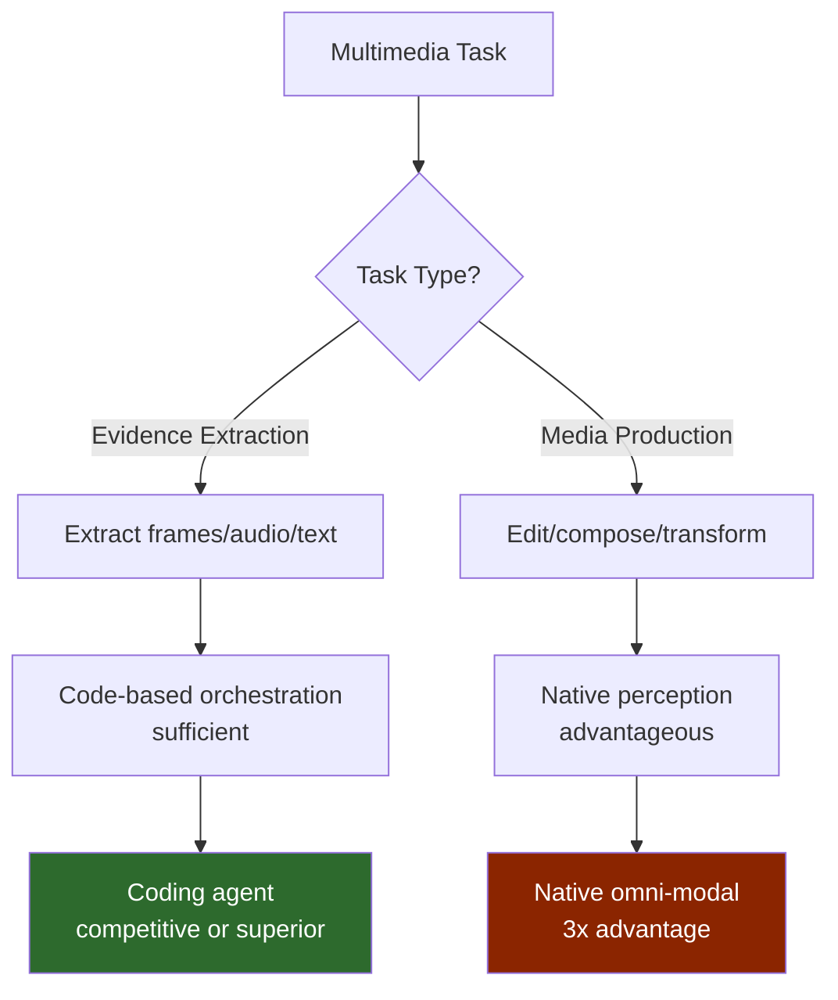
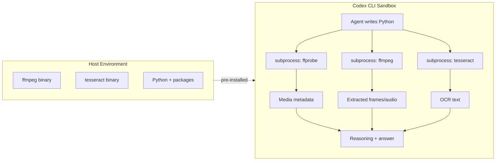

# Sandboxed Coding Agents as Omni-Modal Task Solvers: What Multimedia Benchmarks Reveal About Codex CLI's Tool Orchestration Ceiling


---

A sandboxed coding agent can write a Python script, call `ffmpeg`, transcribe audio with Whisper, OCR a frame, and compose the results — all without native audio or video perception. Two recent papers ask the obvious question: is that actually enough?

The answer, it turns out, depends on the task.

## The Competing Claims

Chen et al.'s "Sandboxed Coding Agents are Competitive Omni-modal Task Solvers" (arXiv:2606.00579, May 2026) argues that coding agents with only text-plus-image access can match or outperform state-of-the-art native omni-modal models across audio-video benchmarks [^1]. Their GPT-5.4 xHigh agent scored 75.0% on OmniGAIA average accuracy, against 66.1% for Gemini 3.1 Pro and 68.6% for Claude Opus 4.6 running natively [^1]. On VideoZeroBench Level 3, the coding agent reached 27.6% versus 17.8% for Gemini 3 Flash [^1].

The mechanism is straightforward: rather than ingesting entire media streams, the agent writes code to extract only the evidence it needs — a specific frame, a transcript segment, an OCR crop — converting omni-modal tasks into information retrieval problems [^1].

One month earlier, Heo et al.'s "MMTB: Evaluating Terminal Agents on Multimedia-File Tasks" (arXiv:2605.10966, May 2026) reached the opposite conclusion. Their 105-task benchmark showed Codex CLI (GPT-5.2) scoring just 16.2% binary success at \$7.12 per task, while Gemini 3.1 Pro with full multimedia access through their Terminus-MM harness achieved 37.1% — a 3x improvement over text-only baselines [^2].

These are not contradictory results. They measure different things, and the gap between them maps directly to how you configure Codex CLI for multimedia work.

## Why the Results Diverge

The key variable is task structure. Chen et al.'s benchmarks reward **evidence extraction** — finding a specific fact buried in a video or audio clip [^1]. The agent's strategy of "sample frames, transcribe audio, OCR text, then reason" works because the answer exists in a discrete, extractable fragment.

MMTB tasks demand **media production and manipulation** — editing video, composing audio, generating compliant outputs [^2]. Here, the agent must understand temporal relationships, audio mixing, and visual composition that cannot be reduced to text extraction. Terminus-MM's five meta-categories — Media Production, Performance & Coaching, Enterprise & Compliance, Personal & Education, and Operations & Research — deliberately span this production-consumption spectrum [^2].



## The Tool Orchestration Pattern

Both papers confirm the same core pattern: sandboxed agents solve multimedia tasks by orchestrating command-line tools through generated code. The primary toolkit spans `ffmpeg`, `ffprobe`, `python3`, `whisper`, `tesseract`, and web search [^1] [^2].

Chen et al.'s trajectory analysis reveals a consistent workflow [^1]:

1. **Inspect** — `ffprobe` to determine codec, duration, resolution, frame rate
2. **Extract** — `ffmpeg` to sample keyframes or isolate audio tracks
3. **Transcribe** — Whisper for speech-to-text, Tesseract for OCR
4. **Reason** — Python script to correlate extracted evidence
5. **Answer** — structured output from the reasoning step

This pattern consumes far fewer tokens than feeding raw media to an omni-modal model. The agent retrieves only what it needs, substantially reducing the multimedia footprint in its context window [^1].

However, MMTB found that conversion-heavy runs — where agents must transcode media to extract evidence rather than perceiving it directly — incurred 1.63x to 7.72x higher API costs [^2]. Codex CLI's average token consumption was 2,620.6k tokens per task, reflecting the overhead of intermediate representations [^2].

## Skill Injection: Closing the Gap

Chen et al. introduced three skill injection methods to improve coding agent performance on multimedia tasks [^1]:

- **Human-in-the-loop skills** — manually written expert workflows encoding domain knowledge (e.g., "for speaker diarisation, first extract audio, then segment by silence detection, then transcribe each segment separately")
- **Calibration-set self-iteration** — the agent attempts tasks, receives binary correctness feedback, and iterates on its approach
- **Log-driven self-distillation** — mining execution traces from successful runs to extract reusable patterns

Log-driven self-distillation achieved 76.7% average accuracy versus 73.0% for calibration-based self-iteration [^1]. The implication is clear: agents improve at multimedia tasks not through better models but through better procedural knowledge about tool usage.

This maps directly to Codex CLI's `AGENTS.md` instruction hierarchy. A project-level `AGENTS.md` can encode multimedia processing patterns:

```markdown
# AGENTS.md

## Multimedia Processing Rules

- Always run `ffprobe` before any `ffmpeg` operation to determine
  codec, duration, and stream layout
- For audio transcription, extract audio to WAV first:
  `ffmpeg -i input.mp4 -vn -acodec pcm_s16le -ar 16000 output.wav`
- Sample video frames at 1fps for initial analysis; increase to
  keyframe extraction only if 1fps misses relevant content
- For OCR tasks, extract frames then apply contrast enhancement
  before running Tesseract
- Never attempt to process video files larger than 500MB without
  first segmenting them
```

## Codex CLI Configuration for Multimedia Workflows

The sandbox configuration determines whether Codex CLI can even attempt multimedia tasks. The default `workspace-write` mode permits file creation within the working directory, which is sufficient for most extraction workflows [^3].

```toml
# config.toml — multimedia processing profile
[profile.multimedia]
model = "o4-mini"
approval_policy = "unless-allow-listed"

[profile.multimedia.sandbox_workspace_write]
writable_roots = [
  "./output",
  "./frames",
  "./transcripts",
  "/tmp/media-workdir"
]
```

The critical constraint is tool availability. Codex CLI's sandbox restricts network access and package installation [^3]. For multimedia work, the host environment must pre-install `ffmpeg`, `ffprobe`, `tesseract`, and any Python packages the agent might need (`whisper`, `Pillow`, `librosa`). The agent cannot `pip install` into the sandbox at runtime [^3].

On macOS, Apple's Seatbelt framework enforces kernel-level restrictions; on Linux, Landlock and seccomp filter filesystem and syscall access [^3]. Both permit subprocess spawning — the agent can shell out to `ffmpeg` — but network calls are blocked unless explicitly permitted.



## The Code-as-Harness Thesis

These findings fit within the broader "Code as Agent Harness" framework articulated by the survey from Huang et al. (arXiv:2605.18747) [^4]. Their central argument: code is no longer merely the agent's output — it serves as the operational substrate for reasoning, action, environment modelling, and execution-based verification [^4].

For multimedia tasks, the harness role is literal. The agent's code becomes the bridge between a text-native LLM and modalities it cannot directly perceive. Each `ffmpeg` call, each Whisper invocation, each OCR pass is a harness operation that converts opaque media into text the model can reason about [^4].

The survey identifies a key open challenge directly relevant here: **extensions to multimodal environments** [^4]. Current harness engineering assumes text-centric tool output. When tool output is itself multimedia (a spectrogram image, a waveform visualisation, a composite video), the harness must handle nested modality conversions — and each conversion layer introduces information loss and token overhead.

## TerminalBench-O: A Process-Level Benchmark

Chen et al. also introduced TerminalBench-O, the first process-level benchmark for coding agents on omni-modal tasks, with 50 real-world tasks spanning video (38%), audio (26%), image (14%), document (4%), and cross-modal (18%) categories [^1]. Unlike outcome-only benchmarks, TerminalBench-O evaluates intermediate artefacts and final output compliance — whether the agent's `ffmpeg` pipeline actually produced correct intermediate files, not just whether the final answer was right [^1].

Their six-category failure taxonomy is instructive for anyone debugging multimedia workflows in Codex CLI [^1]:

| Failure Category | Description | Codex CLI Mitigation |
|---|---|---|
| Audio Perception & Extraction | Whisper hallucination, wrong language detection | PostToolUse hook validating transcript against `ffprobe` language metadata |
| Video Perception & Extraction | Wrong frame sampling, missed keyframes | AGENTS.md rule: always verify frame count against expected duration |
| Insufficient Modal Exploration | Agent stops after first extraction attempt | Rollout token budget large enough for iterative refinement |
| Knowledge & Factual Errors | Incorrect domain knowledge about codecs/formats | AGENTS.md encoding codec compatibility tables |
| Logical Reasoning & Calculation | Timestamp arithmetic errors | PostToolUse hook cross-checking computed timestamps |
| Tool & Environment Infrastructure | Missing binaries, permission errors | `codex doctor` pre-flight check for required tools |

## Practical Implications

**For evidence extraction tasks** — analysing meeting recordings, extracting data from video tutorials, transcribing conference talks — Codex CLI's sandbox-and-tools approach is not merely adequate but potentially superior to native omni-modal models. The selective retrieval pattern means lower token consumption and, if your `AGENTS.md` encodes good extraction workflows, higher accuracy than brute-force media ingestion [^1].

**For media production tasks** — editing video, composing audio, generating multimedia outputs — the 3x performance gap from MMTB suggests Codex CLI needs a different strategy [^2]. The most practical approach is to pair Codex CLI with MCP servers that provide structured access to multimedia capabilities, rather than relying on raw `ffmpeg` commands generated from scratch each time.

**For cost control**, the 2,620.6k token average from MMTB is a warning [^2]. Multimedia workflows generate large intermediate artefacts (frame images, transcripts) that inflate context. Use `tool_output_token_limit` in your Codex CLI configuration to cap the size of tool outputs returned to the model, and consider `model_auto_compact_token_limit` to trigger compaction before context overflow.

```toml
# config.toml — cost-conscious multimedia settings
[profile.multimedia-lean]
model = "o4-mini"
rollout_token_budget = 50000
tool_output_token_limit = 8000
model_auto_compact_token_limit = 80000
```

The gap between these two papers is not a contradiction — it is a design decision. Know which kind of multimedia task you are solving, configure Codex CLI accordingly, and encode your extraction patterns in `AGENTS.md` so the agent does not rediscover them from scratch every session.

## Citations

[^1]: Chen, D., Huang, X., Hu, Z., Shi, Q., Li, D., & Zhou, T. (2026). "Sandboxed Coding Agents are Competitive Omni-modal Task Solvers." arXiv:2606.00579. [https://arxiv.org/abs/2606.00579](https://arxiv.org/abs/2606.00579)

[^2]: Heo, C., Kim, J., Kwon, J., Kim, H., Park, D., Lee, J., & Ok, J. (2026). "MMTB: Evaluating Terminal Agents on Multimedia-File Tasks." arXiv:2605.10966. [https://arxiv.org/abs/2605.10966](https://arxiv.org/abs/2605.10966)

[^3]: OpenAI. (2026). "Sandbox — Codex CLI." OpenAI Developer Documentation. [https://developers.openai.com/codex/concepts/sandboxing](https://developers.openai.com/codex/concepts/sandboxing)

[^4]: Huang, X. et al. (2026). "Code as Agent Harness." arXiv:2605.18747. [https://arxiv.org/abs/2605.18747](https://arxiv.org/abs/2605.18747)
