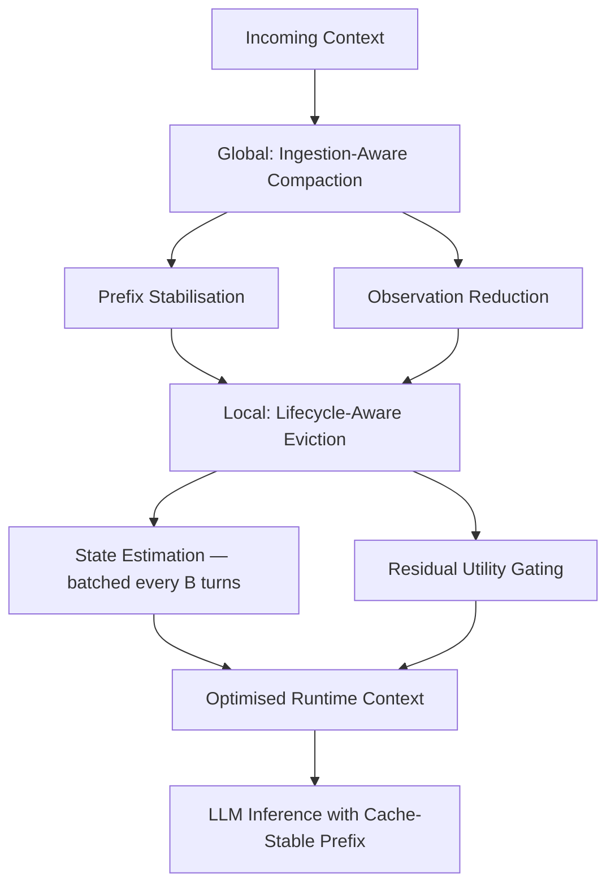
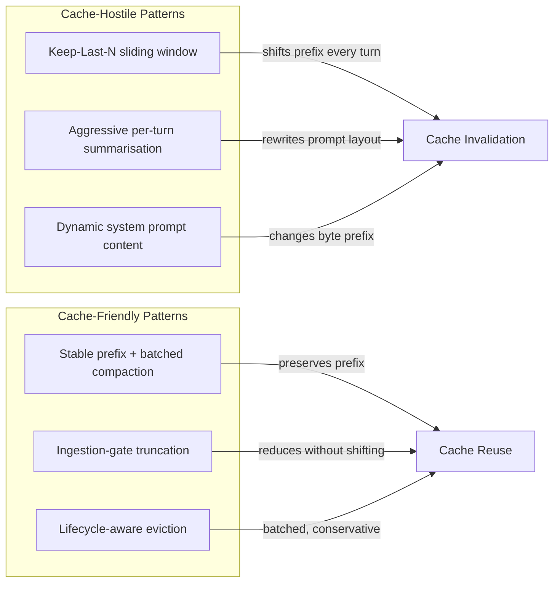

# TokenPilot and the Cache Invalidation Trap: Why Aggressive Context Pruning Can Cost More — and How to Configure Codex CLI's Compaction for Prompt Cache Efficiency


---

Every guide on agent cost optimisation says the same thing: prune your context, drop old messages, summarise aggressively. What none of them mention is that the moment you mutate your prompt's byte layout, you shatter the very prefix cache that was saving you 50–90% on input tokens. A June 2026 paper from Zhejiang University quantifies this trap and proposes a fix. The implications for Codex CLI configuration are immediate.

## The Problem: Context Reduction vs Cache Continuity

OpenAI's prompt caching is automatic for all API requests exceeding 1,024 tokens [^1]. When a request's initial tokens are byte-identical to a recently processed prefix, the inference server reuses pre-computed KV state instead of recomputing from scratch. Cached input tokens cost 50% less than uncached ones [^2], and in long agentic sessions where the same system instructions, tool definitions, and sandbox configuration reload every turn, cache hit rates of 80–90% are routine [^3].

Here is the tension: every existing context-management strategy — pruning old messages, summarising history, evicting tool outputs — mutates the token sequence. If that mutation shifts the prefix boundary, the cache miss penalty can exceed the token savings.

Xu et al.'s *TokenPilot: Cache-Efficient Context Management for LLM Agents* (arXiv:2606.17016) [^4] is the first paper to treat prompt cache efficiency as a first-class optimisation target for agent context management, and the results are striking.

## TokenPilot's Dual-Granularity Architecture

TokenPilot operates at two levels. The global layer stabilises what enters the context; the local layer controls what leaves.



### Ingestion-Aware Compaction

Messages are partitioned into internal (system/model messages, utility density U=1) and environmental (tool outputs, file reads, shell results). Environmental messages pass through a canonicalisation operator that replaces runtime-volatile fields — timestamps, absolute paths, tool schema versions — with static placeholders [^4]. The result is a byte-identical prompt prefix from the first turn onwards, regardless of when or where the session runs.

Environmental outputs that trigger the ingestion gate then undergo deterministic reduction: HTML slimming, execution output truncation, deduplication, and format cleaning. The paper reports 115,000 characters saved from HTML slimming alone and 883,000 from execution truncation across their benchmark sessions [^4]. Crucially, full payloads are retained in an artefact registry for on-demand recovery — the compression is lossy in the prompt but lossless in the system.

### Lifecycle-Aware Eviction

Rather than evicting context on a rolling window or fixed token budget, TokenPilot tracks each context segment through three states:

| State | Utility | Eviction Eligible |
|---|---|---|
| Active | U = 1 | No |
| Completed | U = residual | No |
| Evictable | U = 0 | Yes |

A model-based estimator extracts explicit resolution evidence and residual utility signals from dependency patterns [^4]. Segments only transition to evictable when residual utility has thoroughly expired — preventing the premature eviction that causes agents to re-read files or repeat tool calls.

The eviction schedule is batched in windows of B turns (empirically B=3 optimal [^4]), not applied turn-by-turn. This conservative cadence prevents the constant layout mutation that triggers cache invalidation.

## The Numbers

TokenPilot was evaluated on PinchBench and Claw-Eval using GPT-5.4-mini as the backbone, compared against nine baselines including LLMLingua-2, SelectiveContext, Keep-Last-N, and various summarisation approaches [^4].

### PinchBench Results

| Mode | System | Score | Cost | Cache Miss (M tokens) |
|---|---|---|---|---|
| Isolated | Vanilla (no management) | 80.5 | \$8.31 | 6.18 |
| Isolated | TokenPilot | **81.0** | **\$3.22** | 8.89 |
| Continuous | Vanilla | 79.2 | \$7.24 | 25.02 |
| Continuous | TokenPilot | **81.3** | **\$2.79** | 8.55 |

### Claw-Eval Results

| Mode | System | Score | Cost | Cache Miss (M tokens) |
|---|---|---|---|---|
| Isolated | Vanilla | 64.5 | \$5.16 | 4.64 |
| Isolated | TokenPilot | 63.1 | **\$2.27** | 1.15 |
| Continuous | Vanilla | 63.4 | \$81.52 | 21.98 |
| Continuous | TokenPilot | 60.8 | **\$10.58** | 9.93 |

The headline: **61% cost reduction in isolated mode, up to 87% in continuous mode**, with competitive or improved task performance [^4]. The continuous-mode savings are particularly relevant for Codex CLI, where long sessions with dozens of tool calls are the norm.

### Ablation: Why Both Layers Matter

The ablation study on PinchBench continuous mode isolates each component's contribution [^4]:

| Configuration | Score | Cost | Cache Miss (M) |
|---|---|---|---|
| Vanilla | 79.2 | \$7.24 | 5.94 |
| + Global Compaction only | 79.9 | \$4.22 | 1.59 |
| + Global + Local Eviction | **81.3** | **\$2.79** | 1.55 |

Global compaction alone cuts cache misses by 73%. Adding lifecycle eviction reduces cache reads by 65% on top. Neither layer works as well in isolation.

## What This Means for Codex CLI Configuration

Codex CLI already implements prompt-prefix stabilisation: system instructions, tool definitions, sandbox configuration, and environment context are kept identical and consistently ordered between requests [^3]. Its auto-compaction system fires when accumulated tokens exceed `model_auto_compact_token_limit` (default: 200,000 tokens) [^5], and for Codex models, compaction delegates to OpenAI's remote `compact()` endpoint which returns an AES-encrypted blob [^6].

TokenPilot's findings suggest three configuration strategies for maximising cache efficiency.

### 1. Stabilise Your AGENTS.md and System Prompt

Every volatile element in your system prompt — dynamic dates, git SHAs, changing file counts — shifts the prefix boundary. Move volatile context to the end of the prompt or into tool outputs rather than system instructions.

```toml
# ~/.codex/config.toml

# Keep system prompt stable — avoid dynamic content in instructions
# that changes between turns
model = "o3"
approval_policy = "on-request"

# Lower compaction threshold to trigger compaction before
# the context window fills, preserving cache-friendly prefixes
model_auto_compact_token_limit = 160000

# Cap individual tool outputs to prevent large, volatile
# payloads from dominating the context
tool_output_token_limit = 8000
```

### 2. Use tool_output_token_limit as an Ingestion Gate

TokenPilot's observation reduction — truncating large tool outputs at ingestion — maps directly to `tool_output_token_limit`. The default is unset (unlimited), which means a single `cat` of a large file can inject tens of thousands of volatile tokens into the middle of your context, shattering cache continuity for every subsequent turn.

Setting `tool_output_token_limit` to 8,000–12,000 tokens acts as a deterministic ingestion gate. The full output remains available in the session's tool call history but does not bloat the prompt prefix [^5].

### 3. Prefer Earlier Compaction Over Later Eviction

TokenPilot's B=3 batched eviction schedule outperformed both turn-by-turn eviction and larger windows [^4]. In Codex CLI terms, this means lowering `model_auto_compact_token_limit` to 75–80% of your model's context window rather than waiting until 90%:

```toml
# Profile for long sessions prioritising cache efficiency
# ~/.codex/cache-efficient.config.toml

model_auto_compact_token_limit = 150000
tool_output_token_limit = 10000
model_reasoning_effort = "medium"
```

Activate with `--profile cache-efficient`.

The reasoning: compacting earlier means the compacted summary replaces fewer turns of accumulated context, producing a smaller delta in the byte layout and preserving more of the cached prefix. Waiting until 90% means the compaction event is larger, the layout shift is more dramatic, and the subsequent cache miss penalty is steeper.

## The Anti-Patterns

TokenPilot's comparison against baselines reveals which common strategies are actively harmful for cache efficiency:



The Keep-Last-N pattern — dropping all but the most recent N messages — is particularly destructive. Every dropped message shifts the position of all subsequent messages in the prompt, guaranteeing a full cache miss [^4]. Codex CLI's built-in compaction avoids this by summarising rather than truncating, but manual `/compact` invocations mid-session should be used sparingly and at natural task boundaries rather than mid-derivation.

## The Broader Context: Cache-Aware Agent Design

TokenPilot builds on a growing body of work recognising that agent cost optimisation cannot be reduced to token counting. The Microsoft *Less Context, Better Agents* study (arXiv:2606.10209) [^7] demonstrated that full history retention is actively harmful to task completion — but its pruning strategies did not account for cache effects. TokenPilot's contribution is showing that the *how* of pruning matters as much as the *what*.

For Codex CLI practitioners, the practical takeaway is a hierarchy of cost levers:

1. **Prefix stability** — keep system instructions, tool definitions, and sandbox config identical and consistently ordered (Codex CLI does this by default)
2. **Ingestion gating** — truncate large tool outputs at entry via `tool_output_token_limit` rather than letting them into the context and pruning later
3. **Batched compaction** — trigger auto-compaction at 75–80% of context window, not 90%, to minimise layout disruption
4. **Lifecycle awareness** — avoid evicting context segments that the agent may need to re-read (the residual utility signal), which maps to Codex CLI's summarise-not-truncate compaction strategy

Cache-aware context management is not about using fewer tokens. It is about using fewer tokens without destroying the prefix that makes the remaining tokens cheap.

## Citations

[^1]: OpenAI, "Prompt Caching," API Documentation, 2026. [https://developers.openai.com/api/docs/guides/prompt-caching](https://developers.openai.com/api/docs/guides/prompt-caching)

[^2]: OpenAI, "Pricing," API Documentation, 2026. [https://developers.openai.com/api/docs/pricing](https://developers.openai.com/api/docs/pricing)

[^3]: OpenAI, "Prompt Caching 201," Developer Cookbook, 2026. [https://developers.openai.com/cookbook/examples/prompt_caching_201](https://developers.openai.com/cookbook/examples/prompt_caching_201)

[^4]: Xu, B., Xue, Z., Chen, D., Fu, C., Wu, C., Huang, C., Jiang, C., Fang, J., Deng, X., Chen, Y., Yao, Y., Wang, X., Shang, J., Yu, G., and Zhang, N., "TokenPilot: Cache-Efficient Context Management for LLM Agents," arXiv:2606.17016, June 2026. [https://arxiv.org/abs/2606.17016](https://arxiv.org/abs/2606.17016)

[^5]: OpenAI, "Configuration Reference," Codex Developer Documentation, 2026. [https://developers.openai.com/codex/config-reference](https://developers.openai.com/codex/config-reference)

[^6]: Context Compaction Research, "Claude Code, Codex CLI, OpenCode, Amp," GitHub Gist, 2026. [https://gist.github.com/badlogic/cd2ef65b0697c4dbe2d13fbecb0a0a5f](https://gist.github.com/badlogic/cd2ef65b0697c4dbe2d13fbecb0a0a5f)

[^7]: Lodha, A. et al., "Less Context, Better Agents," arXiv:2606.10209, June 2026. [https://arxiv.org/abs/2606.10209](https://arxiv.org/abs/2606.10209)
